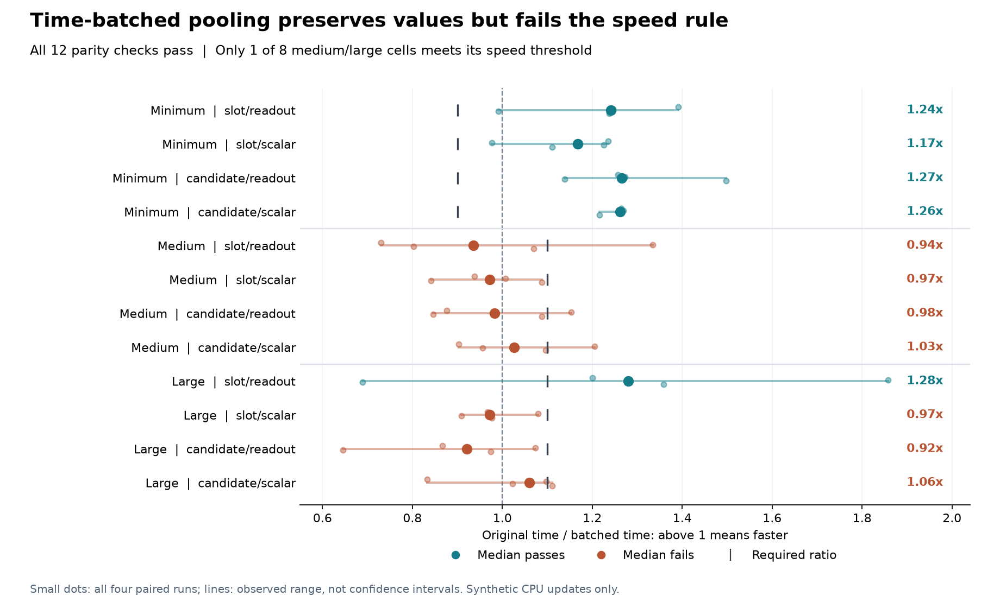

# Time-batched pooling: correct, insufficient speed benefit

The implementation passes numerical agreement checks in all twelve synthetic
workload cells, but **fails the fixed performance rule**. Only **one of eight
medium/large cells** meets its required 1.10 original/batched time ratio.
There is no admission for another full training study.

The [protocol](dialogue-token-batching-protocol.md), complete source snapshots
and [plan](../output/dialogue-token-batching-v1/protocol-01/plan.json) were
published in commit `f9b263b` before the one actual run. The run finished in
**32.73 seconds**, below its 300-second cap, with **120 optimizer updates and
24 parity forward/backward passes**. Process-lifetime peak RSS was
**3,193,815,040 bytes (2.97 GiB)**, below the 6 GiB ceiling. This is the whole
process high-water mark, not a separate memory measurement for either method.

## All paired medians

Ratios are original complete-update time divided by batched time. Above one
means batching was faster. Each cell contains four predeclared alternating
pairs; the table reports the median of their ratios, not a ratio of medians.
The figure retains every pair and its observed range, without confidence
interval or statistical-significance claims.

| Workload | Slot/readout | Slot/scalar | Candidate/readout | Candidate/scalar | Required |
|---|---:|---:|---:|---:|---:|
| Minimum | 1.242 | 1.168 | 1.265 | 1.262 | >=0.90 |
| Medium | 0.936 | 0.972 | 0.983 | 1.026 | >=1.10 |
| Large | 1.279 | 0.971 | 0.921 | 1.061 | >=1.10 |

The smallest cases improved, while the larger cases show mixed performance
and substantial pair-to-pair variation. In the only passing large cell,
individual ratios span **0.689 to 1.857**. All four minimum cells and one large
cell pass their respective speed thresholds; seven cells fail. The unchanged
rule requires every cell. There was no retiming, favorable subset selection,
threshold adjustment or training restart.

## What correctness establishes

The largest recorded absolute differences were **2.38e-7 in outputs**, zero
in supervised loss, **2.10e-8 in input gradients**, and **4.47e-8 in parameter
gradients**. Masks, absent-gradient membership and internal monitor coverage
agree. All original `2e-6` probability-normalization checks remain active.
Prior model and harness checks passed **56 tests**, with independent source
review before execution. The saved parity summaries are execution witnesses;
the independent audit does not replay unsaved tensor comparisons.

Both paths use the same 173,186 parameters, initialization, synthetic inputs,
loss weights and optimizer state. Every measured pair starts from the original
path's same post-warmup state. Timings include the original batch assembler,
validation, monitored forward, loss, backward, clipping, AdamW update and
scalar readback. Model construction, state restoration and parity comparison
are included in the whole-command total but excluded from update timings.

Batching reduces pooling invocations while retaining its token and candidate
arithmetic. Fewer calls alone did not produce the required end-to-end benefit.
These measurements do not isolate a kernel bottleneck or predict full-study
runtime. The synthetic cases are shaped like recorded batches but do not
reproduce their actual token values or padding distributions. Valid tokens
occupy 83.29%/87.26% of the medium/large synthetic tensors, versus 22.00% in
the earlier closed training ledgers. Those differing densities limit transfer
of these timing observations to real training.

## Evidence and next boundary

- [All results and complete timing ledger](../output/dialogue-token-batching-v1/qualification-01/summary.json)
- [Completion and file hashes](../output/dialogue-token-batching-v1/qualification-01/completed.json)
- [Independent saved-output audit](../output/dialogue-token-batching-v1/audit-01/summary.json)
- [New implementation](../src/openjev/research/dialogue_token_batched.py) and [qualification harness](../scripts/qualify_dialogue_token_batching.py)
- [Earlier incomplete training attempt](dialogue-token-results.md)

The earlier seven completed fits and partial eighth remain preserved and
unscored. A different implementation would need its own prospective cost
qualification. Reducing padding is a possible next target, with gathering,
scattering and memory costs included; this result supplies no measured gain
for that unimplemented change. The [support-packing design](dialogue-token-packing-design.md)
specifies that candidate and the work it would retain. Neither this engineering study nor the
incomplete training establishes a new architecture, biological advantage,
calibrated decision model or recurrent world-model result.
