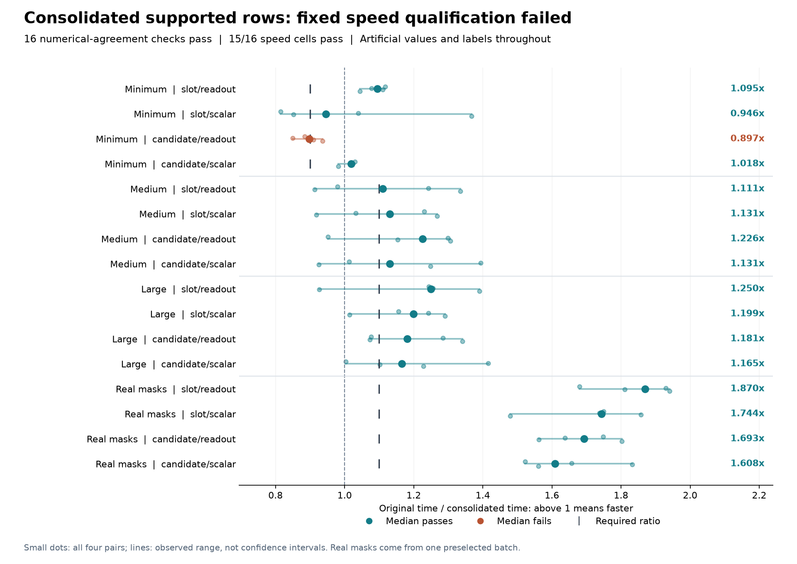

# Consolidated projections: 15/16 speed checks, overall failure

Combining supported evidence rows before projection passes all sixteen
output/gradient comparisons and **15/16 speed requirements**. All twelve
larger workloads meet their 1.10x threshold, including **1.61-1.87x** paired
median ratios on the four real-mask cases. Minimum candidate/readout reaches
**0.897042x**, below its 0.90 floor. The fixed rule requires every cell, so
this implementation does not qualify for training.

The [protocol](dialogue-token-consolidation-protocol.md),
[plan](../output/dialogue-token-consolidation-v1/protocol-01/plan.json) and all
61 source snapshots were published in commit `e757b2c` before the single
actual run. It completed in **33.06 seconds**, with **160 optimizer updates,
32 parity forward/backward passes and 192 operation records**. Combined
process-lifetime peak RSS was **2,841,575,424 bytes (2.65 GiB)**, below 6 GiB.
This high-water mark covers both implementations, not per-method peak memory.

## Every paired median

Ratios divide original complete-update time by consolidated time. Above one
means faster. Each value is the median of four alternating paired ratios,
not the ratio of separate median runtimes.

| Workload | Slot/readout | Slot/scalar | Candidate/readout | Candidate/scalar | Required |
|---|---:|---:|---:|---:|---:|
| Minimum | 1.095 | 0.946 | 0.897 | 1.018 | >=0.90 |
| Medium | 1.111 | 1.131 | 1.226 | 1.131 | >=1.10 |
| Large | 1.250 | 1.199 | 1.181 | 1.165 | >=1.10 |
| Real mask geometry | 1.870 | 1.744 | 1.693 | 1.608 | >=1.10 |

The failing cell's four ratios are 0.885, 0.849, 0.910 and 0.936. Its median
misses the fixed floor by about 0.003. Closeness does not change the outcome.
Minimum slot/scalar also has a slower median than the original, but passes
the predeclared 0.90 floor. All pairs and ranges are shown; four-pair ranges
are not confidence intervals. No failed cell was retimed and no threshold,
workload, cap or hardware was changed after measurement.

These are comparisons with the original model in this run. Comparing them
with the [earlier factoring run](dialogue-token-factoring-results.md) is not a
paired estimate of consolidation's incremental benefit.

## What changed

Public-mask attention groups, weighted token pooling and raw 384-dimensional
normalization are unchanged. The new path concatenates only supported,
normalized evidence rows, then applies one original biased turn projection
and `tanh`. Query, candidate and lexical rows are gathered in the same order
for one observation-dependent first-layer projection. Hidden preactivations
are scattered to their original destinations.

The full-schema skipped-cell fill still executes once per forward. The
factored parent's ordered recurrence, actual belief/entropy inputs, feature
hook, scalar departure-mass checks and ordinary step API are inherited
unchanged. The model retains all 173,186 parameters, their initialization and
names; no activation survives across optimizer updates.

For the fixed geometry, each supported-row projection changes from 69 calls
to one. Attention still has 69 groups, the schema fill still has 3,840 rows,
and the head still performs 23 ordered state updates. First-layer arithmetic
is unchanged from factoring: **449,937,280 multiply-accumulates**, versus
2,238,382,080 in the original dense first layer. This is a layer-only
algebraic estimate, not hardware FLOPs or evidence of which operations caused
the observed speed ratios.

Consolidation introduces a **20.82 MB** supported pooled concatenation for
the geometry, replacing a **3.47 MB** hidden concatenation. The corresponding
new buffer is **106.69 MB** for the large synthetic shape. These decimal-MB
payload counts are not physical traffic or peak-memory sums. Group tensors,
schema/lexical gathers, feature buffers and backward lifetimes also cost memory.

## Correctness and measurement scope

Before freezing, **97 focused tests passed** in two author runs: 58 model
checks and 39 harness checks. An independent source review found no material
issue. Tests cover all four arms, float32/float64, all-padding gradients,
schema fill, inherited monitored steps, causal prefixes, permutations and
absence of cross-update activation caches. Hooks witness one supported turn
projection and one
supported observation projection, with schema fill counted separately;
normalized evidence and schema/lexical gathers are checked for row alignment.

All sixteen measured comparisons pass the original tolerances. Largest
recorded absolute differences are **1.19e-6 in outputs**, **4.77e-7 in loss**,
**5.94e-9 in input gradients** and **2.98e-8 in parameter gradients**.
Raw output/gradient tensors were not saved, so these are authenticated
execution witnesses rather than independently replayed numerical comparisons.
Different reduction order prevents a claim of bitwise optimizer trajectories.

Every measured update restores and hash-checks the same original post-warmup
model and AdamW state. Complete-update timing includes original assembly,
grouping, all gathers and concatenations, attention/normalization, projections,
fill/scatter, internal work counters, validation, monitored recurrence, loss,
backward, clipping, optimizer update and scalar readback. Construction,
restoration, parity checks, external counter comparisons and formatting remain
in whole-command time outside update intervals. The original baseline does
not execute hypothetical consolidation to collect counters.

All sixteen sample, initial-parameter, actor, mask and canonical-state digests
match the prior factoring run. Values and labels are artificial. The last four
cells reuse one preselected maximum-work training mask; they are not a
representative training distribution. No corpus, encoder, external model or
official-test call was made, and no task predictions were scored.

## Evidence and continuation

An independent saved-output audit verified all 82 files, 61 source identities,
192 ordered events and all 50 work counters, along with the paired arithmetic
and parent-state digests. Those checks pass; engineering admission remains
failed. The audit did not replay models or measure new timings.

- [All cells and paired ratios](../output/dialogue-token-consolidation-v1/qualification-01/summary.json)
- [Execution completion and file hashes](../output/dialogue-token-consolidation-v1/qualification-01/completed.json)
- [Independent saved-output audit](../output/dialogue-token-consolidation-v1/audit-01/summary.json)
- [Implementation](../src/openjev/research/dialogue_token_consolidated.py) and [harness](../scripts/qualify_dialogue_token_consolidation.py)
- [Focused test receipts](../output/dialogue-token-consolidation-v1/preflight-01.json)
- [Earlier incomplete training study](dialogue-token-results.md)

This candidate stops under its fixed protocol. The previous incomplete
training attempt remains unscored and cannot resume. A different execution
mechanism requires a new prospective comparison; a passing cost check would
still not establish better decisions, a novel architecture, biological
learning or a recurrent-world-model advantage.

The next proposed control [computes only required schema-fill rows](dialogue-required-fill-design.md).
It removes calculations whose outputs are overwritten at every turn, using
only public masks. Additional indexing costs could erase the savings; its
effect has not been measured.
