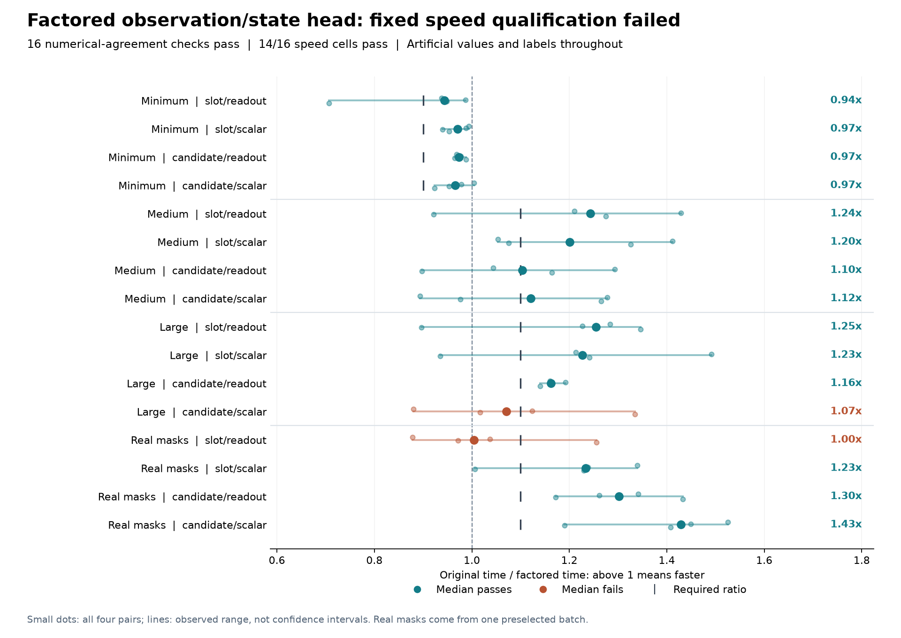

# Separating observation and state: 14/16 speed checks, overall failure

Precomputing the head's observation-dependent linear term preserves all
sixteen numerical comparisons and passes **14/16 speed requirements**. Two
cells fail: large candidate/scalar reaches **1.070x**, and real-mask
slot/readout reaches **1.005x**, against the required 1.10x. The fixed rule
requires every cell, so this implementation does not qualify for training.

The [protocol](dialogue-token-factoring-protocol.md), [plan](../output/dialogue-token-factoring-v1/protocol-01/plan.json)
and all 56 source snapshots were published in commit `8dfc9af` before the one
actual run. It completed in **33.25 seconds** with **160 optimizer updates,
32 parity forward/backward passes and 192 operation records**. Process-lifetime
peak RSS was **2,647,687,168 bytes (2.47 GiB)**, below its 6 GiB ceiling.
This high-water mark combines both paths; it is not per-method peak memory.

## All sixteen paired medians

Ratios divide the original complete-update time by the factored time. Above
one means the factored implementation was faster. Each cell uses the median
of four alternating paired ratios, not the ratio of two median times.

| Workload | Slot/readout | Slot/scalar | Candidate/readout | Candidate/scalar | Required |
|---|---:|---:|---:|---:|---:|
| Minimum | 0.944 | 0.970 | 0.973 | 0.966 | >=0.90 |
| Medium | 1.243 | 1.201 | 1.104 | 1.121 | >=1.10 |
| Large | 1.255 | 1.227 | 1.162 | 1.070 | >=1.10 |
| Real mask geometry | 1.005 | 1.234 | 1.301 | 1.429 | >=1.10 |

All four minimum cells pass their original 0.90 floor even though their
medians are slightly slower than the baseline. Seven of eight original
medium/large cells and three of four geometry cells meet 1.10. The medium
candidate/readout cell clears that threshold by only about 0.004.

The two failing cells have individual pair ranges of **0.880-1.335x** and
**0.878-1.255x**, respectively. Every pair remains visible in the plot. These
four-pair ranges are not confidence intervals or statistical guarantees.
There was no retiming, threshold change, favorable subset selection, retry
or hardware switch. Whole-command times from different experiments are not
a paired comparison of their implementations.

## The same model, with a split linear sum

The original first feature layer consumes 396 values: six 64-dimensional
observation/schema terms, ten lexical values, own belief and entropy. The
first 394 values are independent of the recurrent state. The new execution
path computes their contribution inside the existing public-mask pooling
groups, using the original weight columns and bias, then scatters a
64-dimensional preactivation. Each ordered state update computes only the
last two columns from its actual belief and entropy, adds both terms, and
applies the original `tanh`, output layer and transition.

The schema-dependent skipped-cell fill is computed once per forward. It
includes projected query/candidate interactions, turn bias and zero lexical
values. Neither zero fill nor moving a nonlinearity through the linear split
would preserve the intended model. A direct query gather avoids materializing
all expanded query projections separately for every group.

The feature adapter retains the same Linear/Tanh children, parameter objects,
names and initialization. Its split call supplies the actual consumed
`[belief, entropy]` tensor to the existing feature pre-hook. Ordinary inherited
step calls still supply the original full feature tensor. Incoming, feature,
output and scalar departure-mass checks remain in turn order at the original
`2e-6` tolerance. No activation is cached across optimizer updates.

The geometry contains 13,555 supported candidate/turn rows within 88,320
dense positions. Including all 3,840 schema-fill rows and all sequential
state rows, the first layer uses **449,937,280 estimated multiply-accumulates**
instead of **2,238,382,080**, a **79.9% reduction for that layer**. It still
makes 69 group feature projections, one full-schema fill and 23 state
projections. These are algebraic work counts, not hardware FLOPs, physical
memory traffic or proof that this layer determines total runtime.

## Correctness and complete cost

Before freezing, **94 focused implementation and harness tests passed**, with
independent source review. Tests cover float32/float64, all four arms, dense
and irregular masks, bias/schema fill, all-padding gradients, inherited
monitored steps, the actual split feature inputs and absence of cached
activations across updates.

All sixteen measured comparisons satisfy the frozen tolerances. The largest
recorded absolute differences are **1.19e-6 in outputs**, **4.77e-7 in loss**,
**5.94e-9 in input gradients**, and **2.98e-8 in parameter gradients**.
The split changes floating reduction order; neither bitwise equality nor
identical long optimizer trajectories is established. Raw output/gradient
tensors were not retained, so those parity summaries are authenticated
execution witnesses rather than independently replayed comparisons.

Every measured update restores the original path's same post-warmup model
and AdamW state. Timing includes original input assembly, grouping and all
gathers, pooling/normalization, turn projection, feature concatenation,
weight slicing, observation projection, schema fill, scattering, state
projection/addition, internal counters, validation, monitored recurrence,
loss, backward, clipping, optimizer update and scalar readback. Independent
counter comparison, receipt formatting, construction, state restoration and
parity checks remain in whole-command time, outside update timing. The
baseline does not execute hypothetical factoring to collect reference counts.

## Scope, evidence and continuation boundary

All values and labels are artificial. The same sixteen sample and initial
parameter digests match the [previous projection comparison](dialogue-token-projection-results.md).
The final four cells use masks from one preselected maximum-work training
batch; this is not a representative training distribution. No corpus,
encoder, external-model or official-test call was made, and no task
predictions were scored.

An independent saved-output audit verified all 77 files, 56 frozen source
identities, operation counts, all 48 work counters and the paired timing
arithmetic. Its checks pass while the engineering admission remains failed.
It did not regenerate model outputs or independently measure runtime.

- [All cells and paired ratios](../output/dialogue-token-factoring-v1/qualification-01/summary.json)
- [Complete execution and file hashes](../output/dialogue-token-factoring-v1/qualification-01/completed.json)
- [Independent saved-output audit](../output/dialogue-token-factoring-v1/audit-01/summary.json)
- [Implementation](../src/openjev/research/dialogue_token_factored.py) and [qualification harness](../scripts/qualify_dialogue_token_factoring.py)
- [Focused test receipt](../output/dialogue-token-factoring-v1/preflight-01.json)
- [Earlier incomplete scientific study](dialogue-token-results.md)

This candidate stops under its fixed protocol. The earlier seven completed
fits and partial eighth remain unscored and cannot resume. A different
implementation requires a new prospective comparison. These engineering
results establish no decision-quality, novel-architecture, biological-learning
or recurrent-world-model advantage.

The next proposed control [combines projection calls across supported rows](dialogue-supported-row-consolidation-design.md).
It preserves grouped attention and the same arithmetic, but introduces a
larger pooled intermediate. Its speed and memory tradeoff are unmeasured.
