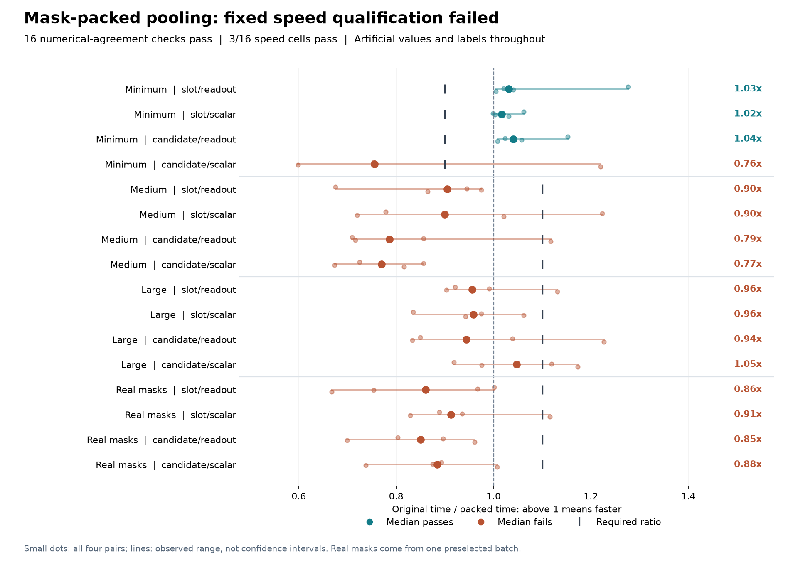

# Mask-packed pooling: fewer attention scores, speed qualification fails

Packing valid tokens and supported candidates preserves numerical agreement
in all sixteen workload cells, but **fails the fixed speed qualification**.
Only three minimum-size cells pass; all eight original medium/large cells
and all four cells using a preselected real training mask fail. This
implementation does not qualify for a full training restart.

The [protocol](dialogue-token-packing-protocol.md), implementation, tests,
public-mask fixture and [frozen plan](../output/dialogue-token-packing-v1/protocol-01/plan.json)
were published in commit `0bc5943` before the single actual run. It completed
in **52.96 seconds**, below its 300-second cap, with **160 optimizer updates
and 32 parity forward/backward passes**. The process-lifetime peak RSS was
**2,878,504,960 bytes (2.68 GiB)**, below the 6 GiB ceiling. This is a whole-process
high-water mark, not a separate memory measurement for either implementation.

## All paired medians

Ratios are original complete-update time divided by packed time. Above one
means packing was faster. Every cell has four predeclared alternating pairs;
these are medians of paired ratios, not ratios of median times. The figure
shows every pair and its observed range, without confidence-interval or
statistical-significance claims.

| Workload | Slot/readout | Slot/scalar | Candidate/readout | Candidate/scalar | Required |
|---|---:|---:|---:|---:|---:|
| Minimum | 1.031 | 1.017 | 1.040 | 0.756 | >=0.90 |
| Medium | 0.905 | 0.900 | 0.786 | 0.770 | >=1.10 |
| Large | 0.956 | 0.959 | 0.944 | 1.047 | >=1.10 |
| Real mask geometry | 0.860 | 0.912 | 0.850 | 0.884 | >=1.10 |

All sixteen cells are required by the unchanged rule. Thirteen fail their
speed thresholds. The four real-mask cells are slower in their paired
medians, despite substantial reductions in attention work. There was no
retiming, favorable-subset selection or threshold adjustment.

## What was changed and checked

The implementation projects valid raw tokens once, groups real turns by
token-length bucket and supported-candidate count, and scatters pooled
evidence back into the original dense layout. It retains the original
sequential recurrent updates, including their internal probability checks.
Grouping uses public masks, never labels or attention scores. Dummy question
slots retain their valid NONE support.

Both paths use the same 173,186 parameters, initialization, synthetic values,
supervision and AdamW state. Before each measured update, both paths restore
the original path's same post-warmup model and optimizer state. Timings include
the original batch assembly, mask grouping, gathering, scattering, forward
checks, loss, backward, clipping, optimizer update and scalar readback. The
packed path's internal work counters are included; external count comparison
and receipt formatting are outside update timing. Construction, state
restoration and parity comparison remain in the whole-command total.

All sixteen output, loss, input-gradient and parameter-gradient comparisons
pass the frozen tolerances. The largest recorded absolute differences are
zero for outputs and loss, **4.66e-10 for input gradients**, and **3.27e-11
for parameter gradients**. Mask identity, absent-gradient membership and
internal normalization coverage also pass. The original `2e-6` normalization
checks remain active. Before execution, the combined implementation and
harness checks passed **67 tests**, with independent source review.
The saved parity summaries are execution witnesses; their unsaved tensors
cannot be independently replayed from these receipts.

## Real masks are not a representative training benchmark

The added geometry comes from the first maximum-attention-work batch among
all 1,280 batches of the closed `slot_readout-4101` fit: update 1,237. The
selection uses public shapes and masks. The fixture contains lengths and
candidate counts, with no text, feature values, predictions or weights.
All four geometry cells use freshly generated artificial values and labels.

That batch has 374 real turns and 11,304 valid token positions within 66,240
padded positions. Packing reduces projected token positions by **82.9%**.
For candidate-conditioned attention, computed score positions fall from
**7,948,800 to 515,006**, a **93.5% reduction**. The packed path still creates
69 pooling groups and scatters into a dense evidence tensor with 33,914,880
float32 elements. These are logical work and payload counts, not measured
memory traffic or a kernel-level attribution of the slowdown.

The recorded median backward-and-clipping phase is longer for the packed
path in every one of the sixteen cells. That broad phase includes more than
pooling, so it identifies where the regression appears without establishing
which operation caused it.

One extreme batch does not establish cost across the training distribution.
The original twelve cases remain unchanged, with their earlier shapes,
random seeds and denser synthetic masks. Neither set supports a full-study
runtime projection. This is an implementation experiment, with no accuracy,
calibration, biological-wiring or recurrent-world-model result.

## Evidence and continuation boundary

- [All sixteen cells and paired timings](../output/dialogue-token-packing-v1/qualification-01/summary.json)
- [Completion and complete file hashes](../output/dialogue-token-packing-v1/qualification-01/completed.json)
- [Independent saved-output audit](../output/dialogue-token-packing-v1/audit-01/summary.json)
- [Public-mask fixture](../output/dialogue-token-packing-v1/geometry-01.json) and [independent geometry audit](../output/dialogue-token-packing-v1/geometry-audit-01.json)
- [New implementation](../src/openjev/research/dialogue_token_packed.py) and [qualification harness](../scripts/qualify_dialogue_token_packing.py)
- [Earlier failed batching qualification](dialogue-token-batching-results.md) and [incomplete training attempt](dialogue-token-results.md)

The earlier seven completed fits and partial eighth remain preserved and
unscored. Full training remains unadmitted. Another mechanism would need a
distinct, prospectively frozen comparison that includes its overhead and
retains the failed workload cells.

The [next source-based candidate](dialogue-projected-packing-design.md) moves
the existing 384-to-64 projection before dense scattering while retaining
384-dimensional normalization and the original transition equations. It is
unimplemented and has no measured benefit.
