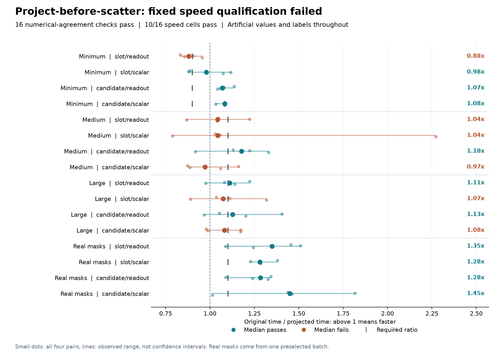

# Projecting before scattering: sparse gains, full qualification fails

Moving the existing turn projection before dense scattering preserves all
sixteen output/gradient comparisons and gives **1.28-1.45x paired median
speed ratios** across four variants using one real training mask layout.
However, **only 10/16 speed cells pass** the unchanged requirement. One
minimum cell and five of the original eight medium/large cells fail.
This result does not admit a full training restart.

The [protocol](dialogue-token-projection-protocol.md), all 51 source snapshots,
tests and [frozen plan](../output/dialogue-token-projection-v1/protocol-01/plan.json)
were published in commit `a7ae824` before the one actual run. The run completed
in **33.84 seconds** with **160 optimizer updates and 32 parity
forward/backward passes**. All 192 operation records are retained.
Process-lifetime peak RSS was **2,676,375,552 bytes (2.49 GiB)**, within the
6 GiB cap. This combined-process high-water mark is not per-method peak memory.

## Every workload and threshold

Each entry is the median of four paired original/projected complete-update
time ratios. Above one means the projected path was faster. The alternating
pair order, random seeds, shapes, synthetic generation and thresholds remain
identical to the [previous packing qualification](dialogue-token-packing-results.md).
Every stored sample and initial-parameter digest agrees with that earlier run.

| Workload | Slot/readout | Slot/scalar | Candidate/readout | Candidate/scalar | Required |
|---|---:|---:|---:|---:|---:|
| Minimum | 0.881 | 0.980 | 1.070 | 1.083 | >=0.90 |
| Medium | 1.043 | 1.043 | 1.177 | 0.972 | >=1.10 |
| Large | 1.110 | 1.073 | 1.127 | 1.081 | >=1.10 |
| Real mask geometry | 1.349 | 1.281 | 1.284 | 1.450 | >=1.10 |

Three minimum, three original medium/large and all four geometry cells pass
their speed thresholds. The full rule requires all sixteen. No retry,
retiming, threshold relaxation, favorable-subset selection or hardware switch
was performed. A passing minimum cell may still be slightly slower, because
its predeclared floor is 0.90 rather than 1.10.

Individual timings remain variable: the medium slot/scalar cell spans
**0.789-2.271x** across its four pairs while its median is only 1.043x. The
plot retains every pair and observed range; they are not confidence intervals.
Separate whole-command durations across experiments are not a paired speed
comparison. The ratios above compare both implementations within this run.

## What the implementation changes

The earlier packed version scattered 384-dimensional evidence into a dense
tensor and immediately projected it down to 64 dimensions in each recurrent
step. The new path performs the same operations inside each packed group:

`weighted raw-token sum -> L2 normalization in 384 dimensions -> existing linear projection with bias -> tanh -> scatter 64 dimensions`

Skipped positions retain `tanh(bias)`, matching projection of zero evidence.
An explicit internal marker distinguishes these preprojected inputs from the
original single-step API. The subsequent feature equations, ordered recurrent
transitions and monitor remain unchanged. No tensors are detached or cached
across optimizer updates; all-padded inputs preserve zero versus absent
gradients. All 173,186 parameters and initialization draws remain the same.

For the geometry cells, the dense intermediate has **5,652,480 float32
elements (22,609,920 bytes)** instead of 33,914,880 elements (135,659,520
bytes): one sixth of that logical payload. The turn projection processes
**13,555 supported rows** rather than 88,320 dense rows, with 69 group calls
and bias fill retained. These counts establish the execution change, not
physical memory traffic or a causal attribution of every timing difference.

## Correctness, cost and scope

Before execution, **90 implementation and harness tests passed**, including
float32/float64, irregular masks, nonzero bias, dummy NONE support,
all-padding gradients, inherited-step compatibility and actual monitor
coverage. Independent source review found no material mismatch.

In the measured qualification, the maximum recorded absolute differences
were zero for outputs and loss, **4.66e-10 for input gradients**, and
**1.63e-9 for parameter gradients**. All original `2e-6` probability checks
remain active. Saved parity summaries are authenticated execution witnesses;
raw output/gradient tensors were not saved for independent replay. Agreement
on these cases does not prove identical long optimizer trajectories.

Every measured update restores the original path's same post-warmup model
and AdamW state. Update timing includes the original input assembly, packing,
pooling, normalization, group projection, bias fill, scattering, internal
work counters, validation, monitored recurrence, supervised loss, backward,
clipping, AdamW and scalar readback. Counter comparisons and receipt formatting
are outside update timing but remain within whole-command cost, alongside
construction, state restoration and parity comparison. The baseline does not
execute hypothetical packing to collect its reference counts.

All values and labels are synthetic. The four geometry cases reuse public
masks from one preselected maximum-work batch of the closed training ledger,
not actual text or token features. That one extreme batch does not represent
the full training distribution. There were no corpus, encoder, external-model
or official-test calls, and no task predictions were scored.

## Evidence and next boundary

- [All sixteen cells and paired ratios](../output/dialogue-token-projection-v1/qualification-01/summary.json)
- [Complete execution and file hashes](../output/dialogue-token-projection-v1/qualification-01/completed.json)
- [Independent saved-output audit](../output/dialogue-token-projection-v1/audit-01/summary.json)
- [Implementation](../src/openjev/research/dialogue_token_projected.py) and [qualification harness](../scripts/qualify_dialogue_token_projection.py)
- [Focused test receipt](../output/dialogue-token-projection-v1/preflight-01.json)
- [Earlier packing failure](dialogue-token-packing-results.md), [batching failure](dialogue-token-batching-results.md), and [incomplete scientific study](dialogue-token-results.md)

The full speed qualification failed despite the sparse-case gains. This
candidate stops under its fixed protocol. The earlier seven complete fits
and partial eighth remain unscored and cannot be resumed. A distinct future
implementation needs its own prospective comparison; these measurements do
not establish a full-study runtime or a new architecture, biological-learning
or recurrent-world-model advantage.

The [next source-based candidate](dialogue-exogenous-head-design.md) separates
the existing head's observation terms from its two state-dependent features.
It is unimplemented, and its potential work reduction has no measured speed
or quality result.
