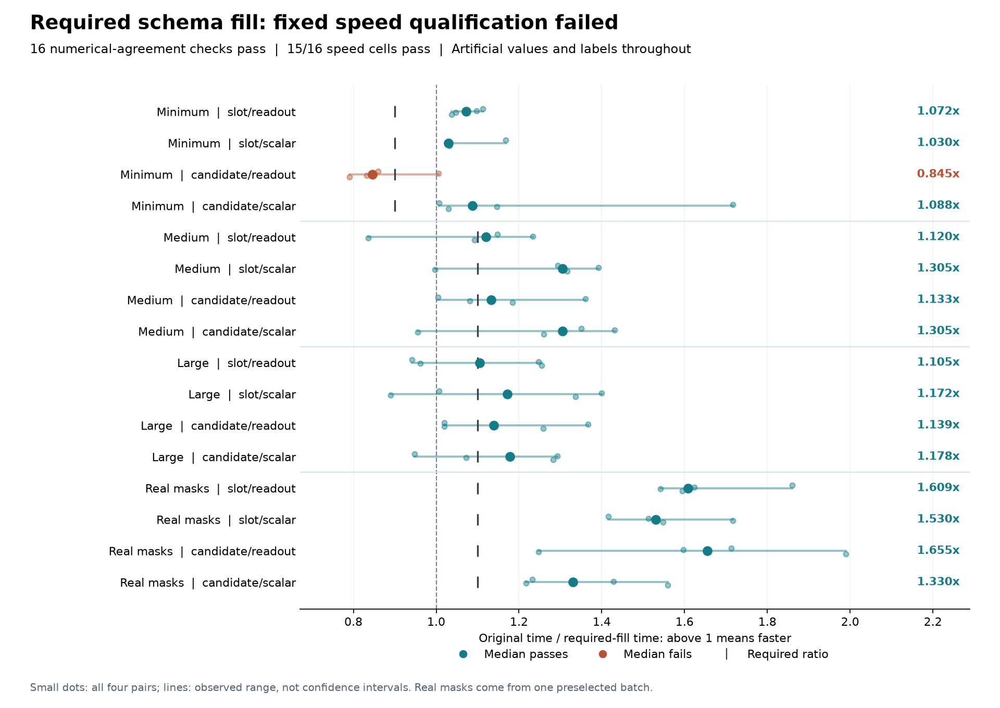

# Required fill: numerical agreement, but the small-workload failure remains

Computing only schema-fill rows that survive the supported-row scatter passes
all sixteen numerical comparisons and **15/16 speed requirements**. All twelve
larger workloads pass their 1.10x threshold. Minimum candidate/readout reaches
**0.845486x**, below its 0.90 floor, so the fixed overall qualification fails.
Removing every unused fill row in that small case did not clear the requirement.

The [protocol](dialogue-token-required-fill-protocol.md),
[plan](../output/dialogue-token-required-fill-v1/protocol-01/plan.json) and all
66 source snapshots were published in commit `63d2a00` before the single run.
It completed in **32.75 seconds**, with **160 optimizer updates, 32 parity
forward/backward passes and 192 operation records**. Combined process-lifetime
peak RSS was **2,740,682,752 bytes (2.55 GiB)**, below the 6 GiB limit. This
high-water mark includes both paths and cannot establish per-method memory use.

## All sixteen paired medians

Ratios divide original complete-update time by required-fill time. Each cell
reports the median of four alternating paired ratios. Above one means faster.

| Workload | Slot/readout | Slot/scalar | Candidate/readout | Candidate/scalar | Required |
|---|---:|---:|---:|---:|---:|
| Minimum | 1.072 | 1.030 | 0.845 | 1.088 | >=0.90 |
| Medium | 1.120 | 1.305 | 1.133 | 1.305 | >=1.10 |
| Large | 1.105 | 1.172 | 1.139 | 1.178 | >=1.10 |
| Real mask geometry | 1.609 | 1.530 | 1.655 | 1.330 | >=1.10 |

The failing cell's four ratios are 0.860, 1.005, 0.831 and 0.791. The large
slot/readout median clears its threshold by only about 0.0046. The plot retains
every pair; four-pair ranges are not confidence intervals. No failed cell was
retimed and no threshold, cap, workload or hardware was changed after the run.

All ratios compare against the original model within this run. Differences
from the [previous consolidation comparison](dialogue-token-consolidation-results.md)
are not a paired estimate of the incremental effect of required fill.

## The exact work removed

The public-mask predicate is `not all_t(valid[b,t]) or not candidate_mask[b,q,c]`.
A fill row is omitted only when its supported candidate overwrites every time
position. Any padded turn requires all schema rows of that dialogue; masked
candidates retain fill, and dummy NONE uses ordinary support.

Zero-required batches skip the fill projection and use initialized zeros.
All-required batches retain the original dense fill. Partial batches gather
only required query/candidate rows, compute their exact original fill, and
scatter into initialized schema storage. Supported evidence then overwrites
the same unique time/schema destinations as before. Attention, normalization,
supported projections and monitored recurrence are unchanged.

| Layout | Previous fill rows | Executed fill rows | Removed first-layer MACs |
|---|---:|---:|---:|
| Minimum | 7 | 0 | 176,512 |
| Medium | 3,840 | 3,025 | 20,551,040 |
| Large | 3,840 | 3,025 | 20,551,040 |
| Real mask geometry | 3,840 | 3,789 | 1,286,016 |

The geometry's whole first feature layer uses **448,651,264 estimated
multiply-accumulates**, including supported, fill and sequential state terms.
Minimum uses **1,064,448**, equal to the original first-layer algebraic count.
Neither arithmetic count establishes a runtime cause or a whole-model speedup.

Mask reductions, predicate checks, index creation, gathers, initialized storage
and schema scatter add work. The run records **70 integer counters**, including
15 explicitly reference-only fields. Boolean and int64 payloads are separate
from float32 estimates; overlapping logical payloads are not an allocation sum.
Dense hidden storage and all monitored state updates remain.

## Correctness and complete cost

Before freezing, **129 focused tests passed** in two author runs: 86 model
tests and 43 harness tests. Independent source review found no material issue.
The tests cover all four arms and float32/float64, no/partial/all fill, actual
projection calls and contents, complete overwrite coverage, exact absent-gradient
membership, nonzero biases, padding, token holes, dummy NONE, generic widths,
inherited monitored steps and cache absence. Changing only later validity masks
also preserves earlier outputs and gradients within tolerance.

All sixteen measured comparisons satisfy the original tolerances. The largest
recorded absolute differences are **1.19e-6 in outputs**, **4.77e-7 in loss**,
**5.94e-9 in input gradients** and **2.98e-8 in parameter gradients**.
Raw tensors were not saved, so these summaries are authenticated execution
witnesses, not independent numerical replay. Bitwise optimizer trajectories
and universal extreme-finite-input equivalence are not established.

Every measured update restores and hash-checks the same original post-warmup
model and AdamW state. Timing includes original assembly, grouping, mask/index
work, gathers, concatenations, attention, normalization, projections, fill and
scatter, internal counters, all validation/monitoring, loss, backward, clipping,
AdamW and scalar readback. Construction, restoration, parity, external counter
comparisons and receipt formatting remain in whole-command time outside measured
updates. The baseline does not execute hypothetical required-fill bookkeeping.

The same sixteen sample, initial-parameter, actor, mask and canonical-state
digests match the consolidation run. Values and labels remain artificial. One
preselected maximum-work mask supplies the last four cases; this is not a
representative training distribution. No corpus, encoder, external model or
official-test call was made, and no task predictions were scored.

## Evidence and continuation

An independent saved-output audit verified 87 files, 66 source identities,
192 ordered events, all 70 work counters and typed payload maps, paired timing
arithmetic and all parent-state digests. Those checks pass while the engineering
decision remains failed. It made no model or timing calls.

- [All paired timings and decision](../output/dialogue-token-required-fill-v1/qualification-01/summary.json)
- [Completion and file hashes](../output/dialogue-token-required-fill-v1/qualification-01/completed.json)
- [Independent saved-output audit](../output/dialogue-token-required-fill-v1/audit-01/summary.json)
- [Implementation](../src/openjev/research/dialogue_token_required_fill.py) and [harness](../scripts/qualify_dialogue_token_required_fill.py)
- [Focused test receipts](../output/dialogue-token-required-fill-v1/preflight-01.json)
- [Earlier incomplete scientific study](dialogue-token-results.md)

This candidate stops under its fixed protocol. Earlier incomplete training
remains unscored and cannot resume. The result establishes no accuracy gain,
architecture novelty, biological learning or recurrent-world-model advantage.
Any different execution mechanism needs a new prospective comparison; a passing
cost screen would still require a representative cost check before new training.

The next proposed control [shares one state-weight column view within each forward](dialogue-shared-state-columns-design.md).
The current head creates the same parameter slice at every recurrent step.
Sharing a fresh differentiable view could simplify gradient accumulation while
preserving every state operation and monitor. Its runtime effect is unmeasured.
