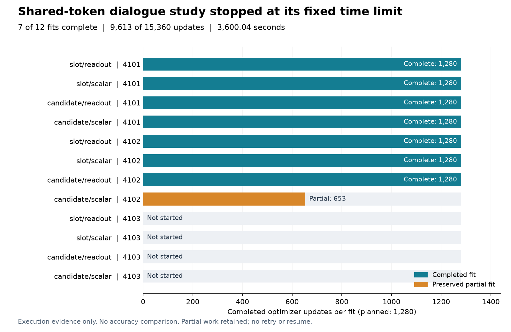

# Shared-token dialogue study: execution incomplete

The fixed twelve-fit comparison stopped at **3,600.04 seconds** after exceeding
its unchanged 3,600-second cap. **Seven fits completed; the eighth stopped
after 653 of 1,280 updates. Four fits never started.** This is an execution
failure, not a completed accuracy comparison or a measured failure of the
fourteen task-quality conditions. No task predictions were inspected or scored.

The [preparation](dialogue-token-preparation-results.md) succeeded: shared
contextual token vectors for 43,553 unique contexts took **17.88 seconds** and
2.012 GB of payload. An independent saved-output audit verified all token
pooling results against the original sentence features. Preparation cost and
representation agreement do not establish a better decision model.

## Preserved work

| Seed | Slot/readout | Slot/scalar | Candidate/readout | Candidate/scalar |
|---|---|---|---|---|
| 4101 | Complete | Complete | Complete | Complete |
| 4102 | Complete | Complete | Complete | Partial: 653 updates |
| 4103 | Not started | Not started | Not started | Not started |

Each completed fit has 20 epochs and 1,280 optimizer updates. The partial fit
stopped after a forward pass in its eleventh epoch, before that batch's
backward pass or optimizer update. Its partial weights and 653 completed batch
records remain saved. All seven completed weights, predictions and fit receipts
remain intact. No retry, resume, cap extension or partial-seed selection was
performed. The original official SGD test set remains untouched.

The [terminal receipt](../output/dialogue-token-v1/execution-01/failed.json),
[all-file manifest](../output/dialogue-token-v1/execution-01/publication-manifest.json)
and [frozen plan](../output/dialogue-token-v1/study-protocol/plan.json) identify
the attempted work. Metadata is published; raw token vectors, individual
predictions and weights stay local with their hashes. The independent
[execution audit](../output/dialogue-token-v1/execution-audit-01/summary.json)
checks the stopped state without calculating task metrics.

## Next engineering question

The [closed-work analysis](dialogue-token-cost-design.md) found 23,746 separate
token-pooling invocations per training fit. Pooling does not read recurrent
state, so it can be batched across turns while retaining the original ordered
memory updates. This would reduce pooling invocations to 1,280; it does not
reduce the attention arithmetic or establish a speedup.

A separate [prospective qualification](dialogue-token-batching-protocol.md)
checks numerical agreement and complete synthetic training-step cost. A pass
would justify a representative cost check before considering another full
study. The old failure and all frozen scientific sources remain unchanged.

This work tests observation extraction before introducing another memory
mechanism. It has not established an architecture, biological-wiring,
calibration or world-model advantage.
