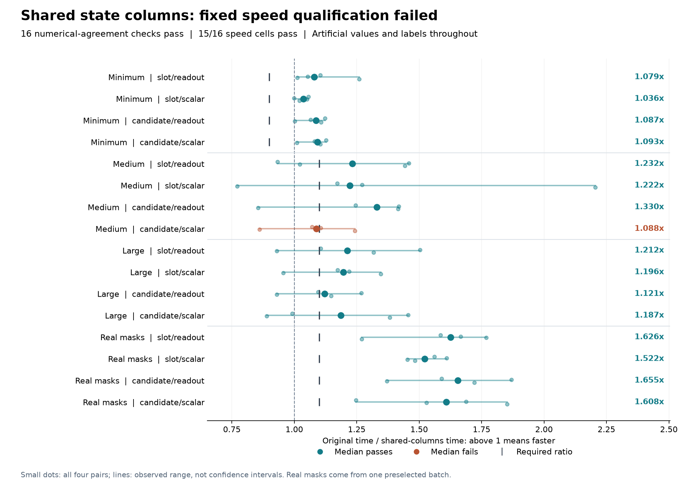

# Shared state columns: all numerical checks pass, speed qualification fails

Sharing one state-weight view per forward passes all sixteen numerical
comparisons and **15/16 speed requirements**. The remaining failure is medium
candidate/scalar: **1.088323x**, below its fixed **1.10x** threshold. All four
minimum cells now pass, but the overall qualification still fails. There is no
training admission or new task-accuracy result.

The [protocol](dialogue-token-shared-columns-protocol.md),
[plan](../output/dialogue-token-shared-columns-v1/protocol-01/plan.json) and all
71 source snapshots were published in commit `3e58d2f` before execution. The
single attempt completed in **33.78 seconds**, with **160 optimizer updates,
32 parity forward/backward passes and 192 operation records**. Combined
process-lifetime peak RSS was **2,848,997,376 bytes (2.65 GiB)**, below the
6 GiB limit. That high-water mark does not identify per-method memory use.

## All sixteen paired medians

Ratios divide original complete-update time by shared-columns time. Each cell
reports the median of four alternating paired ratios. Above one means faster.

| Workload | Slot/readout | Slot/scalar | Candidate/readout | Candidate/scalar | Required |
|---|---:|---:|---:|---:|---:|
| Minimum | 1.079 | 1.036 | 1.087 | 1.093 | >=0.90 |
| Medium | 1.232 | 1.222 | 1.330 | 1.088 | >=1.10 |
| Large | 1.212 | 1.196 | 1.121 | 1.187 | >=1.10 |
| Real mask geometry | 1.626 | 1.522 | 1.655 | 1.608 | >=1.10 |

The failing cell's four ratios are **1.071, 1.106, 0.861 and 1.243**. Other
cells also vary substantially: medium slot/scalar ranges from 0.772 to 2.206.
The plot retains every pair; observed ranges are not confidence intervals.
No failed cell was retimed, and no threshold, cap or workload was changed.
The coordinated run began after the other known heavy local job exited;
that does not eliminate all host scheduling or thermal variation.

All ratios compare against the original model within this run. Differences
from the [required-fill result](dialogue-token-required-fill-results.md) are
not a paired estimate of the incremental effect of sharing columns. The four
real-mask cells use one preselected training batch with artificial values and
labels; their 1.52-1.66x ratios do not estimate representative training speed.

## What changed

The sequential head previously constructed `feature.weight[:, -2:]` at every
time position. The new caller constructs that differentiable view once per
forward and passes it explicitly to each head call. The view is fresh on the
next forward and is never stored on the model. Parameter registration,
initialization, state inputs, normalization and all monitoring remain intact.

| Layout | Previous slice expressions | Shared slice expressions | Unchanged state linear calls |
|---|---:|---:|---:|
| Minimum | 6 | 1 | 6 |
| Medium | 15 | 1 | 15 |
| Large | 23 | 1 | 23 |
| Real mask geometry | 23 | 1 | 23 |

The view has 128 logical elements at the default width. It is not a copied
tensor or a measured allocation saving. The arithmetic count is unchanged
from required fill. Shared gradient ancestry may alter accumulation order;
this run does not establish a causal runtime effect for that change alone.

The harness checks **74 integer work fields**, including 16 reference-only
fields and one separately identified view-size field. Boolean and int64
payloads remain separate; neither references nor the logical view are counted
as float32 payload allocations. Actual recurrent computation remains ordered.

## Correctness and cost boundaries

Before freezing, **113 focused tests passed**: 66 model and 47 harness tests.
The model test file received an import-order-only lint fix afterward; production
source did not change. The [preflight receipt](../output/dialogue-token-shared-columns-v1/preflight-01.json)
preserves both the initial lint failure and the successful fix. Independent
source review found no material issue. Tests cover outputs and gradients,
monitor inputs, exact absent-gradient membership, generic widths and masks,
ordinary one-step behavior, two pending forward graphs, changed weights and
absence of a persistent view.

All sixteen execution comparisons satisfy the unchanged tolerances. Recorded
maximum absolute differences are **1.19e-6 in outputs**, **4.77e-7 in loss**,
**5.94e-9 in input gradients** and **2.98e-8 in parameter gradients**.
Raw tensors were not saved. These are authenticated execution witnesses,
not independent tensor replay or proof of bitwise optimizer trajectories.

Each measured update restores and hash-checks the same original post-warmup
model and AdamW state. Timing includes assembly, grouping, attention,
projections, fill/scatter, view creation and dispatch, internal work counters,
all validation/monitoring, loss, backward/clipping, AdamW and scalar readback.
Construction, restoration, parity and external checks remain inside total
run time but outside measured updates. The recorded whole-run duration includes
final payload hashing and excludes completion-file writing and terminal output.

All sixteen sample, initial-parameter, actor, mask and canonical-state digests
match the required-fill parent. No corpus, encoder, external model or official
test call occurred. No task predictions were scored.

## Audit and continuation

The independent saved-output audit verified **92 files, 71 source identities,
192 ordered events, all work counters and all sixteen parent-state identities**.
It recomputed the same failed admission decision without model or timing calls.
The complete run was copied to the public output directory and every file's
hash was checked against the original.

- [All timings and decision](../output/dialogue-token-shared-columns-v1/qualification-01/summary.json)
- [Completion and payload hashes](../output/dialogue-token-shared-columns-v1/qualification-01/completed.json)
- [Independent audit](../output/dialogue-token-shared-columns-v1/audit-01/summary.json)
- [Auditor source](../scripts/audit_dialogue_token_shared_columns_saved.py)
- [Implementation](../src/openjev/research/dialogue_token_shared_columns.py) and [harness](../scripts/qualify_dialogue_token_shared_columns.py)
- [Earlier incomplete scientific study](dialogue-token-results.md)

This qualification is closed. Its failed requirement leaves the conditional
[representative-cost proposal](dialogue-representative-cost-design.md)
ineligible; no metadata export, additional timing or training follows from it.
The earlier incomplete fits remain closed and unscored. The implementation
sequence has not established an architecture, biological-learning or
recurrent-world-model advantage. Another small execution rewrite is not
justified by the remaining cell alone. A future scientific experiment should
address the unresolved observation-versus-transition question with a distinct
prospective design. The [conditional observation proposal](dialogue-conditional-observation-design.md)
compares evidence extraction with a supplied correct previous value; it is a
diagnostic design only, with no new training or performance result.
