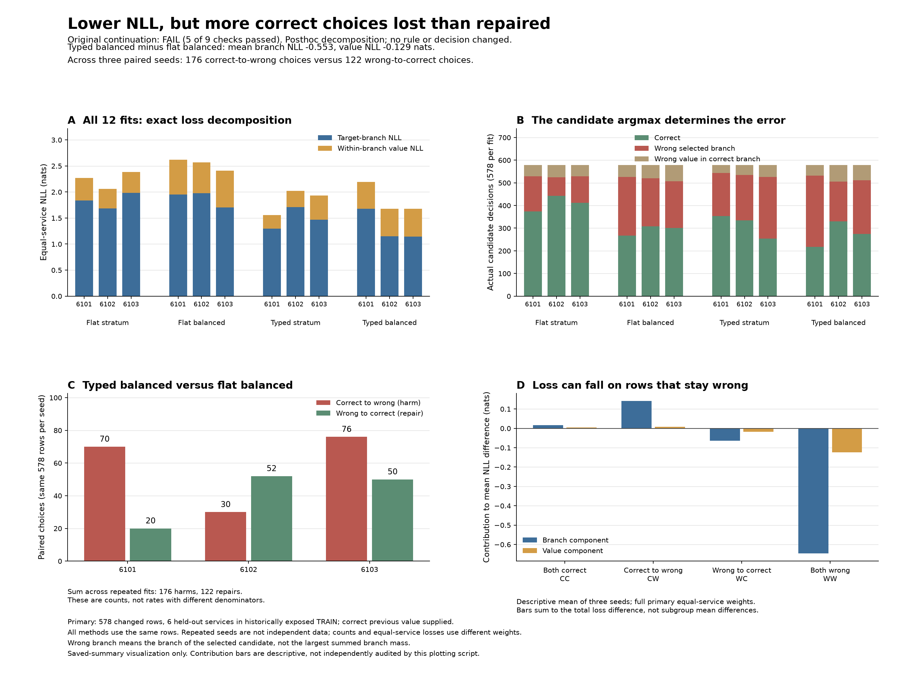

# Why lower loss did not produce better decisions

The typed head put more probability on correct answers that it still did not select. Its largest loss improvement comes from cases that remain wrong. Across the three paired fits, it breaks **176 previously correct decisions** and repairs **122**, leaving **54 fewer correct prediction events**. Of those 176 new errors, **164 choose the wrong answer branch** and twelve choose the wrong concrete value.

This explains the output tradeoff in the [completed twelve-fit study](dialogue-typed-results.md); it does not identify a causal change in learned representations. The original experiment remains **FAIL, with 5 of 9 checks passed**. No model, probability or decision was changed.

## Exact decomposition

The supplied schema separates NOT_MENTIONED, DONTCARE and concrete values. For every saved prediction:

**Target loss = correct-branch loss + correct-value loss conditional on that branch.**

Branch mass is the sum of its candidate probabilities. Computation uses stable logsumexp on the saved logs, without flooring, clipping or renormalizing. All **163,188 evaluated prediction rows** satisfy the identity; the maximum observed residual is zero at float64 precision. The code preserves permitted tiny floating-point deviations rather than repairing probabilities.

These primary results average the three final fits. Losses weight the six held-out services equally; accuracy weights the same **578 changed rows** equally.

| Model | Branch NLL | Within-branch NLL | Total NLL | Actual accuracy |
|---|---:|---:|---:|---:|
| Flat, stratum weights | 1.833056 | 0.406074 | 2.239130 | **70.88%** |
| Flat, rare-category weights | 1.876714 | 0.655843 | 2.532557 | 50.52% |
| Typed, stratum weights | 1.492133 | 0.344781 | **1.836914** | 54.33% |
| Typed, rare-category weights | **1.323570** | 0.527288 | 1.850857 | 47.40% |

The fixed typed-balanced versus flat-balanced contrast reduces branch loss **0.553144 nats** and within-branch loss **0.128555 nats**. Both components improve at every paired seed. Nevertheless, its actual wrong-branch count increases from **225.67 to 242.00 per fit**, and wrong-value count increases from **60.33 to 62.00**. A better log loss does not imply more correct top choices.

## Where the improvement occurs

These contributions use the full primary equal-service denominator, including each service's original row count. They add to the total difference; they are not conditional means within the named subgroup. Negative values favor typed-balanced.

| Paired outcome | Total loss contribution | Branch contribution | Value contribution |
|---|---:|---:|---:|
| Correct in both | +0.020113 | +0.015779 | +0.004334 |
| Correct becomes wrong | +0.149404 | +0.141185 | +0.008220 |
| Wrong becomes correct | -0.081455 | -0.063706 | -0.017749 |
| Wrong in both | **-0.769761** | **-0.646402** | **-0.123360** |
| Total | **-0.681699** | **-0.553144** | **-0.128555** |

The still-wrong contribution exceeds the net improvement because other changes partly offset it. This supports increased probability on the correct answer within still-incorrect decisions, averaged with the specified weights. It does not establish lower confidence in every wrong answer, calibrated probabilities or increased application utility.

| Seed | Correct becomes wrong | Wrong becomes correct | Net correct change |
|---|---:|---:|---:|
| 6101 | 70 | 20 | -50 |
| 6102 | 30 | 52 | +22 |
| 6103 | 76 | 50 | -26 |
| Repeated prediction events | **176** | **122** | **-54** |

The last line counts three models evaluated on the same rows, not 1,734 independent examples or 54 unique failed cases.

All 29 TRUE updates offer both TRUE and FALSE. Every model ranks TRUE above FALSE within the concrete branch, but most actual decisions select another branch. This localizes those observed mistakes to branch selection. Since the primary panel contains no FALSE updates, it does not demonstrate general Boolean or negation understanding. DONTCARE has only five changed rows; its conditional-value correctness is automatic because it is a singleton branch.

## Implication for the next model

Changing branch normalization has not repaired observation-to-answer grounding. Extra rare-category weighting also worsens within-branch NLL at every seed under both normalizers. Repeating those recipes or interpreting their loss gain as a memory result is not justified.

The next [proposed comparison](dialogue-token-alignment-design.md) tests explicit token alignment between the supplied schema/candidate and the observation, against the original flat-stratum scorer and a token-input-matched global-mean control. This is a hypothesis about a stronger observation component, not a conclusion of this diagnostic. Alignment and late interaction have established precedents; success here would not itself establish a novel architecture.

## Evidence and limits

The [protocol and source](dialogue-typed-decomposition-protocol.md) were published before this diagnostic in commit 800d86a. Six synthetic checks cover branch/candidate disagreement, within-branch mistakes, underflow, roundoff, padding, ties, permutations, unequal service weights, paired changes, empty groups and failure preservation. All six pass; Ruff is clean.

The single saved-output run took **6.12 seconds**, with **zero model or training calls**. Its [report](../output/dialogue-typed-decomposition-v1/diagnostic-01/report.md) retains all twelve fits and four paired contrasts. The [summary](../output/dialogue-typed-decomposition-v1/diagnostic-01/summary.json) includes all three evaluation panels, per-service changes, target types, confusion matrices and additive contributions.

An [independent checker](../output/dialogue-typed-decomposition-v1/audit-01/result-01/receipt.json) matches all 163,188 row decomposition identities, 144 primary fit/paired loss means, twelve error partitions/confusions and twelve paired error-transition tables. A separate [contribution check](../output/dialogue-typed-decomposition-v1/contribution-audit-01/receipt.json) verifies the primary contrast's 162 contribution scalars, 27 support counts and 48 TRUE decision counts, including the contribution table above. These independent checks do not cover every secondary panel, every contrast's contributions or all privileged diagnostics. They took 1.05 and 0.67 seconds, respectively, without new model calls.

All inputs remain historically exposed official TRAIN data. The models receive the correct previous value. Branch-mass argmax is distinct from the branch of the actual selected candidate; neither the branch-mass nor true-branch diagnostic is substituted for the original policy. Official test remains untouched, and this posthoc explanation changes no continuation decision.
