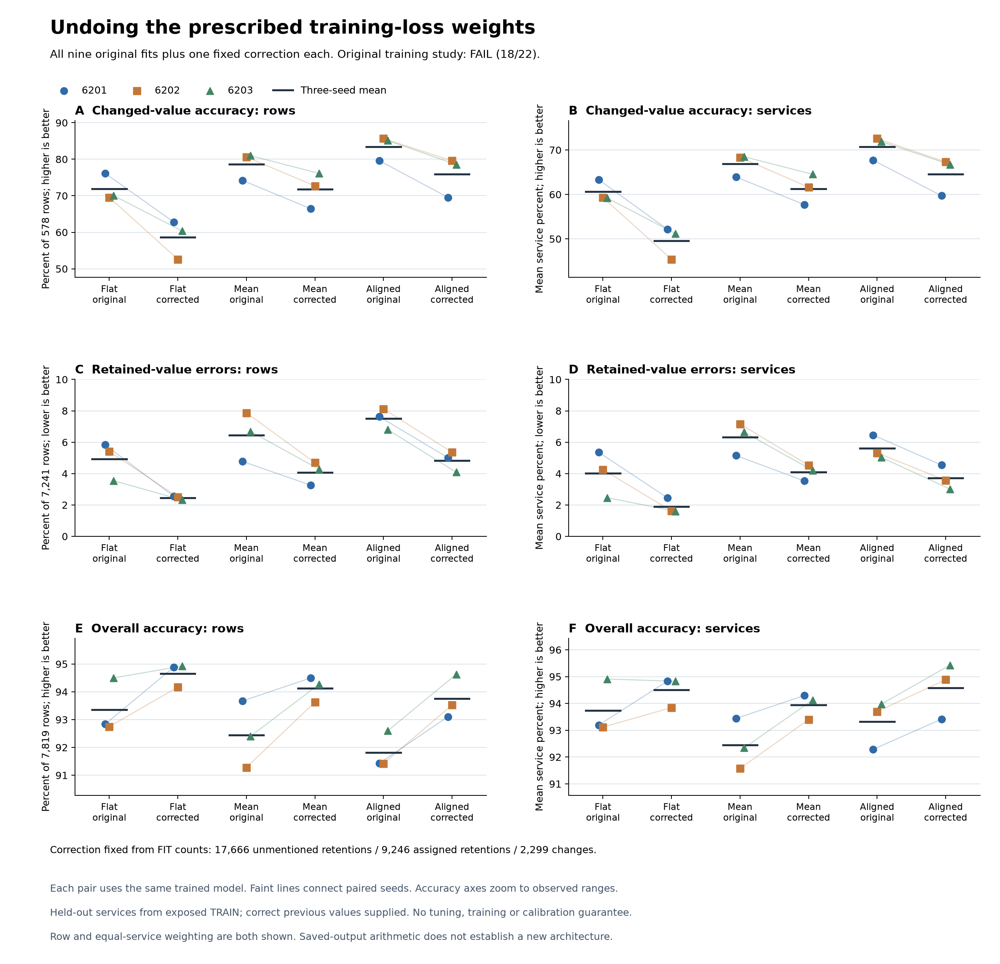

# Training-weight correction improves retention by missing more changes

The fixed correction improves pooled overall accuracy in **all nine fits**,
but reduces changed-value accuracy in every fit. For the aligned model,
retained-value error falls **7.52% to 4.82%**, while changed accuracy falls
**83.45% to 75.89%**. The flat baseline also benefits and reaches the highest
pooled overall accuracy, **94.66%**. This is a consistent keep/update tradeoff,
not a new architecture result or a calibration guarantee.

The producer and independent primary checker agree. The original training
campaign remains **FAIL, 18/22**; no new continuation gate was declared for
this diagnostic.

## What changed

The [published specification](dialogue-weight-prior-diagnostic.md) fixes one
correction using only the training objective. Its FIT counts are 17,666
unmentioned retentions, 9,246 assigned retentions and 2,299 changes. Each
stratum originally receives one third of training-loss mass, through weights
`N / (3 * stratum_count)`.

For each supported candidate, divide its model probability by the analytic
weight of its hypothetical transition, then normalize. A candidate different
from the supplied previous value is a hypothetical change. The previous
candidate is either unmentioned or assigned retention according to its public
type. Current targets never enter the construction. There is no fitted
coefficient, threshold search, model selection, new training or new inference.

The correction preserves the conditional distribution among alternatives.
It only increases the preference to keep the previous value. Consequently it
can repair false updates but cannot repair a previously wrong changed-state
decision in exact arithmetic. The saved decisions follow this pattern:
every prediction altered by the correction moves to the previous candidate; none moves between
alternatives or away from an already selected previous candidate.

All nine original distributions and all nine corrected distributions were
reported. The primary panel remains 7,819 rows from held-out services:
578 changes and 7,241 retentions. These are exposed official TRAIN development
examples, with the correct previous value supplied by the evaluator. The three
seeds repeat optimization on the same data. There was no official DEV inference
or TEST access, and this does not establish autonomous recurrent memory.

## Results and the strongest controls

The table gives three-seed means. Row metrics weight examples equally; service
metrics give each supported service equal weight.

| Model/readout | Changed accuracy | Retained error | Overall row accuracy | Equal-service changed accuracy | Equal-service retained error | Equal-service overall accuracy |
|---|---:|---:|---:|---:|---:|---:|
| Flat original | 71.9146% | 4.9257% | 93.3623% | 60.6091% | 4.0225% | 93.7408% |
| Flat corrected | 58.5928% | 2.4628% | 94.6583% | 49.5859% | 1.8947% | 94.5018% |
| Mean original | 78.6044% | 6.4448% | 92.4500% | 66.9173% | 6.3177% | 92.4522% |
| Mean corrected | 71.7416% | 4.0786% | 94.1339% | 61.2880% | 4.0866% | 93.9411% |
| Aligned original | 83.4487% | 7.5174% | 91.8148% | 70.7136% | 5.6048% | 93.3187% |
| Aligned corrected | 75.8939% | 4.8198% | 93.7545% | 64.5801% | 3.7083% | 94.5765% |

Corrected alignment preserves a changed-value advantage over both corrected
controls, but corrected flat beats its pooled overall accuracy in every seed,
by **139/50/23 correct decisions**. Corrected flat also has the best mean
overall NLL and Brier among corrected methods. Comparing corrected alignment
only with the uncorrected flat baseline would hide this stronger control.

Equal-service overall accuracy narrowly favors corrected alignment over
corrected flat, by **0.0747 percentage points** on average. The paired
differences are **-1.4175/+1.0416/+0.6001 points**, so that advantage is neither
large nor consistent. Flat seed 6203 improves pooled accuracy after correction
but loses **0.0831 points** of equal-service overall accuracy. Pooled gains do
not establish improvement on every service or weighting.

| Model/readout | Unmentioned-retention error | Assigned-retention error | Overall row NLL | Overall row Brier | Changed row NLL | Changed row Brier |
|---|---:|---:|---:|---:|---:|---:|
| Flat original | 6.6716% | 2.7319% | 0.245657 | 0.107935 | 1.193483 | 0.468095 |
| Flat corrected | 3.1415% | 1.6101% | 0.211276 | 0.087518 | 1.792394 | 0.676518 |
| Mean original | 8.6806% | 3.6356% | 0.360954 | 0.126375 | 1.063733 | 0.363995 |
| Mean corrected | 5.4563% | 2.3476% | 0.280447 | 0.097702 | 1.431686 | 0.473622 |
| Aligned original | 10.9540% | 3.1993% | 0.393956 | 0.137895 | 0.749613 | 0.274747 |
| Aligned corrected | 7.0437% | 2.0256% | 0.292989 | 0.104841 | 1.081475 | 0.387079 |

Overall row NLL and Brier improve in every fit; changed-row NLL and Brier worsen
in every fit. These proper-score improvements on the pooled panel are not a
calibration proof. For example, flat seed 6203's equal-service overall NLL
worsens by 0.01153 despite its pooled NLL improvement.

## Every paired fit

No seed or readout is omitted. Changed counts are out of 578; retained errors
are out of 7,241. Each row shows original to corrected.

| Model | Seed | Changed correct | Retained errors | Overall row accuracy |
|---|---:|---:|---:|---:|
| Flat | 6201 | 440 → 363 | 422 → 185 | 92.8380% → 94.8843% |
| Flat | 6202 | 402 → 304 | 391 → 182 | 92.7484% → 94.1681% |
| Flat | 6203 | 405 → 349 | 257 → 168 | 94.5006% → 94.9226% |
| Mean | 6201 | 429 → 384 | 346 → 236 | 93.6693% → 94.5006% |
| Mean | 6202 | 466 → 420 | 570 → 340 | 91.2777% → 93.6309% |
| Mean | 6203 | 468 → 440 | 484 → 310 | 92.4031% → 94.2704% |
| Aligned | 6201 | 460 → 402 | 552 → 363 | 91.4311% → 93.1065% |
| Aligned | 6202 | 495 → 460 | 588 → 388 | 91.4183% → 93.5286% |
| Aligned | 6203 | 492 → 454 | 493 → 296 | 92.5950% → 94.6285% |

Across the three fits, corrected flat repairs 535 retention errors and loses
231 correct changes. Mean repairs 514 and loses 119; aligned repairs 586 and
loses 131. These repeat the same rows across seeds, not independent new
examples. Retained paired tables contain no correct-to-wrong events; changed
tables contain no wrong-to-correct events, as expected from this correction.

## Rare changes still fail

TRUE changed recall falls from **21.84% to 6.90%** for flat, **22.99% to 12.64%**
for mean, and **35.63% to 25.29%** for aligned. Corrected aligned gets 5/10/7
of the 29 TRUE changes right across seeds, versus 11/11/9 originally.

TRUE false-positive rates on the inherited 2,039 supported non-TRUE rows also
fall: flat 6.0978% to 1.1770%, mean 1.9127% to 0.5395%, and aligned 3.1878%
to 1.3078%. Every original and corrected readout still misses all five
DONTCARE changes. There are no FALSE changes or clears in this primary panel.
Zero-support rates remain null.

## What this changes next

The loss weighting is consequential and must be a control in any subsequent
architecture comparison. Inference correction alone only moves the
keep/update tradeoff; it learns no better observation or memory. Training the
same scorer with ordinary row-uniform cross-entropy can test whether different
representation learning does more than this fixed shift. That comparison
requires paired inputs, initialization and orders, with the corrected stratum
model and corrected flat baseline retained as controls. No new training is
admitted by this report.

The broader goal remains unresolved: we still need evidence of a useful
architecture advantage beyond objective choices and simple controls. Neither
this result nor the [earlier probability swap](dialogue-commitment-results.md)
supports a novel recurrent, biological, world-model or conformal mechanism.

## Execution and evidence

The code, specification, synthetic checks and input identities were frozen in
commit `29536f9` before actual execution. The producer ran once in **1.90 s**;
the independent primary audit ran once in **4.67 s**. Process-lifetime peak RSS
was **217.5 MiB / 246.6 MiB**, within the respective 1 GiB limits. Both remained
within 60 seconds and 64 MiB output. These costs cover saved-output arithmetic,
not the earlier model inference. All original training costs remain applicable.

The producer passed 22 synthetic tests and the auditor passed 13; lint passed.
The auditor's synthetic integration preceded the addition of a descriptive
hard-choice witness, with the compared arithmetic unchanged. The final source
review found no blocker. The independent audit confirms **12,130 scalar checks
across 90 primary cells and 270 paired cells**, including row/service/dialogue
metrics, rare supports and normalized scores. Other panels and per-service
tables are reported by the producer but not separately recomputed by this audit.
The final figure was visually inspected.

| Artifact | SHA256 |
|---|---|
| [Source freeze](../output/dialogue-weight-prior-v1/protocol-01/freeze.json) | `44b11a749030353301785aa143674f1636190a00a2b0208e375f7da98d807ed9` |
| [Diagnostic receipt](../output/dialogue-weight-prior-v1/diagnostic-01/receipt.json) | `a0b5209b81a81f33bcebb833b3badc8e7fcf4144ceda5eb2f64bd03adeb67975` |
| [Full summary](../output/dialogue-weight-prior-v1/diagnostic-01/summary.json) | `97e6388f89020628854b3274b8c6d05f8524ea69e7a31931738840ff1bbbd961` |
| [Independent audit](../output/dialogue-weight-prior-v1/audit-01/receipt.json) | `b1f802b477fddfc3c11bf304588753780536d580ec36037acba04290bc96d771` |
| [Figure receipt](../output/dialogue-weight-prior-v1/figure-01/receipt.json) | `34313c5fd5acebb006a7b99c75d9a0d155a1c64b0fa595c7edfb10af8a720ffd` |

Saved request fields provide the exact commands. Source:
[producer](../scripts/diagnose_dialogue_weight_prior.py),
[independent checker](../scripts/audit_dialogue_weight_prior.py),
[plot](../scripts/plot_dialogue_weight_prior.py).
