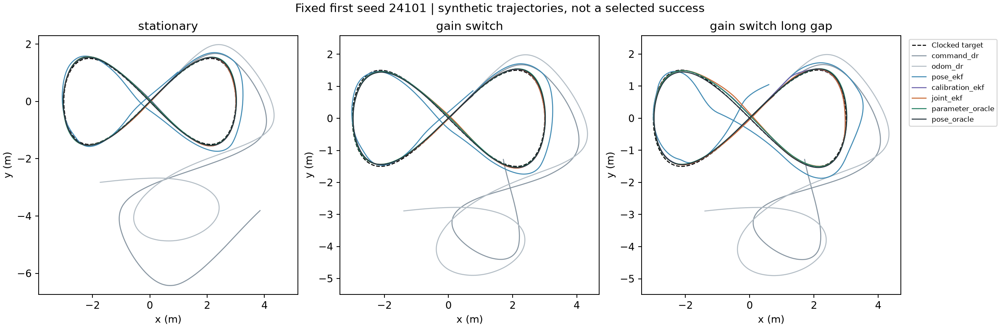

# Does uncertain robot dynamics leave room for learned adaptation?

**This fixed simulation failed its necessary opportunity screen: 6 of 10 requirements passed.** Across 252 episodes, supplying exact dynamics and calibration parameters improved late tracking error by only 3.76% and 9.49% on the two changed-dynamics panels. Both improvements missed the prospective relative and absolute thresholds. A simpler calibration filter also slightly outperformed the joint dynamics filter.

We close this configuration for the proposed recurrent-transition experiment. No neural model was trained, and these results establish no connectome, recurrent architecture, RL or real-robot advantage.


The figure includes every episode. Dots are per-seed errors; bars are equal-seed means. The vertical scale is logarithmic. Lines pair the joint filter and parameter oracle within a seed.

## What was tested

This is an independent differential-drive simulation informed by [Do Better Imagined Rollouts Mean Better Robot Control?](https://arxiv.org/abs/2609.02811). Our [source review](differential-drive-source-review.md) identified a timestamp inconsistency and an exact command-integration shortcut in the released implementation. We aligned endpoint observations, added uncertain physical actuation and actual motion noise, and used a time-indexed tracking target. These are declared task changes, so our scores are not a reproduction of that paper. No upstream implementation or checkpoint was copied.

All seven methods use the same controller, initial pose, landmark map and declared noise scales. Public observers receive issued commands, interval odometry, and endpoint landmark packets with missing-observation masks. Unknown parameters are physical forward/turn gains, odometer scale and gyro bias. Only physical gains change mid-episode; sensor calibration remains fixed. The controller tracks a moving figure-eight target for 300 actions at 0.1 seconds per action.

Twelve seeds run under three conditions: fixed dynamics, one hidden gain change, and the same change with longer landmark blackouts. Every seed's exogenous noise is shared across methods and panels. Observations and visibility can differ because the methods drive along different trajectories. The exact [protocol](drive-qualification-protocol.md) and [frozen configuration](../output/drive-qualification-v1/protocol.json) precede the scored run.

| Method | Information and retained state |
| --- | --- |
| Command integration | Nominal dynamics and issued commands |
| Odometry integration | Raw measured motion, without calibration correction |
| Pose EKF | Pose estimate and covariance; nominal calibration |
| Calibration EKF | Pose, odometer scale, gyro bias and covariance |
| Joint EKF | Pose, actuator gains, calibration and covariance |
| Parameter oracle | Exact current parameters; pose still estimated from noisy public sensors |
| Pose oracle | Exact pose feeds the same nominal controller |

EKF means extended Kalman filter. The joint filter conditions on the shared motion disturbance in odometry and pose propagation. It uses a nonlinear Gaussian approximation, not exact Bayesian inference. The two oracles are separate information references, not deployable methods. Neither secretly uses gain inversion in the controller.

## All results

Equal-seed mean **late tracking MSE in square metres**, lower is better. Each seed contributes one episode mean, regardless of late-window length. Late scoring covers actions 150-299 for stationary physics and starts 30 actions after the hidden switch otherwise. These evaluator-only windows never reset an observer.

| Method | Stationary | Gain switch | Gain switch + long blackout |
| --- | ---: | ---: | ---: |
| Command integration | 7.75388500 | 8.02929827 | 8.02929827 |
| Odometry integration | 16.55555615 | 17.95136231 | 17.95136231 |
| Pose EKF | 0.03552629 | 0.03241258 | 0.07097025 |
| Calibration EKF | 0.00740178 | 0.00665021 | 0.00710874 |
| Joint EKF | 0.00739847 | 0.00673331 | 0.00740732 |
| Parameter oracle | 0.00659931 | 0.00648008 | 0.00670456 |
| Pose oracle | 0.00606627 | 0.00597994 | 0.00597994 |

The fixed screen required **each switched panel** to show at least 10% and 0.001 m² lower late MSE for the parameter oracle versus joint EKF, strict improvements on at least 9/12 seeds, and zero divergent episodes for both methods. Divergence means exceeding three metres of tracking error at any step.

| Required check | Gain switch | Longer blackout |
| --- | ---: | ---: |
| Relative improvement >=10% | **3.76084%, fail** | **9.48737%, fail** |
| Absolute improvement >=0.001 m² | **0.000253229, fail** | **0.000702760, fail** |
| Strict paired wins >=9/12 | 9/12, pass | 10/12, pass |
| Joint EKF: no divergence | 0/12, pass | 0/12, pass |
| Parameter oracle: no divergence | 0/12, pass | 0/12, pass |

The stationary diagnostic improves 10.80%, but only by 0.000799157 m² and on 7/12 seeds. It is not part of the required ten checks. All EKFs and oracles have zero divergent episodes in all panels. Command integration diverges on 4/12 stationary and 7/12 switched episodes; raw odometry integration diverges on 9/12 in every panel. Full tracking, localization, heading, command effort and timing measurements are retained in the [machine-readable report](../output/drive-qualification-v1/report-01/summary.json).



This is the first seed specified in the protocol, not a selected successful case. The target is scored by time; following its geometric curve alone does not establish good tracking.

## Interpretation and continuation

Estimating sensor calibration accounts for much of the improvement over pose-only EKF. The calibration filter already observes realized motion through corrected odometry, which is consistent with a small extra control benefit from knowing physical gains. It slightly beats the larger joint filter in both switched panels.

The failed screen does not prove that neural adaptation is useless or that the remaining uncertainty is irreducible. It says this fixed configuration did not demonstrate the practical parameter-information gap required before more expensive comparisons. The pose oracle has a different information privilege; its gap cannot substitute for passing the parameter screen.

We will not retune gains, blackout lengths, thresholds or controller settings to turn this result into a pass. The moving-window and change-point baselines, followed by neural recurrent-transition adaptation, do not proceed on this recipe. A future venue must independently demonstrate a useful learnable gap beyond strong classical estimation. This run supplies no evidence of a new architecture or paper-level contribution.

## Reproducibility and accounting

- **252 completed episodes, 75,600 simulated plant transitions**, zero neural fits and zero model API calls. No scored retries or failures.
- **67 preflight tests passed** across the task, observers and independent reporter; Ruff passed. Checks include event order, analytic Jacobians, disturbance conditioning, covariance updates, angle wrapping, failure-prefix retention and rejection of private observer inputs.
- The run took **9.94 seconds** on an Apple M5 Max with Python 3.12.13 and NumPy 2.5.3. Summed observer time was 7.53 seconds and controller time 0.62 seconds, both included in the execution time. Thread-limit environment variables requested one thread; actual library threading was not separately measured. This is not a hardware speed comparison.
- The saved-output audit reconstructed every motion transition, command, parameter timeline, odometry reading, landmark packet and visibility mask. Maximum numerical reconstruction discrepancies were **0.0** for all five reported categories. It also recomputed metrics and verified counts and artifact hashes.
- The audit did not run observers, regenerate random draws or call a model. Observer algebra is bound to frozen source and tests, rather than independently replayed. Its 5.99-second reporting time is separate from simulation time.

Receipts: [execution completion](../output/drive-qualification-v1/run-01/completed.json), [all episode records](../output/drive-qualification-v1/run-01/records.json), [audit receipt](../output/drive-qualification-v1/report-01/receipt.json), [saved noise streams](../output/drive-qualification-v1/streams/).

Pinned SHA-256 values:

```text
protocol:   98d74a8ac90c936dbb29daad63e0b53109413b8f272999b4e0e04e8bea607260
completion: f9a0bf412108e8c4058d662d4b59212086adc72bd641e9a37083b7ec0d2800d1
audit:      6089723ead2892f398aef624fa6092358e92d7435bb272d248f97563c261eed1
```

To independently audit the published saved run, from the repository root with its locked environment:

```sh
PYTHONPATH=src:scripts OPENBLAS_NUM_THREADS=1 OMP_NUM_THREADS=1 VECLIB_MAXIMUM_THREADS=1 \
  .venv/bin/python scripts/report_drive_qualification.py \
  --experiment output/drive-qualification-v1 \
  --out output/drive-qualification-v1/report-independent \
  --protocol-sha256 98d74a8ac90c936dbb29daad63e0b53109413b8f272999b4e0e04e8bea607260 \
  --completed-sha256 f9a0bf412108e8c4058d662d4b59212086adc72bd641e9a37083b7ec0d2800d1
```

The reporter requires a new output directory and validates the frozen source files. No scientific rerun is needed to inspect these results.
