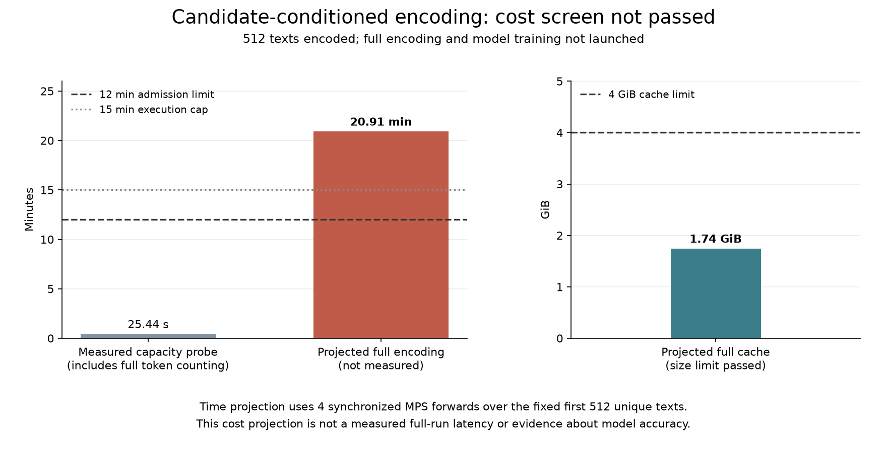
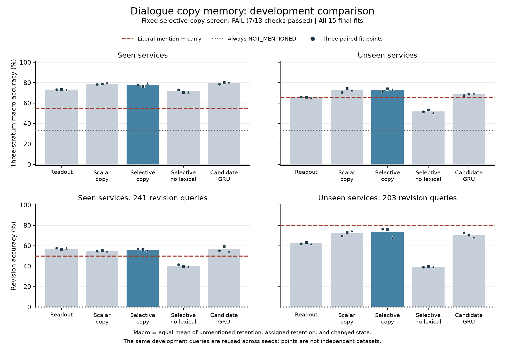
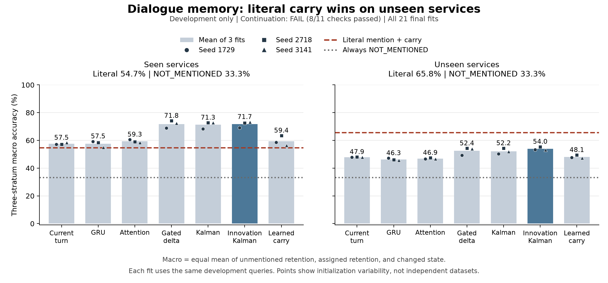
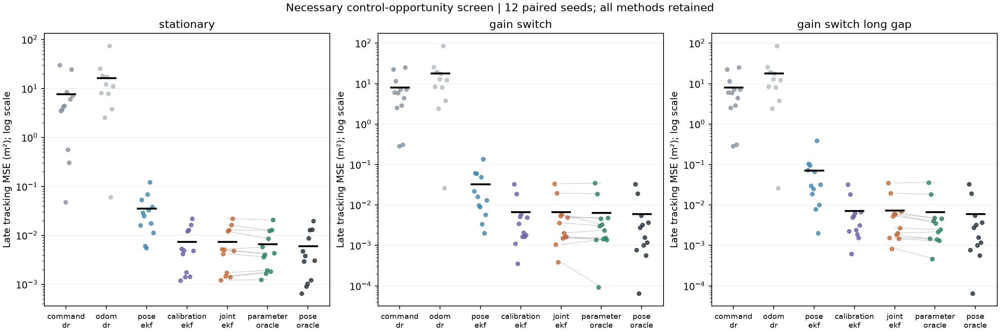
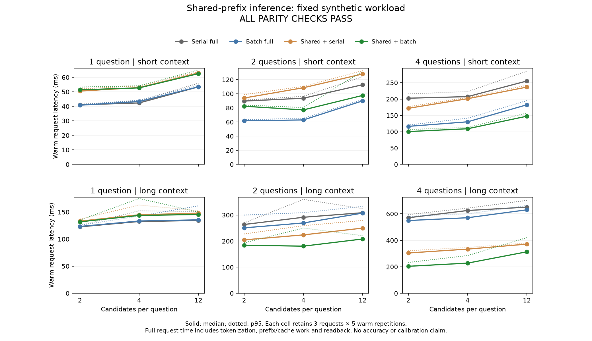
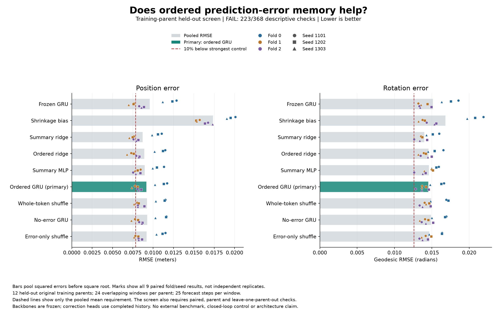
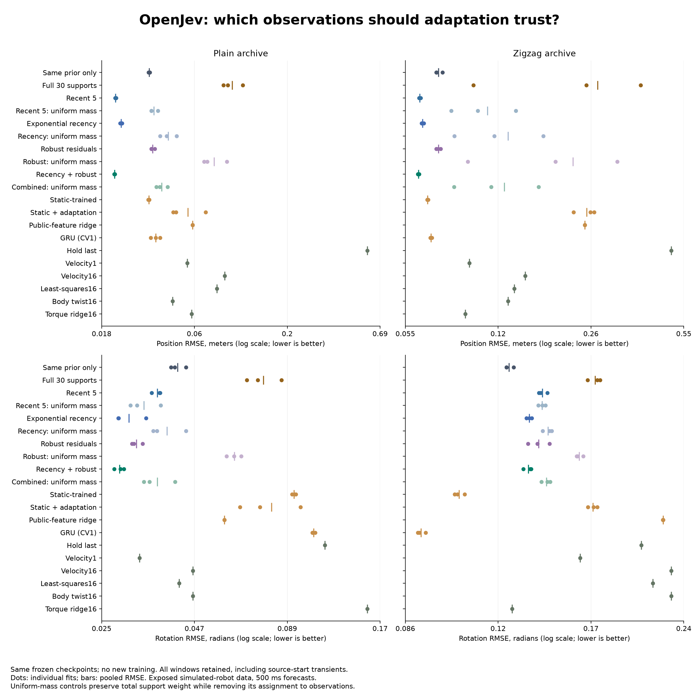
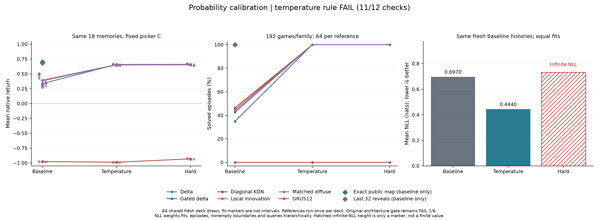
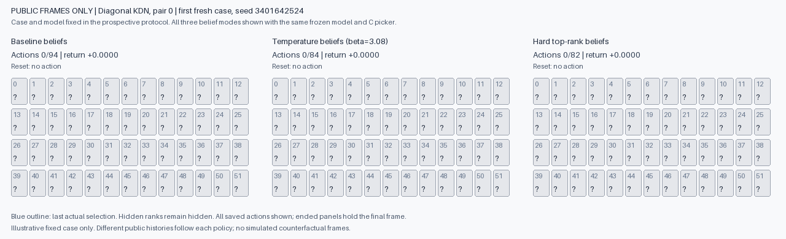

# OpenJev experiment archive

- [Larger-budget author NL-LFR](fsm-author-nllfr-budget-protocol.md): **registered; not yet started**. One fresh fit from the exact original initialization raises the iteration cap from 10,000 to 100,000, retaining the five-hour limit. The first 10,000 loss entries must match exactly. Qualification passes 19 producer/vendor tests and 53 independent-auditor tests. FIT-only; no new development evaluation or candidate selection. [Registration](fsm-author-nllfr-budget-registration.json).

- [Author NL-LFR diagnostic](fsm-author-nllfr-results.md): **REFERENCE_INCOMPLETE**. One fit reaches its fixed 10,000-iteration cap; all 384 diagnostic forecasts replay exactly in the independent audit. Diagnostic RMSE is 0.05146 versus 0.04290 for the unchanged candidate, but an incomplete reference cannot pass the continuation rule. Training and bounded state estimation remain unresolved. [Protocol](fsm-author-nllfr-protocol.md) · [Evidence and checkpoints](https://github.com/kw2828/OpenJev/releases/tag/fsm-author-nllfr-study-v1) · [Prior publication correction](fsm-author-publication-correction.md).

- [FIT-only author BLA28 reference](fsm-author-bla-results.md): **reference complete; 4/4 continuation checks pass** with independent audit agreement. One 574-step BFGS fit finishes; all 384 causal forecasts are independently reconstructed. BLA error is 0.09573, versus 0.04290 for the unchanged recurrent candidate. VARX96 remains the stronger linear control at 0.05830; the output-only correction remains the strongest overall control. The new reference does not strengthen the prior hardest comparison or reproduce the authors' periodic score. NL-LFR and untouched shift remain pending. [Protocol](fsm-author-bla-protocol.md) · [Evidence and checkpoints](https://github.com/kw2828/OpenJev/releases/tag/fsm-author-bla-study-v1).

- [Stronger linear controls and affine deployment](fsm-linear-controls-results.md): **development PASS, 9/9 conditions**. Nine new VARX fits with orders 32/64/96 complete; all twelve selected residual checkpoints remain unchanged. The fixed candidate has 26.41% lower error than the best new linear model and 22.31% lower than output-only tanh. Native affine folding preserves all three models' forecasts and reduces measured latency 3.56 times and numeric storage 42.47%. All 25 evaluations, 300 forecast banks, 36 parity banks and 600 timing samples are retained; independent audit agrees. Small timing differences are unstable across runs. This is exposed DEV, with author BLA28/NL-LFR and untouched transfer still pending. [Protocol](fsm-linear-controls-protocol.md) · [Complete evidence](https://github.com/kw2828/OpenJev/releases/tag/fsm-linear-controls-study-v1) · [Author-method qualification](fsm-author-reference-qualification.md).

- [Linear-backbone residual comparison](fsm-residual-results.md): **development PASS, 9/9 conditions**. All 36 fits complete 73,728 updates; all 37 evaluations, 444 prediction banks and 888 timing samples are retained. Selected tanh feedback lowers error 22.31% versus tanh output-only, at 2.33% higher latency and equal storage. All three matched learning rates favor tanh feedback. Native VARX remains 4.08 times faster and 7.01 times smaller. The independent audit agrees. Selection uses exposed DEV; no untouched transfer, biological mechanism or new architecture is established. [Protocol](fsm-residual-protocol.md) · [Complete evidence](https://github.com/kw2828/OpenJev/releases/tag/fsm-residual-study-v1) · [Next design](fsm-residual-next.md).

- [Multivariate recurrent correction](fsm-correction-results.md): **development FAIL, 5/9 conditions pass**. All 21 neural fits and nine VARX fits complete; 21,504 neural updates, 360 prediction banks and 720 timing samples are retained. Selective correction has 2.46% higher error and 21.69% higher latency than dense correction, losing in every seed. Routing varies across blocks but does not improve forecasting. Independent saved-output audit agrees. [Protocol](fsm-correction-protocol.md) · [Complete evidence](https://github.com/kw2828/OpenJev/releases/tag/fsm-correction-study-v1).

- [Predictive-state correction qualification](predictive-state-qualification.md): **139 fabricated tests and lint pass**. Dense, selective and rewired correction share parameters and predictive supervision. A mathematical check rejects the single-output ParWH circuit as a test of adaptive routing: the selected block is fixed at frozen weights. The estimation-only data adapter passes chronology and target-isolation checks; no measured arrays, training or efficacy comparison were run. [Mechanism and next comparison](predictive-state-routing-design.md).

- [Joint observer and dynamics](robot-joint-observer-results.md): **development FAIL, 4/5 criteria pass**. All twelve fresh fits complete 4,096 updates. Long history lowers mean error 0.75% versus continued two-observation training and 0.32% versus the fresh temporal encoder, but remains 4.68% worse than the strongest historical control at 1.41x continued two-observation latency. The independent audit agrees. All 57 final states, 584 score rows, 292 attempts and 61 cost slots are retained, including prior failures. All four recordings are exposed development data; transfer remains unlaunched. [Complete evidence](robot-joint-observer-results/README.md) · [Protocol](robot-joint-observer-protocol.md).

- [Position-only observer](robot-position-observer-results.md): **development FAIL, 3/5 criteria pass**. All six fresh fits complete 4,096 updates. Error is only 0.023% lower than the two-observation baseline, at 1.37x its full-request latency, and 5.59% higher than the strongest historical control. Seven FIT-only probes identify native float32 aggregate-norm overflow despite finite gradient entries in two replayed failures. The original process and independent audit complete, retaining 45 final states, 488 score rows, 244 attempts and 46 current cost slots. All four recordings remain exposed development data; official TEST stays closed. [Complete evidence](robot-position-observer-results/README.md) · [Protocol](robot-position-observer-protocol.md).

- [Frozen-dynamics observer](robot-observer-results.md): **development FAIL, 0/5 criteria pass**. Three of six learned-gain fits fail with nonfinite training gradient norms, leaving neither rate eligible across all three seeds. All twelve newly fitted affine initializers complete. Eighteen attempts retain 61,462 updates, 48 final checkpoints, 208 forecast attempts, 416 score rows and 43 cost slots, including unavailable costs. The original process and independent audit complete; all four recordings are exposed development data and official TEST remains closed. [Full-range and detail charts](robot-observer-results/README.md) · [Evidence](robot-observer-results/manifest.json) · [Protocol](robot-observer-protocol.md).

- [Reserved-recording history confirmation](robot-history-confirmation-results.md): **confirmation FAIL, 3/5 criteria pass**. All 24 frozen checkpoints and four references complete on two previously reserved recordings, with no refitting or selection. Temporal affine lowers equal-file H128 error 4.16% versus last-two and 0.38% versus equally sized local affine, below the required 5%, and is 3.19% worse on the first recording. The original run and independent audit complete; all 112 rows and 28 timing attempts remain visible. Both confirmation recordings are now exposed; official TEST remains closed. [Evidence](robot-history-confirmation-results/manifest.json) · [Protocol](robot-history-confirmation-protocol.md).

- [Observed-history initialization](robot-history-initialization-results.md): **development gate PASS, 5/5; subsequent confirmation fails, with 3/5 criteria passing**. All eighteen fresh fits complete 4,096 updates, with thirty unchanged control fits retained. Temporal affine lowers development H128 RMSE 6.48% versus last-two and 5.21% versus equal-size local affine. That development result and its independent audit remain valid, but the [reserved-recording comparison](robot-history-confirmation-results.md) does not confirm the required benefit. [Complete development evidence](robot-history-initialization-results/manifest.json) · [Protocol](robot-history-initialization-protocol.md).

- [Twelve-reflection capacity comparison](robot-reflection-capacity-results.md): **continuation FAIL, 38/69 conditions**, comprising 38/67 accuracy and 0/2 compute conditions. All six fresh fits complete 4,096 updates, with 36 parent fits retained unchanged. Selected-recipe mean error improves 3.47% / 4.64% over four reflections, but remains 8.50% / 12.80% worse than the smaller MLP-gated dense control and takes 3.14 times its latency. All 182 pre-run and 95 integrated audit/publication tests pass; the independent audit verifies 92 forecasts and all 184 scores. No confirmation or official TEST access. [Complete evidence](robot-reflection-capacity-results/manifest.json) · [Protocol](robot-reflection-capacity-protocol.md) · [Prospective history-initialization comparison](robot-history-initialization-design.md).

- [Compact structured robot transitions](robot-structured-results.md): **continuation FAIL, 23/61 conditions**. All 30 fresh fits complete 4,096 updates, with six unchanged legacy fits retained. Four Householder reflections reduce storage 20.32% versus matched bounded dense but worsen mean error 9.15% / 19.35% and take 1.61 times its eager CPU latency. The 590-parameter MLP-gated dense control is the useful development lead; it still takes 1.69 times GRU32 latency. Independent audit verifies 72 neural and eight reference replays, 160 scores and the full unchanged rule. Confirmation and official TEST remain closed. [Complete evidence](robot-structured-results/manifest.json) · [Protocol](robot-structured-protocol.md).

- [Native robot inference qualification](robot-native-qualification-results/README.md): **110/110 fabricated checks pass**, with the original 88/90 failure preserved. A source-derived reduction-order correction fixes initialized Householder drift. The separately registered trained-checkpoint comparison fails numerical parity before timing, with all 30 cases retained. No Rust speedup, accuracy improvement or architecture promotion. [Native protocol](robot-native-protocol.md) · [Build and tests](../rust/robot_transition/README.md).

- [Bounded robot transitions](robot-transition-results.md): **recurrent-scheduler continuation FAIL, 27/45 conditions**. All 24 fits complete 4,096 updates. The simpler current-state scheduler has 8.27% / 6.36% lower mean error than a freshly trained GRU, but 1.90 times its inference latency. Its dynamics state still recurs; only scheduler memory is reset. Causal horizon-specific ridge controls use no later torque inputs. All 196 qualification tests pass; an independent scoring audit verifies 48 exact neural checkpoint replays, 112 scores and all 45 conditions. These are adaptive results on the same exposed DEV2, not independent confirmation. [Complete evidence](robot-transition-results/manifest.json) · [Protocol](robot-transition-protocol.md).

- [Recurrent residual coupling on measured robot data](robot-coupling-results.md): **continuation FAIL, 20/55 conditions**. Thirty scheduled attempts produce 24 completed fits and six unstable polynomial fits. The 266-parameter chain-memory candidate has mean full-horizon standardized RMSE 0.78402 / 0.85290, versus 0.78114 / 0.84783 for rewired memory and 0.77177 / 0.82614 for GRU. Complete CPU forecasts take 4.42 ms versus GRU's 1.99 ms. All 98 qualification tests pass. Whole-recording splits, causal preprocessing and future measured-torque inputs define an internal conditional forecast, not the official benchmark or a deployable controller. Confirmation and official TEST stay closed. [Chart, checkpoints and evidence](robot-coupling-results/manifest.json) · [Protocol](robot-coupling-protocol.md) · [Next constraint](robot-coupling-next.md).

- [Small nonlinear phase memory on measured hardware](phase-results.md): **continuation FAIL, 3/21 conditions**. Fifteen completed fits and four classical references use internal Silverbox development sequences. The 18-parameter energy-phase model has mean RMSE 7.23071 / 5.47164 mV, versus 6.35180 / 4.76508 for its matched nonlinear-readout control, 0.87717 / 0.72743 for GRU16 and 0.94665 / 0.94149 for seven-parameter refined cubic AR2. All 131 tests pass; independent reconstruction verifies 504 arrays, 38 full predictions and all conditions. No official TEST values are parsed. [Chart, checkpoints and evidence](phase-results/manifest.json) · [Protocol](phase-protocol.md) · [Next constraint](phase-next.md).

- [TRAIN-only delayed sensor-memory screen](sensor-screen-results.md): **benchmark rejected, 3/6 conditions**. Nine fixed predictors use seven public inputs and a 24-hour label delay. Static quadratic RMSE is 0.04724 / 0.05825 on May/June, below the frozen 0.07340 headroom threshold. Adaptation helps in June, but no same RLS configuration reaches 10% improvement in both months. All 75 tests pass; independent CSV/equation reconstruction verifies 52 saved arrays and all six conditions. No learned architecture was trained, and July+ measurements remain unparsed. Pending-input queues alone cost 1,344 bytes, correcting the earlier prospective 1 KB sketch budget. [Chart and evidence](sensor-screen-results/manifest.json) · [Protocol](sensor-screen-protocol.md) · [Next constraint](sensor-screen-next.md).

- [Bounded observation consolidation](measurement-results.md): **baseline qualification PASS, 26/26 conditions**. Three fixed sketches compete with packed Coverage118, Coverage98 and Recent98 on 1,536 fresh fields and 6,144 requests. The spectral primary has zero measured decision regret on both 192-observation populations within 1,022 logical bytes. DCT has effectively equal regret, so the result does not establish a spectral or learned-architecture advantage. Both have higher measured latency than raw buffers on the long streams. The 64-observation panels fit raw memory exactly by design. Known grid/kernel assumptions remain explicit. [Protocol](measurement-protocol.md) · [Chart and evidence](measurement-results/archive-index.json).

- [RL-trained Gaussian memory retention](retention-results.md): **continuation FAIL, 12/42 conditions**. Three 33-parameter selectors complete 1,536 group-relative policy-gradient updates and 49,152 TRAIN trajectories. Mean regret falls 27.63% / 17.07% / 19.53% versus KL8 on BASE / SHIFT / LONG, but a geometry-based 41-observation buffer has 7.32x / 4.02x / 3.00x lower regret and faster measured inference within the same 1,024-byte logical cap. All 151 qualification tests pass; the independent audit replays all 54 projected-state batches of 128 contexts, reconstructs 18 raw-buffer and nine FIC state batches, and verifies 99 prediction groups and all 42 conditions. The known-law field is static; no learned world dynamics or architecture advantage is established. [Chart and evidence](retention-results/archive-index.json) · [Protocol](retention-protocol.md) · [Stop and redirect](retention-next.md).

- [Residual uncertainty with fixed learned kernels](residual-memory-results.md): **control qualification FAIL, 9/11 conditions**. An established FIC correction lowers SHIFT regret 71.80% but raises BASE/LONG regret 13.64% / 20.74%, failing both preservation conditions. Three unchanged parent kernels, 1,152 fresh contexts and 4,608 requests compare original low-rank, query-only correction, FIC, fitted full GP and true-kernel GP. All 61 qualification tests pass; independent dense conditioning agrees with all 117 prediction groups. Full GP receives archive caching too. No new training, architecture advantage or parent-candidate rescue. [Chart and evidence](residual-memory-results/archive-index.json) · [Protocol](residual-memory-protocol.md) · [Prospective correlated-memory question](residual-memory-next.md).

- [Query-centered nonlinear features](query-feature-results.md): **continuation FAIL, 2/24 conditions**, with 15 completed fits and 3,072 fresh requests across 768 contexts. Query-centered16 raises regret by 63.09% BASE and 8.98% SHIFT versus static16; every control wins on each cohort's mean regret. Static Nyström is the strongest fitted decision baseline, but all fitted arms lose to always defer under the compound shift. All 107 tests pass; independent full-GP reconstruction and saved-output scoring agree with 96 rows and the complete rule. Static models receive archive caching, while centered models pay for every recomputation. This is a failed prerequisite for selective refinement, not a recurrent or biological architecture result. [Chart, all checkpoints and evidence](query-feature-results/archive-index.json) · [Protocol](query-feature-protocol.md).

- [Strong linear function-reuse reference](function-reuse-reference-results.md): **all 10,240 fresh requests recovered the correct function and incurred zero candidate-decision regret**, across 1,280 contexts, five independent cohorts and K=1/3/8/16 public functions. Per-group MSE is 1.50e-30 to 4.06e-30; all 80 fixed conditions pass. Cached ordinary least squares uses 64K map coefficients and exploits the known noiseless linear class. Few-shot-only MSE is approximately 0.50. All 69 tests pass; the independent QR/SVD audit agrees with all 20 groups. Original run/audit processes took 1.792/1.582 seconds. This is a strong-control benchmark diagnostic, not a novel neural architecture or reproduction of the cited paper's trained models. Raw accuracy on this task does not justify further neural training. [Chart and complete evidence](function-reuse-reference-results/receipt.json) · [Prospective query-time memory question](query-time-memory-next.md).

- [Exact public-history schedule diagnostic](schedule-headroom-results.md): **NO_REGISTERED_HEADROOM** under the precommitted requirements. Ten fixed references on five fresh datasets, with no new training. Learned exact tracking lowers additive regret by 40.95% versus recurrent, 21.86% versus global, and 12.18% versus learned static-two; all seven control comparisons improve in every cohort. Both learned and true-law exact candidates pass 14/15 conditions, failing only normal-noise preservation: regret is 2.55x / 1.89x unchanged, respectively, with harm in all five cohorts. The true-law history comparison passes 2/2 and reduces mean regret 17.54% versus true static-two, so the classification does not mean that history has no descriptive benefit. Exact tracking is supplied the correct schedule prior and stores 288 joint probabilities. Learned exact inference averages 65.2 ms per 512 episodes versus recurrent's 15.2 ms. All 123 tests pass; the independent audit reconstructs all 20 exact-reference outputs and agrees with all 50 rows. This closes the adaptation line for the tested population, history length and requirements; neither average gains nor a privileged-oracle gap overrides the rule. It does not prove that every possible controller must fail. [Chart](schedule-headroom-results/benchmark.png) · [Full evidence](schedule-headroom-results/archive-index.json) · [Protocol](schedule-headroom-protocol.md).

- [Learning observation reliability with recurrent memory](reliability-memory-results.md): **continuation FAIL, 8/13 conditions**. Twenty fits across five independent datasets compare six filters using the same frozen backbones. The recurrent model has lower mean decision regret by 3.59% / 2.86% versus Markov and 3.43% / 1.83% versus the GRU-reset control on SHIFT / SWITCH, with all five paired datasets favoring recurrent in each comparison. All four improvements miss the required 10%; BASE regret is 3.80x unchanged, with harm in every cohort. The one-parameter global adapter beats recurrent in every SHIFT and SWITCH cohort; the static bank adds no trainable parameters and has lower mean regret than recurrent in all four strata. Mean recurrent inference is 18.5% slower than Markov. All 141 tests pass; the independent audit checks 120 prediction groups and agrees with all 13 conditions. Complete evidence preserves all 20 fits, 30 final checkpoints, optimizer states, public histories, privileged references and original closures across 368 archived members. Reset preserves Bayesian memory and matches stored size, not effective capacity. Private-noise-path risk is not a calibration guarantee or public-information Bayes floor. [Chart](reliability-memory-results/benchmark.png) · [Evidence index](reliability-memory-results/archive-index.json) · [Protocol](reliability-memory-protocol.md).

- [Independent-cohort action-error loss comparison](finite-action-range-results.md): **continuation FAIL, 17/54 conditions**. Thirty fits cross two unchanged recurrent architectures with MSE, twice-MSE and action-error-range losses across five independent data cohorts. The rounded-range candidate wins 13/40 paired H4/H8 comparisons, meets 0/8 mean-reduction requirements and passes 4/6 absolute groups. Twice-MSE has lower mean regret than range loss in all four regime/horizon settings. All three rounded losses fail SHORT and OBSERVED criteria in the same four shifted cohorts. Mean rounded fitting takes 26.41 / 25.47 / 25.88 seconds for MSE / twice-MSE / range. All 46 primitive and 120 integration tests pass; the independent audit agrees. Complete evidence retains all 30 fits, 90 model and 90 Adam boundaries, both 161-source snapshots, the primitive 152-source snapshot and original closures: 1,017 members across 11 archive parts. This rejects the proposed loss improvement under the fixed rule; architecture contrasts remain descriptive and the earlier 14/15 failure stays unchanged. [Chart](finite-action-range-results/benchmark.png) · [Evidence index](finite-action-range-results/archive-index.json) · [Protocol](finite-action-range-study-protocol.md).

- [Saved decision-error decomposition](finite-decision-error-results.md): **descriptive audit complete; parent remains FAIL 14/15**. All 29,160 case records, 60 model/horizon groups and 20 paired contrasts reconcile independently with original predictions. In the previously losing seed's H8 comparison, three decisions favor the candidate, six favor the control and 477 have equal regret. One disagreement with true margin at least 0.1 contributes +0.00047412 to the mean difference and outweighs the other bins' combined gains. Costs are already centered by construction. Qualification passes 65 fabricated tests; no model, optimizer or generator calls occur. The complete 144-source snapshot, original closures and all case records remain available. [Chart and evidence](finite-decision-error-results/evidence.tar.gz) · [Separate prospective loss-control hypothesis](finite-decision-error-next.md).

- [Learning without the task-specific starting head](finite-head-learning-results.md): **continuation FAIL, 14/15 conditions**. Fifteen fresh fits compare a task-initialized rounded anchor, random-head rounded candidate and initially matched random-head free control. Candidate passes SHORT 36/36, BLIND 31/31 and OBSERVED 12/12; nine of ten paired comparisons improve, but seed 436261004 loses at H8. Mean H4/H8 regret falls 97.96% / 98.01%, largely driven by two weak control fits. Mean fitting takes 26.48 versus 24.95 seconds. Qualification passes 375 tests and the independent saved-output audit agrees. Complete evidence retains all 45 model and 45 optimizer boundaries, both 137-source snapshots and the original 372-pass/three-failure qualification with its 131-source snapshot. This BASE-only diagnostic does not fix the prior observation-noise-shift failure or admit a further architecture experiment. [Complete evidence](finite-head-learning-results/evidence.tar.gz) · [Test-only repair protocol](finite-head-learning-protocol-v2.md).

- [Five-seed recurrent replication and observation-noise shift](finite-reuse-replication-results.md): **continuation FAIL, 45/54 conditions**. Fifteen fresh fits complete the same 1,024 prefix and 3,072 joint updates; each unchanged model faces two independently generated evaluation cohorts. BASE passes 24/27 conditions and SHIFT passes 21/27; both fail continuation. Mean H4/H8 regret reductions span 99.50-99.82% at original noise and 92.92-95.58% at higher noise, with weak control fits driving much of the average. Seed 435261005 loses three BASE and four SHIFT paired comparisons; SHIFT also fails rounded SHORT and OBSERVED criteria. Mean rounded fit time is 25.46 seconds versus 23.89 / 24.19 seconds. All 336 qualification tests and the independent saved-output audit pass. The archive retains every attempted case, 45 model and 45 optimizer boundaries, original closures and both 116-source snapshots. The shift changes emissions only and retains favorable transition structure and task-derived head initialization. [Complete evidence](finite-reuse-replication-results/evidence.tar.gz) · [Separate prospective diagnostic and prior art](finite-recurrent-next-direction.md).

- [Equal-update recurrent learning with computation reuse](finite-reuse-learning-results.md): **local advance PASS, all 19 conditions**. Nine fits complete exactly 1,024 prefix and 3,072 joint updates each, with paired minibatches and shared computation for every arm. Rounded mean H4/H8 regret falls 99.13% / 99.53% against original free and 99.11% / 99.51% against matched free; all twelve paired comparisons improve. Two weak fits in each control dominate the average gap. Mean rounded fitting time is 23.86 seconds versus 22.35 / 22.14 seconds. All 229 qualification tests pass; independent saved-output audit agrees. All 512 TRAIN and 128 DEV attempts, 27 model and 27 optimizer boundaries, full traces and both 102-source snapshots remain available. This synthetic-world result requires untouched replication and scenario shift before broader validation; prior failed studies stay closed. [Complete evidence](finite-reuse-learning-results/evidence.tar.gz).

- [Integrated joint-reuse throughput](finite-joint-reuse-throughput-results.md): **engineering speed gate PASS, all 12 conditions**. Median complete-training-call ratios are 1.201x / 1.203x / 1.349x for original free / matched free / rounded. All nine measured pairs favor reuse; one original-free pair improves only 0.9%. All 24 fits, including six warmups, are retained. Qualification passes 78 tests; the independent audit checks 72 model and 72 optimizer boundaries with maximum model discrepancy 1.72e-14. The initial 77-pass/one-failure qualification exposed a test-label collision before any timed fit; its evidence and sources remain frozen. A separate registration corrects the test only. This is single-machine training throughput, not task effectiveness, significance or scientific admission. [Complete study and original failure evidence](finite-joint-reuse-throughput-results/evidence.tar.gz).

- [Joint computation reuse qualification](finite-joint-reuse-qualification-results.md): **44 tests and lint pass; original native phase 4.067 seconds**. A per-call helper builds probability fields once instead of five times and filters eligible endpoint histories once instead of twice. Fabricated checks cover all three arms, H1/H2/H8 outputs/losses, raw and clipped gradients, three Adam steps, partial and empty endpoint batches, failures and stale-state prevention. Numerical equivalence is tolerance-based, not a promise of identical long training trajectories. No measured speedup, empirical fit or scientific admission; the earlier feasibility stop stays closed. [Complete evidence](finite-joint-reuse-qualification-results/evidence.tar.gz).

- [Equal-update feasibility stop](finite-update-learning-stop-results.md): **273 tests pass; engineering admission FAIL**. All three retained engineering fits and their independent audit completed. Conservative projections of the preselected 1,024-prefix/3,072-joint schedule are 97.13 / 99.39 / 102.53 seconds, exceeding the fixed strict 90-second admission rule. These are projections, not measured full-fit times. No scientific registration or run followed; counts and thresholds stay unchanged. All 75 frozen sources, original closure, full retained probe and dependency evidence are preserved. [Complete evidence](finite-update-learning-stop-results/evidence.tar.gz).

- [Rounded transition learning comparison](finite-rounded-learning-results.md): **nine fits; advance FAIL with 14/21 conditions met**. Rounded and original-free arms pass all SHORT, BLIND and OBSERVED criteria. Rounded mean H4/H8 decision regret is 11.09% / 17.88% worse than original free; its 96.04% / 96.72% reductions against the initially matched free control are dominated by one poor control fit. Rounded loses three paired comparisons against original free and two against matched free. Both comparisons pass the mean fitting-time bound. Qualification passes 216 tests; independent saved-output audit agrees. Both 63-file source snapshots, all 27 model and 27 optimizer boundaries, every attempted update and complete costs are retained. [Complete evidence](https://github.com/kw2828/OpenJev/releases/tag/finite-rounded-learning-v1).

- [Rounded transition numerical qualification](finite-rounded-transition-qualification-results.md): **36 tests and lint pass in 1.896 seconds including startup and cleanup**. Four fixed sweeps plus declared positive-slack transport rounding pass independent values/gradients, correction diagnostics and failure checks at the unchanged 1e-12 residual tolerance. This is a different finite function from the stopped fixed64 candidate. No training or task evaluation in this qualification; the subsequent [learning comparison](finite-rounded-learning-results.md) fails its advance rule. [Source and qualification evidence](finite-rounded-transition-qualification-results/evidence.tar.gz).

- [Balanced-transition integration stopped](finite-balanced-learning-stop-results.md): **204 tests passed, one integration test failed**. After 299 accepted engineering prefix updates, the balanced model exceeded its fixed 1e-12 row-residual tolerance on attempt 300. Two free-control engineering fits completed, but no DEV generation, independent evaluation or scientific study followed. All 63 frozen sources, original process closure and 27 preserved partial artifacts are retained. The original attempt remains closed. [Complete evidence](finite-balanced-learning-stop-results/evidence.tar.gz).

- [Balanced transition numerical qualification](finite-balanced-transition-qualification-results.md): **42 tests and lint pass in 2.699 seconds including startup and cleanup**. Fixed 64-sweep log-domain balancing passes closed forms, independent forward/finite-difference checks, analytic uniform gradients, invariances and explicit failures. No empirical evaluation or training. Subsequent [model integration stopped at qualification](finite-balanced-learning-stop-results.md); no three-arm research result exists and uniform mixing is still possible. [All source and qualification evidence](finite-balanced-transition-qualification-results/evidence.tar.gz).

- [Saved recurrent transport diagnostic](finite-transport-diagnostic-results.md): **all 27 checkpoints, 53 qualification tests pass**. Four accurate final fits have stronger weakest transition directions and lower uniform-mass drift than five inaccurate fits. Dobrushin coefficients overlap and every H8 cost Gram retains rank seven; this is descriptive geometry, not a causal information-loss result or a performance gain. No model, optimizer or generator calls, new cases or training updates. Both qualification attempts and complete source snapshots are retained. [Child evidence](finite-transport-diagnostic-results/evidence.tar.gz) requires the [parent checkpoint release](https://github.com/kw2828/OpenJev/releases/tag/finite-training-allocation-v1). [Prospective balanced-transition test](balanced-transport-next.md).

- [Equal-time recurrent learning allocation](finite-training-allocation-results.md): **nine fits; advance FAIL with 16/21 conditions met**. Prefix learning lowers mean H4/H8 regret 40.68% / 44.17% versus continuous joint training and 37.94% / 44.39% versus restarted joint training, with mean full fitting time within 0.03% of both controls. Seed 430261001 worsens at both horizons against both controls. All arms pass SHORT 24/24 and OBSERVED 8/8 but fail BLIND; prefix meets 18/21 blind conditions. All 512/128 fresh attempted histories, 27 model and 27 optimizer boundaries and every attempted update retained. Qualification passes 269 tests; the independent audit agrees. [Complete evidence](https://github.com/kw2828/OpenJev/releases/tag/finite-training-allocation-v1).

- [Expected-count versus gradient pretraining](finite-expected-count-learning-results.md): **nine fits; gradient passes SHORT 24/24 and OBSERVED 8/8, but fails BLIND 15/21**. Gradient pretraining lowers mean H4/H8 regret 45.42% / 35.63% versus joint-only, with all six paired comparisons favorable and 34.61% more training time. Expected-count MAP lowers means 24.75% / 29.17%, with mixed paired effects and 35.34% more time. Every arm fails long-horizon forecasting; no candidate advances. All 512/128 fresh attempted histories, 27 checkpoints and update traces retained; 156 integration tests pass and the independent audit agrees. [Complete evidence](https://github.com/kw2828/OpenJev/releases/tag/finite-expected-count-learning-v1).

- [Expected-count numerical qualification](finite-expected-count-qualification-results.md): **66 tests and seven exact hidden-path witnesses pass**. Independent rational enumeration checks action-conditioned inference and hazards; gradient/MAP paths share the specified regularized objective. Fabricated inputs only, no decision-performance claim. Evidence is included in the [learning release](https://github.com/kw2828/OpenJev/releases/tag/finite-expected-count-learning-v1).

- [Frozen states, certificate-driven readouts](finite-gap-readout-study-results.md): **9/9 numerical certificates pass; every family still fails SHORT and BLIND**. All nine original checkpoints stay fixed. Refitting the bounded head gives small, mixed changes on 114 eligible fresh DEV cases; matched unrestricted improves means, but no model advances. Event, survival and state outputs are unchanged. Selected integration tests pass 75/75; failed first integration and initial publication rendering are retained. [Complete evidence](https://github.com/kw2828/OpenJev/releases/tag/finite-gap-readout-study-v1) · [Next proposed learning mechanism](finite-gap-readout-study-next.md).

- [Projected-solver qualification](finite-gap-solver-qualification-results.md): **18/18 fabricated fixtures pass versus 10/18 for the original solver**. All 36 outputs receive independent scalar checks; 73 tests and lint pass. No empirical model calls or decision-performance claim. Evidence is included in the [readout diagnostic release](https://github.com/kw2828/OpenJev/releases/tag/finite-gap-readout-study-v1).

- [Frozen dynamics, convex action readout](finite-convex-readout-results.md): **stopped before DEV; 3/9 numerical certificates pass**. All nine fixed-checkpoint solves return optimizer success, but six exceed the registered 1e-8 optimality-gap threshold. Original model weights remain unchanged, and fresh evaluation generation is zero. Qualification passes 73 tests. No retry, tolerance change, numerical re-audit or performance claim. [Preserved evidence](https://github.com/kw2828/OpenJev/releases/tag/finite-convex-readout-v1).

- [Factorized recurrent dynamics](finite-factorized-dynamics-results.md): **nine fits; smaller model fails SHORT 23/24 and BLIND 17/21, passes OBSERVED 8/8**. With 352 rather than 1,120 parameters, mean H4/H8 regret falls 35.15% / 19.39% against the initially function-matched control and 47.88% / 39.00% against the dense control. Same-seed gains are mixed, and fitting takes 4.87% / 5.06% longer. No stable candidate advancement. All nine checkpoints, initial/final functions and fresh 512/128 attempted cases are retained. [Complete evidence](https://github.com/kw2828/OpenJev/releases/tag/finite-factorized-dynamics-v1).

- [Fresh readout replication](finite-cost-readout-replication-results.md): **six fits; continuation FAIL, 6/8 conditions**. Mean H4/H8 regret falls 59.55% / 55.47% against the initially identical softened control, with all six paired comparisons favorable. Learned SHORT 21/24, BLIND 14/21 and OBSERVED 7/8 all fail. The longer-horizon follow-up does not proceed; all 512 TRAIN and 128 DEV attempts, six checkpoints and original phases are retained. [Complete evidence](https://github.com/kw2828/OpenJev/releases/tag/finite-cost-readout-replication-v1).

- [Learning the decision readout](finite-cost-readout-results.md): **nine fits; learned readout passes short-horizon learning and observed filtering, but fails blind extrapolation, 16/21 conditions**. Mean four/eight-step regret falls 73.75% / 53.24% against exact fixed C and 72.27% / 49.72% against the initially matched softened control; every paired seed improves, but two learned fits fail eight-step thresholds. All 512 TRAIN and 128 DEV attempts, checkpoints and complete costs remain retained. Privileged initialization, synthetic world, no architecture or native-transfer claim. [Complete evidence](https://github.com/kw2828/OpenJev/releases/tag/finite-cost-readout-v1).

- [Public-history prediction supervision](finite-prefix-learning-results.md): **six matched fits; all three criteria fail for both versions**. Added prefix likelihood lowers fresh-event NLL 19.56% and eight-step regret 6.05%, but four-step regret rises 5.44% and training time rises 41.45%. All 512 TRAIN and 128 DEV attempts, including terminal prefixes, are retained; the models remain identical and the fixed cost readout is privileged. [Complete evidence](https://github.com/kw2828/OpenJev/releases/tag/finite-prefix-learning-v1).

- [Shared learned filtering](finite-shared-filter-results.md): **all nine fits complete; all three criteria fail for every arm**. Shared filtering lowers mean eight-step regret 10.27% versus untied filtering and 6.43% versus a GRU prefix, with every paired seed favorable at that horizon; four-step regret remains mixed. No oracle prefix inputs, but the fixed cost basis remains privileged. All 481 TRAIN and 122 fresh DEV cases, paired differences, work counts and checkpoints are retained. [Complete evidence](https://github.com/kw2828/OpenJev/releases/tag/finite-shared-filter-v1) · [Next: predict throughout the public history](finite-shared-filter-next.md).

- [Learning state versus learning dynamics](finite-factor-learning-results.md): **12 fits, all three criteria pass only with the exact starting state supplied**. The learned-state/exact-dynamics and jointly learned cells fail all three criteria. All 484 TRAIN and 120 fresh DEV cases, all seeds and independent target/metric checks are retained. The result isolates a history-encoding weakness under this recipe; no deployable-policy or architecture gain. [Complete evidence](https://github.com/kw2828/OpenJev/releases/tag/finite-factor-learning-v1) · [Next: shared filtering and forecasting operators](finite-factor-learning-next.md).

- [Exact finite-world recurrent learning](finite-observation-learning-results.md): **audited BASE_TRAINABLE_FAIL and SHIFT_TRANSFER_FAIL**, all 15 fits complete, 485 TRAIN and 239 DEV prefixes. Tied/untied transitions, dense/retentive initialization and an ordinary GRU trained on two-step targets and faced four/eight-step gaps. Retentive initialization did not solve learning; no native-environment or architecture gain. [Complete evidence](https://github.com/kw2828/OpenJev/releases/tag/finite-observation-learning-v1) · [Next: isolate history encoding from dynamics](finite-observation-learning-next.md).

- [Same GRU, conditional cost labels](otto-conditional-label-results.md): **audited DEV_FAIL in both settings**, six matched fits, 329 fresh TRAIN and 173 DEV prefixes. Averaging the same 32-label bank lowers mean teacher-cost regret 4.9% in lambda3 but raises it 6.1% in the unseen sensing regime. Both margin and paired-seed consistency checks fail; no architecture or autonomous-control claim. [All checkpoints and evidence](https://github.com/kw2828/OpenJev/releases/tag/otto-conditional-label-v1). [Interpretation and next qualification](otto-conditional-label-next.md).

- [Observation-operator component](otto-observation-operator-status.md): **24 fabricated tests and 16 geometry rollouts pass**. Tied observation marginals and an independently learned blind-transition control have explicit probability accounting, causal forecasts and verified optimizer paths. No empirical training or architecture advantage established.

- [Conditional-cost decision headroom](otto-cost-information-results.md): **audited HEADROOM_RESOLVED**, 48 retained fresh prefixes from 64 starts, twelve frozen policies and 23,557 teacher annotations. Separate selection/evaluation streams lower mean teacher-cost regret about 48% / 62% versus three recurrent policies, with the predeclared criterion passing in both settings. This is an expensive reference diagnostic, not a trained-model or autonomous-control gain. [Next: separate conditional labels from recurrent state design](otto-cost-information-next.md).

- [Paired action-effect supervision](otto-action-effect-results.md): 12 fits, the same 1,046 TRAIN cases and 181 fresh DEV cases; audited **DEV_FAIL, 6/18**, unchanged legacy gate also 6/18. Against the identical recurrent control, mean action-effect error falls 22.78% / 19.44%, but shifted decision gap rises 19.79%; all six complete matched-recurrent comparisons fail. [Next: align decision targets with available information](otto-action-effect-next.md).

- [Full-belief probability distillation](otto-belief-distillation-results.md): 12 fits, 1,046 TRAIN and 187 fresh DEV cases; audited **DEV_FAIL, 7/18**. Soft targets lower mean long-gap log loss 31.94% / 33.74% versus sampled targets; action-effect accuracy fails to transfer consistently. [Next hypothesis](otto-belief-distillation-next.md).

- [Action-conditioned latent prediction](otto-action-latent-results.md): fresh precommitted action blocks, nine neural fits and one ridge reference; DEV_FAIL, 2/18 comparisons. [Next hypothesis](otto-action-latent-next.md).

Studies and frozen work awaiting execution, including failures and controls. A passing implementation check is not an architecture result.

## Complete experiment list

- [Direct readout solve on frozen recurrent features](otto-direct-readout-results.md): **audited REUSED DEV FAIL 4/6**, six solves, twelve TRAIN export checks and fifteen DEV views. Fixed ridge lowers mean later gap 16.49% versus Adam in lambda3 but is 3.71% worse in lambda4; all rank-87 designs/export checks pass. Adaptation takes 4.79-5.16 seconds with full shared cache cost charged, without a matched-speedup claim. [All methods and checks](otto-direct-readout-results/README.md) · [Evidence](https://github.com/kw2828/OpenJev/releases/tag/otto-direct-readout-v1) · [Next action-conditioned prediction hypothesis](otto-action-latent-proposal.md).

- [Recurrent weight updates at comparable continuation cost](otto-readout-compute-results.md): **audited DEV FAIL 1/6**, all six fits and nine views on 36 fresh paths. All three timing ratios pass the registered 10% comparability band. Readout74 lowers mean later gaps 3.01% / 12.82% versus joint40, with mixed individual cells and slightly greater elapsed training time. No autonomous, inference-speed or architecture advantage. [Every fit and check](otto-readout-compute-results/README.md) · [Evidence and checkpoints](https://github.com/kw2828/OpenJev/releases/tag/otto-readout-compute-v1) · [Direct-solve control proposal](otto-linear-probe-proposal.md).

- [Readout learning versus recurrent weight adaptation](otto-readout-state-ablation-results.md): **audited diagnostic FAIL 3/6**, nine matched continuation fits and twelve DEV views. Action-only readout training costs 46.38% less than full joint, with mean later gaps 1.84% / 5.31% higher. Full-joint gains vary across paired seeds and settings; readout proximity holds in only three of six cells. Reused DEV is explicit; no new TEST, confirmation or autonomous result. [All fits and costs](otto-readout-state-ablation-results/README.md) · [Evidence and checkpoints](https://github.com/kw2828/OpenJev/releases/tag/otto-readout-state-ablation-v1).

- [Prior-DEV Bayesian residual reanalysis](otto-residual-reanalysis-results.md): **audited DEV FAIL 4/13**, all 72 views completed at selected tau 0.1. Later score gaps are 30.11% / 3.35% worse than joint auxiliary training; covariance contrast fails 2/10. The real two-interpreter handoff is repaired and qualified. Prior development data is disclosed, and the earlier failed screen remains closed. [Figure and all methods](otto-residual-reanalysis-results/README.md) · [Complete evidence](https://github.com/kw2828/OpenJev/releases/tag/otto-residual-reanalysis-v1).

- [Frozen-feature Bayesian residual estimators](otto-residual-estimator-status.md): **18 DEV paths collected; evaluation planning failed before numerical decoding**. The 531 fabricated tests and capacity probe missed a conflict between the native collector and evaluator runtime checks. No candidate selection or performance result was produced; confirmation and the prior study's TEST remain unused. [Failure and separate repair plan](otto-residual-runtime-repair.md) · [Protocol](otto-residual-estimator-protocol.md).

- [Query-written memory comparison](otto-query-memory-results.md): **18 fits, 108 collected paths; DEV FAIL 6/13**. History delta memory has a **54.1% higher / 14.3% lower** later teacher-score gap than the best control in the two settings, with several paired-seed failures. Original training and independent audit close successfully. TEST remains unused; no autonomous comparison is admitted. [All methods and seeds](otto-query-memory-dev-results/query-memory-dev.md) · [Protocol](otto-query-memory-protocol.md) · [Closure and qualification](otto-query-memory-status.md).

- [Query-written memory engineering](otto-query-memory-engineering.md): **128 fabricated tests and lint pass; no new trained-model result**. Separate period-four/eight predictor and causal history-conditioned correction kernel, with exact query outputs, prewrite forecasts, explicit carry and computation counts. Prior failure remains closed. [New hypothesis and required comparisons](otto-query-memory-design.md).

- [Protected recurrent forecasts and action readouts](otto-protected-readout-results.md): **15 fits, 90 fresh trajectories; FAIL 15/29**. All original phases and the independent audit close successfully. Frozen-SPO preserves recurrent forecasts bitwise but has **29.05% / 36.28% higher** mean later teacher-score gaps than Joint AUX. All eight 10% mean-gap comparisons and all four agreement guards fail. No autonomous, connectome or architecture advantage established. [All models and evidence](https://github.com/kw2828/OpenJev/releases/tag/otto-protected-readout-v1).

- [Decision-focused recurrent training: negative, descriptive result](otto-action-focused-results.md): all **12 paired seed-by-setting later gaps worsen**. Mean increases are 26-34% for explicit correction and 52-107% for GRU. Saved arithmetic independently reconciles; original training parent closure remains unverified, so all three continuation gates stay ineligible. Complete models and predictions are retained without retry. [Figures and evidence](https://github.com/kw2828/OpenJev/releases/tag/otto-action-focused-v1) · [Frozen protocol](otto-action-focused-protocol.md) · [Next protected-readout design](otto-protected-readout-design.md).

- [Saved score-error and action-ranking diagnosis](otto-ranking-diagnosis-results.md): all **24 fits, 36 VALID paths and 27,990 diagnostic records** independently reconciled. Lower legal-centered and best-boundary MSE can accompany worse choices; a simple irrelevant-pair explanation is not supported. Separate-AUX versus shared-AUX increases both errors in all four full-path architecture/setting means. Retrospective only, zero new model or simulator calls; the original three failed gates stay closed. [All-fit figure](../docs/assets/otto-ranking-levels.png) · [All contrasts](../docs/assets/otto-ranking-contrasts.png) · [Evidence](https://github.com/kw2828/OpenJev/releases/tag/otto-ranking-diagnosis-v1) · [Decision-focused follow-up design](otto-action-focused-design.md).

- [Separate forecast readouts](otto-separate-prior-results.md): **90 complete paths, 24 fits; all three gates fail**. Explicit mechanism **11/19**, GRU mechanism **10/19**, architecture **14/29**. Versus shared-AUX, splitting outputs lowers full agreement **2.84 / 1.21 pp** for explicit correction and **4.04 / 1.98 pp** for GRU, while worsening primary raw gaps in every setting. Independent saved-output audit agrees. No autonomous or architecture advantage. [All-fit figure](../docs/assets/otto-separate-prior-forecast.png) · [Costs](../docs/assets/otto-separate-prior-costs.png) · [Protocol](otto-separate-prior-protocol.md) · [All checkpoints and evidence](https://github.com/kw2828/OpenJev/releases/tag/otto-separate-prior-v1).

- [Where prior supervision hurts decisions](otto-prequery-decision-diagnosis-results.md): **216 saved episode pairs, no new fitting**. Initial steps 1-3 contribute **-2.43 / -5.44 percentage points** to the proposed model's full-path agreement change, outweighing later gains. The ordinary GRU shows the same mean pattern, with substantial variation across seeds. Independent reconciliation of all 1,728 transition cells agrees. Original **FAIL 51/55** unchanged; gradient conflict is not established. [Figure](../docs/assets/otto-prequery-decision-decomposition.png) · [Separate-readout implementation and next comparison](otto-separate-prior-engineering.md).

- [Supervising the forecast before each planner query](otto-prequery-calibration-results.md): **90 complete paths, 12 fits, audited FAIL 51/55**. The explicit correction's auxiliary loss reduces prior MSE **44.87% / 40.59%** and primary teacher-score gap **20.32% / 40.62%** versus its original-loss control. The ordinary GRU also benefits; it retains the lower gap at λ4. Full-path agreement declines in both settings. Auxiliary training costs about **1.9x**, with **4.87x** the backward chunks and unchanged update counts. No consistent architecture or autonomous-control advantage. [Figure](../docs/assets/otto-prequery-forecast.png) · [Costs](../docs/assets/otto-prequery-costs.png) · [Protocol](otto-prequery-calibration-protocol.md) · [Complete evidence](https://github.com/kw2828/OpenJev/releases/tag/otto-prequery-calibration-v1).

- [Persistent memory corrected at real queries](otto-cross-query-forecast-results.md): **90 complete paths, 12 fits, audited FAIL 40/53**. Candidate primary agreement is **63.08% / 46.64%**, versus persistent GRU's **64.03% / 48.76%**; its teacher-score gaps are also worse in both settings. Primary metrics retain zero-support episodes in their denominators. The explicit-error GRU has lower mean gaps than all other learned families. All 291 sampled training windows, 7,346 validation rows and twelve final checkpoints remain available. No autonomous or architecture advantage established. [Figure](../docs/assets/otto-cross-query-forecast.png) · [Protocol](otto-cross-query-forecast-protocol.md) · [Engineering checks](otto-cross-query-engineering.md) · [Complete evidence](https://github.com/kw2828/OpenJev/releases/tag/otto-cross-query-forecast-v1).

- [Sampled TRAIN, complete VALID score forecasts](otto-sampled-forecast-results.md): **90 complete paths, 12 fits, audited FAIL 41/45**. Ordinary GRU agreement is **76.54% / 64.36%**, compared with hold's **30.24% / 33.27%**. The proposed residual GRU reaches **71.53% / 62.74%** and fails all four ordinary-GRU comparison conditions. All 327 sampled training windows, full 9,698-row validation census, checkpoints and predictions are retained. No autonomous performance, compute saving or architecture advantage established. [Figure](../docs/assets/otto-sampled-forecast.png) · [Protocol](otto-sampled-forecast-protocol.md) · [Complete evidence](https://github.com/kw2828/OpenJev/releases/tag/otto-sampled-forecast-v1).

- [Exact teacher-value cache diagnostic](otto-exact-cache-results.md): **complete exact replay; opportunity screen FAIL 3/4**. A fixed episode-local LRU64 found 2,378 hits in 22,296 returned requests, associated with **10.65% of historical TensorFlow time**, below the fixed 40% threshold. All 68 resets, final updates, twelve cells and the partial episode prefix remain visible. Zero new learned-model, TensorFlow, native-environment or optimizer calls. No measured speedup, native-cache admission or architecture gain. [Figure](../docs/assets/otto-exact-cache.png) · [Protocol](otto-exact-cache-protocol.md) · [Complete evidence](https://github.com/kw2828/OpenJev/releases/tag/otto-exact-cache-v1).

- [Recurrent score-forecast pilot](otto-score-forecast-results.md): **collection incomplete at its fixed 900-second cap; 67/90 episodes complete, one interrupted, 22 unstarted**. Four matched models, complete causal windows and the comparison harness passed 72 fabricated checks. No fitting or forecast evaluation occurred; all 45 conditions remain not evaluated. Original sources, failed collection, complete TRAIN arrays and partial VALID records are preserved. [Coverage figure](../docs/assets/otto-score-forecast-status.png) · [Protocol](otto-score-forecast-protocol.md) · [Related work](otto-score-forecast-related-work.md) · [Complete evidence](https://github.com/kw2828/OpenJev/releases/tag/otto-score-forecast-v1).

- [Sparse-query opportunity test](otto-sparse-query-results.md): **24 VALID paths and 360 EVAL searches; FAIL 14/16**. All searches succeed. Period-two cuts fully paid controller cost **53.15% / 40.79%** versus neural at primary lengths 3 / 4, but misses one move-quality requirement in each. All five arms, known-shift length 5 and 54 diagnostics retained. The first audit failed on a nested cost-field type check; a separately frozen correction agrees without changing data or criteria. No learned-model or architecture result. [Figure](../docs/assets/otto-sparse-query.png) · [Protocol](otto-sparse-query-protocol.md) · [Audit correction](otto-sparse-query-audit-repair.md) · [Complete evidence](https://github.com/kw2828/OpenJev/releases/tag/otto-sparse-query-v1).

- [Completed paired query-value pilot V2](otto-query-advantage-v2-results.md): **72 TRAIN paths, 264/264 available label panels; FAIL 7/11**. Base differing decisions span only five originating cases; length 4 has nonpositive covariance. Independent saved-record audit agrees on 6,606,135 checks; no gate fitting admitted. The separate durable-logging qualification achieved **5.103x median speedup** on fabricated events with identical bytes and per-event fsync. [Figure](../docs/assets/otto-query-advantage-v2.png) · [Scientific protocol](otto-query-advantage-v2-protocol.md) · [Logging results](otto-query-logging-results.md) · [Complete evidence](https://github.com/kw2828/OpenJev/releases/tag/otto-query-advantage-v2).

- [Paired query-value signal pilot](otto-query-advantage-results.md): **incomplete at the fixed 900-second cap**. All 72 TRAIN paths and 256 available anchors were saved; 210 label panels completed, one was interrupted and 45 remained unstarted. The signal rule was not evaluated, no model was trained, and no scientific retry occurred. [Protocol](otto-query-advantage-protocol.md) · [Preserved partial evidence](https://github.com/kw2828/OpenJev/releases/tag/otto-query-advantage-v1).

- [Learned recurrent and stateless query gates](otto-query-gate-learning-results.md): **60 TRAIN trajectories, six fits, 576 fresh searches; FAIL 30/38 required checks**. Every learned decision queries the existing neural planner, so both families reproduce its behavior with extra cost. All searches succeed; the changed setting takes **2.34x** as many moves as analytic control. No computation saving or recurrence advantage. The independent saved-record audit agrees on 4,299,097 checks. [Tradeoff figure](../docs/assets/otto-query-gate-tradeoff.png) · [All-fit metrics](../docs/assets/otto-query-gate-metrics.png) · [Protocol](otto-query-gate-evaluation-protocol.md) · [Evidence and checkpoints](https://github.com/kw2828/OpenJev/releases/tag/otto-query-gate-learning-v1) · [Next experiment](otto-query-gate-next-experiment.md).

- [Native query-gate integration](otto-query-gate-native-results.md): **18 short probes, 174 steps, 85 queries and 3,033 original checks passed**. Queried decisions match the unchanged neural planner, and never-query makes no neural calls. A separate saved-log check reconciles the complete records. This qualifies the interface only; the alternating counter is not a learned recurrent model. [Next learning design](otto-query-gate-learning-design.md): 60 scheduled TRAIN trajectories with separate annotation/query histories, followed by matched recurrent/stateless gates and fixed controls.

- [Exact-input target conflicts](otto-target-conflicts-results.md): the common empirical squared-error component **0.167067503** accounts for **67.40%** of the longer-trained models' final mean TRAIN loss. All 4,464 occurrences, 2,672 groups and six fixed models retained; independent saved-data audit agrees. Pooling weighted mean targets changes this objective only by a constant and supplies no new information. No new model or simulator calls, no policy gain. [Figure](../docs/assets/otto-target-conflicts.png) · [Protocol](otto-target-conflicts-protocol.md). The [competent-planner query gate](otto-competent-start-options.md) is a prospective learning direction.

- [Fixed training budget, 80 versus 320 epochs](otto-training-budget-results.md): **six fits and 504 fresh searches; FAIL 10/33**. On identical R64 labels, final TRAIN MSE falls **11.38%** and sampled-label decision cost gap falls **14.78%**. Weighted success rises from **10.19% / 20.42% / 4.52%** to **15.34% / 21.57% / 9.52%**, but competence is **0/18** and analytic control finds all 72 sources. All three paired-block conditions fail. Exact training prefixes match, and the independent saved-record audit agrees on 27,768,190 checks. No architecture advantage. [Control figure](../docs/assets/otto-training-budget.png) · [TRAIN diagnostics](../docs/assets/otto-training-budget-train.png) · [Protocol](otto-training-budget-protocol.md) · [Evidence](https://github.com/kw2828/OpenJev/releases/tag/otto-training-budget-v1) · [Completed target-conflict follow-up](otto-target-conflicts-results.md).

- [Teacher-target precision, 16 versus 64 samples](otto-target-precision-results.md): **six fits and 504 fresh searches; FAIL 7/33**. Weighted success changes from **21.43% / 12.79% / 15.11%** to **19.78% / 17.89% / 13.06%**. More samples help only length 4; all learned fits fail competence and analytic control finds all 72 sources. The 96,912 added continuations cost 1,028.31 seconds. Independent saved-record audit agrees with all outcomes and criteria. Same model, original 16-sample scale, data and optimizer work; no architecture advantage. [Chart](../docs/assets/otto-target-precision.png) · [Protocol](otto-target-precision-protocol.md) · [Evidence](https://github.com/kw2828/OpenJev/releases/tag/otto-target-precision-v1) · [Next decision](otto-target-precision-next-decisions.md).

  [Saved-target noise diagnosis](otto-target-noise-results.md): all 558 original panels retained. The estimated mean-noise moment is 99.883% of the observed centered-target second moment; independent split-half correlation is -0.0522. Exploratory saved-data diagnosis, independently checked, with no new scientific calls. It motivated the precision experiment but does not establish policy efficacy.

- [Matched teacher-cost learning](otto-teacher-learning-results.md): **six fits and 504 fresh searches; FAIL 5/33**. Continuation-target weighted success **7.75% / 4.11% / 5.83%** is below analytic-target **20.65% / 8.42% / 9.08%** in every setting; analytic control finds all 72 sources. Competence **0/18**, relative conditions **2/12**, positive controls **3/3**. All 558 anchors and 32,304 teacher continuations were retained. The corrected saved-record audit agrees on 88,432,918 checks, with zero new scientific calls. The original target-centering audit failure and its separately frozen repair remain preserved. No competence or architecture advantage. [All-fit figure](../docs/assets/otto-teacher-learning.png) · [Protocol](otto-teacher-learning-protocol.md) · [Evidence](https://github.com/kw2828/OpenJev/releases/tag/otto-teacher-learning-v1).

- [Teacher-cost cohort support](otto-teacher-cohort-results.md): **558/558 selected states supported across all 144 learner-TRAIN episodes**, including reset and late retained states. One public replay reconstructed 119,212 updates in 16.85 seconds; no belief repair, replacement or omission. Independent saved-record audit agrees on selection, all captured hashes, support predicates and 239,828 events. Twenty extractor tests and four execution-failure tests passed. This qualifies inputs for a matched learning study; it generates no labels and establishes no policy or architecture gain. [Protocol](otto-teacher-cohort-protocol.md) · [Complete phase evidence](https://github.com/kw2828/OpenJev/releases/tag/otto-teacher-cohort-v1).

- [Autonomous spatial value control](otto-spatial-control-results.md): **1,152 searches, fifteen learned models plus analytic control; FAIL 32/66**. Spatial weighted success is **40.35% / 27.81% / 16.12%** across lambda3/4/5; analytic control finds all 72 sources. Spatial competence **0/18**, relative conditions **32/48**, other-head competence **0/72**. Spatial beats neighbor-free on success and moves in lambda3/4, loses on lambda5, and uses more controller time in all three. All 1,736,024 saved learned calls replay exactly; final audit agrees on 76,316,348 comparisons. No architecture advantage. [All-head chart](../docs/assets/otto-spatial-control.png) · [Protocol](otto-spatial-control-protocol.md) · [Evidence and checkpoints](https://github.com/kw2828/OpenJev/releases/tag/otto-spatial-control-v1).

  [Learning-signal follow-up](otto-action-cost-followup.md): the [six-state teacher-cost pilot](otto-teacher-label-pilot-results.md) completed **368 continuations / 8,565 moves in 6.67 seconds**, with every continuation found and independent saved-output audit agreement. Five states have a lowest-to-next mean gap at most 0.625 moves; all 33 range-only intervals remain unresolved. Practical target generation at these states, no new learning or architecture result. [All-paired-cost figure](../output/otto-teacher-label-pilot-v1/report-01/paired-costs.png) · [Sampler/native qualification](otto-teacher-sampler-qualification-results.md) · [Public reconstruction](otto-teacher-anchor-component.md).

- [All-head deployment qualification](otto-spatial-control-qualification.md): **all fifteen fixed models, 780 paired comparisons passed**, including exact action equality on 52 shared public and boundary fixtures. Independent saved replay agrees on 49,004 checks. No new training or environment calls. The completed autonomous comparison above establishes that numerical correctness did not translate into competent task performance.

- [Fixed-data spatial value learning](otto-spatial-study-results.md): **15 final fits, 52,800 updates, completed and independently replayed**. The spatial head's mean exposed-VALID MSE is **2.25% above neighbor-free and 4.93% above statistics**, with 3.64x the statistics fitting time. Statistics has the lowest VALID MSE in every seed; dense128 has the lowest TRAIN and highest VALID MSE in every seed. Replay agrees exactly on 100,470 NumPy predictions, with maximum Torch64 difference 5.88e-15. No autonomous or novel-architecture advantage is established. [All-fit chart](../docs/assets/otto-spatial-study.png) · [Protocol](otto-spatial-training-protocol.md) · [All checkpoints and evidence](https://github.com/kw2828/OpenJev/releases/tag/otto-spatial-study-v1).

- [Spatial-model engineering qualification](otto-spatial-qualification-results.md): **five implemented families, 40 mathematical tests and seven harness tests passed**. One bounded synthetic run completed 50 disposable updates and 135 local forwards; maximum saved float64 backend difference was 5.55e-17. Spatial head inference takes 4.19 ms per 16-branch synthetic batch versus 0.67 ms for familiar statistics, excluding branch construction and public updates. Subsequent fitting and autonomous-evaluation status are linked above. [Protocol](otto-spatial-qualification-protocol.md) · [Timing and parity evidence](../output/otto-spatial-qualification-v1/run-01/summary.json).

- [Autonomous control after input conditioning](otto-conditioning-control-results.md): **504 searches, six fixed models plus analytic control; FAIL 0/30**. Gain53 weighted success is **13.57% / 5.10% / 9.20%**, below gain1 in all settings (**19.51% / 31.41% / 42.02%**) with higher capped moves and controller cost. Both learned families fail all absolute competence checks; analytic control succeeds in 72/72 cases. Independent replay agrees on **28,585,498 final checks**, including 651,596 saved-checkpoint calls and 10,425,536 branch rows. The earlier scalar failure remains unchanged; no architecture result. [All-model chart](../docs/assets/otto-conditioning-control.png) · [Protocol](otto-conditioning-control-protocol.md) · [Raw evidence and six checkpoints](https://github.com/kw2828/OpenJev/releases/tag/otto-conditioning-control-v1).

- [Fixed spatial-input conditioning](otto-conditioning-results.md): **six paired fits, 21,120 updates; scalar FAIL 3/6**. All three TRAIN-excess conditions pass and all three VALID-improvement conditions fail. Mean TRAIN excess falls **42.11%**, while mean VALID MSE rises **9.73%**; two seeds improve slightly and one worsens. Independent replay agrees on 300 calls / 73,842 rows. Both gains keep the same width-eight model class and approximately matched initial functions. No autonomous or novel-architecture result; a fresh autonomous comparison is required regardless of the scalar flag. [All-seed chart](../docs/assets/otto-conditioning.png) · [Protocol](otto-conditioning-protocol.md) · [Raw evidence](https://github.com/kw2828/OpenJev/releases/tag/otto-conditioning-v1).

- [Fixed student-state coverage collection](otto-coverage-collection-results.md): **72 trajectories, 52,072 native steps; mixture admission FAILED**. All three collectors lack enough rows in the sensing-length-3/initial-hit-2 stratum: 35/122, 23/121 and 31/121 available/required. The other 15 groups meet their count quotas. All raw trajectories are preserved; no resampling, continuation training or held-out evaluation. Metadata review checks cohort/count/process evidence, not numerical policy replay. No architecture result. [Protocol](otto-coverage-protocol.md) · [Raw evidence](https://github.com/kw2828/OpenJev/releases/tag/otto-coverage-collection-v1).

- [Fixed-data capacity screen](otto-capacity-results.md): **nine fresh fits, 31,680 updates; continuation FAIL 6/12**. Both larger ordinary networks pass all TRAIN-excess requirements, but neither passes any of its three 10% VALID-improvement requirements. Mean VALID MSE improves **7.93%** with width128 and worsens **1.37%** with three width128 layers. The empirical identical-input floor is **0.06400578** normalized MSE; it is a finite-cache lower bound, not a population noise estimate. Independent audit agrees on every saved final prediction and criterion. No autonomous, recurrent or connectome evaluation. [All-seed chart](../docs/assets/otto-capacity.png) · [Protocol](otto-capacity-protocol.md) · [Raw evidence](https://github.com/kw2828/OpenJev/releases/tag/otto-capacity-v1).

- [Bellman versus Monte Carlo continuation](otto-bellman-control-results.md): **six fits, 1,440 searches and 1,111,596 native steps; continuation FAIL 19/42**. All three original MLP checkpoints receive both training recipes, with unchanged-model and analytic controls. Bellman weighted success is **64.30% / 39.78% / 38.62%**, compared with MC's **50.32% / 14.72% / 27.26%** and analytic control's **100%**. It trails the unchanged reference on lambda5 (**42.99%**). Competence **0/18**, paired improvement **19/24**. Independent audit agrees on **64,603,745 comparisons**. Equal optimizer updates do not mean equal compute; full training and deployed costs are reported. [All-arm figure](../docs/assets/otto-bellman-control.png) · [Paper](../output/pdf/openjev-otto-bellman-control.pdf) · [Raw evidence](https://github.com/kw2828/OpenJev/releases/tag/otto-bellman-control-v1) · [Frozen plan](../output/otto-bellman-control-v1/plan-01.json). The [coverage follow-up](otto-coverage-followup-design.md) and [spatial-readout hypothesis](otto-spatial-readout-hypothesis.md) remain proposed and untested. No architecture advantage is established.

- [Saved branch-consistency diagnostic](otto-return-consistency-results.md): **144 model-prefix rows, 16 selected prefixes from two teacher episodes**, with an independent audit agreeing on 61,899 identity and arithmetic checks. The structured model has larger greedy-backup inconsistencies than the MLP controls on this narrow sample. No new model calls, training or policy evaluation; no causal diagnosis or change to the original 0/54 result. The first terminal-packet failure is preserved. Its learning-objective follow-up is listed above; the [original design](otto-bellman-control-design.md) and [31-test target-construction qualification](../output/otto-bellman-target-qualification-v1/engineering-01/qualification-01/receipt.json) remain historical engineering evidence, not gameplay results.

- [Matched scalar-return value learning](otto-return-value-results.md): **nine fits, 720 searches, ten evaluation arms and three sensing settings**. The structured min8 candidate achieves **17.97% / 7.70% / 10.13%** mixture-weighted success versus analytic control's 100%, with higher total controller computation per search. Competence **0/18**, utility-compute **0/12**, architecture **0/24**: all **54 conditions fail**. The independent audit agrees on **31,285,560 comparisons**. All 5,589 TRAIN and 1,109 VALID prefixes, nine checkpoints, 332 learned-policy failures and complete capped costs remain recorded. Better scalar validation MSE does not establish better action choices, and no compact-memory or biological-wiring advantage is established. [All-arm chart](../output/otto-return-value-v1/figure-01/return-value-comparison.png) · [First-case replay](../output/otto-return-value-v1/figure-01/replay-lambda3-case0.gif) · [Complete raw archive](https://github.com/kw2828/OpenJev/releases/tag/otto-return-value-v1).

- [Symmetry and pooled student-state training](otto-symmetry-head-results.md): **720 searches, six models trained in two stages, ten evaluation arms and three sensing settings**. The shared candidate achieves **27.40% / 24.09% / 33.51%** mixture-weighted success versus analytic control's 100%, with higher controller computation. Competence **0/18**, compression **0/12**, architecture **2/24**: the full **2/54** continuation rule fails. The independent audit agrees on 12,108,280 checks. A separate saved-trajectory diagnostic finds two-position oscillation in the final 256 decisions of **164/213** learned failures, without exactly-zero-mass packets or exact repeated position/posterior-hash states. No causal mechanism or architecture advantage established. [All-arm chart](../output/otto-symmetry-head-v1/figure-01/symmetry-comparison.png) · [Fixed replay](../output/otto-symmetry-head-v1/figure-01/replay-lambda3-case0.gif) · [Weights and full raw archive](https://github.com/kw2828/OpenJev/releases/tag/otto-symmetry-head-v1).

  [Earlier readout qualification](otto-branch-value-qualification-results.md): all sixteen observation branches and explicit/minimum-linear values implemented. Initial 57 tests pass; after mechanical lint corrections, 24 affected tests and lint pass. Float32 shortcut counterexamples remain explicit. That qualification involved no fitting or autonomous evaluation; the completed scalar-return study is above.

- [Boundary restriction for the released OTTO policy](otto-boundary-control-results.md): **768 fresh searches**, four arms, all searches successful. Restriction changes **none of 192 paired neural paths**; it is behaviorally unexercised. The existing neural model uses **9.67% / 13.24% fewer weighted moves** than analytic control, with **91.72x / 85.26x** the CPU cost. Restriction **4/5 FAIL**, competence **6/6 PASS**, teacher **8/12 FAIL**, utility-compute **12/16 FAIL**. Only 5/8 blocks improve in each regime. Independent audit agrees on 757,879 checks. No training, boundary-rescue or new architecture claim. [Chart](../output/otto-boundary-control-v1/figure-01/boundary-comparison.png) · [Fixed baseline replay](../output/otto-boundary-control-v1/figure-01/replay-base-case0.gif) · [Fixed shifted replay](../output/otto-boundary-control-v1/figure-01/replay-shift-case0.gif).

- [Completed learned action-head pilot](otto-action-head-results.md): **1,536 searches, twelve fits and four analytic planners**. Only **6/40** candidate checks pass; full-belief readout competence also fails in both regimes. Full-head family weighted success is **24.59% / 23.08%**, versus 100% for the full planner. Independent audit agrees on 1,574,853 checks. This recipe does not isolate a compact-memory weakness or establish architecture advantage. [All-arm chart](../output/otto-action-head-v1/figure-01/action-head.png) · [Preselected replay](../output/otto-action-head-v1/figure-01/first-case-base.gif) · [Historical training snapshot](otto-action-head-status.md).

- [Original OTTO policy, autonomous comparison](otto-released-reference-results.md): **576 fresh searches**, original TensorFlow model and two exact analytic controls. Baseline capped moves improve **7.29%**, but known-kernel shift worsens **94.88%**, with **97.36%** weighted success versus **100%**. Competence **4/6**, promising-teacher **6/12** and utility-compute **6/16** rules all fail. Independent saved-output audit agrees on 717,193 checks. No training or new architecture claim. [Chart](../output/otto-released-reference-v1/figure-01/reference-comparison.png) · [Fixed baseline replay](../output/otto-released-reference-v1/figure-01/replay-base-case0.gif) · [Fixed shifted replay](../output/otto-released-reference-v1/figure-01/replay-shift-case0.gif).

- [Original OTTO policy, public-input integration](otto-released-native-qualification-results.md): exact beliefs at eight resets and 446 prescribed transitions; all eight paired inputs, masses, values, costs and actions match. All sixteen TensorFlow forwards returned; independent saved-output reconstruction agrees. This earlier check is mechanical integration only; autonomous results are in the separate comparison above. The failed NumPy port remains unqualified.

- [Released OTTO reference, corrected-runtime comparison](otto-pretrained-reference-runtime-v2-results.md): all eight weight tensors and all saved policy inputs/masses match; all value/cost comparisons pass tolerance. **Five of 36 actions differ at floating-point ties**, so the NumPy policy remains unqualified. Independent saved-output audit agrees. The original TensorFlow policy subsequently passed the separate native adapter check; no autonomous effectiveness or architecture claim. [Original stopped attempt](otto-pretrained-reference-results.md).

- [Autonomous compact odor memory](otto-spectral-control-results.md): **1,152 searches**, six fixed controllers under two known sensing regimes. Both DCT fills find every source, with weighted moves within **2.83%** of full Bayes and **80.79% less evolving state**, but **31-39% more controller computation**. Compact rule **FAIL (39/40 passed)** (baseline/nearest improves 5/8 blocks, requires six); strict utility-compute rule **FAIL (8/16 passed)**. All 20 native checks pass; independent saved-output audit agrees on 2,819,596 scalar checks. No training, prior gate revision or architecture claim. [All-controller chart](../output/otto-spectral-control-v1/figure-01/spectral-control.png) · [Preselected replay](../output/otto-spectral-control-v1/figure-01/first-cases.gif).

- [Fixed spectral odor memory](otto-spectral-memory-results.md): all **12 arms, 96 saved trajectories, 2,164 prefixes** completed, with 258,520 independent reporting checks. The 256-coefficient variants reproduce **88.63% / 89.47%** of full actions on 538 after-32 prefixes versus recent-32's **60.93%**. State arrays shrink 80.79% versus full Bayes, but complete computation rises about 35%; all-case mixture-weighted agreement favors recent-32 **95.19% versus 91.84% / 91.17%**. Both fills and all ranks remain reported. No new gameplay, learning, gate reversal or architecture advantage. [All-arm visualization](../output/otto-spectral-memory-v1/figure-04/spectral-memory.png).

- [Which older odor evidence changes decisions](otto-memory-evidence-results.md): post hoc saved-data diagnostic across **96 pairs**, with **2,164 full-action parity checks** and **538 eligible prefixes**. Three cases explain **98.02% of net search-time gain**. At first divergence, old zeros recover the full action in **11/17 cases**, old positives in six. On later full-policy prefixes, zero retention raises agreement **60.93% to 71.15%**, but slightly worsens the full-belief heuristic excess; positive-only retention worsens both. No new episodes or training; the original **9/10 failure remains unchanged**. [Diagnostic figure](../output/otto-memory-evidence-v1/figure-02/memory-evidence.png) · [Mechanisms and primary literature](otto-compact-evidence-directions.md).

- [Larger OTTO odor-memory comparison](otto-large-memory-results.md): **768 searches, 41,692 cohort moves plus 764 qualification moves; continuation FAIL with 9/10 conditions passed**. All searches succeed. Space-aware full history averages **36.1795 moves** versus recent-32's **61.4544**, a **41.13%** reduction, but only **5/8** blocks improve against the required six. Full-history searches exceed 32 moves in 26/96 cases. Seventeen native checks pass and full public/native filtering agrees exactly. No model was trained or learned pilot admitted. [All-controller figure](../output/otto-large-memory-v1/figure-01/otto-large-memory.png).

- [OTTO odor-memory opportunity pilot](otto-memory-results.md): **512 searches, 5,834 cohort moves plus 284 qualification moves; continuation FAIL 7/10**. All searches succeed. Space-aware full history averages **11.9659 moves** versus recent-32's **12.1038**, a **1.14%** gain with only **2/8** positive blocks. Only four full-history cases exceed 32 moves. Fourteen native qualification checks pass and full public/native filtering agrees exactly; this qualifies the simulator subset, not a learned model. [All-controller figure](../output/otto-memory-v1/figure-01/otto-memory.png).

- [RockSample state representation and information diagnostic](rocksample-representation-results.md): **256 episodes, 58,035 transitions and 14,634 decisions; continuation FAIL 8/13**. Factorized full history scores **42.8125**, versus recent-128's **38.4375**, quality-only's **40.6250** and fixed particles' **36.8750**. It improves over particles on all eight maps, but misses the recent/quality margins and has six overfull planning states. Known-map and privileged references both score **77.5000**, with very different sensing costs. Independent audit agrees on 293,561 scalar comparisons. No learned pilot or architecture claim. [All-map reward/cost figure](../output/rocksample-representations-v1/figure-01/representations.png) · [Olfactory search source opportunity](olfactory-search-opportunity.md).

- [RockSample classical policy-value screen](rocksample-policy-value-results.md): **192 episodes, 30,952 transitions and 6,177 decisions; continuation FAIL 3/10**. Full history averages **10.3125** reward versus exit's **10.0000** and quality-only's **12.1875**. Privileged information raises reward to **57.5000**, but no public-memory or learned-architecture advantage is established. Independent audit agrees on 146,117 scalar comparisons. [All-map reward/cost figure](../output/rocksample-policy-value-v1/figure-01/policy-value.png).

- [RockSample public-memory diagnostic](rocksample-public-memory-results.md): **32 fragments, 8,192 transitions and 1,651 checks; continuation FAIL 4/6**. Full-history public filtering improves NLL **3.06%** versus recent-128 and **8.47%** versus latest-check, below both 10% requirements despite gains on all eight maps. Delayed queries improve more but comprise only 42 checks. No learned-memory pilot is admitted. [All-map figure](../output/rocksample-public-memory-v1/figure-01/render-01/public-memory.png). [Runtime qualification](rocksample-runtime-qualification-results.md) reproduced upstream cross-episode memory carry and established the compatible raw-input route.

- [Warm-start belief-guided pooling](dialogue-warm-pooling-results.md): **12/12 adapted fits plus 3 untouched references, continuation FAIL 13/32**. All fifteen initial replays preserve the original predictions exactly. Belief-query unseen macro is **79.31%**, versus **79.42%** pooled continuation and **79.57%** schema attention; its NLL and Brier worsen against both in every seed. Independent audit agrees on 180 cells and all 32 conditions. This competent-start negative result closes the pooling recipe. [All-seed visualization](../output/dialogue-warm-pooling-v1/figure-01/render-01/warm-pooling.png).

- [Belief-guided observation pooling pilot](dialogue-belief-pooling-pilot-results.md): **8/8 fits, continuation FAIL 11/18**. The belief-query, schema-attention and state-token arms all reach 33.56% macro accuracy; simple pooling reaches 33.42%. Every fit scores 0% on changed decisions, limiting architectural interpretation of this small cold-start recipe. Independent audit agrees on 96 cells and all eighteen conditions. [All-fit visualization](../output/dialogue-belief-pooling-pilot-v1/figure-01/render-01/pooling-pilot.png).

- [Complete calibration after runtime qualification](dialogue-calibration-runtime-v2-results.md): **12/12 fits, continuation FAIL 9/11**. Held-out scalar fitting lowers the primary trained model's unseen log loss **26.4% (0.82721 to 0.60893)** and Brier **7.6%**, with every answer unchanged. The frozen reference worsens on both proper scores in every seed, failing two safeguards. The separate runtime pilot passed all twelve forecasts and bit-exact replay checks; full calibration took 149 seconds. Original raw 6/7 and V1 cost failures remain unchanged. [All paired seeds](../output/dialogue-calibration-runtime-v2/figure-01/render-01/calibration-control.png).

- [Held-out calibration control](dialogue-calibration-control-results.md): **24/24 checkpoint replays match exactly, but cost admission fails** at 84.69 projected minutes versus the frozen 30-minute limit. All 512 calibration dialogues and replay evidence were independently audited. Full inference and temperature fitting were not launched under V1. A separate, prospective runtime study and complete calibration result are linked above; the V1 decision remains unchanged. [All timings and projection values](../output/dialogue-calibration-control-v1/figure-01/replay-cost-gate.png).

- [Saved probability diagnostic](dialogue-probability-diagnostic-results.md): all twelve fits, no new model calls, independent agreement on 27,320 checks. In all three primary seeds, the common subset where either model assigns the correct answer below 1% probability contributes more than the full unseen NLL regression, while the complement improves. The complete eight-temperature grid preserves all choices; no temperature was fitted or selected. Original V2 failure remains unchanged. The separately held-out calibration control is now complete; its mixed result is linked above.

- [Clock-corrected observation-learning comparison](dialogue-observation-learning-v2-results.md): **all twelve fits completed; continuation failed 6/7**. Training the encoder with number-word correction improves unseen macro accuracy **76.46% → 79.34%** and assigned-retention error by **6.05 pp**, but log loss worsens **0.705 → 0.827**, in all three paired seeds. The independent audit agrees. Ordinary scalar memory and exposed DEV do not establish an architecture advantage. [Figures and complete results](dialogue-observation-learning-v2-results.md) · [Execution and audit-launch correction](dialogue-observation-learning-v2-status.md).

- [Observation learning with fixed autonomous memory](dialogue-observation-learning-status.md): the **first twelve-fit attempt failed technically after five fits**. System sleep exposed inconsistent clock semantics under its eight-hour allocation. The old attempt remains stopped and unscored; all 53 frozen sources and partial outputs are preserved. [Timing failure and prospective repair](dialogue-observation-learning-timing-failure.md).

  [Conditional follow-up review](dialogue-observation-followup-candidates.md): earlier predicted-state conditioning has relevant prior art, but no new recurrent or connectome experiment is admitted by this source review. Its matched controls and error-reinforcement risk depend on the completed observation-learning result.

- [Full-batch observation-learning qualification](dialogue-observation-learning-cost-results.md): **40 cells / 52 updates / 1,168 training visits** completed in **75.306 seconds**, with independent agreement on all work, gradient and state witnesses. This synthetic-target qualification supports the separate scientific allocation; it establishes no accuracy gain.

- [Complete observation-learning inputs](dialogue-observation-learning-status.md): all **4,380 dialogues / 114,070 endpoints** prepared, with an independently verified four-arm factorial, 60 paired epoch orders and complete work profiles. A split-ID metadata defect stopped the first attempt and is preserved; the additive correction completed in **14.35 seconds with zero neural calls**. Scientific training subsequently started under its separate frozen plan.

- [Trainable observations through autonomous memory](dialogue-finetune-qualification-results.md): the real MiniLM gradient/cost qualification passed all **six cells in 8.15 phase seconds**, with **18 updates, 72 repeated dialogue visits and 168 encoder batch calls**. All checked states were valid; trainable encoder gradients reached embeddings and attention. Synthetic targets only, no quality evaluation or architecture claim. [Protocol](dialogue-finetune-qualification-protocol.md) · [Execution history](dialogue-finetune-qualification-status.md).

- [Complete-stream literal-history audit](dialogue-history-support-results.md): all **51,741 training endpoints in 2,017 dialogues**, completed in **2.57 seconds with zero model calls**. Of 38 apparent distant SYSTEM-only references, 34 already express the target number as words within four exchanges; four involve ambiguous older cross-service party-size transfer. The source-separated proposal branch is closed on this cohort. This is diagnostic evidence, not a performance result. [All case assessments](dialogue-history-support-case-review.md) · [Frozen protocol](dialogue-history-support-protocol.md).

- [Qwen lexical-input ablation](dialogue-qwen-lexical-ablation-results.md): all **15,638 decisions completed in 41.3 minutes**. Removing flags improves changed accuracy **83.74% → 85.64%** for current context and **82.35% → 84.60%** with history. Retained error rises **17.40% → 19.85%** and **21.67% → 21.68%** respectively, while overall log loss worsens. **5/16 checks passed; both arms fail**, with independent agreement on 84 primary cells and all decisions. [Figure](../output/dialogue-qwen-lexical-ablation-v1/figure-01/comparison.png) · [Execution record](dialogue-qwen-lexical-ablation-status.md) · [Frozen protocol](dialogue-qwen-lexical-ablation-protocol.md).

- [Qwen retention diagnosis and blinded Astra6 review](dialogue-qwen-retention-results.md): all **15,638 saved decisions** reconciled. Retained TRUE errors are **521/551** current and **531/551** with history; previously unset errors rise **461 → 780**. Three completed reviewers agree on all 12 fixed sampled choices, including two defensible answers that conflict with reference labels. One planned reviewer could not start and remains missing. This error-conditioned review is diagnostic, not new accuracy or architecture evidence.

- [Qwen observation and recent history](dialogue-qwen-observation-results.md): all **15,638 decisions completed in 53.8 minutes**. Current-exchange Qwen reaches **83.74%** changed accuracy but **17.40%** retained error, versus **58.59% / 2.46%** for the historical corrected-flat mean. Four exchanges worsen changed accuracy to **82.35%** and retained error to **21.67%**. Both behavioral comparisons and both proper-score nonregression checks fail; the independent audit agrees. Correct previous values are supplied on exposed development rows. [Chart](../output/dialogue-qwen-observation-v1/figure-02/comparison.png) · [Execution history](dialogue-qwen-observation-status.md) · [Prospective protocol](dialogue-qwen-observation-protocol.md).

  [Pretrained recurrent control review](dialogue-delta-mem-source-review.md): the pinned delta-mem checkpoint matches all **324 expected tensor shapes** for the same Qwen3-4B backbone, with **4.87 million active adapter parameters**. Numerical compatibility remains untested, and MLX's existing delta kernel has different recurrence semantics. Its chat runtime retains ordinary KV history. The failed observation comparison does not promote this adapter to a quality study; diagnose retention first.

- [Paired training-objective comparison](dialogue-objective-results.md): all six fits completed once in **74.67 minutes**. Uniform training lowers retained error **4.82% → 3.95%** versus corrected stratum, but changed accuracy is **75.78% versus 75.89%**. Historical corrected flat remains stronger on pooled overall accuracy and log loss. **6/13 checks passed; continuation failed**, with independent agreement on all decisions. No architecture or autonomous-memory claim. [Decision figure](../output/dialogue-objective-v1/figure-01/objective-decisions.png) · [Overall figure](../output/dialogue-objective-v1/figure-01/objective-overall.png) · [Execution history](dialogue-objective-status.md).

- [Fixed training-weight correction](dialogue-weight-prior-results.md): all nine fits gain pooled overall accuracy and lose changed accuracy. Corrected aligned reaches **93.75%** overall and **75.89%** changed accuracy; corrected flat reaches **94.66%** overall and **58.59%** changed. Independent agreement on 90 primary cells and 270 paired cells. This is a fixed readout tradeoff, with no new fitting or architecture advantage. [All-fit figure](../output/dialogue-weight-prior-v1/figure-01/weight-prior.png).

- [Saved-distribution commitment diagnostic](dialogue-commitment-results.md): all five constructions across three seeds, with independent agreement on 75 primary cells and 225 paired cells. Mean mass plus aligned alternatives reaches **80.68%** changed accuracy versus mean's **78.60%**, but retained error rises and overall improvement is only **0.0554 pp**. Retention recovery versus aligned reverses under equal-service weighting. No fitting, new architecture or gate reversal. [All-seed figure](../output/dialogue-commitment-v1/figure-03/commitment.png).

- [Token alignment scientific campaign](dialogue-token-alignment-scientific-results.md): **all nine fits completed in 69.19 minutes** under the separately published two-hour allocation. Changed-value accuracy is **83.45% aligned / 78.60% token mean / 71.91% baseline**. Every paired seed improves on changed values, but retained-value harms lower overall accuracy and the rule fails **18/22**. Main report and independent audit agree. [All-nine figure](../output/dialogue-token-alignment-scientific-v1/figure-01/alignment.png) · [Launch and resource history](dialogue-token-alignment-scientific-status.md).

- [Token alignment cost screen](dialogue-token-alignment-capacity-results.md): exact frozen schema cache and two matched 124,482-parameter models pass implementation checks. All **72 synthetic cost events** complete in **20.84 seconds**, but the nine-fit study projects to **77.27 minutes**, above the fixed **48-minute admission threshold**. No scientific fits or new quality result. The zero-call metadata failure and its correction are preserved. [Timing figure](../output/dialogue-token-alignment-v1/capacity-figure-02/capacity.png).

- [Why typed loss improves while decisions worsen](dialogue-typed-decomposition-results.md): no new fits. Exact saved-probability decomposition shows **176 correct-to-wrong versus 122 wrong-to-correct events**; 164 of the new mistakes choose the wrong branch. The largest favorable loss contribution is among still-wrong rows. Two independent numerical readers agree within their declared scopes. Original **5/9 failure** unchanged. [Figure](../output/dialogue-typed-decomposition-v1/figure-01/typed-decomposition.png) · [Next observation-model design](dialogue-token-alignment-design.md).

- [Typed decisions and rare-category support](dialogue-typed-results.md): **12 fresh fits and 27,600 updates** complete in **551.82 seconds**. Typed-balanced reduces changed equal-service NLL **26.92%**, but changed accuracy falls **50.52% to 47.40%** and retained error rises **2.18% to 3.52%** against flat-balanced. The flat/stratum control reaches **70.88%** changed accuracy. **5/9 requirements pass; the recipe fails.** Independent arithmetic agrees. The original pre-scoring reader failure and its separate correction are preserved. [All-fit figure](../output/dialogue-typed-v1/figure-01/typed-observation.png).

- [Conditional decision error diagnosis](dialogue-conditional-error-results.md): a saved-output analysis finds that all nine fits choose the previous NOT_MENTIONED value on every unseen TRUE update. The small favorable mean NLL difference comes from TRUE/DONTCARE probability changes despite incorrect choices, offset by an ordinary-value regression. No new training or change to the failed study.

- [Conditional observation with the correct previous value](dialogue-conditional-results.md): all **9 fits** and **30,240 updates** complete in **489.08 seconds**. Candidate attention improves unseen-change NLL in two seeds and worsens in one, failing the fixed consistency rule despite a 1.07% favorable mean. Unseen-change accuracy is **68.64%**, versus **69.74%** for slot attention; mean pooling has the lowest average NLL. Independent audit verifies all metrics and costs. No memory or architecture advantage. [Figure](../output/dialogue-conditional-v1/figure-01/comparison.png).

- [Sharing state-weight columns within each dialogue forward](dialogue-token-shared-columns-results.md): all sixteen numerical comparisons and **15/16** speed requirements pass. Minimum cells all pass, but medium candidate/scalar reaches **1.088x**, below its 1.10x threshold. The single 160-update qualification fails admission. No training restart. [All paired timings](../output/dialogue-token-shared-columns-v1/figure-01/timing.png).

- [Computing only required schema-fill rows](dialogue-token-required-fill-results.md): all sixteen numerical comparisons and **15/16** speed requirements pass. All twelve larger cells meet 1.10x; minimum candidate/readout remains below its floor at **0.845x**. Overall qualification fails despite removing all seven unused fill rows in that layout. No training admission. [All paired timings](../output/dialogue-token-required-fill-v1/figure-01/timing.png).

- [Consolidating supported dialogue evidence before projection](dialogue-token-consolidation-results.md): all sixteen numerical comparisons and **15/16** speed requirements pass. All twelve larger cells meet 1.10x, including **1.61-1.87x** on the fixed real-mask layout. Minimum candidate/readout reaches **0.897x**, below its 0.90 floor, so overall qualification fails. No training admission. [All paired timings](../output/dialogue-token-consolidation-v1/figure-02/timing.png).

- [Separating observation and recurrent-state head computation](dialogue-token-factoring-results.md): all sixteen numerical comparisons pass and **14/16** speed requirements pass. Large candidate/scalar reaches 1.070x and real-mask slot/readout 1.005x, below the required 1.10x. Overall qualification fails; no training admission. [All paired timings](../output/dialogue-token-factoring-v1/figure-01/timing.png).

- [Projecting dialogue evidence before scattering](dialogue-token-projection-results.md): all sixteen numerical comparisons pass, with **1.28-1.45x** paired median speed ratios on the four real-mask cells. Overall admission still fails: **10/16** speed cells pass, including only 3/8 original medium/large cells. No training restart or task-quality claim. [All paired timings](../output/dialogue-token-projection-v1/figure-01/timing.png).

- [Mask-packed dialogue pooling](dialogue-token-packing-results.md): all sixteen output/gradient checks pass, but **0/12 larger cells** meets the speed requirement. The fixed 160-update run fails admission, including all four cells with a preselected real training mask. Values and labels remain synthetic. [Every paired timing measurement](../output/dialogue-token-packing-v1/figure-01/timing.png).

- [Time-batched dialogue pooling](dialogue-token-batching-results.md): all twelve output/gradient checks pass, but only **1/8 medium/large cells** meets the speed requirement. The fixed 120-update engineering run fails admission. No training restart. [All paired timing measurements](../output/dialogue-token-batching-v1/figure-01/timing.png).

- [Shared-token dialogue study](dialogue-token-results.md): preparation completed in **17.88 seconds**, with independently verified representations. Training then exceeded its fixed **3,600-second** cap at **7/12 complete fits**, with one partial fit preserved. No task predictions were scored. [Prospective batching qualification](dialogue-token-batching-protocol.md).

- [Candidate-conditioned dialogue encoding cost screen](dialogue-joint-capacity-results.md): a valid **512-text** probe projects **20.91 minutes**, exceeding the fixed **12-minute** admission limit. Disk projection passes at 1.74 GiB. Independent audit confirms the stop; no full encoding, training or new accuracy result. [Shared-token follow-up design](dialogue-token-evidence-design.md).

- [Corrected candidate dialogue memory](dialogue-copy-v2-results.md): **15 fresh fits**, valid internal probabilities, independently audited **7/13** scientific checks passed. Selective unseen macro remains **72.89%**, versus scalar's **72.58%**; the proposed mechanism still fails. The numerical correction changes no continuation decision. All **56,202,005** executed question positions passed each state-normalization check.

- [Internal dialogue-memory qualification](dialogue-evidence-qualification-results.md): stopped after the first scalar fit reproduced all **62,329** saved predictions but failed internal normalization checks on **7,989** prior states. The old output metrics remain descriptive; this motivated the corrected fresh training above. No counterfactual efficacy result was produced by the failed qualification.

- [Historical candidate dialogue memory with lexical observations](dialogue-copy-results.md): **15 fits**. Selective memory improves unseen macro accuracy to **72.89%**, versus literal carry's **65.76%**. Simpler scalar memory reaches **72.58%** and beats selective on seen services. The primary fails its rule with **7/13 checks passed** and still trails literal carry on unseen revisions. Its internal normalization defect is addressed by the fresh corrected study above; retain these outputs as historical evidence.

- [Recurrent dialogue memory](dialogue-memory-results.md): **21 fits** on a supplied-schema SGD subtask. Surprise-adaptive Kalman memory scores **71.65% / 53.98%** seen/unseen macro accuracy and fails its fixed continuation rule with **8/11 checks passed**. A literal-match-and-carry reference scores **65.76%** on unseen services and beats all neural models there. No new architecture advantage established.

- [Robot dynamics opportunity screen](drive-qualification-results.md): **252 episodes and 75,600 simulated transitions**. Exact parameters improve late tracking by only 3.76% and 9.49%; **6/10 requirements pass**. Strong calibration controls close this fixed configuration before any neural fit.

- [Shared-context text scoring](../research/shared-prefix-results.md): a cache prototype is **2.08x faster** across the four-question workloads, with every selected answer preserved in 1,296 synthetic request evaluations. One-question caching is slower. This is a serving benchmark, not a new model or calibration result.

- [Does ordered error memory help?](../research/pose-innovation-results.md): **45 fits across nine methods**, evaluated on twelve held-out training parents. The recurrent head lowers error by about 4%, but simple summary ridge beats it on both endpoints in all nine paired comparisons. **223/368 checks passed; the recipe failed.**

- [Can past errors choose the blend?](../research/pose-probe-blend-results.md): **0/17 requirements passed**. Simple inverse-error weights beat the fitted probe on all four measurements. The [earlier capacity diagnosis](../research/pose-capacity-results.md) found 17-21% potential improvement when given future answers; the past-error rule did not realize it.

- [Parent-excluded selector training](../research/pose-crossfit-results.md): 30 neural fits produced small improvements, but only **2/17 requirements passed**. The [earlier coordination screen](../research/pose-coordination-results.md) passed 1/17. Neither established an architecture advantage.

- [Recency and robust adaptation](../research/pose-support-results.md): with the same trained weights, position error falls **36.6% / 15.4%** versus no adaptation. Plain rotation improves; zigzag rotation regresses **7.6%**. Recent-five explains most of the position gain. **5/17 requirements pass**, so no new architecture advantage is established.

- [Learning through context adaptation](../research/pose-adaptation-results.md): twelve new fits. Disabling adaptation in the **same trained model** lowers both physical errors on both robot archives for every seed. Only **1/17 requirements** passed; the adaptation recipe failed.

- [Geometry and recurrent memory](../research/pose-transport-results.md): 12 new fits with physical position/rotation errors and stronger motion baselines. Rotating memory improved the matched model by only 0.1% to 1.4%; **345/541 checks passed**, so the continuation rule failed.

- [Residual dynamics and online correction](../research/residual-dynamics-results.md): six new fits and 500 ms forecasts. Error fell 52% on one archive and rose 27% on another; **36/49 checks passed**, so the continuation rule failed. The gain is concentrated in one trajectory, and simple motion prediction explains much of the position improvement. [Figure](../output/residual-dynamics-v1/visualization-03/forecast-results.png).

- [Action-conditioned robot memory](../research/action-filter-results.md): 15 new fits on published simulated-robot data. A linear predictor beat every neural model; the proposed memory had 18.3 times the GRU's forecast error. [Comparison figure](../output/action-filter-v1/visualization-01/forecast-results.png). No architecture advantage established.

- [Calibrated card memory](../research/card-calibration-results.md): with the same weights, all five associative-memory families improve from **35-46% to 100% completion**, and aggregate prediction loss falls **36.3%**. The overall rule still fails **11/12** because the GRU regresses. Simple memory references remain more efficient; no new architecture advantage is established. [Earlier controller comparison](../research/card-controller-comparison.md) · [Original training](../research/card-memory-pilot.md).
- [Route memory](../research/mystery-path-memory-qualification.md): full memory reached 76.2% success versus 29.7% with the last 32 transitions, but missed the fixed 80% requirement. These are rule-based controls; no neural-model result is claimed. [Recorded GIF](../output/mystery-path-qualification-v1/visualization-01/episode.gif).
- [Planning diagnostic](../research/reacher-common-root-diagnostic.md): a longer horizon lowered mean branch cost by 7.33%, but missed the consistency rule; accurate dynamics lowered selected branch cost by 2.51%. All three comparisons failed, so this tracking setup is closed. [Earlier plan-memory test](../research/reacher-proposal-memory.md).
- [Error-gated memory pilot](../research/reacher-innovation-pilot.md): twelve fits learned, but normalized-error gating failed its continuation rule (21/29 checks). Its gain over age-only gating was below 0.13%.
- [Earlier robot reward-prediction study](../research/reacher-reward-residual-control.md): 9/17 continuation checks passed. [Biological learning and JEPA follow-up](../research/connectome-learning-program.md).
- [Chess action-outcome supervision](../docs/chess-continuation.md): nine fits and 192 games; no established gameplay improvement.
- [Astra-trained text students](../docs/codex-astra-distillation.md): routing improved; BoolQ remained near chance.
- [Recurrent world models](../docs/recurrent-world-model-study.md) and [associative-memory PPO](../docs/associative-ppo-study.md): no established memory advantage. [Initialization follow-up](../docs/zero-critic-ppo-study.md).
- [Doom PPO/DQN](../docs/rl-study.md), [JEPA + RL](../docs/jepa-rl-study.md), [all figures](../docs/benchmarks.md) and [paper sources](../paper/README.md).
