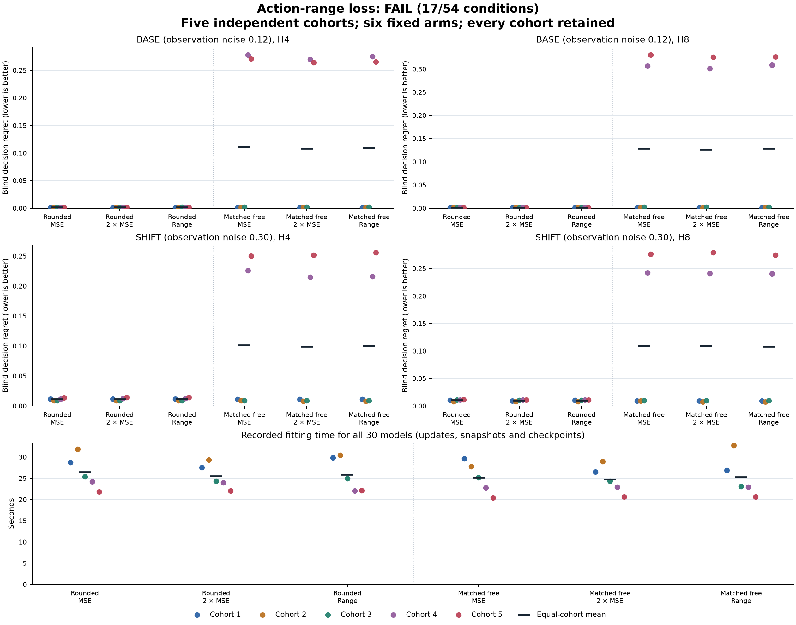

# Action-range loss across independent cohorts

**Technical audit complete. Prospective rule: FAIL, 17/54 conditions.**

The fixed rounded-range candidate is compared with rounded MSE and rounded double-MSE. All five cohorts, both observation regimes and every predeclared condition count. The matched-free arms are descriptive architecture controls and cannot rescue this decision.

Each cohort independently generates 512 TRAIN, 512 BASE and 512 SHIFT attempts. Its six models share data, initial task-independent random heads and paired joint batches. Loss variants within each architecture also share identical initial and prefix-boundary model/Adam states. All 30 final checkpoints precede either DEV regime.

Training uses 1024 full-prefix updates followed by 3072 joint updates on H1/H2 targets. Only the blind cost term changes: mean squared error, twice mean squared error, or one quarter of squared four-action error range. Observed cost, survival, event and public-prefix losses are unchanged. The same update count does not imply equal computation, gradients or elapsed time.

BASE has observation noise 0.12; SHIFT increases it to 0.30 without retraining. Both retain the same transition, hazard and true-cost structure. The known transition is doubly stochastic, so this remains a structurally favorable synthetic setting for rounded transport.

The 54 conditions consist of 40 strictly lower cohort-specific H4/H8 regret comparisons, 8 reductions of at least 10% in equal-cohort mean regret with positive control means, and 6 unchanged absolute criteria across both regimes. No average rescues a failed individual condition.

The earlier independent-head comparison remains FAIL at 14/15. Its retrospective decision-error decomposition motivated this separate comparison; neither that diagnostic nor this fresh result changes the earlier outcome. No statistical-significance, loss-novelty, architectural-superiority, latent-identification or native-transfer claim is made.

## Prospective outcome

| Condition | Outcome |
|---|---|
| `base_BLIND_EXTRAPOLATION` | PASS |
| `base_OBSERVED_FILTERING_EXTRAPOLATION` | PASS |
| `base_SHORT_HORIZON_LEARNING` | PASS |
| `rounded_double_base_h4_cohort0_strict` | FAIL |
| `rounded_double_base_h4_cohort1_strict` | PASS |
| `rounded_double_base_h4_cohort2_strict` | FAIL |
| `rounded_double_base_h4_cohort3_strict` | PASS |
| `rounded_double_base_h4_cohort4_strict` | FAIL |
| `rounded_double_base_h4_mean_reduction` | FAIL |
| `rounded_double_base_h8_cohort0_strict` | FAIL |
| `rounded_double_base_h8_cohort1_strict` | FAIL |
| `rounded_double_base_h8_cohort2_strict` | FAIL |
| `rounded_double_base_h8_cohort3_strict` | PASS |
| `rounded_double_base_h8_cohort4_strict` | PASS |
| `rounded_double_base_h8_mean_reduction` | FAIL |
| `rounded_double_shift_h4_cohort0_strict` | FAIL |
| `rounded_double_shift_h4_cohort1_strict` | FAIL |
| `rounded_double_shift_h4_cohort2_strict` | FAIL |
| `rounded_double_shift_h4_cohort3_strict` | FAIL |
| `rounded_double_shift_h4_cohort4_strict` | FAIL |
| `rounded_double_shift_h4_mean_reduction` | FAIL |
| `rounded_double_shift_h8_cohort0_strict` | FAIL |
| `rounded_double_shift_h8_cohort1_strict` | FAIL |
| `rounded_double_shift_h8_cohort2_strict` | FAIL |
| `rounded_double_shift_h8_cohort3_strict` | PASS |
| `rounded_double_shift_h8_cohort4_strict` | FAIL |
| `rounded_double_shift_h8_mean_reduction` | FAIL |
| `rounded_mse_base_h4_cohort0_strict` | FAIL |
| `rounded_mse_base_h4_cohort1_strict` | FAIL |
| `rounded_mse_base_h4_cohort2_strict` | FAIL |
| `rounded_mse_base_h4_cohort3_strict` | PASS |
| `rounded_mse_base_h4_cohort4_strict` | PASS |
| `rounded_mse_base_h4_mean_reduction` | FAIL |
| `rounded_mse_base_h8_cohort0_strict` | PASS |
| `rounded_mse_base_h8_cohort1_strict` | FAIL |
| `rounded_mse_base_h8_cohort2_strict` | PASS |
| `rounded_mse_base_h8_cohort3_strict` | PASS |
| `rounded_mse_base_h8_cohort4_strict` | FAIL |
| `rounded_mse_base_h8_mean_reduction` | FAIL |
| `rounded_mse_shift_h4_cohort0_strict` | FAIL |
| `rounded_mse_shift_h4_cohort1_strict` | FAIL |
| `rounded_mse_shift_h4_cohort2_strict` | PASS |
| `rounded_mse_shift_h4_cohort3_strict` | FAIL |
| `rounded_mse_shift_h4_cohort4_strict` | FAIL |
| `rounded_mse_shift_h4_mean_reduction` | FAIL |
| `rounded_mse_shift_h8_cohort0_strict` | FAIL |
| `rounded_mse_shift_h8_cohort1_strict` | FAIL |
| `rounded_mse_shift_h8_cohort2_strict` | PASS |
| `rounded_mse_shift_h8_cohort3_strict` | FAIL |
| `rounded_mse_shift_h8_cohort4_strict` | PASS |
| `rounded_mse_shift_h8_mean_reduction` | FAIL |
| `shift_BLIND_EXTRAPOLATION` | PASS |
| `shift_OBSERVED_FILTERING_EXTRAPOLATION` | FAIL |
| `shift_SHORT_HORIZON_LEARNING` | FAIL |

## Absolute criteria for every arm

| Regime | Arm | Short-horizon learning | Blind extrapolation | Observed filtering extrapolation |
|---|---|---|---|---|
| base | rounded_mse | PASS | PASS | PASS |
| base | rounded_double | PASS | PASS | PASS |
| base | rounded_range | PASS | PASS | PASS |
| base | free_mse | PASS | FAIL | PASS |
| base | free_double | PASS | FAIL | PASS |
| base | free_range | PASS | FAIL | PASS |
| shift | rounded_mse | FAIL | PASS | FAIL |
| shift | rounded_double | FAIL | PASS | FAIL |
| shift | rounded_range | FAIL | PASS | FAIL |
| shift | free_mse | FAIL | FAIL | FAIL |
| shift | free_double | FAIL | FAIL | FAIL |
| shift | free_range | FAIL | FAIL | FAIL |

Observed filtering receives intervening observations. Its criterion is separate from blind forecasts. Each group above requires every cohort; complete per-cohort condition records remain in summary.json and the archived original audit.

## Equal-cohort regret means

| Control | Regime | H | Rounded range | Control | Difference | Reduction |
|---|---|---:|---:|---:|---:|---:|
| rounded_mse | base | 4 | 0.00136242368 | 0.00130987377 | 5.25499087e-05 | -4.012% |
| rounded_mse | base | 8 | 0.00126075968 | 0.00129172792 | -3.09682391e-05 | 2.397% |
| rounded_mse | shift | 4 | 0.0113996927 | 0.0110300367 | 0.000369656003 | -3.351% |
| rounded_mse | shift | 8 | 0.0101063161 | 0.0103993558 | -0.000293039659 | 2.818% |
| rounded_double | base | 4 | 0.00136242368 | 0.001271489 | 9.09346789e-05 | -7.152% |
| rounded_double | base | 8 | 0.00126075968 | 0.00125562496 | 5.13471931e-06 | -0.409% |
| rounded_double | shift | 4 | 0.0113996927 | 0.011354877 | 4.4815657e-05 | -0.395% |
| rounded_double | shift | 8 | 0.0101063161 | 0.00998011611 | 0.000126200007 | -1.265% |

## Every paired loss contrast

| Cohort | Seed | Control | Regime | H | Candidate regret | Control regret | Candidate minus control |
|---:|---:|---|---|---:|---:|---:|---:|
| 1 | 437261001 | rounded_mse | base | 4 | 0.00095331795 | 0.00095322668 | 9.12701771e-08 |
| 2 | 437261002 | rounded_mse | base | 4 | 0.00147834391 | 0.00147786247 | 4.81433877e-07 |
| 3 | 437261003 | rounded_mse | base | 4 | 0.00187794693 | 0.00161077551 | 0.000267171424 |
| 4 | 437261004 | rounded_mse | base | 4 | 0.00120377126 | 0.00120840924 | -4.63798388e-06 |
| 5 | 437261005 | rounded_mse | base | 4 | 0.00129873834 | 0.00129909494 | -3.56600865e-07 |
| 1 | 437261001 | rounded_mse | base | 8 | 0.000856890266 | 0.000860878832 | -3.98856592e-06 |
| 2 | 437261002 | rounded_mse | base | 8 | 0.00165921692 | 0.00164300427 | 1.62126467e-05 |
| 3 | 437261003 | rounded_mse | base | 8 | 0.00131713867 | 0.00131749089 | -3.52219664e-07 |
| 4 | 437261004 | rounded_mse | base | 8 | 0.00149285322 | 0.00165956628 | -0.000166713057 |
| 5 | 437261005 | rounded_mse | base | 8 | 0.000977699329 | 0.000977699329 | 0 |
| 1 | 437261001 | rounded_mse | shift | 4 | 0.0117112146 | 0.0116982581 | 1.2956555e-05 |
| 2 | 437261002 | rounded_mse | shift | 4 | 0.00919512707 | 0.00913411985 | 6.10072174e-05 |
| 3 | 437261003 | rounded_mse | shift | 4 | 0.00908090142 | 0.00917984393 | -9.89425089e-05 |
| 4 | 437261004 | rounded_mse | shift | 4 | 0.0127317628 | 0.0115601577 | 0.00117160512 |
| 5 | 437261005 | rounded_mse | shift | 4 | 0.0142794574 | 0.0135778038 | 0.000701653633 |
| 1 | 437261001 | rounded_mse | shift | 8 | 0.010165512 | 0.010150884 | 1.46279819e-05 |
| 2 | 437261002 | rounded_mse | shift | 8 | 0.00817979659 | 0.00816288702 | 1.69095774e-05 |
| 3 | 437261003 | rounded_mse | shift | 8 | 0.0101705663 | 0.011081338 | -0.00091077171 |
| 4 | 437261004 | rounded_mse | shift | 8 | 0.0112094044 | 0.0112094044 | 0 |
| 5 | 437261005 | rounded_mse | shift | 8 | 0.0108063013 | 0.0113922655 | -0.000585964145 |
| 1 | 437261001 | rounded_double | base | 4 | 0.00095331795 | 0.00095322668 | 9.12701771e-08 |
| 2 | 437261002 | rounded_double | base | 4 | 0.00147834391 | 0.00148752719 | -9.18327953e-06 |
| 3 | 437261003 | rounded_double | base | 4 | 0.00187794693 | 0.00140947906 | 0.00046846787 |
| 4 | 437261004 | rounded_double | base | 4 | 0.00120377126 | 0.00120847373 | -4.70246607e-06 |
| 5 | 437261005 | rounded_double | base | 4 | 0.00129873834 | 0.00129873834 | 0 |
| 1 | 437261001 | rounded_double | base | 8 | 0.000856890266 | 0.000848692248 | 8.19801837e-06 |
| 2 | 437261002 | rounded_double | base | 8 | 0.00165921692 | 0.00165921692 | 0 |
| 3 | 437261003 | rounded_double | base | 8 | 0.00131713867 | 0.00113290783 | 0.000184230845 |
| 4 | 437261004 | rounded_double | base | 8 | 0.00149285322 | 0.00165956628 | -0.000166713057 |
| 5 | 437261005 | rounded_double | base | 8 | 0.000977699329 | 0.000977741539 | -4.22096803e-08 |
| 1 | 437261001 | rounded_double | shift | 4 | 0.0117112146 | 0.0117112146 | 0 |
| 2 | 437261002 | rounded_double | shift | 4 | 0.00919512707 | 0.00919512707 | 0 |
| 3 | 437261003 | rounded_double | shift | 4 | 0.00908090142 | 0.00895010798 | 0.000130793437 |
| 4 | 437261004 | rounded_double | shift | 4 | 0.0127317628 | 0.012638478 | 9.32848477e-05 |
| 5 | 437261005 | rounded_double | shift | 4 | 0.0142794574 | 0.0142794574 | 0 |
| 1 | 437261001 | rounded_double | shift | 8 | 0.010165512 | 0.0095435083 | 0.000622003699 |
| 2 | 437261002 | rounded_double | shift | 8 | 0.00817979659 | 0.00816288702 | 1.69095774e-05 |
| 3 | 437261003 | rounded_double | shift | 8 | 0.0101705663 | 0.0101705663 | 0 |
| 4 | 437261004 | rounded_double | shift | 8 | 0.0112094044 | 0.0112197952 | -1.03908437e-05 |
| 5 | 437261005 | rounded_double | shift | 8 | 0.0108063013 | 0.0108038237 | 2.47760431e-06 |

## Population and cost

| Cohort | Data namespace | Fit seed | TRAIN retained | BASE retained | SHIFT retained |
|---:|---:|---:|---:|---:|---:|
| 1 | 437260924 | 437261001 | 475 | 489 | 491 |
| 2 | 437260925 | 437261002 | 484 | 488 | 478 |
| 3 | 437260926 | 437261003 | 480 | 478 | 480 |
| 4 | 437260927 | 437261004 | 486 | 485 | 485 |
| 5 | 437260928 | 437261005 | 482 | 476 | 483 |

| Original closed phase | Native wall seconds |
|---|---:|
| Fabricated primitive qualification | 6.70618704 |
| qualify | 16.5808008 |
| fit | 785.479999 |
| audit | 20.9100716 |

The primitive qualification passed 46 tests. Integration passed 120 tests and retained the original smoke, TRAIN-only exposure and all cost projections. These engineering costs are separate from the scientific fit phase.

| Cohort | Arm | Train-call seconds | Safety-clock seconds | Constructor seconds | Nested final-summary seconds |
|---:|---|---:|---:|---:|---:|
| 1 | rounded_mse | 28.7599551 | 28.5231399 | 0.00191104203 | 0.00151354214 |
| 1 | rounded_double | 27.531233 | 27.3175077 | 0.000394125003 | 0.00145654194 |
| 1 | rounded_range | 29.8597971 | 29.6324927 | 0.000462750206 | 0.00153408293 |
| 1 | free_mse | 29.6750209 | 29.4395968 | 0.000720249955 | 0.00153283286 |
| 1 | free_double | 26.544061 | 26.3139252 | 0.00082195783 | 0.00147924991 |
| 1 | free_range | 26.913775 | 26.6857154 | 0.000714207999 | 0.00147483405 |
| 2 | rounded_double | 29.3632236 | 29.0531613 | 0.000356874894 | 0.00147504103 |
| 2 | rounded_range | 30.4300713 | 30.192171 | 0.000547999982 | 0.002598583 |
| 2 | free_mse | 27.798854 | 27.5623572 | 0.000691374997 | 0.00143712503 |
| 2 | free_double | 28.9866093 | 28.7206372 | 0.000693624839 | 0.00266775 |
| 2 | free_range | 32.7700173 | 32.5165936 | 0.00168720796 | 0.00149283302 |
| 2 | rounded_mse | 31.8531663 | 31.6512099 | 0.000518208137 | 0.00138445781 |
| 3 | rounded_range | 24.9234022 | 24.7146946 | 0.000326250214 | 0.00136383297 |
| 3 | free_mse | 25.1604122 | 24.9451106 | 0.000668375054 | 0.00147404103 |
| 3 | free_double | 24.373589 | 24.1643629 | 0.000684625003 | 0.00139308302 |
| 3 | free_range | 23.0818335 | 22.8746092 | 0.000736957882 | 0.00147791603 |
| 3 | rounded_mse | 25.4239927 | 25.2166266 | 0.000374875031 | 0.00139387487 |
| 3 | rounded_double | 24.3560668 | 24.1441272 | 0.000359457918 | 0.00136670796 |
| 4 | free_mse | 22.7764472 | 22.5774899 | 0.000782165909 | 0.00135087501 |
| 4 | free_double | 22.91934 | 22.7132127 | 0.000635958044 | 0.00143375015 |
| 4 | free_range | 22.9153083 | 22.7113784 | 0.00064520794 | 0.00137549988 |
| 4 | rounded_mse | 24.2012116 | 23.9839672 | 0.000419500051 | 0.00154887512 |
| 4 | rounded_double | 24.0026438 | 23.8010237 | 0.000455666799 | 0.00132174999 |
| 4 | rounded_range | 22.048986 | 21.8552081 | 0.000390124973 | 0.00134204212 |
| 5 | free_double | 20.6639391 | 20.4657332 | 0.000575416954 | 0.00130604114 |
| 5 | free_range | 20.6116158 | 20.4133729 | 0.000697167125 | 0.00131099997 |
| 5 | rounded_mse | 21.7948824 | 21.5966343 | 0.000323290937 | 0.00129125011 |
| 5 | rounded_double | 22.0830307 | 21.8800525 | 0.000338417012 | 0.0013169169 |
| 5 | rounded_range | 22.131944 | 21.9363156 | 0.000349124894 | 0.00126662501 |
| 5 | free_mse | 20.425135 | 20.2218956 | 0.000577207888 | 0.0013205409 |

The train-call measurement includes model/optimizer setup, accepted updates, snapshots, checkpoint files and durable allocation trace. It ends before final fit-row publication; that work is charged in the original complete scientific phase. Safety-clock, constructor and final-summary measurements overlap and must not be added to train-call time. All 30 fits retain 352 stored float64 parameters; parameter count does not equalize transition degrees of freedom.

The independent audit decoded 220 NPZ files, including 90 parameter boundaries, and 90 Adam JSON boundaries. It reconstructed 5 initial head streams and called no models, optimizers or world generators. Publishing uses only saved audited scalars plus opaque file hashing. Intermediate training losses, gradients and historical clock readings are not independently replayed.

## All endpoint results

| Cohort | Arm | Regime | H | Blind regret | Blind MSE | Blind survival MAE | Observed MSE | Observed survival MAE | Observed KL | Shuffled regret |
|---:|---|---|---:|---:|---:|---:|---:|---:|---:|---:|
| 1 | rounded_mse | base | 1 | 0.00159604828 | 0.00106135915 | 0.00310587887 | 0.00106135915 | 0.00310587887 | 0.00382657791 | 0.624207784 |
| 1 | rounded_mse | base | 2 | 0.00132193312 | 0.00105383698 | 0.00412790509 | 0.00122060907 | 0.00317064339 | 0.00442868336 | 0.623484003 |
| 1 | rounded_mse | base | 4 | 0.00095322668 | 0.00092345273 | 0.0056093771 | 0.00129147298 | 0.00310681803 | 0.00460506144 | 0.592498218 |
| 1 | rounded_mse | base | 8 | 0.000860878832 | 0.000696847398 | 0.00772444568 | 0.00108311749 | 0.00304511141 | 0.00391359353 | 0.54244151 |
| 1 | rounded_double | base | 1 | 0.000814189487 | 0.000967924829 | 0.00306544801 | 0.000967924829 | 0.00306544801 | 0.00358689457 | 0.626049827 |
| 1 | rounded_double | base | 2 | 0.000643940797 | 0.000953818153 | 0.00407515174 | 0.00109899298 | 0.0031367798 | 0.00416009713 | 0.623447476 |
| 1 | rounded_double | base | 4 | 0.00095322668 | 0.000820815419 | 0.00548713616 | 0.00117527023 | 0.00307089885 | 0.00459807123 | 0.594271273 |
| 1 | rounded_double | base | 8 | 0.000848692248 | 0.000594248584 | 0.0074340478 | 0.00101141278 | 0.00301017369 | 0.00377359038 | 0.544052002 |
| 1 | rounded_range | base | 1 | 0.00151380159 | 0.00101136204 | 0.00308881164 | 0.00101136204 | 0.00308881164 | 0.00363179825 | 0.62216611 |
| 1 | rounded_range | base | 2 | 0.00132676258 | 0.00100648464 | 0.00410655795 | 0.00114725579 | 0.00315587335 | 0.0041473893 | 0.621577391 |
| 1 | rounded_range | base | 4 | 0.00095331795 | 0.000864780528 | 0.0055524629 | 0.00122751939 | 0.00309312872 | 0.00465338173 | 0.592497983 |
| 1 | rounded_range | base | 8 | 0.000856890266 | 0.000630953544 | 0.00758254423 | 0.00105990693 | 0.00303037361 | 0.00381382804 | 0.544052002 |
| 1 | free_mse | base | 1 | 0.0016324327 | 0.00117675338 | 0.00307688134 | 0.00117675338 | 0.00307688134 | 0.00476941871 | 0.624315986 |
| 1 | free_mse | base | 2 | 0.00122091921 | 0.001177173 | 0.00409981936 | 0.00113457504 | 0.00314233718 | 0.00608339949 | 0.623408292 |
| 1 | free_mse | base | 4 | 0.000866408333 | 0.00107675184 | 0.00557403911 | 0.00155071848 | 0.00307041458 | 0.00565476165 | 0.592498655 |
| 1 | free_mse | base | 8 | 0.000847756633 | 0.000846727558 | 0.00769506061 | 0.0010309743 | 0.00301227899 | 0.0044701604 | 0.538782995 |
| 1 | free_double | base | 1 | 0.0016324327 | 0.00110624142 | 0.00303468894 | 0.00110624142 | 0.00303468894 | 0.00456418648 | 0.624315986 |
| 1 | free_double | base | 2 | 0.00122091921 | 0.00110339214 | 0.00404681039 | 0.00106742112 | 0.00310664803 | 0.00587419432 | 0.625315828 |
| 1 | free_double | base | 4 | 0.000875554807 | 0.000996269544 | 0.00545423428 | 0.00149221801 | 0.00303169225 | 0.00554336822 | 0.59249865 |
| 1 | free_double | base | 8 | 0.000847756633 | 0.000768984854 | 0.00742752145 | 0.000970489885 | 0.00297799159 | 0.00434952803 | 0.538768876 |
| 1 | free_range | base | 1 | 0.0016324327 | 0.00110781775 | 0.0030582372 | 0.00110781775 | 0.0030582372 | 0.00459521786 | 0.624315986 |
| 1 | free_range | base | 2 | 0.00121127788 | 0.00110908528 | 0.00407233061 | 0.00105447662 | 0.00312782496 | 0.00586697063 | 0.625315828 |
| 1 | free_range | base | 4 | 0.000875554807 | 0.00099705015 | 0.0055181859 | 0.00146858193 | 0.00305534469 | 0.00552763559 | 0.59249865 |
| 1 | free_range | base | 8 | 0.000860311568 | 0.000759795943 | 0.00757268273 | 0.000970458457 | 0.00299825391 | 0.00426912649 | 0.53875669 |
| 1 | rounded_mse | shift | 1 | 0.0134508404 | 0.00496073153 | 0.00289008063 | 0.00496073153 | 0.00289008063 | 0.110111639 | 0.53947686 |
| 1 | rounded_mse | shift | 2 | 0.0117031556 | 0.00455596892 | 0.00380492546 | 0.00477566109 | 0.00286719599 | 0.108356886 | 0.543616192 |
| 1 | rounded_mse | shift | 4 | 0.0116982581 | 0.00416818269 | 0.00558624681 | 0.00479052817 | 0.00273290209 | 0.104394696 | 0.517200123 |
| 1 | rounded_mse | shift | 8 | 0.010150884 | 0.00315422968 | 0.0074367718 | 0.00672264757 | 0.00260564956 | 0.103519551 | 0.466004698 |
| 1 | rounded_double | shift | 1 | 0.0134555754 | 0.00472758345 | 0.00285443599 | 0.00472758345 | 0.00285443599 | 0.10977529 | 0.53947686 |
| 1 | rounded_double | shift | 2 | 0.0116863782 | 0.00434812133 | 0.00374823579 | 0.0044813461 | 0.00282670796 | 0.108127622 | 0.543319152 |
| 1 | rounded_double | shift | 4 | 0.0117112146 | 0.00398889962 | 0.0054408648 | 0.00453511442 | 0.00270091585 | 0.104366842 | 0.517200123 |
| 1 | rounded_double | shift | 8 | 0.0095435083 | 0.00302059088 | 0.00708058581 | 0.00638354483 | 0.00258252853 | 0.103425365 | 0.466004698 |
| 1 | rounded_range | shift | 1 | 0.0134555754 | 0.00477549464 | 0.002875355 | 0.00477549464 | 0.002875355 | 0.109760419 | 0.53947686 |
| 1 | rounded_range | shift | 2 | 0.0116863782 | 0.00438571724 | 0.00378165514 | 0.00456138031 | 0.002847922 | 0.108090917 | 0.543319152 |
| 1 | rounded_range | shift | 4 | 0.0117112146 | 0.00401485564 | 0.00551721505 | 0.00463564219 | 0.00271978852 | 0.104327075 | 0.517200123 |
| 1 | rounded_range | shift | 8 | 0.010165512 | 0.0030441303 | 0.00725443392 | 0.006460827 | 0.00259818908 | 0.103387363 | 0.46486429 |
| 1 | free_mse | shift | 1 | 0.0130095042 | 0.00494474903 | 0.00286589626 | 0.00494474903 | 0.00286589626 | 0.110689466 | 0.541790112 |
| 1 | free_mse | shift | 2 | 0.011387075 | 0.00461371028 | 0.00377402982 | 0.00512773101 | 0.00283242747 | 0.108577177 | 0.542493242 |
| 1 | free_mse | shift | 4 | 0.0113566498 | 0.00432347867 | 0.00553809256 | 0.00488043639 | 0.00272298638 | 0.104799837 | 0.515414256 |
| 1 | free_mse | shift | 8 | 0.00939918401 | 0.00326722044 | 0.00743894876 | 0.00619959722 | 0.00258441586 | 0.103690229 | 0.465723 |
| 1 | free_double | shift | 1 | 0.012997105 | 0.00469030178 | 0.00282705755 | 0.00469030178 | 0.00282705755 | 0.110331207 | 0.541790112 |
| 1 | free_double | shift | 2 | 0.010946859 | 0.00437314925 | 0.00371388909 | 0.00487003473 | 0.00279145334 | 0.108256988 | 0.541299394 |
| 1 | free_double | shift | 4 | 0.0113566498 | 0.00411366656 | 0.00540045659 | 0.00465085029 | 0.00269294891 | 0.1045518 | 0.515414256 |
| 1 | free_double | shift | 8 | 0.00905216809 | 0.00312729253 | 0.00711107516 | 0.00590615817 | 0.00255937792 | 0.103300065 | 0.464215034 |
| 1 | free_range | shift | 1 | 0.0125290301 | 0.00473634941 | 0.00284976185 | 0.00473634941 | 0.00284976185 | 0.110312526 | 0.538587696 |
| 1 | free_range | shift | 2 | 0.0109433389 | 0.00441206797 | 0.00374204427 | 0.00495364662 | 0.00281308196 | 0.108261554 | 0.542742304 |
| 1 | free_range | shift | 4 | 0.0109014382 | 0.00414574519 | 0.00547073722 | 0.00469223527 | 0.00271122735 | 0.104535416 | 0.517205756 |
| 1 | free_range | shift | 8 | 0.00904976604 | 0.00313988547 | 0.00728000538 | 0.00594201878 | 0.00257261078 | 0.103393118 | 0.464214841 |
| 2 | rounded_mse | base | 1 | 0.00161854449 | 0.00124697466 | 0.00236960239 | 0.00124697466 | 0.00236960239 | 0.00385760855 | 0.619595406 |
| 2 | rounded_mse | base | 2 | 0.00216948821 | 0.00117328727 | 0.00307537412 | 0.00155952271 | 0.00230790641 | 0.00493699895 | 0.602481636 |
| 2 | rounded_mse | base | 4 | 0.00147786247 | 0.0010501171 | 0.00445616827 | 0.00106340725 | 0.00245955738 | 0.00295802123 | 0.593940864 |
| 2 | rounded_mse | base | 8 | 0.00164300427 | 0.000876503087 | 0.00597130457 | 0.00113611692 | 0.00244091469 | 0.00399890904 | 0.54310726 |
| 2 | rounded_double | base | 1 | 0.00162912769 | 0.00118208704 | 0.00236094498 | 0.00118208704 | 0.00236094498 | 0.00375113853 | 0.620166773 |
| 2 | rounded_double | base | 2 | 0.00217975594 | 0.00110421711 | 0.00306770866 | 0.00147110994 | 0.00229738399 | 0.00483877591 | 0.605342724 |
| 2 | rounded_double | base | 4 | 0.00148752719 | 0.000969946159 | 0.00446908611 | 0.000967515427 | 0.00244980328 | 0.00287539307 | 0.593940849 |
| 2 | rounded_double | base | 8 | 0.00165921692 | 0.000788206913 | 0.00609487907 | 0.00106518717 | 0.0024253671 | 0.00380107482 | 0.543107112 |
| 2 | rounded_range | base | 1 | 0.00162907887 | 0.00124063925 | 0.00236650412 | 0.00124063925 | 0.00236650412 | 0.003826847 | 0.622140213 |
| 2 | rounded_range | base | 2 | 0.00217965876 | 0.00115869277 | 0.00307119656 | 0.00152264575 | 0.00230413077 | 0.00487016571 | 0.605342724 |
| 2 | rounded_range | base | 4 | 0.00147834391 | 0.00102141312 | 0.00446506166 | 0.0010333158 | 0.00245340949 | 0.00288289906 | 0.595746149 |
| 2 | rounded_range | base | 8 | 0.00165921692 | 0.000828029521 | 0.00604495947 | 0.00110566393 | 0.00243275086 | 0.00381318325 | 0.544744167 |
| 2 | free_mse | base | 1 | 0.00201575251 | 0.00123651492 | 0.00239170284 | 0.00123651492 | 0.00239170284 | 0.00400964209 | 0.620516384 |
| 2 | free_mse | base | 2 | 0.00238218278 | 0.00117094509 | 0.00312568958 | 0.00152945906 | 0.00234098838 | 0.00499500532 | 0.606234427 |
| 2 | free_mse | base | 4 | 0.00169882113 | 0.00109987355 | 0.00449605079 | 0.00113222439 | 0.00247582759 | 0.00333774279 | 0.595173363 |
| 2 | free_mse | base | 8 | 0.00148318565 | 0.000930849758 | 0.00604029376 | 0.00125914209 | 0.00248618056 | 0.00488430825 | 0.544257945 |
| 2 | free_double | base | 1 | 0.00201575251 | 0.00117391641 | 0.00238105779 | 0.00117391641 | 0.00238105779 | 0.00394435945 | 0.620528734 |
| 2 | free_double | base | 2 | 0.00237741361 | 0.00110461193 | 0.00311562731 | 0.00145933523 | 0.00232898269 | 0.00493654556 | 0.608152909 |
| 2 | free_double | base | 4 | 0.0016617888 | 0.00102123852 | 0.00451086991 | 0.00107502514 | 0.00246640023 | 0.00326178046 | 0.595173363 |
| 2 | free_double | base | 8 | 0.00138037102 | 0.00084441229 | 0.00616806825 | 0.00118789375 | 0.00247146016 | 0.00476300097 | 0.544257945 |
| 2 | free_range | base | 1 | 0.00201575251 | 0.00122884669 | 0.0023851325 | 0.00122884669 | 0.0023851325 | 0.00405146985 | 0.620516384 |
| 2 | free_range | base | 2 | 0.00239210901 | 0.00115277867 | 0.0031174473 | 0.00147756882 | 0.00233256675 | 0.00490947304 | 0.606229434 |
| 2 | free_range | base | 4 | 0.00167145351 | 0.0010637064 | 0.0045035799 | 0.00109413739 | 0.00246785227 | 0.00327574143 | 0.595173363 |
| 2 | free_range | base | 8 | 0.00180912032 | 0.000881998371 | 0.00611482755 | 0.00120122436 | 0.00247679761 | 0.00474035391 | 0.544258141 |
| 2 | rounded_mse | shift | 1 | 0.0102221891 | 0.00421521929 | 0.0022199424 | 0.00421521929 | 0.0022199424 | 0.112687983 | 0.572079576 |
| 2 | rounded_mse | shift | 2 | 0.00951026066 | 0.00378454908 | 0.00283279494 | 0.00474516015 | 0.00219222203 | 0.108609404 | 0.555162652 |
| 2 | rounded_mse | shift | 4 | 0.00913411985 | 0.00348581842 | 0.00422863258 | 0.0067153735 | 0.00226072386 | 0.110613986 | 0.517690949 |
| 2 | rounded_mse | shift | 8 | 0.00816288702 | 0.00314292864 | 0.0058060739 | 0.00729710876 | 0.00228119222 | 0.106849845 | 0.456974017 |
| 2 | rounded_double | shift | 1 | 0.0102257206 | 0.00412972047 | 0.00220855751 | 0.00412972047 | 0.00220855751 | 0.11286097 | 0.574103471 |
| 2 | rounded_double | shift | 2 | 0.00951370673 | 0.00370935299 | 0.00283378858 | 0.00458494333 | 0.00218818057 | 0.108553839 | 0.557802769 |
| 2 | rounded_double | shift | 4 | 0.00919512707 | 0.0034219205 | 0.00425111033 | 0.00651595487 | 0.00225789512 | 0.110647535 | 0.517690843 |
| 2 | rounded_double | shift | 8 | 0.00816288702 | 0.00309209445 | 0.00599561998 | 0.00700602346 | 0.00227880381 | 0.106809039 | 0.456973921 |
| 2 | rounded_range | shift | 1 | 0.0118386498 | 0.00416579491 | 0.00221357698 | 0.00416579491 | 0.00221357698 | 0.112769071 | 0.573082693 |
| 2 | rounded_range | shift | 2 | 0.00951370673 | 0.00373390573 | 0.00283273582 | 0.00463548552 | 0.00219113355 | 0.108452587 | 0.557804842 |
| 2 | rounded_range | shift | 4 | 0.00919512707 | 0.0034438245 | 0.00424463445 | 0.00658093764 | 0.00226056302 | 0.110595684 | 0.517690843 |
| 2 | rounded_range | shift | 8 | 0.00817979659 | 0.00310511092 | 0.00592369585 | 0.00709499655 | 0.00228146144 | 0.106804368 | 0.456974606 |
| 2 | free_mse | shift | 1 | 0.0109373 | 0.00432486017 | 0.00224990404 | 0.00432486017 | 0.00224990404 | 0.113244317 | 0.566503389 |
| 2 | free_mse | shift | 2 | 0.0102224076 | 0.00402736992 | 0.00288771942 | 0.00448387926 | 0.00221387514 | 0.108396652 | 0.550776723 |
| 2 | free_mse | shift | 4 | 0.00921398969 | 0.00355078456 | 0.00427757117 | 0.00644452458 | 0.00226675773 | 0.109565814 | 0.518054111 |
| 2 | free_mse | shift | 8 | 0.00906260459 | 0.00314633833 | 0.0059032521 | 0.00728780976 | 0.00230091355 | 0.106912906 | 0.457873651 |
| 2 | free_double | shift | 1 | 0.0109523156 | 0.0042034542 | 0.00223764967 | 0.0042034542 | 0.00223764967 | 0.113378463 | 0.568517063 |
| 2 | free_double | shift | 2 | 0.0102185814 | 0.00392075656 | 0.00288996088 | 0.00428669909 | 0.00220834492 | 0.108298473 | 0.549008183 |
| 2 | free_double | shift | 4 | 0.00819066767 | 0.00345755743 | 0.00429888391 | 0.00617528621 | 0.00226058458 | 0.109493662 | 0.518054111 |
| 2 | free_double | shift | 8 | 0.00730960002 | 0.00307638583 | 0.00608034906 | 0.00695442828 | 0.00229496897 | 0.1068335 | 0.458676311 |
| 2 | free_range | shift | 1 | 0.00987196152 | 0.00424199439 | 0.00224119168 | 0.00424199439 | 0.00224119168 | 0.11329332 | 0.568587787 |
| 2 | free_range | shift | 2 | 0.0105459988 | 0.00394358703 | 0.0028876284 | 0.00434212954 | 0.00221054522 | 0.108234797 | 0.5521935 |
| 2 | free_range | shift | 4 | 0.00818636544 | 0.00348037359 | 0.00428897199 | 0.00625407813 | 0.0022630311 | 0.109491664 | 0.516880873 |
| 2 | free_range | shift | 8 | 0.00730960002 | 0.00309416043 | 0.006007161 | 0.0070473263 | 0.00229659931 | 0.106822981 | 0.458409514 |
| 3 | rounded_mse | base | 1 | 0.00178435569 | 0.000962514305 | 0.00303412552 | 0.000962514305 | 0.00303412552 | 0.00446617115 | 0.631841521 |
| 3 | rounded_mse | base | 2 | 0.00177762927 | 0.000918032318 | 0.0040390547 | 0.00123614194 | 0.00289570763 | 0.0057104366 | 0.625185343 |
| 3 | rounded_mse | base | 4 | 0.00161077551 | 0.000829992405 | 0.00529877226 | 0.00107874613 | 0.00297859983 | 0.00454852355 | 0.584982071 |
| 3 | rounded_mse | base | 8 | 0.00131749089 | 0.000594639048 | 0.00723362286 | 0.00141808604 | 0.00271022754 | 0.00558284153 | 0.507546796 |
| 3 | rounded_double | base | 1 | 0.00155888304 | 0.000901736288 | 0.00296935507 | 0.000901736288 | 0.00296935507 | 0.00410918803 | 0.633848288 |
| 3 | rounded_double | base | 2 | 0.00152525191 | 0.000847033787 | 0.00394224616 | 0.00116367068 | 0.00284002161 | 0.00533221563 | 0.627132231 |
| 3 | rounded_double | base | 4 | 0.00140947906 | 0.000752937684 | 0.00516136962 | 0.00101461714 | 0.0029133074 | 0.00439019337 | 0.586802373 |
| 3 | rounded_double | base | 8 | 0.00113290783 | 0.000507405922 | 0.0070573635 | 0.00134098795 | 0.00265833018 | 0.00521850378 | 0.507546767 |
| 3 | rounded_range | base | 1 | 0.00206877279 | 0.000914398566 | 0.00299017357 | 0.000914398566 | 0.00299017357 | 0.00425262195 | 0.633848288 |
| 3 | rounded_range | base | 2 | 0.00173910362 | 0.000857401932 | 0.00397660282 | 0.00120042032 | 0.00285531358 | 0.00551327216 | 0.627132231 |
| 3 | rounded_range | base | 4 | 0.00187794693 | 0.000766074648 | 0.00520990067 | 0.00101359986 | 0.00293288959 | 0.00435376309 | 0.586616808 |
| 3 | rounded_range | base | 8 | 0.00131713867 | 0.000526864014 | 0.00712198271 | 0.00138116348 | 0.00267186261 | 0.0053572315 | 0.505886704 |
| 3 | free_mse | base | 1 | 0.00210304889 | 0.00141834021 | 0.00311559579 | 0.00141834021 | 0.00311559579 | 0.00768147083 | 0.634150523 |
| 3 | free_mse | base | 2 | 0.00205312339 | 0.00134855986 | 0.00410600848 | 0.0012380312 | 0.00297468214 | 0.00611104089 | 0.630369755 |
| 3 | free_mse | base | 4 | 0.00227711496 | 0.00127626499 | 0.00535225113 | 0.00116147029 | 0.00307491279 | 0.00542023866 | 0.585004161 |
| 3 | free_mse | base | 8 | 0.0022693026 | 0.00106750468 | 0.00730182923 | 0.00142278684 | 0.00278832651 | 0.00647264729 | 0.509637781 |
| 3 | free_double | base | 1 | 0.00209799627 | 0.00135128206 | 0.00308128369 | 0.00135128206 | 0.00308128369 | 0.00753468687 | 0.632215884 |
| 3 | free_double | base | 2 | 0.00203888751 | 0.00127387373 | 0.00404366567 | 0.00119810837 | 0.00294747673 | 0.00599989012 | 0.628465694 |
| 3 | free_double | base | 4 | 0.00227711496 | 0.00118647997 | 0.00526963301 | 0.00109699361 | 0.00304049045 | 0.00524476203 | 0.584999634 |
| 3 | free_double | base | 8 | 0.00227392215 | 0.000953846488 | 0.00720358498 | 0.00132128909 | 0.00276196929 | 0.00622935908 | 0.509645512 |
| 3 | free_range | base | 1 | 0.00208851195 | 0.00138743987 | 0.00308695432 | 0.00138743987 | 0.00308695432 | 0.00757913614 | 0.634155774 |
| 3 | free_range | base | 2 | 0.00203888751 | 0.00129977196 | 0.00405809559 | 0.00121118746 | 0.00294828089 | 0.00603555173 | 0.628465694 |
| 3 | free_range | base | 4 | 0.00227711496 | 0.00121578867 | 0.0052837534 | 0.0011147816 | 0.00304532019 | 0.00525807196 | 0.584989931 |
| 3 | free_range | base | 8 | 0.00227392215 | 0.000983529704 | 0.00722330321 | 0.00136748087 | 0.00276682914 | 0.00623978296 | 0.509645236 |
| 3 | rounded_mse | shift | 1 | 0.0104745682 | 0.00384643259 | 0.00258879563 | 0.00384643259 | 0.00258879563 | 0.104987074 | 0.537989034 |
| 3 | rounded_mse | shift | 2 | 0.0125543725 | 0.00380682582 | 0.00351500039 | 0.00533906594 | 0.0026939613 | 0.106370454 | 0.535957186 |
| 3 | rounded_mse | shift | 4 | 0.00917984393 | 0.00365229765 | 0.00485003933 | 0.00579406903 | 0.00275730005 | 0.103193972 | 0.509827659 |
| 3 | rounded_mse | shift | 8 | 0.011081338 | 0.00312742351 | 0.00655102334 | 0.00652923405 | 0.00271549634 | 0.102969318 | 0.452383454 |
| 3 | rounded_double | shift | 1 | 0.0100399572 | 0.003640486 | 0.00253508623 | 0.003640486 | 0.00253508623 | 0.104686285 | 0.53822279 |
| 3 | rounded_double | shift | 2 | 0.0114822568 | 0.00362723225 | 0.00343991267 | 0.00509569849 | 0.00264425814 | 0.105915615 | 0.534510639 |
| 3 | rounded_double | shift | 4 | 0.00895010798 | 0.00350736548 | 0.00475774689 | 0.00548913632 | 0.00270085772 | 0.102533575 | 0.508350338 |
| 3 | rounded_double | shift | 8 | 0.0101705663 | 0.00299785358 | 0.00639564519 | 0.0061149831 | 0.00266165463 | 0.102515633 | 0.450926158 |
| 3 | rounded_range | shift | 1 | 0.0100399572 | 0.00368644975 | 0.00254837606 | 0.00368644975 | 0.00254837606 | 0.104757408 | 0.538367341 |
| 3 | rounded_range | shift | 2 | 0.011491664 | 0.00365469485 | 0.00346852871 | 0.00513240269 | 0.00265850744 | 0.105977099 | 0.535961497 |
| 3 | rounded_range | shift | 4 | 0.00908090142 | 0.00353026538 | 0.00478882186 | 0.0055709606 | 0.00271569586 | 0.102647492 | 0.509836354 |
| 3 | rounded_range | shift | 8 | 0.0101705663 | 0.0030092796 | 0.00646303172 | 0.00621963809 | 0.00267830756 | 0.102552426 | 0.450928867 |
| 3 | free_mse | shift | 1 | 0.00738552521 | 0.00357809679 | 0.00265799228 | 0.00357809679 | 0.00265799228 | 0.105045976 | 0.537809056 |
| 3 | free_mse | shift | 2 | 0.0101541883 | 0.00366173354 | 0.00357688029 | 0.00524906202 | 0.00276499775 | 0.107637319 | 0.538046884 |
| 3 | free_mse | shift | 4 | 0.0092147083 | 0.00355577155 | 0.00494192965 | 0.00603437209 | 0.00282980317 | 0.10490758 | 0.513125354 |
| 3 | free_mse | shift | 8 | 0.00978008385 | 0.0029745545 | 0.00660249843 | 0.00678169865 | 0.00277197288 | 0.104921175 | 0.453620352 |
| 3 | free_double | shift | 1 | 0.00704044013 | 0.00335066539 | 0.00263449902 | 0.00335066539 | 0.00263449902 | 0.10478449 | 0.538802208 |
| 3 | free_double | shift | 2 | 0.0101476132 | 0.00345433553 | 0.00353378408 | 0.00497402868 | 0.00274224191 | 0.107199186 | 0.538042903 |
| 3 | free_double | shift | 4 | 0.00904696573 | 0.00336918676 | 0.00490452868 | 0.00571305021 | 0.00280596837 | 0.10438842 | 0.512437669 |
| 3 | free_double | shift | 8 | 0.00975462502 | 0.00280407638 | 0.00652433877 | 0.00646730767 | 0.00274569166 | 0.104356054 | 0.453615642 |
| 3 | free_range | shift | 1 | 0.00704044013 | 0.00340405025 | 0.00263510154 | 0.00340405025 | 0.00263510154 | 0.104801329 | 0.537824278 |
| 3 | free_range | shift | 2 | 0.0101541883 | 0.00349367379 | 0.00353955045 | 0.00502088031 | 0.00274689865 | 0.107207584 | 0.539431936 |
| 3 | free_range | shift | 4 | 0.0090513224 | 0.00340675894 | 0.00490651178 | 0.00579788752 | 0.00280765749 | 0.104471787 | 0.512433233 |
| 3 | free_range | shift | 8 | 0.00975462502 | 0.00283634639 | 0.00653851136 | 0.00651589733 | 0.00274968059 | 0.104453861 | 0.453620352 |
| 4 | rounded_mse | base | 1 | 0.00142626285 | 0.0011255888 | 0.00298050174 | 0.0011255888 | 0.00298050174 | 0.00554161541 | 0.61654894 |
| 4 | rounded_mse | base | 2 | 0.00138165031 | 0.00104693451 | 0.00430477455 | 0.000987320658 | 0.00294518273 | 0.0053654162 | 0.590242357 |
| 4 | rounded_mse | base | 4 | 0.00120840924 | 0.000940277928 | 0.00676833164 | 0.00117130373 | 0.00292054573 | 0.00567314974 | 0.557744608 |
| 4 | rounded_mse | base | 8 | 0.00165956628 | 0.00063646532 | 0.00977288976 | 0.00185467826 | 0.00296703351 | 0.00606844552 | 0.507458505 |
| 4 | rounded_double | base | 1 | 0.00142626285 | 0.00107516517 | 0.00297291807 | 0.00107516517 | 0.00297291807 | 0.00542292317 | 0.61654894 |
| 4 | rounded_double | base | 2 | 0.00138393271 | 0.000995456517 | 0.00429729587 | 0.000958738081 | 0.00293893271 | 0.00524319935 | 0.592066882 |
| 4 | rounded_double | base | 4 | 0.00120847373 | 0.000885610723 | 0.00676920004 | 0.0011228734 | 0.0029144398 | 0.00549808133 | 0.557744608 |
| 4 | rounded_double | base | 8 | 0.00165956628 | 0.000582374685 | 0.00981949381 | 0.00175192162 | 0.00295322377 | 0.00591413358 | 0.507458505 |
| 4 | rounded_range | base | 1 | 0.00129898089 | 0.0010389816 | 0.00297444338 | 0.0010389816 | 0.00297444338 | 0.00521614103 | 0.618550929 |
| 4 | rounded_range | base | 2 | 0.0012434118 | 0.000966002229 | 0.00430058219 | 0.000953516615 | 0.00294309004 | 0.00525995596 | 0.594023034 |
| 4 | rounded_range | base | 4 | 0.00120377126 | 0.000849648252 | 0.00677338744 | 0.00109278611 | 0.00291597564 | 0.00537710554 | 0.557744608 |
| 4 | rounded_range | base | 8 | 0.00149285322 | 0.000576078407 | 0.00980955361 | 0.00176145399 | 0.00296000338 | 0.00586270726 | 0.507458505 |
| 4 | free_mse | base | 1 | 0.228896603 | 0.0579574342 | 0.0026864533 | 0.0579574342 | 0.0026864533 | 0.0609873357 | 0.617654071 |
| 4 | free_mse | base | 2 | 0.234546114 | 0.0623795571 | 0.00395696447 | 0.0573916808 | 0.00258342769 | 0.0621149311 | 0.595551482 |
| 4 | free_mse | base | 4 | 0.278206751 | 0.0690032612 | 0.00602387975 | 0.0636362358 | 0.00263905188 | 0.0713072392 | 0.555524186 |
| 4 | free_mse | base | 8 | 0.306894757 | 0.06965369 | 0.00871575459 | 0.0672270615 | 0.00254506021 | 0.0792697526 | 0.539850071 |
| 4 | free_double | base | 1 | 0.227265703 | 0.0576023005 | 0.00267637374 | 0.0576023005 | 0.00267637374 | 0.0611356327 | 0.617590857 |
| 4 | free_double | base | 2 | 0.230942831 | 0.0618926628 | 0.00403344871 | 0.0569766222 | 0.00256330595 | 0.0616100185 | 0.600012807 |
| 4 | free_double | base | 4 | 0.270065513 | 0.0685142906 | 0.00612562217 | 0.063198075 | 0.00262777955 | 0.0705643885 | 0.556922671 |
| 4 | free_double | base | 8 | 0.301468334 | 0.0694043545 | 0.0088684488 | 0.066875659 | 0.0025352693 | 0.0786411532 | 0.53707175 |
| 4 | free_range | base | 1 | 0.229036553 | 0.0579982227 | 0.00267171857 | 0.0579982227 | 0.00267171857 | 0.0610969632 | 0.617576458 |
| 4 | free_range | base | 2 | 0.239209367 | 0.0621512591 | 0.00402338038 | 0.0573396 | 0.002554686 | 0.0617264528 | 0.596350826 |
| 4 | free_range | base | 4 | 0.275251466 | 0.0687861786 | 0.00610695906 | 0.0634968309 | 0.00262310309 | 0.0704219474 | 0.555725706 |
| 4 | free_range | base | 8 | 0.308840395 | 0.0694407254 | 0.00878002062 | 0.0669408563 | 0.00253604878 | 0.0784999756 | 0.538110709 |
| 4 | rounded_mse | shift | 1 | 0.0141490776 | 0.00374117131 | 0.0027381146 | 0.00374117131 | 0.0027381146 | 0.0953810809 | 0.534089302 |
| 4 | rounded_mse | shift | 2 | 0.0127774297 | 0.00348105169 | 0.00384424353 | 0.0036176313 | 0.00267849564 | 0.0969177965 | 0.524478405 |
| 4 | rounded_mse | shift | 4 | 0.0115601577 | 0.00332286604 | 0.00605355541 | 0.00485492469 | 0.00257801333 | 0.094938627 | 0.488860318 |
| 4 | rounded_mse | shift | 8 | 0.0112094044 | 0.00276384959 | 0.00903100102 | 0.00618795796 | 0.00278436742 | 0.0919541942 | 0.448789804 |
| 4 | rounded_double | shift | 1 | 0.0150236435 | 0.00357180235 | 0.00273481391 | 0.00357180235 | 0.00273481391 | 0.0953004372 | 0.534102981 |
| 4 | rounded_double | shift | 2 | 0.0139434468 | 0.00334462816 | 0.00383340304 | 0.00345494703 | 0.00267390523 | 0.0967811224 | 0.524552519 |
| 4 | rounded_double | shift | 4 | 0.012638478 | 0.00321620589 | 0.00605932511 | 0.00461582557 | 0.00257177606 | 0.0946731446 | 0.487194749 |
| 4 | rounded_double | shift | 8 | 0.0112197952 | 0.00266766282 | 0.00910662922 | 0.00602467916 | 0.00278276051 | 0.0919795306 | 0.4472553 |
| 4 | rounded_range | shift | 1 | 0.0149305936 | 0.00365991973 | 0.00274174472 | 0.00365991973 | 0.00274174472 | 0.0955001364 | 0.532189502 |
| 4 | rounded_range | shift | 2 | 0.0129199126 | 0.00341376353 | 0.00384926061 | 0.0035870827 | 0.00267800896 | 0.096908804 | 0.524552519 |
| 4 | rounded_range | shift | 4 | 0.0127317628 | 0.00328717734 | 0.00606647879 | 0.00460425402 | 0.0025769129 | 0.0945972561 | 0.488035541 |
| 4 | rounded_range | shift | 8 | 0.0112094044 | 0.00272280483 | 0.0091019736 | 0.00595801278 | 0.00278054344 | 0.091879738 | 0.448095687 |
| 4 | free_mse | shift | 1 | 0.180277155 | 0.0503332823 | 0.0023402319 | 0.0503332823 | 0.0023402319 | 0.135095269 | 0.534457211 |
| 4 | free_mse | shift | 2 | 0.187823175 | 0.0553974625 | 0.00356587989 | 0.0537977645 | 0.00244022087 | 0.134594948 | 0.515864067 |
| 4 | free_mse | shift | 4 | 0.225705422 | 0.0573135869 | 0.00535663063 | 0.0584521437 | 0.00235470618 | 0.131863842 | 0.491742711 |
| 4 | free_mse | shift | 8 | 0.24215822 | 0.0545456777 | 0.00778470371 | 0.0604503891 | 0.00241531111 | 0.139516463 | 0.449935814 |
| 4 | free_double | shift | 1 | 0.1815669 | 0.0499489723 | 0.00233981078 | 0.0499489723 | 0.00233981078 | 0.135003592 | 0.532883276 |
| 4 | free_double | shift | 2 | 0.179344129 | 0.0551298308 | 0.00363479698 | 0.0534706071 | 0.00244798378 | 0.134173074 | 0.511829889 |
| 4 | free_double | shift | 4 | 0.215055144 | 0.057015623 | 0.00547390971 | 0.0580568573 | 0.00233598581 | 0.131677859 | 0.489156218 |
| 4 | free_double | shift | 8 | 0.241194813 | 0.0542926904 | 0.00796994821 | 0.059768443 | 0.00238991088 | 0.138631146 | 0.451963089 |
| 4 | free_range | shift | 1 | 0.185829259 | 0.0500484819 | 0.00233201565 | 0.0500484819 | 0.00233201565 | 0.135205403 | 0.530241259 |
| 4 | free_range | shift | 2 | 0.189030102 | 0.0551515983 | 0.00362364853 | 0.053520685 | 0.00244099192 | 0.13391635 | 0.517643767 |
| 4 | free_range | shift | 4 | 0.215945006 | 0.0571917953 | 0.00544140805 | 0.0582447462 | 0.00232897553 | 0.131611332 | 0.495069228 |
| 4 | free_range | shift | 8 | 0.240669701 | 0.0543763728 | 0.00785715623 | 0.0599299002 | 0.00238476488 | 0.138355429 | 0.449834582 |
| 5 | rounded_mse | base | 1 | 0.000609763814 | 0.00102778017 | 0.00243418574 | 0.00102778017 | 0.00243418574 | 0.00340400109 | 0.623446568 |
| 5 | rounded_mse | base | 2 | 0.00124211785 | 0.000975578178 | 0.00352785528 | 0.00152195194 | 0.00237015958 | 0.00471292445 | 0.602907997 |
| 5 | rounded_mse | base | 4 | 0.00129909494 | 0.000883098465 | 0.00464906606 | 0.00187174189 | 0.00217577505 | 0.00534821386 | 0.581276983 |
| 5 | rounded_mse | base | 8 | 0.000977699329 | 0.000820092221 | 0.0057415271 | 0.00136415422 | 0.00247633943 | 0.00501435124 | 0.504859411 |
| 5 | rounded_double | base | 1 | 0.000609375836 | 0.000921174235 | 0.00241497926 | 0.000921174235 | 0.00241497926 | 0.00328712542 | 0.623446568 |
| 5 | rounded_double | base | 2 | 0.00124211785 | 0.000868583547 | 0.00350895501 | 0.00137187758 | 0.00235378836 | 0.00423962759 | 0.600960519 |
| 5 | rounded_double | base | 4 | 0.00129873834 | 0.000780275945 | 0.00464030572 | 0.00175919904 | 0.00215891667 | 0.00502721234 | 0.5776477 |
| 5 | rounded_double | base | 8 | 0.000977741539 | 0.000720954807 | 0.005726488 | 0.00132757206 | 0.00245877394 | 0.00487451783 | 0.503383876 |
| 5 | rounded_range | base | 1 | 0.00061973674 | 0.000944138401 | 0.00242116729 | 0.000944138401 | 0.00242116729 | 0.00331615106 | 0.623446568 |
| 5 | rounded_range | base | 2 | 0.00124211785 | 0.000889003262 | 0.00351496197 | 0.00139946493 | 0.00235819039 | 0.00431747878 | 0.600960519 |
| 5 | rounded_range | base | 4 | 0.00129873834 | 0.000800664719 | 0.0046419273 | 0.00177600548 | 0.00216517984 | 0.0051396058 | 0.5776477 |
| 5 | rounded_range | base | 8 | 0.000977699329 | 0.000744018984 | 0.00572576739 | 0.0013356316 | 0.00246474517 | 0.00494070236 | 0.503383876 |
| 5 | free_mse | base | 1 | 0.229137019 | 0.0583724402 | 0.00269512041 | 0.0583724402 | 0.00269512041 | 0.0461244702 | 0.617779466 |
| 5 | free_mse | base | 2 | 0.29457451 | 0.0651448306 | 0.00359359309 | 0.0625695466 | 0.00264678216 | 0.057355788 | 0.60401275 |
| 5 | free_mse | base | 4 | 0.271239621 | 0.0686294356 | 0.00464491673 | 0.0641501576 | 0.00239625412 | 0.0761949052 | 0.559998429 |
| 5 | free_mse | base | 8 | 0.33068487 | 0.0694120154 | 0.00584507334 | 0.0704400844 | 0.00267220949 | 0.0657409449 | 0.486581276 |
| 5 | free_double | base | 1 | 0.225543959 | 0.0582587187 | 0.00268905557 | 0.0582587187 | 0.00268905557 | 0.0468500626 | 0.614155184 |
| 5 | free_double | base | 2 | 0.293780293 | 0.0650659546 | 0.00354513565 | 0.0623969186 | 0.00262457492 | 0.0575951641 | 0.604017415 |
| 5 | free_double | base | 4 | 0.26448076 | 0.0685127997 | 0.00464304435 | 0.0640734503 | 0.00238358482 | 0.0760616936 | 0.567390998 |
| 5 | free_double | base | 8 | 0.326000051 | 0.0693359417 | 0.00587345585 | 0.0702392802 | 0.00266307576 | 0.0659121991 | 0.488147153 |
| 5 | free_range | base | 1 | 0.225543959 | 0.0585454374 | 0.00269246251 | 0.0585454374 | 0.00269246251 | 0.0466673942 | 0.618131082 |
| 5 | free_range | base | 2 | 0.297868511 | 0.0655471205 | 0.00355313428 | 0.0628404051 | 0.0026277514 | 0.0575680971 | 0.603826963 |
| 5 | free_range | base | 4 | 0.265342829 | 0.0687198782 | 0.00463769911 | 0.0646085737 | 0.00238817442 | 0.0758535178 | 0.565479534 |
| 5 | free_range | base | 8 | 0.32653273 | 0.0692453244 | 0.00586286618 | 0.0703406132 | 0.00267265963 | 0.0655592539 | 0.497284617 |
| 5 | rounded_mse | shift | 1 | 0.0138617895 | 0.00430890763 | 0.00216646948 | 0.00430890763 | 0.00216646948 | 0.103365539 | 0.532546288 |
| 5 | rounded_mse | shift | 2 | 0.012176775 | 0.00407346966 | 0.00321330568 | 0.00485394337 | 0.00223484806 | 0.103280144 | 0.521637793 |
| 5 | rounded_mse | shift | 4 | 0.0135778038 | 0.00387518496 | 0.00433470624 | 0.00495390667 | 0.00211733126 | 0.100974513 | 0.496014128 |
| 5 | rounded_mse | shift | 8 | 0.0113922655 | 0.00317441146 | 0.00542763043 | 0.00666948683 | 0.0023908399 | 0.10194915 | 0.441340893 |
| 5 | rounded_double | shift | 1 | 0.0131449499 | 0.00421895341 | 0.00214936235 | 0.00421895341 | 0.00214936235 | 0.103514688 | 0.532559421 |
| 5 | rounded_double | shift | 2 | 0.012176775 | 0.00398278092 | 0.00319242747 | 0.00473803723 | 0.0022189697 | 0.103339742 | 0.52353737 |
| 5 | rounded_double | shift | 4 | 0.0142794574 | 0.00379312084 | 0.00431519652 | 0.00488802161 | 0.00211100431 | 0.100857389 | 0.494334059 |
| 5 | rounded_double | shift | 8 | 0.0108038237 | 0.00309820381 | 0.00542023658 | 0.00629604806 | 0.00237041192 | 0.101625288 | 0.441341729 |
| 5 | rounded_range | shift | 1 | 0.0130798638 | 0.00426456473 | 0.00215396604 | 0.00426456473 | 0.00215396604 | 0.103498312 | 0.532559421 |
| 5 | rounded_range | shift | 2 | 0.012176775 | 0.00402083132 | 0.00319883261 | 0.00479103204 | 0.00222412941 | 0.103356416 | 0.52353737 |
| 5 | rounded_range | shift | 4 | 0.0142794574 | 0.00382090514 | 0.0043200681 | 0.00492815435 | 0.00211387949 | 0.100877012 | 0.494334059 |
| 5 | rounded_range | shift | 8 | 0.0108063013 | 0.00311536529 | 0.00542090818 | 0.00635178636 | 0.00237513524 | 0.101703592 | 0.441341757 |
| 5 | free_mse | shift | 1 | 0.230642729 | 0.0549458437 | 0.00238490014 | 0.0549458437 | 0.00238490014 | 0.139309689 | 0.553087709 |
| 5 | free_mse | shift | 2 | 0.215623963 | 0.0570435413 | 0.00317380457 | 0.0584140824 | 0.00232790744 | 0.136607139 | 0.522126759 |
| 5 | free_mse | shift | 4 | 0.250330709 | 0.058386372 | 0.00433610734 | 0.0598648157 | 0.00230236031 | 0.144581389 | 0.494118732 |
| 5 | free_mse | shift | 8 | 0.276161436 | 0.057684846 | 0.0053163768 | 0.0671362382 | 0.00240957192 | 0.161439381 | 0.424290822 |
| 5 | free_double | shift | 1 | 0.226500557 | 0.0548149143 | 0.0023797339 | 0.0548149143 | 0.0023797339 | 0.141133875 | 0.553988366 |
| 5 | free_double | shift | 2 | 0.214328294 | 0.0569783479 | 0.00315195403 | 0.0582583339 | 0.00231165117 | 0.137293256 | 0.524162149 |
| 5 | free_double | shift | 4 | 0.251438982 | 0.0582277132 | 0.00431773711 | 0.0597050192 | 0.00230526778 | 0.146174259 | 0.499264539 |
| 5 | free_double | shift | 8 | 0.279254197 | 0.0575681359 | 0.00533580324 | 0.0671147926 | 0.00240543329 | 0.162551951 | 0.423083227 |
| 5 | free_range | shift | 1 | 0.230073964 | 0.054662535 | 0.00238038704 | 0.054662535 | 0.00238038704 | 0.140448307 | 0.553101532 |
| 5 | free_range | shift | 2 | 0.217355721 | 0.0570555904 | 0.00315733366 | 0.0584158283 | 0.00231632667 | 0.13700424 | 0.524691013 |
| 5 | free_range | shift | 4 | 0.256090935 | 0.058188325 | 0.00433061335 | 0.0599360537 | 0.00230608436 | 0.145786203 | 0.49922523 |
| 5 | free_range | shift | 8 | 0.274388116 | 0.0575339269 | 0.00532468634 | 0.0671177832 | 0.00240865611 | 0.162635335 | 0.424141317 |

## All public-prefix diagnostics

| Cohort | Arm | Regime | Attempts | Valid events | Event-weighted NLL |
|---:|---|---|---:|---:|---:|
| 1 | rounded_mse | base | 512 | 4536 | 0.790706435 |
| 1 | rounded_double | base | 512 | 4536 | 0.790534715 |
| 1 | rounded_range | base | 512 | 4536 | 0.79059327 |
| 1 | free_mse | base | 512 | 4536 | 0.790940613 |
| 1 | free_double | base | 512 | 4536 | 0.790947098 |
| 1 | free_range | base | 512 | 4536 | 0.790920818 |
| 1 | rounded_mse | shift | 512 | 4532 | 1.28885559 |
| 1 | rounded_double | shift | 512 | 4532 | 1.28887123 |
| 1 | rounded_range | shift | 512 | 4532 | 1.28879902 |
| 1 | free_mse | shift | 512 | 4532 | 1.28870952 |
| 1 | free_double | shift | 512 | 4532 | 1.2887204 |
| 1 | free_range | shift | 512 | 4532 | 1.28865702 |
| 2 | rounded_mse | base | 512 | 4508 | 0.814155798 |
| 2 | rounded_double | base | 512 | 4508 | 0.814254127 |
| 2 | rounded_range | base | 512 | 4508 | 0.814270663 |
| 2 | free_mse | base | 512 | 4508 | 0.814669157 |
| 2 | free_double | base | 512 | 4508 | 0.814780172 |
| 2 | free_range | base | 512 | 4508 | 0.814750696 |
| 2 | rounded_mse | shift | 512 | 4489 | 1.3024147 |
| 2 | rounded_double | shift | 512 | 4489 | 1.30244305 |
| 2 | rounded_range | shift | 512 | 4489 | 1.30233813 |
| 2 | free_mse | shift | 512 | 4489 | 1.30253321 |
| 2 | free_double | shift | 512 | 4489 | 1.30258441 |
| 2 | free_range | shift | 512 | 4489 | 1.302491 |
| 3 | rounded_mse | base | 512 | 4474 | 0.812205485 |
| 3 | rounded_double | base | 512 | 4474 | 0.811865458 |
| 3 | rounded_range | base | 512 | 4474 | 0.811972146 |
| 3 | free_mse | base | 512 | 4474 | 0.813505459 |
| 3 | free_double | base | 512 | 4474 | 0.813337446 |
| 3 | free_range | base | 512 | 4474 | 0.813326699 |
| 3 | rounded_mse | shift | 512 | 4520 | 1.27716808 |
| 3 | rounded_double | shift | 512 | 4520 | 1.27710343 |
| 3 | rounded_range | shift | 512 | 4520 | 1.27701789 |
| 3 | free_mse | shift | 512 | 4520 | 1.27806833 |
| 3 | free_double | shift | 512 | 4520 | 1.27802751 |
| 3 | free_range | shift | 512 | 4520 | 1.2779989 |
| 4 | rounded_mse | base | 512 | 4496 | 0.809767273 |
| 4 | rounded_double | base | 512 | 4496 | 0.80968371 |
| 4 | rounded_range | base | 512 | 4496 | 0.809821751 |
| 4 | free_mse | base | 512 | 4496 | 0.840471894 |
| 4 | free_double | base | 512 | 4496 | 0.841281431 |
| 4 | free_range | base | 512 | 4496 | 0.841414154 |
| 4 | rounded_mse | shift | 512 | 4499 | 1.25707527 |
| 4 | rounded_double | shift | 512 | 4499 | 1.25712079 |
| 4 | rounded_range | shift | 512 | 4499 | 1.25711106 |
| 4 | free_mse | shift | 512 | 4499 | 1.26780207 |
| 4 | free_double | shift | 512 | 4499 | 1.26901548 |
| 4 | free_range | shift | 512 | 4499 | 1.26880693 |
| 5 | rounded_mse | base | 512 | 4507 | 0.837766457 |
| 5 | rounded_double | base | 512 | 4507 | 0.83778834 |
| 5 | rounded_range | base | 512 | 4507 | 0.837790683 |
| 5 | free_mse | base | 512 | 4507 | 0.861972923 |
| 5 | free_double | base | 512 | 4507 | 0.863393418 |
| 5 | free_range | base | 512 | 4507 | 0.862861195 |
| 5 | rounded_mse | shift | 512 | 4513 | 1.28067129 |
| 5 | rounded_double | shift | 512 | 4513 | 1.2804857 |
| 5 | rounded_range | shift | 512 | 4513 | 1.28045121 |
| 5 | free_mse | shift | 512 | 4513 | 1.29097283 |
| 5 | free_double | shift | 512 | 4513 | 1.2907205 |
| 5 | free_range | shift | 512 | 4513 | 1.29067878 |

All 120 same-loss rounded-minus-free comparisons, complete loss-operation counts, physical forward-operation receipts, logical exposures, and every per-cohort absolute condition remain in the saved summary. Those architecture comparisons are descriptive; the primary gate tests the rounded model’s training loss.

[Protocol](../finite-action-range-study-protocol.md) · [Complete summary](summary.json) · [Archive parts and hashes](archive-index.json) · [Every member](manifest.json) · [Publication receipt](receipt.json)

The archive contains every original current-study payload, all 30 traces, 90 parameter and 90 Adam boundaries, both 161-source registration snapshots, and the original primitive qualification with its 152-source snapshot. Portable archive names retain original path descriptors. Older learning and diagnostic archives stay external with their original hashes; their failed outcomes remain unchanged. No evidence is dropped to meet the archive-size limit.
