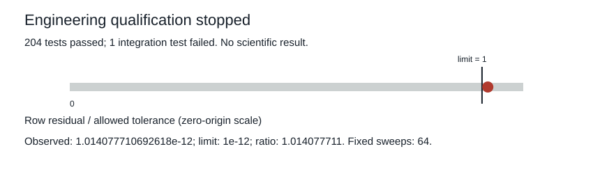

# Balanced-transition integration stopped at qualification

**QUALIFICATION_FAILED.** Lint passed; 204 tests passed and one integration test failed (one test warning). The original supervised qualification closed with exit code 1 in 13.466069750 seconds. No scientific study was registered or started.

| Recorded check | Original value |
| --- | ---: |
| Fixed normalization sweeps | 64 |
| Allowed row/column residual | 9.9999999999999998e-13 |
| Observed row residual | 1.014077710692618e-12 |
| Observed column residual | 2.2204460492503131e-16 |
| Completed engineering free-control fits | 2 |
| Accepted balanced prefix updates | 299 |
| Failed balanced prefix attempt | 300 |
| Engineering DEV generations and evaluations | 0 |

The row residual exceeded the frozen 1e-12 limit. The exception occurred in the balanced arm of the three-arm engineering smoke, before development generation and saved-output auditing. Its controller records model, optimizer and cursor rollback. The failed update began 1.702321125 seconds after that fit started; it has no completion timestamp. These are preserved producer records, not a numerical replay.

The earlier primitive qualification remains a separate pass. This integration failure shows that its fixed64 routine did not reliably meet the declared tolerance during this smoke. It does not establish task performance, architectural superiority or a general impossibility. The original attempt remains closed, with no added sweeps or relaxed tolerance.

The evidence archive includes all 63 registered source copies, the original process and test logs, all 27 post-stop engineering artifact copies and the complete pinned primitive prerequisite. Original temporary paths and the separate preservation status are retained. Arrays and checkpoints are opaque. Interpreter and installed packages remain external.

[Complete summary](summary.json) · [Exact member manifest](manifest.json) · [Evidence archive](evidence.tar.gz)
