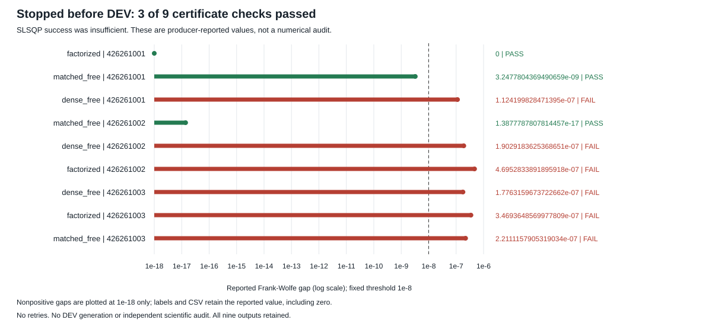

# Convex-readout diagnostic stopped before DEV

**STOPPED: three of nine reported certificate checks passed.** All nine SLSQP calls reported success, but six did not meet the fixed Frank-Wolfe gap threshold of 1e-8. The registered all-solves gate stopped the run before DEV generation. There was no retry, fallback success or independent scientific audit.

**These certificate values are producer outputs, not independently numerically audited results.** This publisher verifies original source/process/payload identity and consistency of the saved status fields. It does not decode latent states or recompute any loss, gradient or certificate.

| Parent | Seed | Reported FW gap | Fixed threshold | Reported certificate | Original TRAIN loss | Reported final TRAIN loss |
|---|---:|---:|---:|---|---:|---:|
| factorized | 426261001 | 0 | 1e-8 | PASS | 0.00362076556 | 0.00255567343 |
| matched_free | 426261001 | 3.24778044e-09 | 1e-8 | PASS | 0.14863569 | 0.143390915 |
| dense_free | 426261001 | 1.12419983e-07 | 1e-8 | FAIL | 0.133483397 | 0.132953984 |
| matched_free | 426261002 | 1.38777878e-17 | 1e-8 | PASS | 0.0690768975 | 0.0678183858 |
| dense_free | 426261002 | 1.90291836e-07 | 1e-8 | FAIL | 0.125960502 | 0.124881715 |
| factorized | 426261002 | 4.69528339e-07 | 1e-8 | FAIL | 0.129180484 | 0.129101948 |
| dense_free | 426261003 | 1.77631597e-07 | 1e-8 | FAIL | 0.117624908 | 0.116867916 |
| factorized | 426261003 | 3.46936486e-07 | 1e-8 | FAIL | 0.0981513107 | 0.0973315201 |
| matched_free | 426261003 | 2.21111579e-07 | 1e-8 | FAIL | 0.113583748 | 0.112924753 |

The objective remains original blind cost MSE plus observed cost MSE on H1/H2 TRAIN states. Solver termination tolerance and the registered direct-residual certificate requirement are different conditions. A successful SLSQP status did not establish the required numerical certificate. The original recurrent models stayed frozen according to every saved before/after state hash; this publisher checks those hashes against original metadata without decoding checkpoints.

The domain is the closed per-state probability simplex, with cost matrix C = 0.25 - P. It permits boundary heads that finite softmax logits only approach. Even a completed solve would therefore not isolate optimizer choice from this domain extension.

## Recorded cost and stop boundary

| Parent | Seed | Load seconds | TRAIN extraction seconds | Build/solve/certificate seconds | Objective calls | Iterations |
|---|---:|---:|---:|---:|---:|---:|
| factorized | 426261001 | 0.002429 | 0.024004 | 0.284231 | 10 | 10 |
| matched_free | 426261001 | 0.000811 | 0.044101 | 0.014064 | 37 | 37 |
| dense_free | 426261001 | 0.000636 | 0.021733 | 0.010285 | 22 | 21 |
| matched_free | 426261002 | 0.000683 | 0.023235 | 0.006067 | 9 | 9 |
| dense_free | 426261002 | 0.000547 | 0.023220 | 0.018275 | 41 | 40 |
| factorized | 426261002 | 0.000643 | 0.022481 | 0.027195 | 55 | 55 |
| dense_free | 426261003 | 0.000572 | 0.021704 | 0.014743 | 24 | 24 |
| factorized | 426261003 | 0.000555 | 0.024351 | 0.011110 | 19 | 19 |
| matched_free | 426261003 | 0.000658 | 0.025833 | 0.024244 | 38 | 38 |

Original qualification duration: 3.017 seconds. Original stopped producer duration: 1.754 seconds. These supervisor durations include process cleanup and already contain the nested timers. Prior recurrent-model training is excluded.

Recorded solver calls: 9; qualifying solves: 3; DEV generation, evaluation calls, new checkpoint writes, model-weight optimizer steps, teacher calls and native environment calls: zero. The exact 22-file stopped inventory has nine saved TRAIN-state archives, nine solve records, the journal, copied TRAIN, configuration and failure receipt. No solve barrier, DEV file, success summary or scientific-audit launch exists.

## Evidence and limits

[Frozen protocol](https://github.com/kw2828/OpenJev/blob/main/research/finite-convex-readout-protocol.md) · [All solve rows](solves.csv) · [Manifest](https://github.com/kw2828/OpenJev/releases/download/finite-convex-readout-v1/manifest.json) · [Complete stopped evidence archive](https://github.com/kw2828/OpenJev/releases/download/finite-convex-readout-v1/finite-convex-readout-stopped-v1.tar.gz)

The archive contains all 37 registered sources, current original process records and payloads, and every explicitly pinned parent-study member as opaque historical provenance. Only original TRAIN and the nine original checkpoints were reused scientific inputs; previous DEV arrays are historical proof and were not decoded for this experiment. Absolute source paths are provenance, not a portable installation contract.

The failed worker did not reach its final sources-after field. Current source and upstream hashes are verified against the registered pins before and after publication; that check is not relabeled as a historical worker-end attestation.

No fresh decision-performance result, architecture improvement, latent-information conclusion, calibration result, native transfer or novelty claim follows from this stopped attempt. Earlier study verdicts remain unchanged. A repaired solver would require a separate prospective registration, not a silent rerun of this attempt.
