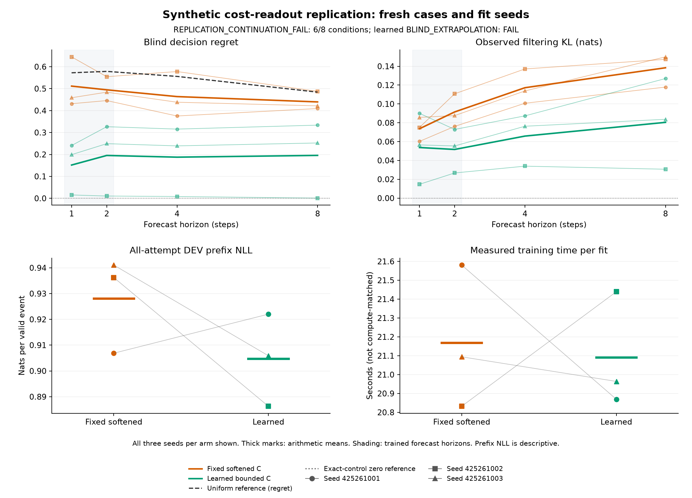

# Readout gains repeat, but the competence criteria do not

**The fresh replication fails its continuation rule: 6/8 conditions pass.**
The learned head again lowers four- and eight-step regret in every paired seed,
but the required short-horizon and observed-filtering criteria fail. Both arms
fail all three absolute criteria. The proposed longer-horizon training study
does not proceed under this rule.

Six new fits use a fresh TRAIN/DEV population and three new fit seeds. The
model, objective, 480-epoch schedule and all training functions are unchanged
from the [original readout study](finite-cost-readout-results.md). Each learned
head starts with the same predictions as its fixed softened control, with
paired filter initialization and batch order. This repeats the trainability
comparison; the original fixed exact-C anchor is not repeated.

| Absolute criterion | Fixed softened C | Learned readout |
| --- | --- | --- |
| Short-horizon learning | FAIL, 11/24 | FAIL, 21/24 |
| Blind extrapolation | FAIL, 9/21 | FAIL, 14/21 |
| Observed filtering extrapolation | FAIL, 2/8 | FAIL, 7/8 |

Condition counts are not accuracy percentages. Every required condition must
hold in every seed. The separate continuation rule requires the learned short
and observed criteria plus six strict paired H4/H8 regret improvements. All
six relative comparisons pass; the two absolute requirements fail. Means and
observation likelihood cannot rescue the outcome.

| Three-seed mean, lower is better | Fixed softened | Learned | Change |
| --- | ---: | ---: | --- |
| Four-step blind regret | 0.463759 | 0.187608 | 59.55% lower |
| Eight-step blind regret | 0.439449 | 0.195671 | 55.47% lower |
| Four-step blind cost MSE | 0.119596 | 0.052273 | 56.29% lower |
| Eight-step blind cost MSE | 0.093656 | 0.052305 | 44.15% lower |
| Four-step observed cost MSE | 0.165870 | 0.054667 | 67.04% lower |
| Eight-step observed cost MSE | 0.165907 | 0.058619 | 64.67% lower |
| Four-step observed KL, nats | 0.117215 | 0.065843 | 43.83% lower |
| Eight-step observed KL, nats | 0.138390 | 0.080420 | 41.89% lower |
| Prefix NLL, nats/event | 0.928057 | 0.904731 | Descriptive |
| Training seconds, all three fits | 63.51 | 63.27 | No speedup claim |

These percentages compare means of three separately fitted models on the same
fresh cases, not an ensemble or significance test. Regret and blind/observed
cost MSE improve in all six paired H4/H8 cells. Observed KL improves in five;
the remaining H8 cell worsens. Prefix NLL also worsens in one of three fits,
despite its lower mean.

The first learned fit, seed **425261001**, fails H1/H2 cost MSE and H2 regret.
Its H8 observed KL is **0.126953**, above the 0.1 threshold. Those four cells
explain the short and observed criterion failures. Learned H8 regrets are
**0.333660, 0.001024 and 0.252330**; the strong middle fit is retained alongside
both weaker fits, with no selection. Seven blind conditions fail: the first
fit's H4/H8 cost MSE and regret, and the third fit's H4 MSE plus H8 MSE and
regret. The history-ignorant known-dynamics reference has H8 regret 0.484018
and cost MSE 0.095732; each fit must halve both, not only their average.

All **512 TRAIN attempts** are retained: 478 eligible endpoint cases, 34
terminal histories and 4,457 valid events. Fresh DEV retains **128 attempts**:
118 eligible endpoint cases, 10 terminal histories and 1,126 valid events.
All six final checkpoints precede DEV generation. Training completes 23,040
updates, 1,474,560 attempt exposures, 1,376,640 eligible endpoint exposures and
12,836,160 prefix-event exposures. No attempts were replaced and no batch
lacked eligible endpoints in this run.

The learned model has 1,120 trainable parameters; the control has 1,088 plus
32 fixed costs. Both store 8,960 parameter-plus-buffer bytes, excluding
optimizer state and activations. Extra head normalization and optimizer work
remain charged. Equal updates and similar measured time do not establish
equal computation or inference speed.

The first engineering attempt passes **123 tests**, with one inherited
test-only tensor-to-scalar warning. Original qualification, fit/evaluation and
audit take **3.48, 128.22 and 1.27 seconds**, respectively. The saved-record
audit reconstructs targets, metrics and work with 15 array decodes and no
model, optimizer, generator or checkpoint decodes. Technical completion is
distinct from the failed scientific criteria. All four prior studies' source
pins remain unchanged.

The result supports keeping learned readouts as a useful comparison arm while
investigating unreliable training. It does not establish that initialization
alone causes the variation: fit seeds also change minibatch order, and this
replication changes the data pool. Both initial heads retain privileged
world-aligned information. There is no scenario shift, native-task transfer,
calibration, connectome benefit, RL advance or new architecture claim.

The original study remains a completed positive relative comparison with two
passing criteria on its own cohort. Its success does not override this fresh
failure, and this failure does not erase its recorded result.

[Every seed, condition and measured cost](finite-cost-readout-replication-results/report.md) ·
[Machine-readable results](finite-cost-readout-replication-results/summary.json) ·
[Frozen protocol](finite-cost-readout-replication-protocol.md) ·
[All six checkpoints and original evidence](https://github.com/kw2828/OpenJev/releases/tag/finite-cost-readout-replication-v1).

[New stability proposal: factorized recurrent dynamics](finite-cost-readout-replication-next.md).
