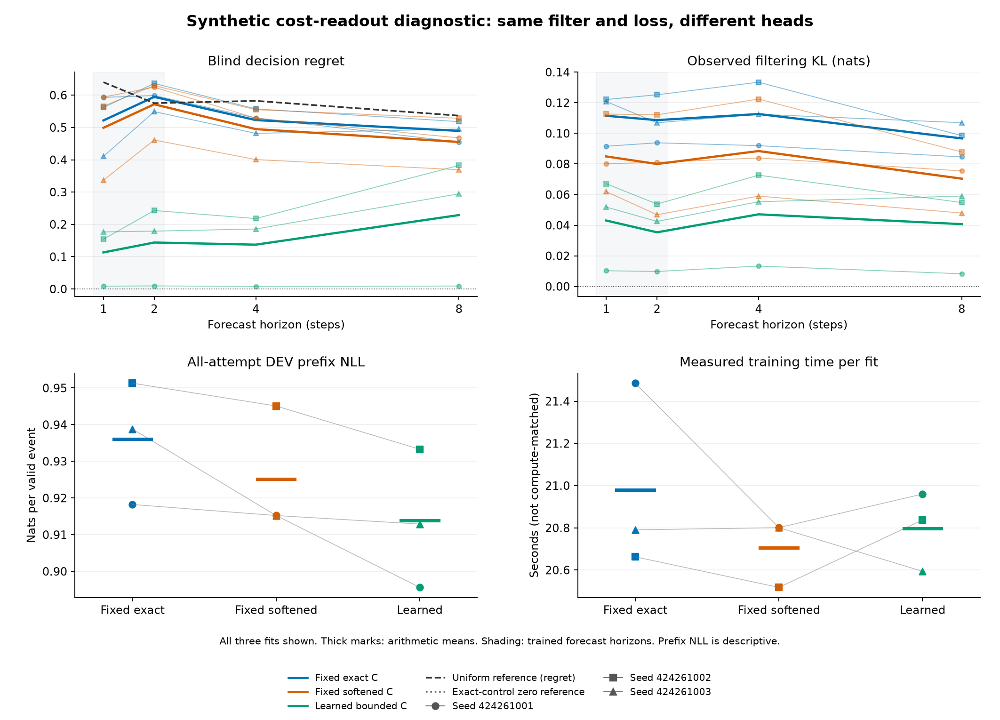

# Learning the cost readout of a synthetic recurrent filter

Three arms share the same learned reset emission, recurrent branch operators and coefficient-one prefix loss. `fixed_exact` uses the known centered cost matrix C; `fixed_softened` uses 0.9C; `learned_readout` uses 0.25 minus a softmax over decisions in each latent-state column, initialized to match 0.9C within 1e-12.

The learned head adds 32 logits, or 24 identifiable head degrees of freedom. Only learned versus softened isolates trainability from initialization. A gain against softened alone might simply undo the softening; the exact-C control retains the stronger privileged anchor. All arms start with world-aligned readouts.

All learned models receive public history only. Every attempted prefix, including its first found event, is retained for coefficient-one event-mean NLL; post-found padding is excluded. Endpoint targets exist only for surviving prefixes and use a separate fixed denominator. There is no oracle posterior or belief-supervision input to a learner. The exact correctness reference alone receives the true boundary posterior and dynamics.

[Frozen protocol](../finite-cost-readout-protocol.md). Original qualification, fit and audit closures, source pins and complete payload hashes were authenticated before reading these metrics. Exact-control forecasts match independently reconstructed targets within 1e-12.

## Unchanged criteria

| Criterion | Fixed exact | Fixed softened | Learned readout |
|---|---|---|---|
| SHORT_HORIZON_LEARNING | FAIL (8/24) | FAIL (10/24) | PASS (24/24) |
| BLIND_EXTRAPOLATION | FAIL (9/21) | FAIL (9/21) | FAIL (16/21) |
| OBSERVED_FILTERING_EXTRAPOLATION | FAIL (5/8) | FAIL (7/8) | PASS (8/8) |

Every fit seed must pass each criterion and minimum support. H1/H2 learning requires blind cost MSE and regret at most half the positive uniform reference and observed KL at most 0.1 nats. Blind H4/H8 extrapolation uses the same cost thresholds and H8 survival MAE at most 0.05. Observed H4/H8 filtering requires KL at most 0.1 and receives intervening observations. Prefix likelihood cannot rescue these criteria.

## Longer-horizon means

| Arm | H | Blind regret | Blind cost MSE | Observed cost MSE | Observed KL | Blind survival MAE |
|---|---:|---:|---:|---:|---:|---:|
| fixed_exact | 4 | 0.522908 | 0.128634 | 0.184953 | 0.11262 | 0.00552715 |
| fixed_exact | 8 | 0.489451 | 0.101825 | 0.193688 | 0.0966927 | 0.00780171 |
| fixed_softened | 4 | 0.494941 | 0.125317 | 0.180912 | 0.0884354 | 0.00549442 |
| fixed_softened | 8 | 0.45519 | 0.0985857 | 0.18366 | 0.0703968 | 0.0076695 |
| learned_readout | 4 | 0.13726 | 0.0413601 | 0.0374808 | 0.0470954 | 0.00496993 |
| learned_readout | 8 | 0.228868 | 0.0469077 | 0.0456678 | 0.0406839 | 0.00693539 |

Means describe three separately fitted policies, not an ensemble or confidence interval.

## Paired differences against both fixed controls

Every difference is learned minus the named control on the same seed and cases. Negative favors learned for that metric. These are descriptive arithmetic, not significance tests or additional gates.

| Control | Seed | H | Regret difference | Blind MSE difference | Observed MSE difference | KL difference |
|---|---:|---:|---:|---:|---:|---:|
| fixed_exact | 424261001 | 4 | -0.521409 | -0.13064 | -0.204511 | -0.0786738 |
| fixed_exact | 424261002 | 4 | -0.33948 | -0.066475 | -0.129062 | -0.0607349 |
| fixed_exact | 424261003 | 4 | -0.296054 | -0.064707 | -0.108845 | -0.0571638 |
| fixed_exact | 424261001 | 8 | -0.445717 | -0.0929672 | -0.187842 | -0.0763591 |
| fixed_exact | 424261002 | 8 | -0.135542 | -0.0320514 | -0.125485 | -0.0436973 |
| fixed_exact | 424261003 | 8 | -0.200491 | -0.0397327 | -0.130735 | -0.04797 |
| fixed_softened | 424261001 | 4 | -0.521034 | -0.133232 | -0.202755 | -0.0706142 |
| fixed_softened | 424261002 | 4 | -0.337116 | -0.0697139 | -0.131062 | -0.0497185 |
| fixed_softened | 424261003 | 4 | -0.214891 | -0.0489252 | -0.0964776 | -0.00368758 |
| fixed_softened | 424261001 | 8 | -0.458674 | -0.0943716 | -0.186681 | -0.0671998 |
| fixed_softened | 424261002 | 8 | -0.145844 | -0.0328323 | -0.125073 | -0.0330165 |
| fixed_softened | 424261003 | 8 | -0.0744472 | -0.02783 | -0.102222 | +0.0110777 |

## Readout changes for every fit

| Arm | Seed | Mean absolute change | Maximum absolute change | Initial SHA256 | Final SHA256 |
|---|---:|---:|---:|---|---|
| fixed_exact | 424261001 | 0 | 0 | c5bfe4d5b186c43f14ed1435f67672369cfb739316bfbd18c74b12a90ee31f31 | c5bfe4d5b186c43f14ed1435f67672369cfb739316bfbd18c74b12a90ee31f31 |
| fixed_softened | 424261001 | 0 | 0 | d6f63ee233f1e1f1b9fb9420937ea8dead56a67164de9955b109207636bdb337 | d6f63ee233f1e1f1b9fb9420937ea8dead56a67164de9955b109207636bdb337 |
| learned_readout | 424261001 | 0.370091 | 0.969426 | 887658d8e3c8cd134a01881d4b04ab78eddc5554d0f55d7f23c023094b2baafc | 03d9239bb7f595418b71117ef95092102aa65bb69f22071fec5a198b364ccf73 |
| fixed_softened | 424261002 | 0 | 0 | d6f63ee233f1e1f1b9fb9420937ea8dead56a67164de9955b109207636bdb337 | d6f63ee233f1e1f1b9fb9420937ea8dead56a67164de9955b109207636bdb337 |
| learned_readout | 424261002 | 0.363997 | 0.968006 | 887658d8e3c8cd134a01881d4b04ab78eddc5554d0f55d7f23c023094b2baafc | cfabd003277820be8903212717972b8b7f4beeec57cb6525c6416a1c3be2e10c |
| fixed_exact | 424261002 | 0 | 0 | c5bfe4d5b186c43f14ed1435f67672369cfb739316bfbd18c74b12a90ee31f31 | c5bfe4d5b186c43f14ed1435f67672369cfb739316bfbd18c74b12a90ee31f31 |
| learned_readout | 424261003 | 0.253803 | 0.966532 | 887658d8e3c8cd134a01881d4b04ab78eddc5554d0f55d7f23c023094b2baafc | 4d80dc7f269e8e8939dd26d0e8d09d5f620fade1597ec0b8758e5ad5536f5283 |
| fixed_exact | 424261003 | 0 | 0 | c5bfe4d5b186c43f14ed1435f67672369cfb739316bfbd18c74b12a90ee31f31 | c5bfe4d5b186c43f14ed1435f67672369cfb739316bfbd18c74b12a90ee31f31 |
| fixed_softened | 424261003 | 0 | 0 | d6f63ee233f1e1f1b9fb9420937ea8dead56a67164de9955b109207636bdb337 | d6f63ee233f1e1f1b9fb9420937ea8dead56a67164de9955b109207636bdb337 |

The audit checks these saved 4-by-8 matrices and their hashes of little-endian float64 bytes. Every initial/final matrix is retained in the summary; all learned-head matrices are also printed below. Matrix movement is not evidence of latent-state recovery or alignment.

### Learned head, seed 424261001

| Decision | Initial eight-state costs | Final eight-state costs |
|---|---|---|
| 0 | -0.675, 0.225, 0.225, 0.225, 0.225, 0.225, 0.225, -0.675 | -0.748935, 0.237873, 0.249468, 0.249725, 0.24899, 0.246805, -0.736024, 0.244613 |
| 1 | 0.225, -0.675, 0.225, 0.225, 0.225, 0.225, -0.675, 0.225 | 0.249742, 0.246299, 0.243172, 0.248549, -0.741995, 0.249728, 0.245592, -0.731148 |
| 2 | 0.225, 0.225, 0.225, -0.675, -0.675, 0.225, 0.225, 0.225 | 0.249539, -0.733401, 0.249565, 0.246152, 0.245138, -0.743317, 0.240977, 0.249241 |
| 3 | 0.225, 0.225, -0.675, 0.225, 0.225, -0.675, 0.225, 0.225 | 0.249653, 0.24923, -0.742205, -0.744426, 0.247868, 0.246784, 0.249456, 0.237294 |

### Learned head, seed 424261002

| Decision | Initial eight-state costs | Final eight-state costs |
|---|---|---|
| 0 | -0.675, 0.225, 0.225, 0.225, 0.225, 0.225, 0.225, -0.675 | -0.749175, -0.164168, -0.169453, 0.248584, 0.249375, 0.248344, 0.249125, 0.213886 |
| 1 | 0.225, -0.675, 0.225, 0.225, 0.225, 0.225, -0.675, 0.225 | 0.2498, 0.230703, 0.2486, 0.247495, 0.228183, 0.249417, -0.747616, -0.708888 |
| 2 | 0.225, 0.225, 0.225, -0.675, -0.675, 0.225, 0.225, 0.225 | 0.249631, -0.314504, -0.319286, 0.243912, 0.240302, -0.743006, 0.24944, 0.249563 |
| 3 | 0.225, 0.225, -0.675, 0.225, 0.225, -0.675, 0.225, 0.225 | 0.249744, 0.24797, 0.240138, -0.739991, -0.71786, 0.245244, 0.249051, 0.245438 |

### Learned head, seed 424261003

| Decision | Initial eight-state costs | Final eight-state costs |
|---|---|---|
| 0 | -0.675, 0.225, 0.225, 0.225, 0.225, 0.225, 0.225, -0.675 | 0.24319, -0.203085, 0.249483, 0.249006, 0.247962, -0.741532, 0.209856, -0.731248 |
| 1 | 0.225, -0.675, 0.225, 0.225, 0.225, 0.225, -0.675, 0.225 | -0.740587, 0.239425, 0.242834, 0.234043, 0.249811, 0.249212, -0.70793, 0.236525 |
| 2 | 0.225, 0.225, 0.225, -0.675, -0.675, 0.225, 0.225, 0.225 | 0.249185, -0.284429, 0.249257, 0.239668, -0.747605, 0.247124, 0.249343, 0.248729 |
| 3 | 0.225, 0.225, -0.675, 0.225, 0.225, -0.675, 0.225, 0.225 | 0.248212, 0.248089, -0.741573, -0.722717, 0.249833, 0.245196, 0.248732, 0.245994 |

## Prefix likelihood and inference cost

| Arm | Seed | Attempts | Valid events | Prefix NLL | Prefix seconds | Endpoint seconds |
|---|---:|---:|---:|---:|---:|---:|
| fixed_exact | 424261001 | 128 | 1100 | 0.918226 | 0.002565 | 0.011416 |
| fixed_exact | 424261002 | 128 | 1100 | 0.951303 | 0.002605 | 0.011240 |
| fixed_exact | 424261003 | 128 | 1100 | 0.938808 | 0.002735 | 0.010908 |
| fixed_softened | 424261001 | 128 | 1100 | 0.915225 | 0.002485 | 0.011228 |
| fixed_softened | 424261002 | 128 | 1100 | 0.945086 | 0.002535 | 0.010826 |
| fixed_softened | 424261003 | 128 | 1100 | 0.915215 | 0.002422 | 0.011022 |
| learned_readout | 424261001 | 128 | 1100 | 0.895627 | 0.002574 | 0.011629 |
| learned_readout | 424261002 | 128 | 1100 | 0.933286 | 0.002445 | 0.011755 |
| learned_readout | 424261003 | 128 | 1100 | 0.912894 | 0.002483 | 0.011452 |

Prefix timings include input copies, likelihood forwards, guards, output copies and scalar NLL, excluding state hashes and file writes. Endpoint timings include blind, observed and shuffled forecasts with copies and guards, excluding state hashes and scalar metrics. Neither is single-decision latency.

## Data, storage and measured work

| Split | Attempts | Endpoint eligible | Found-terminated | Valid prefix events |
|---|---:|---:|---:|---:|
| train | 512 | 481 | 31 | 4502 |
| base | 128 | 117 | 11 | 1100 |

All nine fits use 480 epochs, batch size 64, Adam 0.003, global gradient clip 5 and the same forecast objective plus coefficient-one prefix NLL. Paired filter initialization, attempt pools and batch orders are shared. The learned and softened heads match initial functions and raw filter gradients before clipping; the additional head gradient can change the global clipping factor. Final checkpoints precede DEV generation.

| Arm | Seed | Parameters | Parameter bytes | Buffer bytes | Updates | Endpoint exposures | Prefix-event exposures | Fit seconds |
|---|---:|---:|---:|---:|---:|---:|---:|---:|
| fixed_exact | 424261001 | 1088 | 8704 | 256 | 3,840 | 230,880 | 2,160,960 | 21.485 |
| fixed_softened | 424261001 | 1088 | 8704 | 256 | 3,840 | 230,880 | 2,160,960 | 20.801 |
| learned_readout | 424261001 | 1120 | 8960 | 0 | 3,840 | 230,880 | 2,160,960 | 20.960 |
| fixed_softened | 424261002 | 1088 | 8704 | 256 | 3,840 | 230,880 | 2,160,960 | 20.518 |
| learned_readout | 424261002 | 1120 | 8960 | 0 | 3,840 | 230,880 | 2,160,960 | 20.837 |
| fixed_exact | 424261002 | 1088 | 8704 | 256 | 3,840 | 230,880 | 2,160,960 | 20.663 |
| learned_readout | 424261003 | 1120 | 8960 | 0 | 3,840 | 230,880 | 2,160,960 | 20.594 |
| fixed_exact | 424261003 | 1088 | 8704 | 256 | 3,840 | 230,880 | 2,160,960 | 20.790 |
| fixed_softened | 424261003 | 1088 | 8704 | 256 | 3,840 | 230,880 | 2,160,960 | 20.801 |

Fit time includes initial/final state and readout snapshots, optimizer construction, training, journals, buffer checks and checkpoint writing; model construction is excluded. All arithmetic is float64 except public float32 tokens. Storage excludes activations and optimizer state. Equal updates are not equal compute.

| Arm | Route | Filter rows | NLL rows | Head softmax calls | Head probability rows | Cost readout rows |
|---|---|---:|---:|---:|---:|---:|
| fixed_exact | training_blind | 5,541,120 | 0 | 0 | 0 | 1,385,280 |
| fixed_exact | training_observed | 5,541,120 | 0 | 0 | 0 | 1,385,280 |
| fixed_exact | training_prefix | 5,700,960 | 6,482,880 | 0 | 0 | 0 |
| fixed_exact | evaluation_blind | 2,808 | 0 | 0 | 0 | 2,808 |
| fixed_exact | evaluation_observed | 2,808 | 0 | 0 | 0 | 2,808 |
| fixed_exact | evaluation_shuffled | 2,808 | 0 | 0 | 0 | 2,808 |
| fixed_exact | evaluation_prefix | 2,883 | 3,300 | 0 | 0 | 0 |
| fixed_softened | training_blind | 5,541,120 | 0 | 0 | 0 | 1,385,280 |
| fixed_softened | training_observed | 5,541,120 | 0 | 0 | 0 | 1,385,280 |
| fixed_softened | training_prefix | 5,700,960 | 6,482,880 | 0 | 0 | 0 |
| fixed_softened | evaluation_blind | 2,808 | 0 | 0 | 0 | 2,808 |
| fixed_softened | evaluation_observed | 2,808 | 0 | 0 | 0 | 2,808 |
| fixed_softened | evaluation_shuffled | 2,808 | 0 | 0 | 0 | 2,808 |
| fixed_softened | evaluation_prefix | 2,883 | 3,300 | 0 | 0 | 0 |
| learned_readout | training_blind | 5,541,120 | 0 | 23,040 | 184,320 | 1,385,280 |
| learned_readout | training_observed | 5,541,120 | 0 | 23,040 | 184,320 | 1,385,280 |
| learned_readout | training_prefix | 5,700,960 | 6,482,880 | 0 | 0 | 0 |
| learned_readout | evaluation_blind | 2,808 | 0 | 48 | 384 | 2,808 |
| learned_readout | evaluation_observed | 2,808 | 0 | 48 | 384 | 2,808 |
| learned_readout | evaluation_shuffled | 2,808 | 0 | 48 | 384 | 2,808 |
| learned_readout | evaluation_prefix | 2,883 | 3,300 | 0 | 0 | 0 |

Readout snapshots are separately counted: 18 exports, including 6 learned-head softmaxes. They are inside fit timings but outside forward-route counters. Each learned forward head normalization processes eight latent columns. Work counts are source-constrained producer attestations checked against schedules and labels; they exclude backward operations, optimizer work, validation FLOPs and allocation.

| Original closed phase | Seconds |
|---|---:|
| qualify | 3.974 |
| fit | 188.885 |
| audit | 1.660 |
| Total of successful phases | 194.519 |

Whole-phase timings include launch and cleanup; nested timings must not be added again. Any earlier failed qualification remains separately preserved in the evidence package. [summary.json](summary.json) retains all 36 endpoint rows, nine prefix rows, conditions, per-seed contrasts, readout snapshots and declared work.

## Interpretation limits

The true world is representable with the exact fixed readout, so failure does not prove a fixed-C expressivity barrier. All arms retain privileged world-aligned initialization. Real-valued learned costs are interior to the known bounds; float64 can round a cost to a boundary without clipping. Four centered costs do not identify every coordinate of an eight-state posterior. Lower event NLL or training loss cannot rescue decision criteria, and observed filtering consumes evidence that blind forecasts do not. No convergence, calibration, architectural novelty, native transfer or cross-study improvement claim is made. Earlier outcomes remain unchanged.
