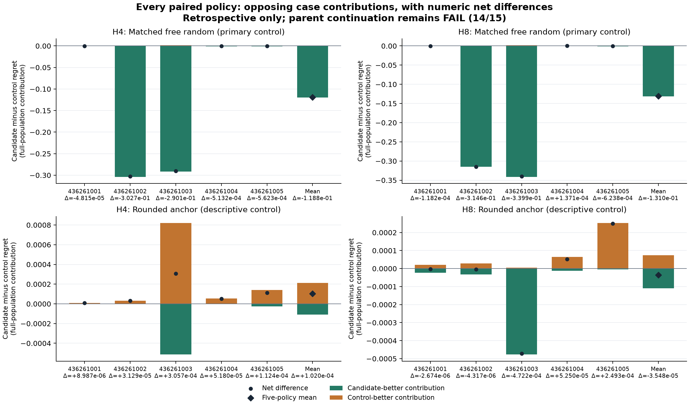

# Where prediction error and decision regret diverge

**Retrospective diagnostic complete. Parent continuation remains FAIL, 14/15 conditions.**

This reuses the closed BASE predictions for all three models, all five fit seeds and all 486 retained cases. No model is trained, selected or run again. Every H1/H2/H4/H8 policy group and both H4/H8 control comparisons remain in the report and evidence.

The paired difference is rounded-random regret minus control regret. Green bars sum cases where the candidate has lower regret; orange bars sum cases where the control has lower regret. Both use the full 486-case denominator. Their sum is the net mean difference, shown numerically for every seed. Exact-equal cases contribute zero and remain in all denominators. Each panel uses a linear axis; panel scales can differ. Diamonds describe the same five policies on shared cases, not a new ensemble or five independent populations.

The preidentified failed comparison:

Seed 436261004 at H8 has candidate regret 0.00249720604 versus 0.00236014691, a difference of 0.000137059129. Its four-action MSE is 0.000715714663 versus 0.000952274995; centered MSE is 0.000715714663 versus 0.000952274995. This comparison was named before the diagnostic decoded its inputs because it failed the parent rule. It receives no separate threshold, fitting, replacement or eligibility decision.

| Case category | Cases | Actions differ | Full-population regret-difference contribution | Within-category mean difference |
|---|---:|---:|---:|---:|
| candidate_better | 3 | 3 | -0.000369253223 | -0.0598190221 |
| control_better | 6 | 6 | 0.000506312352 | 0.0410113005 |
| equal | 477 | 0 | 0 | 0 |

The two policies choose different actions on 9/486 cases. In the predeclared true-margin >=0.1 bin, 1 of 431 cases have different actions; that bin contributes +0.00047412288907 to the full-population regret difference. The other three bins together contribute -0.00033706376. The reversal is therefore not confined to tiny near-ties. True cost columns are centered by the world definition, and learned columns use 0.25 minus four-action softmax probabilities. Both cost vectors are therefore centered by construction. Their raw and action-centered MSE agree at the saved precision, as expected; centering is not a new correction or an independent improvement. These findings use the fixed bins and all cases; they do not change the failed continuation rule.

Lower average squared error need not preserve the ordering of the lowest costs in every case. The decomposition shows associations in saved predictions; it does not identify which parameter or training mechanism caused them. The predicted chosen-versus-true-best contrast is a ranking witness, not confidence or a calibrated probability. No significance test, new loss selection or architecture advancement follows from this diagnostic.

The selected qualification passed 65 tests with 0 warning(s). Original native phase times were 3.793623s for qualification, 3.842679s for diagnosis and 3.537223s for audit. All original processes closed successfully.

The producer and audit each open two original NPZ files and decode 17 arrays: IDs, true costs and 15 blind-cost predictions. Total new scientific input work is four NPZ opens and 34 array decodes. The audit independently joins all 29,160 original vectors and IDs, recomputes all case metrics and 9,720 paired case contrasts, and reconciles 120 regret/MSE values with all 60 published parent rows. Its pure scalar subroutine performs no file decoding; those reads belong to its enclosing phase. No phase invokes a model, optimizer or world generator. Publication plots saved scalar JSON only.

All paired category decompositions:

| Control | Seed | H | Category | Cases | Actions differ | Candidate contribution | Control contribution | Difference contribution | Within-category difference |
|---|---:|---:|---|---:|---:|---:|---:|---:|---:|
| matched_free_random | 436261001 | 4 | candidate_better | 6 | 6 | 0 | 0.000373185741 | -0.000373185741 | -0.030228045 |
| matched_free_random | 436261001 | 4 | control_better | 10 | 10 | 0.000325040097 | 0 | 0.000325040097 | 0.0157969487 |
| matched_free_random | 436261001 | 4 | equal | 470 | 0 | 0.00263313009 | 0.00263313009 | 0 | 0 |
| matched_free_random | 436261001 | 8 | candidate_better | 6 | 6 | 0 | 0.000627637401 | -0.000627637401 | -0.0508386295 |
| matched_free_random | 436261001 | 8 | control_better | 4 | 4 | 0.000509449656 | 0 | 0.000509449656 | 0.0618981332 |
| matched_free_random | 436261001 | 8 | equal | 476 | 0 | 0.00268951223 | 0.00268951223 | 0 | 0 |
| matched_free_random | 436261002 | 4 | candidate_better | 190 | 190 | 0.000654982233 | 0.304617246 | -0.303962264 | -0.777503475 |
| matched_free_random | 436261002 | 4 | control_better | 15 | 15 | 0.00126336505 | 3.24698778e-06 | 0.00126011806 | 0.0408278251 |
| matched_free_random | 436261002 | 4 | equal | 281 | 0 | 0.000370959676 | 0.000370959676 | 0 | 0 |
| matched_free_random | 436261002 | 8 | candidate_better | 225 | 225 | 0.000831276353 | 0.315684641 | -0.314853364 | -0.680083267 |
| matched_free_random | 436261002 | 8 | control_better | 7 | 7 | 0.000270444119 | 0 | 0.000270444119 | 0.0187765488 |
| matched_free_random | 436261002 | 8 | equal | 254 | 0 | 0.00138008714 | 0.00138008714 | 0 | 0 |
| matched_free_random | 436261003 | 4 | candidate_better | 180 | 180 | 0.000242040947 | 0.291680024 | -0.291437983 | -0.786882554 |
| matched_free_random | 436261003 | 4 | control_better | 13 | 13 | 0.00134999247 | 0 | 0.00134999247 | 0.0504689494 |
| matched_free_random | 436261003 | 4 | equal | 293 | 0 | 0.000963187354 | 0.000963187354 | 0 | 0 |
| matched_free_random | 436261003 | 8 | candidate_better | 231 | 231 | 0.000102526265 | 0.341501025 | -0.341398499 | -0.718266971 |
| matched_free_random | 436261003 | 8 | control_better | 13 | 13 | 0.00153541642 | 0 | 0.00153541642 | 0.0574009521 |
| matched_free_random | 436261003 | 8 | equal | 242 | 0 | 0.00102280699 | 0.00102280699 | 0 | 0 |
| matched_free_random | 436261004 | 4 | candidate_better | 2 | 2 | 0 | 0.000803795637 | -0.000803795637 | -0.19532234 |
| matched_free_random | 436261004 | 4 | control_better | 6 | 6 | 0.000290616957 | 0 | 0.000290616957 | 0.0235399735 |
| matched_free_random | 436261004 | 4 | equal | 478 | 0 | 0.00201902873 | 0.00201902873 | 0 | 0 |
| matched_free_random | 436261004 | 8 | candidate_better | 3 | 3 | 0 | 0.000369253223 | -0.000369253223 | -0.0598190221 |
| matched_free_random | 436261004 | 8 | control_better | 6 | 6 | 0.000506312352 | 0 | 0.000506312352 | 0.0410113005 |
| matched_free_random | 436261004 | 8 | equal | 477 | 0 | 0.00199089369 | 0.00199089369 | 0 | 0 |
| matched_free_random | 436261005 | 4 | candidate_better | 4 | 4 | 0 | 0.000830394312 | -0.000830394312 | -0.100892909 |
| matched_free_random | 436261005 | 4 | control_better | 4 | 4 | 0.000268109298 | 0 | 0.000268109298 | 0.0325752797 |
| matched_free_random | 436261005 | 4 | equal | 478 | 0 | 0.00200636862 | 0.00200636862 | 0 | 0 |
| matched_free_random | 436261005 | 8 | candidate_better | 8 | 8 | 0 | 0.00113394763 | -0.00113394763 | -0.0688873186 |
| matched_free_random | 436261005 | 8 | control_better | 4 | 4 | 0.000510107738 | 0 | 0.000510107738 | 0.0619780902 |
| matched_free_random | 436261005 | 8 | equal | 474 | 0 | 0.00193057698 | 0.00193057698 | 0 | 0 |
| rounded_anchor | 436261001 | 4 | candidate_better | 0 | 0 | 0 | 0 | 0 | none (empty) |
| rounded_anchor | 436261001 | 4 | control_better | 1 | 1 | 8.9866937e-06 | 0 | 8.9866937e-06 | 0.00436753314 |
| rounded_anchor | 436261001 | 4 | equal | 485 | 0 | 0.00294918349 | 0.00294918349 | 0 | 0 |
| rounded_anchor | 436261001 | 8 | candidate_better | 2 | 2 | 0 | 2.31757996e-05 | -2.31757996e-05 | -0.00563171931 |
| rounded_anchor | 436261001 | 8 | control_better | 3 | 3 | 2.05017114e-05 | 0 | 2.05017114e-05 | 0.00332127725 |
| rounded_anchor | 436261001 | 8 | equal | 481 | 0 | 0.00317846017 | 0.00317846017 | 0 | 0 |
| rounded_anchor | 436261002 | 4 | candidate_better | 1 | 1 | 0 | 3.99545039e-07 | -3.99545039e-07 | -0.000194178889 |
| rounded_anchor | 436261002 | 4 | control_better | 4 | 4 | 3.16885226e-05 | 0 | 3.16885226e-05 | 0.0038501555 |
| rounded_anchor | 436261002 | 4 | equal | 481 | 0 | 0.00225761843 | 0.00225761843 | 0 | 0 |
| rounded_anchor | 436261002 | 8 | candidate_better | 3 | 3 | 0 | 3.28534089e-05 | -3.28534089e-05 | -0.00532225224 |
| rounded_anchor | 436261002 | 8 | control_better | 4 | 4 | 2.85368943e-05 | 0 | 2.85368943e-05 | 0.00346723266 |
| rounded_anchor | 436261002 | 8 | equal | 479 | 0 | 0.00245327071 | 0.00245327071 | 0 | 0 |
| rounded_anchor | 436261003 | 4 | candidate_better | 1 | 1 | 0 | 0.000514658271 | -0.000514658271 | -0.25012392 |
| rounded_anchor | 436261003 | 4 | control_better | 4 | 4 | 0.000820309321 | 0 | 0.000820309321 | 0.0996675824 |
| rounded_anchor | 436261003 | 4 | equal | 481 | 0 | 0.00173491145 | 0.00173491145 | 0 | 0 |
| rounded_anchor | 436261003 | 8 | candidate_better | 4 | 4 | 0 | 0.000477320258 | -0.000477320258 | -0.0579944114 |
| rounded_anchor | 436261003 | 8 | control_better | 2 | 2 | 5.13670814e-06 | 0 | 5.13670814e-06 | 0.00124822008 |
| rounded_anchor | 436261003 | 8 | equal | 480 | 0 | 0.00265561296 | 0.00265561296 | 0 | 0 |
| rounded_anchor | 436261004 | 4 | candidate_better | 2 | 2 | 0 | 3.32332468e-06 | -3.32332468e-06 | -0.000807567897 |
| rounded_anchor | 436261004 | 4 | control_better | 6 | 6 | 5.51196873e-05 | 0 | 5.51196873e-05 | 0.00446469467 |
| rounded_anchor | 436261004 | 4 | equal | 478 | 0 | 0.002254526 | 0.002254526 | 0 | 0 |
| rounded_anchor | 436261004 | 8 | candidate_better | 1 | 1 | 0 | 1.23915697e-05 | -1.23915697e-05 | -0.00602230286 |
| rounded_anchor | 436261004 | 8 | control_better | 5 | 5 | 6.48901356e-05 | 0 | 6.48901356e-05 | 0.00630732118 |
| rounded_anchor | 436261004 | 8 | equal | 480 | 0 | 0.0024323159 | 0.0024323159 | 0 | 0 |
| rounded_anchor | 436261005 | 4 | candidate_better | 3 | 3 | 0 | 2.68785185e-05 | -2.68785185e-05 | -0.00435431999 |
| rounded_anchor | 436261005 | 4 | control_better | 2 | 2 | 0.000139261398 | 0 | 0.000139261398 | 0.0338405197 |
| rounded_anchor | 436261005 | 4 | equal | 481 | 0 | 0.00213521652 | 0.00213521652 | 0 | 0 |
| rounded_anchor | 436261005 | 8 | candidate_better | 1 | 1 | 0 | 3.68938455e-06 | -3.68938455e-06 | -0.00179304089 |
| rounded_anchor | 436261005 | 8 | control_better | 3 | 3 | 0.000252960606 | 0 | 0.000252960606 | 0.0409796182 |
| rounded_anchor | 436261005 | 8 | equal | 482 | 0 | 0.00218772411 | 0.00218772411 | 0 | 0 |

All fixed true-margin bins, including empty bins:

| Control | Seed | H | True margin | Cases | Actions differ | Candidate contribution | Control contribution | Difference contribution | Within-bin difference |
|---|---:|---:|---|---:|---:|---:|---:|---:|---:|
| matched_free_random | 436261001 | 4 | [0,0.001) | 9 | 1 | 1.27455115e-06 | 1.0436573e-06 | 2.3089385e-07 | 1.24682679e-05 |
| matched_free_random | 436261001 | 4 | [0.001,0.01) | 39 | 12 | 0.000197131456 | 0.000284879584 | -8.77481274e-05 | -0.00109347666 |
| matched_free_random | 436261001 | 4 | [0.01,0.1) | 9 | 2 | 0.00014084041 | 0.000353898441 | -0.000213058031 | -0.0115051337 |
| matched_free_random | 436261001 | 4 | [0.1,inf) | 429 | 1 | 0.00261892377 | 0.00236649414 | 0.000252429621 | 0.000285969221 |
| matched_free_random | 436261001 | 8 | [0,0.001) | 9 | 2 | 1.63917325e-06 | 1.01891479e-06 | 6.20258456e-07 | 3.34939566e-05 |
| matched_free_random | 436261001 | 8 | [0.001,0.01) | 35 | 5 | 0.000186937186 | 0.000408660696 | -0.00022172351 | -0.00307878931 |
| matched_free_random | 436261001 | 8 | [0.01,0.1) | 11 | 1 | 0.000157531172 | 0.00029836348 | -0.000140832309 | -0.00622222746 |
| matched_free_random | 436261001 | 8 | [0.1,inf) | 431 | 2 | 0.00285285435 | 0.00260910654 | 0.000243747815 | 0.000274852524 |
| matched_free_random | 436261002 | 4 | [0,0.001) | 9 | 3 | 1.27455115e-06 | 1.0464886e-06 | 2.28062546e-07 | 1.23153775e-05 |
| matched_free_random | 436261002 | 4 | [0.001,0.01) | 39 | 21 | 0.000331832972 | 0.00384316822 | -0.00351133525 | -0.0437566392 |
| matched_free_random | 436261002 | 4 | [0.01,0.1) | 9 | 5 | 0.00014084041 | 0.00291276759 | -0.00277192718 | -0.149684068 |
| matched_free_random | 436261002 | 4 | [0.1,inf) | 429 | 176 | 0.00181535902 | 0.298234471 | -0.296419112 | -0.335803469 |
| matched_free_random | 436261002 | 8 | [0,0.001) | 9 | 5 | 1.01891479e-06 | 0.00163398499 | -0.00163296607 | -0.0881801678 |
| matched_free_random | 436261002 | 8 | [0.001,0.01) | 35 | 21 | 0.000186402524 | 0.0066350869 | -0.00644868438 | -0.0895445888 |
| matched_free_random | 436261002 | 8 | [0.01,0.1) | 11 | 7 | 0.000157531172 | 0.00368398081 | -0.00352644964 | -0.155804957 |
| matched_free_random | 436261002 | 8 | [0.1,inf) | 431 | 199 | 0.002136855 | 0.305111675 | -0.30297482 | -0.3416375 |
| matched_free_random | 436261003 | 4 | [0,0.001) | 9 | 4 | 1.67409619e-06 | 1.57805866e-06 | 9.60375279e-08 | 5.18602651e-06 |
| matched_free_random | 436261003 | 4 | [0.001,0.01) | 39 | 15 | 0.000308440774 | 0.00289429824 | -0.00258585746 | -0.0322237622 |
| matched_free_random | 436261003 | 4 | [0.01,0.1) | 9 | 4 | 0.00014084041 | 8.17970464e-05 | 5.90433632e-05 | 0.00318834161 |
| matched_free_random | 436261003 | 4 | [0.1,inf) | 429 | 170 | 0.00210426549 | 0.289665538 | -0.287561272 | -0.325768714 |
| matched_free_random | 436261003 | 8 | [0,0.001) | 9 | 4 | 2.31814751e-06 | 0.00162036003 | -0.00161804188 | -0.0873742616 |
| matched_free_random | 436261003 | 8 | [0.001,0.01) | 35 | 18 | 0.000142079706 | 0.00425302132 | -0.00411094161 | -0.0570833606 |
| matched_free_random | 436261003 | 8 | [0.01,0.1) | 11 | 5 | 0.000124035937 | 0.00173193138 | -0.00160789544 | -0.0710397441 |
| matched_free_random | 436261003 | 8 | [0.1,inf) | 431 | 217 | 0.00239231588 | 0.334918519 | -0.332526203 | -0.374959941 |
| matched_free_random | 436261004 | 4 | [0,0.001) | 9 | 1 | 1.0436573e-06 | 1.27455115e-06 | -2.3089385e-07 | -1.24682679e-05 |
| matched_free_random | 436261004 | 4 | [0.001,0.01) | 39 | 5 | 0.0003524026 | 0.000314215264 | 3.81873359e-05 | 0.000475872955 |
| matched_free_random | 436261004 | 4 | [0.01,0.1) | 9 | 0 | 0.00014084041 | 0.00014084041 | 0 | 0 |
| matched_free_random | 436261004 | 4 | [0.1,inf) | 429 | 2 | 0.00181535902 | 0.00236649414 | -0.000551135123 | -0.000624362867 |
| matched_free_random | 436261004 | 8 | [0,0.001) | 9 | 3 | 1.6058428e-06 | 2.18622901e-06 | -5.80386216e-07 | -3.13408557e-05 |
| matched_free_random | 436261004 | 8 | [0.001,0.01) | 35 | 4 | 0.000201214027 | 0.000396865092 | -0.000195651065 | -0.00271675479 |
| matched_free_random | 436261004 | 8 | [0.01,0.1) | 11 | 1 | 0.000157531172 | 0.00029836348 | -0.000140832309 | -0.00622222746 |
| matched_free_random | 436261004 | 8 | [0.1,inf) | 431 | 1 | 0.002136855 | 0.00166273211 | 0.000474122889 | 0.00053462581 |
| matched_free_random | 436261005 | 4 | [0,0.001) | 9 | 0 | 1.27455115e-06 | 1.27455115e-06 | 0 | 0 |
| matched_free_random | 436261005 | 4 | [0.001,0.01) | 39 | 6 | 0.000317003933 | 0.000328153824 | -1.11498907e-05 | -0.000138944791 |
| matched_free_random | 436261005 | 4 | [0.01,0.1) | 9 | 0 | 0.00014084041 | 0.00014084041 | 0 | 0 |
| matched_free_random | 436261005 | 4 | [0.1,inf) | 429 | 2 | 0.00181535902 | 0.00236649414 | -0.000551135123 | -0.000624362867 |
| matched_free_random | 436261005 | 8 | [0,0.001) | 9 | 1 | 9.26868538e-07 | 1.6058428e-06 | -6.78974261e-07 | -3.66646101e-05 |
| matched_free_random | 436261005 | 8 | [0.001,0.01) | 35 | 8 | 0.000178866916 | 0.000419319062 | -0.000240452146 | -0.00333884979 |
| matched_free_random | 436261005 | 8 | [0.01,0.1) | 11 | 1 | 0.000124035937 | 0.000264868246 | -0.000140832309 | -0.00622222746 |
| matched_free_random | 436261005 | 8 | [0.1,inf) | 431 | 2 | 0.002136855 | 0.00237873146 | -0.000241876466 | -0.000272742372 |
| rounded_anchor | 436261001 | 4 | [0,0.001) | 9 | 0 | 1.27455115e-06 | 1.27455115e-06 | 0 | 0 |
| rounded_anchor | 436261001 | 4 | [0.001,0.01) | 39 | 1 | 0.000197131456 | 0.000188144763 | 8.9866937e-06 | 0.000111988029 |
| rounded_anchor | 436261001 | 4 | [0.01,0.1) | 9 | 0 | 0.00014084041 | 0.00014084041 | 0 | 0 |
| rounded_anchor | 436261001 | 4 | [0.1,inf) | 429 | 0 | 0.00261892377 | 0.00261892377 | 0 | 0 |
| rounded_anchor | 436261001 | 8 | [0,0.001) | 9 | 1 | 1.63917325e-06 | 1.59930101e-06 | 3.98722401e-08 | 2.15310096e-06 |
| rounded_anchor | 436261001 | 8 | [0.001,0.01) | 35 | 4 | 0.000186937186 | 0.000189651146 | -2.71396041e-06 | -3.76852788e-05 |
| rounded_anchor | 436261001 | 8 | [0.01,0.1) | 11 | 0 | 0.000157531172 | 0.000157531172 | 0 | 0 |
| rounded_anchor | 436261001 | 8 | [0.1,inf) | 431 | 0 | 0.00285285435 | 0.00285285435 | 0 | 0 |
| rounded_anchor | 436261002 | 4 | [0,0.001) | 9 | 2 | 1.27455115e-06 | 1.44320234e-06 | -1.68651189e-07 | -9.10716419e-06 |
| rounded_anchor | 436261002 | 4 | [0.001,0.01) | 39 | 3 | 0.000331832972 | 0.000300375344 | 3.14576288e-05 | 0.000392010451 |
| rounded_anchor | 436261002 | 4 | [0.01,0.1) | 9 | 0 | 0.00014084041 | 0.00014084041 | 0 | 0 |
| rounded_anchor | 436261002 | 4 | [0.1,inf) | 429 | 0 | 0.00181535902 | 0.00181535902 | 0 | 0 |
| rounded_anchor | 436261002 | 8 | [0,0.001) | 9 | 1 | 1.01891479e-06 | 3.39940529e-07 | 6.78974261e-07 | 3.66646101e-05 |
| rounded_anchor | 436261002 | 8 | [0.001,0.01) | 35 | 6 | 0.000186402524 | 0.000191398013 | -4.9954888e-06 | -6.93659303e-05 |
| rounded_anchor | 436261002 | 8 | [0.01,0.1) | 11 | 0 | 0.000157531172 | 0.000157531172 | 0 | 0 |
| rounded_anchor | 436261002 | 8 | [0.1,inf) | 431 | 0 | 0.002136855 | 0.002136855 | 0 | 0 |
| rounded_anchor | 436261003 | 4 | [0,0.001) | 9 | 1 | 1.67409619e-06 | 1.27455115e-06 | 3.99545039e-07 | 2.15754321e-05 |
| rounded_anchor | 436261003 | 4 | [0.001,0.01) | 39 | 2 | 0.000308440774 | 0.000292095742 | 1.63450319e-05 | 0.000203684243 |
| rounded_anchor | 436261003 | 4 | [0.01,0.1) | 9 | 0 | 0.00014084041 | 0.00014084041 | 0 | 0 |
| rounded_anchor | 436261003 | 4 | [0.1,inf) | 429 | 2 | 0.00210426549 | 0.00181535902 | 0.000288906472 | 0.000327292647 |
| rounded_anchor | 436261003 | 8 | [0,0.001) | 9 | 2 | 2.31814751e-06 | 2.22610125e-06 | 9.20462522e-08 | 4.97049762e-06 |
| rounded_anchor | 436261003 | 8 | [0.001,0.01) | 35 | 3 | 0.000142079706 | 0.000153816827 | -1.17371204e-05 | -0.000162978301 |
| rounded_anchor | 436261003 | 8 | [0.01,0.1) | 11 | 0 | 0.000124035937 | 0.000124035937 | 0 | 0 |
| rounded_anchor | 436261003 | 8 | [0.1,inf) | 431 | 1 | 0.00239231588 | 0.00285285435 | -0.000460538476 | -0.000519307887 |
| rounded_anchor | 436261004 | 4 | [0,0.001) | 9 | 1 | 1.0436573e-06 | 1.27455115e-06 | -2.3089385e-07 | -1.24682679e-05 |
| rounded_anchor | 436261004 | 4 | [0.001,0.01) | 39 | 7 | 0.0003524026 | 0.000300375344 | 5.20272564e-05 | 0.000648339657 |
| rounded_anchor | 436261004 | 4 | [0.01,0.1) | 9 | 0 | 0.00014084041 | 0.00014084041 | 0 | 0 |
| rounded_anchor | 436261004 | 4 | [0.1,inf) | 429 | 0 | 0.00181535902 | 0.00181535902 | 0 | 0 |
| rounded_anchor | 436261004 | 8 | [0,0.001) | 9 | 1 | 1.6058428e-06 | 9.26868538e-07 | 6.78974261e-07 | 3.66646101e-05 |
| rounded_anchor | 436261004 | 8 | [0.001,0.01) | 35 | 4 | 0.000201214027 | 0.000182889669 | 1.83243574e-05 | 0.000254446791 |
| rounded_anchor | 436261004 | 8 | [0.01,0.1) | 11 | 1 | 0.000157531172 | 0.000124035937 | 3.34952343e-05 | 0.00147988035 |
| rounded_anchor | 436261004 | 8 | [0.1,inf) | 431 | 0 | 0.002136855 | 0.002136855 | 0 | 0 |
| rounded_anchor | 436261005 | 4 | [0,0.001) | 9 | 1 | 1.27455115e-06 | 1.0436573e-06 | 2.3089385e-07 | 1.24682679e-05 |
| rounded_anchor | 436261005 | 4 | [0.001,0.01) | 39 | 4 | 0.000317003933 | 0.000204851948 | 0.000112151986 | 0.00139758628 |
| rounded_anchor | 436261005 | 4 | [0.01,0.1) | 9 | 0 | 0.00014084041 | 0.00014084041 | 0 | 0 |
| rounded_anchor | 436261005 | 4 | [0.1,inf) | 429 | 0 | 0.00181535902 | 0.00181535902 | 0 | 0 |
| rounded_anchor | 436261005 | 8 | [0,0.001) | 9 | 0 | 9.26868538e-07 | 9.26868538e-07 | 0 | 0 |
| rounded_anchor | 436261005 | 8 | [0.001,0.01) | 35 | 3 | 0.000178866916 | 0.00015583286 | 2.30340562e-05 | 0.000319844323 |
| rounded_anchor | 436261005 | 8 | [0.01,0.1) | 11 | 0 | 0.000124035937 | 0.000124035937 | 0 | 0 |
| rounded_anchor | 436261005 | 8 | [0.1,inf) | 431 | 1 | 0.002136855 | 0.00191061783 | 0.000226237166 | 0.000255107337 |

Margin is the second-smallest true cost minus the smallest, retaining exact ties. The four intervals were fixed before decoding. A category contribution uses all 486 cases, whereas its within-group mean uses only its own count; they must not be interchanged.

All sixty policy-horizon means:

| Model | Seed | H | Cases | Regret | Four-action MSE | Centered MSE | True margin | Predicted contrast |
|---|---:|---:|---:|---:|---:|---:|---:|---:|
| rounded_anchor | 436261001 | 1 | 486 | 0.0019543033 | 0.00127691713 | 0.00127691713 | 0.785312814 | -0.00933154863 |
| rounded_anchor | 436261001 | 2 | 486 | 0.00326806257 | 0.00116822702 | 0.00116822702 | 0.768963106 | -0.00879528599 |
| rounded_anchor | 436261001 | 4 | 486 | 0.00294918349 | 0.00101530688 | 0.00101530688 | 0.731355064 | -0.00810594622 |
| rounded_anchor | 436261001 | 8 | 486 | 0.00320163597 | 0.00086999196 | 0.00086999196 | 0.656109151 | -0.00781883803 |
| rounded_anchor | 436261002 | 1 | 486 | 0.00196754731 | 0.0010169696 | 0.0010169696 | 0.785312814 | -0.00772144152 |
| rounded_anchor | 436261002 | 2 | 486 | 0.0024313663 | 0.000917933395 | 0.000917933395 | 0.768963106 | -0.00694581038 |
| rounded_anchor | 436261002 | 4 | 486 | 0.00225801798 | 0.000818026724 | 0.000818026724 | 0.731355064 | -0.00691469598 |
| rounded_anchor | 436261002 | 8 | 486 | 0.00248612412 | 0.000668661347 | 0.000668661347 | 0.656109151 | -0.00552026403 |
| rounded_anchor | 436261003 | 1 | 486 | 0.00282421677 | 0.00133109526 | 0.00133109526 | 0.785312814 | -0.00824754406 |
| rounded_anchor | 436261003 | 2 | 486 | 0.00270373024 | 0.00124366526 | 0.00124366526 | 0.768963106 | -0.00737915322 |
| rounded_anchor | 436261003 | 4 | 486 | 0.00224956972 | 0.00106672329 | 0.00106672329 | 0.731355064 | -0.00605020424 |
| rounded_anchor | 436261003 | 8 | 486 | 0.00313293322 | 0.000898704426 | 0.000898704426 | 0.656109151 | -0.00574694387 |
| rounded_anchor | 436261004 | 1 | 486 | 0.00191375267 | 0.00103085228 | 0.00103085228 | 0.785312814 | -0.00802081682 |
| rounded_anchor | 436261004 | 2 | 486 | 0.00239798269 | 0.000942696683 | 0.000942696683 | 0.768963106 | -0.00747976408 |
| rounded_anchor | 436261004 | 4 | 486 | 0.00225784933 | 0.000853264204 | 0.000853264204 | 0.731355064 | -0.00734661039 |
| rounded_anchor | 436261004 | 8 | 486 | 0.00244470747 | 0.000696519819 | 0.000696519819 | 0.656109151 | -0.00575149635 |
| rounded_anchor | 436261005 | 1 | 486 | 0.00196004422 | 0.00132875032 | 0.00132875032 | 0.785312814 | -0.00923748195 |
| rounded_anchor | 436261005 | 2 | 486 | 0.00239581795 | 0.00126157739 | 0.00126157739 | 0.768963106 | -0.0088349464 |
| rounded_anchor | 436261005 | 4 | 486 | 0.00216209504 | 0.00108564029 | 0.00108564029 | 0.731355064 | -0.00743205653 |
| rounded_anchor | 436261005 | 8 | 486 | 0.0021914135 | 0.000874210945 | 0.000874210945 | 0.656109151 | -0.00659576387 |
| rounded_random | 436261001 | 1 | 486 | 0.00283860696 | 0.00118092277 | 0.00118092277 | 0.785312814 | -0.00962936131 |
| rounded_random | 436261001 | 2 | 486 | 0.00328883477 | 0.00109196543 | 0.00109196543 | 0.768963106 | -0.00897257627 |
| rounded_random | 436261001 | 4 | 486 | 0.00295817018 | 0.000943293754 | 0.000943293754 | 0.731355064 | -0.00798639127 |
| rounded_random | 436261001 | 8 | 486 | 0.00319896188 | 0.000786738748 | 0.000786738748 | 0.656109151 | -0.00734559403 |
| rounded_random | 436261002 | 1 | 486 | 0.00198698548 | 0.00100953801 | 0.00100953801 | 0.785312814 | -0.00856001285 |
| rounded_random | 436261002 | 2 | 486 | 0.00243173647 | 0.000951869557 | 0.000951869557 | 0.768963106 | -0.00764380537 |
| rounded_random | 436261002 | 4 | 486 | 0.00228930695 | 0.000814266005 | 0.000814266005 | 0.731355064 | -0.00661949503 |
| rounded_random | 436261002 | 8 | 486 | 0.00248180761 | 0.00066445423 | 0.00066445423 | 0.656109151 | -0.0055133857 |
| rounded_random | 436261003 | 1 | 486 | 0.00279154484 | 0.00123712492 | 0.00123712492 | 0.785312814 | -0.0079452052 |
| rounded_random | 436261003 | 2 | 486 | 0.00270336007 | 0.00114378323 | 0.00114378323 | 0.768963106 | -0.0069642515 |
| rounded_random | 436261003 | 4 | 486 | 0.00255522077 | 0.000989454339 | 0.000989454339 | 0.731355064 | -0.00656624964 |
| rounded_random | 436261003 | 8 | 486 | 0.00266074967 | 0.000858479461 | 0.000858479461 | 0.656109151 | -0.00596044856 |
| rounded_random | 436261004 | 1 | 486 | 0.00197211852 | 0.00104022547 | 0.00104022547 | 0.785312814 | -0.0084550951 |
| rounded_random | 436261004 | 2 | 486 | 0.00243625376 | 0.000982811986 | 0.000982811986 | 0.768963106 | -0.00795821345 |
| rounded_random | 436261004 | 4 | 486 | 0.00230964569 | 0.000873745572 | 0.000873745572 | 0.731355064 | -0.00776884261 |
| rounded_random | 436261004 | 8 | 486 | 0.00249720604 | 0.000715714663 | 0.000715714663 | 0.656109151 | -0.00657473016 |
| rounded_random | 436261005 | 1 | 486 | 0.00192561874 | 0.00118181977 | 0.00118181977 | 0.785312814 | -0.00864575945 |
| rounded_random | 436261005 | 2 | 486 | 0.00239581795 | 0.00111707816 | 0.00111707816 | 0.768963106 | -0.00831056479 |
| rounded_random | 436261005 | 4 | 486 | 0.00227447792 | 0.000965938157 | 0.000965938157 | 0.731355064 | -0.00756495737 |
| rounded_random | 436261005 | 8 | 486 | 0.00244068472 | 0.000780253266 | 0.000780253266 | 0.656109151 | -0.00613650376 |
| matched_free_random | 436261001 | 1 | 486 | 0.00312750825 | 0.00141640342 | 0.00141640342 | 0.785312814 | -0.010959348 |
| matched_free_random | 436261001 | 2 | 486 | 0.00358803887 | 0.00138652056 | 0.00138652056 | 0.768963106 | -0.0107662217 |
| matched_free_random | 436261001 | 4 | 486 | 0.00300631583 | 0.00119712978 | 0.00119712978 | 0.731355064 | -0.00770014695 |
| matched_free_random | 436261001 | 8 | 486 | 0.00331714963 | 0.00114227141 | 0.00114227141 | 0.656109151 | -0.0076292342 |
| matched_free_random | 436261002 | 1 | 486 | 0.279631721 | 0.064116881 | 0.064116881 | 0.785312814 | -0.0330260086 |
| matched_free_random | 436261002 | 2 | 486 | 0.280037235 | 0.0671786564 | 0.0671786564 | 0.768963106 | -0.0327993174 |
| matched_free_random | 436261002 | 4 | 486 | 0.304991453 | 0.0698459087 | 0.0698459087 | 0.731355064 | -0.0402344184 |
| matched_free_random | 436261002 | 8 | 486 | 0.317064728 | 0.0696868661 | 0.0696868661 | 0.656109151 | -0.0543965221 |
| matched_free_random | 436261003 | 1 | 486 | 0.213778569 | 0.0558805933 | 0.0558805933 | 0.785312814 | -0.0325056285 |
| matched_free_random | 436261003 | 2 | 486 | 0.244026293 | 0.0626170238 | 0.0626170238 | 0.768963106 | -0.0409263077 |
| matched_free_random | 436261003 | 4 | 486 | 0.292643211 | 0.0706050613 | 0.0706050613 | 0.731355064 | -0.0478735238 |
| matched_free_random | 436261003 | 8 | 486 | 0.342523832 | 0.0713983821 | 0.0713983821 | 0.656109151 | -0.0517162896 |
| matched_free_random | 436261004 | 1 | 486 | 0.00204733563 | 0.0011756145 | 0.0011756145 | 0.785312814 | -0.00995300074 |
| matched_free_random | 436261004 | 2 | 486 | 0.00329663966 | 0.00119291763 | 0.00119291763 | 0.768963106 | -0.010145909 |
| matched_free_random | 436261004 | 4 | 486 | 0.00282282437 | 0.00107526323 | 0.00107526323 | 0.731355064 | -0.00775721602 |
| matched_free_random | 436261004 | 8 | 486 | 0.00236014691 | 0.000952274995 | 0.000952274995 | 0.656109151 | -0.0078451041 |
| matched_free_random | 436261005 | 1 | 486 | 0.00284130065 | 0.00145311434 | 0.00145311434 | 0.785312814 | -0.0107759304 |
| matched_free_random | 436261005 | 2 | 486 | 0.00325615045 | 0.00143945244 | 0.00143945244 | 0.768963106 | -0.0110025572 |
| matched_free_random | 436261005 | 4 | 486 | 0.00283676293 | 0.00122839215 | 0.00122839215 | 0.731355064 | -0.00846958175 |
| matched_free_random | 436261005 | 8 | 486 | 0.00306452461 | 0.00106318097 | 0.00106318097 | 0.656109151 | -0.00817978647 |

[Protocol](finite-decision-error-protocol.md) · [Saved summary](finite-decision-error-results/summary.json) · [Diagnostic evidence](finite-decision-error-results/evidence.tar.gz) · [Manifest](finite-decision-error-results/manifest.json) · [Publication receipt](finite-decision-error-results/receipt.json) · [Failed parent study](finite-head-learning-results.md) · [Parent evidence](finite-head-learning-results/evidence.tar.gz)

The child archive contains the entire registered diagnostic, its complete 144-source snapshot, all three phase closures, case JSON, and this publication. The original parent archive is separately linked and pinned in the manifest; it is not duplicated. Installed runtime dependencies remain external. The parent original qualification failure and final scientific failure remain preserved in its evidence.
