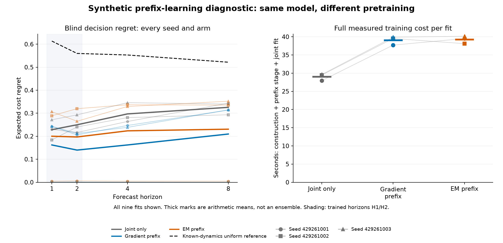

# Learning dynamics before decisions

**Gradient pretraining is the strongest lead, but none of the three methods
passes the longer-horizon criterion.** All nine fits completed and the independent
saved-output audit agrees with the results. This changes the learning recipe
for the same recurrent model; it does not establish a new architecture.

| Method | Short horizon | Blind forecasting | Observed filtering | Mean training seconds |
| --- | --- | --- | --- | ---: |
| Joint training only | FAIL 23/24 | FAIL 11/21 | PASS 8/8 | 29.001 |
| Gradient prefix pretraining | PASS 24/24 | FAIL 15/21 | PASS 8/8 | 39.037 |
| Expected-count MAP pretraining | FAIL 22/24 | FAIL 13/21 | PASS 8/8 | 39.249 |

Fractions count satisfied conditions, not successful episodes. A criterion
requires every condition to pass across all three seeds. No model advances.

## What improved

Gradient pretraining lowers mean four/eight-step blind decision regret by
**45.42% / 35.63%** relative to joint training alone. All six paired seed/horizon
comparisons improve. Full measured training time rises **34.61%**. Its H4/H8
mean regret is **0.16207 / 0.20958**, versus **0.29696 / 0.32556** for the control.
Two gradient-pretrained seeds still fail long-horizon cost criteria.

Expected-count pretraining lowers those same means **24.75% / 29.17%**, with
**35.34%** more training time. Its same-seed effects are mixed: three of six
long-horizon regret comparisons improve. It does not beat gradient pretraining
on either mean. Each prefix method has one very strong seed, but a favorable
seed or average cannot replace the all-seed criterion.

The two active stages optimize the same regularized public-history likelihood.
Gradient pretraining accepts **1,121 / 1,048 / 935** updates; expected-count
pretraining accepts **21 / 20 / 19**. Each method then gets the same 480-epoch
joint-training recipe. Every active stage attempts one additional late update,
restores the preceding accepted state and retains the discarded work. EM's
atomic overrun is **0.311 to 0.452 seconds**, versus **0.003 to 0.010 seconds**
for gradient pretraining. These implementation timings do not establish a
general advantage for either optimizer.

Both stages have ten seconds of update eligibility. This is not equal total
compute: complete pretraining, diagnostics, rollback, construction and joint
training are charged in the table. The joint-only arm has no compensating extra
training allowance. A follow-up must separate pretraining's learning benefit
from the benefit of spending more time training.

## What was checked

The unchanged model has eight latent states and **352 parameters**. Each seed
pairs the complete starting weights and privileged initial cost head. Prefix
learning changes only the dynamics; the audit verifies all 18 boundary
checkpoints and that every cost head stayed unchanged during that stage.

There are **512 fresh TRAIN attempts, 481 endpoint-eligible**, and **128 fresh
DEV attempts, 121 endpoint-eligible**. Prefix likelihood includes all attempts,
including found-terminated histories. All nine final checkpoints were durable
before DEV generation. Training sees public histories and H1/H2 targets;
evaluation includes H1/H2/H4/H8, with the original uniform-state reference and
history-shuffle control.

Numerical qualification passes **66 tests and seven exact hidden-path witness
cases**. The full integration qualification passes **156 tests and lint**.
Original supervised integration, fit/evaluation and audit phases take
**5.644, 323.829 and 2.207 seconds** respectively. The audit reconstructs the
targets, metrics and criteria from saved outputs without new model, optimizer
or environment calls. Intermediate update execution and timings remain
source-qualified producer attestations, not independently replayed training.

## Scope and next decision

This is a synthetic learning diagnostic with known task structure, a known
uniform reset prior and a privileged initial readout. It is not evidence for
biological wiring, calibration, chess, Doom, robotics, scenario transfer or
ICLR novelty. The screenshot-inspired decision interface and this recurrent
learning experiment are different components of OpenJev.

The next useful comparison is **gradient pretraining versus the same added
time spent on ordinary joint training**, with fresh cases and seeds, unchanged
H1/H2 supervision and the existing long-horizon conditions. This is a proposed
new comparison, not a rerun or relaxation of this study. The earlier failed
readout replication and its longer-horizon training follow-up remain closed.

[Frozen protocol](finite-expected-count-learning-protocol.md) ·
[Every metric, seed, pair and timing](finite-expected-count-learning-results/report.md) ·
[Machine-readable report](finite-expected-count-learning-results/summary.json) ·
[Source and closure receipt](finite-expected-count-learning-results/receipt.json) ·
[Complete evidence release](https://github.com/kw2828/OpenJev/releases/tag/finite-expected-count-learning-v1).

Registration SHA256:
`cbf99064bff1e22e7f6502ce78c796d2ac70735d7c2f08406215b1bf14b00597`.
