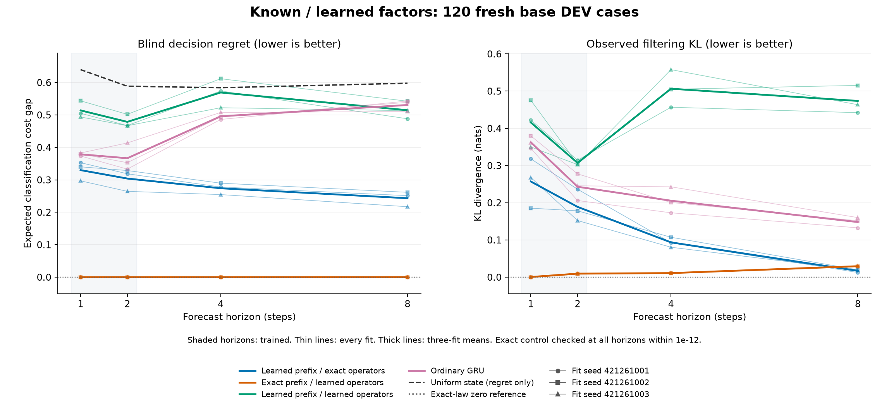

# Learning state versus learning dynamics

**Learned dynamics pass when given the correct starting state. Learning that
state from history remains a bottleneck under this recipe.** All twelve fits
completed, and the independent audit agrees with every metric and criterion.
This is a useful synthetic diagnosis, not a deployable model or an architecture
advantage.

The experiment separates two components in an eight-state world: the encoder
that reads recent actions and observations, and the operators that predict
what happens next. Each component is either learned or supplied exactly. Every
factor cell uses the same fixed, exact cost readout. The ordinary GRU remains a
descriptive control with different capacity and learned output heads.

| Starting state / subsequent dynamics | Short-horizon learning | Blind extrapolation | Observed filtering extrapolation |
| --- | --- | --- | --- |
| Learned / exact | FAIL, 8/24 | FAIL, 15/21 | FAIL, 7/8 |
| Exact / learned | **PASS, 24/24** | **PASS, 21/21** | **PASS, 8/8** |
| Learned / learned | FAIL, 6/24 | FAIL, 9/21 | FAIL, 2/8 |

These are condition counts, not accuracy scores. Every applicable threshold
must hold for all three fit seeds. Exact state is supplied only at the forecast
boundary; learned operators must then propagate and condition their own state.
No future oracle state or state-reconstruction loss is supplied. The untrained
exact/exact control reproduces all five target fields within 1e-12 on both
TRAIN and DEV.

| Model | Eight-step blind regret | Eight-step blind cost MSE | Eight-step observed KL |
| --- | ---: | ---: | ---: |
| Learned state / exact dynamics | 0.243374 | 0.078643 | 0.016981 |
| Exact state / learned dynamics | **0.000248** | **0.010059** | 0.029423 |
| Learned state / learned dynamics | 0.514710 | 0.101938 | 0.473709 |
| Ordinary GRU | 0.530811 | 0.170112 | 0.148137 |
| Uniform state / exact dynamics | 0.597892 | 0.102180 | N/A |

Lower is better. Learned entries average three separately fitted policies, not
an ensemble. The uniform reference knows the dynamics but discards history;
it is not an optimal history-ignorant predictor. No significance claim or
confidence interval accompanies these means.

The exact-state models meet all criteria after training only on one- and
two-step targets, including four- and eight-step blind forecasts. The
learned-state/exact-dynamics models also reduce long-gap regret by more than
half in every seed, but fail the required cost-error reduction. Their separate
filtering criterion fails one four-step KL condition. Later observations can
correct an initially poor state estimate; good observed filtering must not be
read as evidence of accurate blind prediction.

The evidence supports investigating the history encoder next. It does not
establish that encoding is the only difficulty, that the true latent states
were recovered, or that these results transfer to a native environment.
The joint learner also fails, and all factor cells receive a privileged cost
readout in the world's state basis.

The study retained **484/512 TRAIN** and **120/128 fresh DEV** cases; excluded
found prefixes were not replaced. Every learned fit used 480 epochs, totaling
46,080 optimizer steps and 2,787,840 case exposures. All final checkpoints
preceded DEV generation. The complete fit/evaluation phase took **167.77
seconds**, and the independent audit took **0.78 seconds**. Qualification passed
77 tests on its first attempt.

The previous study used 48 epochs and different state dimensions, readouts and
cases. This new result does not isolate the effect of more training or reverse
that study's failed criteria. Parameter counts and actual work differ across
the current models; no matched-compute speedup is claimed.

[Every seed, criterion and timing](finite-factor-learning-results/report.md) ·
[Machine-readable results](finite-factor-learning-results/summary.json) ·
[Frozen protocol](finite-factor-learning-protocol.md) ·
[All checkpoints and original evidence](https://github.com/kw2828/OpenJev/releases/tag/finite-factor-learning-v1) ·
[Next: share filtering and forecasting operators](finite-factor-learning-next.md).
