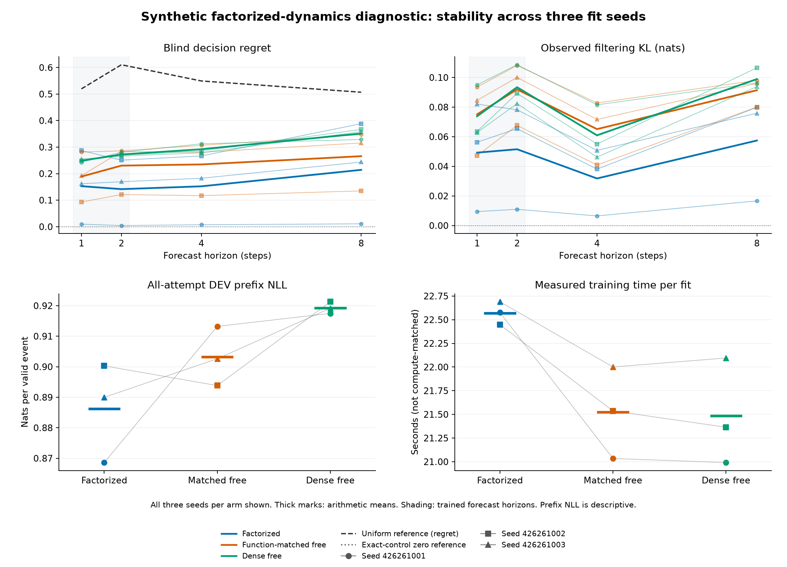

# Factorized recurrent dynamics: a synthetic stability diagnostic

All three arms learn the same bounded linear cost head and use the same forecast loss plus coefficient-one prefix NLL. The intervention changes the dynamics parameterization and its initialization. Every seed and all three absolute learning criteria remain visible; favorable averages cannot rescue a failed condition.

[Frozen protocol](../finite-factorized-dynamics-protocol.md). Original qualification, fit and audit closures, source pins and complete payload hashes were authenticated before reading these metrics.

## All three unchanged criteria

| Criterion | Factorized | Function-matched free | Dense free |
|---|---|---|---|
| SHORT_HORIZON_LEARNING | FAIL (23/24) | FAIL (19/24) | FAIL (21/24) |
| BLIND_EXTRAPOLATION | FAIL (17/21) | FAIL (12/21) | FAIL (9/21) |
| OBSERVED_FILTERING_EXTRAPOLATION | PASS (8/8) | PASS (8/8) | FAIL (7/8) |

Every applicable threshold must hold for all three fit seeds. H1/H2 learning requires blind cost MSE and regret at most half the positive uniform reference and observed KL at most 0.1 nats. Blind H4/H8 extrapolation uses the same cost thresholds and H8 survival MAE at most 0.05. Observed H4/H8 filtering requires KL at most 0.1 and consumes intervening observations. Minimum supports are 256 TRAIN and 64 DEV eligible cases. The previous replication continuation rule is not part of this new study and remains closed.

## Dynamics and controls

| Arm | Dynamics | Trainable parameters | Parameter bytes |
|---|---|---:|---:|
| factorized | Learned transition T, shared reset/event emission O and action/next-state hazard h | 352 | 2,816 |
| matched_free | Unrestricted B and reset emission, initialized to the factorized function | 1,120 | 8,960 |
| dense_free | Existing unrestricted model and its original dense initialization | 1,120 | 8,960 |

`B[a,o,n,s] = O[o,n] * (1-h[a,n]) * T[a,n,s]`; `found[a,s] = sum_n h[a,n]*T[a,n,s]`; the blind operator sums ordinary branches. The factorized reset uses O before any transition or hazard. This imposes the synthetic task's conditional structure; no true numerical transition, emission, hazard or posterior values initialize a learner.

All arms retain the world-aligned learned-head initialization and known uniform reset prior. Factorization bundles conditional structure, shared reset/emission, capacity and parameterization. Matched initial functions do not imply matched gradients. The earlier sticky-initialization study remains a separate failed experiment.

## Audited initial-function checks

| Seed | Reset maximum difference | B maximum difference | Found maximum difference | Blind maximum difference | Head maximum difference |
|---|---:|---:|---:|---:|---:|
| 426261001 | 5.55e-17 | 1.39e-17 | 1.39e-17 | 5.55e-17 | 0 |
| 426261002 | 5.55e-17 | 2.08e-17 | 1.04e-17 | 8.33e-17 | 0 |
| 426261003 | 5.55e-17 | 2.08e-17 | 1.39e-17 | 6.94e-17 | 0 |

The first four columns compare factorized and matched-free initial probabilities; the head check covers all three arms. Every difference must be at most 1e-12. Engineering tests separately qualify full prefix/rollout parity and dense-free parity with the previous model. These are function checks, not a learned state-recovery or parameter-hash-equivalence claim.

## Longer-horizon means

| Arm | H | Blind regret | Blind cost MSE | Observed cost MSE | Observed KL | Blind survival MAE |
|---|---:|---:|---:|---:|---:|---:|
| factorized | 4 | 0.15222 | 0.0435242 | 0.041191 | 0.0317946 | 0.00627655 |
| factorized | 8 | 0.214276 | 0.0476814 | 0.0465838 | 0.0574381 | 0.010668 |
| matched_free | 4 | 0.234729 | 0.0645349 | 0.0634263 | 0.0651279 | 0.00549662 |
| matched_free | 8 | 0.265822 | 0.0655272 | 0.0682234 | 0.0913863 | 0.00815268 |
| dense_free | 4 | 0.292058 | 0.0740301 | 0.0726546 | 0.0609396 | 0.00502403 |
| dense_free | 8 | 0.351249 | 0.0759807 | 0.0779019 | 0.0989231 | 0.0077048 |

Means average three separately fitted policies on common cases, not an ensemble or a confidence interval.

## Every paired contrast against both controls

Differences are factorized minus control on the same seed and cases. Negative favors factorized for that metric. These are descriptive arithmetic, not significance tests, selection rules or replacements for the absolute criteria.

| Control | Seed | H | Regret difference | Blind MSE difference | Observed MSE difference | KL difference |
|---|---:|---:|---:|---:|---:|---:|
| matched_free | 426261001 | 4 | -0.299253 | -0.0755483 | -0.0763767 | -0.0763308 |
| matched_free | 426261002 | 4 | +0.149504 | +0.0237697 | +0.0230817 | -0.00281709 |
| matched_free | 426261003 | 4 | -0.0977773 | -0.0112537 | -0.0134109 | -0.020852 |
| matched_free | 426261001 | 8 | -0.336096 | -0.071055 | -0.0797607 | -0.08145 |
| matched_free | 426261002 | 8 | +0.253317 | +0.0280703 | +0.0321793 | -0.000251859 |
| matched_free | 426261003 | 8 | -0.0718591 | -0.0105529 | -0.0173371 | -0.0201428 |
| dense_free | 426261001 | 4 | -0.304987 | -0.0736209 | -0.0735597 | -0.0750678 |
| dense_free | 426261002 | 4 | -0.0186153 | -0.00397331 | -0.0059383 | -0.016927 |
| dense_free | 426261003 | 4 | -0.0959115 | -0.0139237 | -0.0148928 | +0.00455975 |
| dense_free | 426261001 | 8 | -0.317929 | -0.0704865 | -0.0772927 | -0.0797303 |
| dense_free | 426261002 | 8 | +0.0215524 | +0.00270031 | -0.000198525 | -0.0267448 |
| dense_free | 426261003 | 8 | -0.114541 | -0.0171118 | -0.016463 | -0.0179798 |

## Retained dynamics and readout snapshots

[summary.json](summary.json) retains all 18 initial/final dynamics snapshots in `fits`, including the complete reset emission, B, found and blind arrays, their canonical little-endian float64 hashes, and each export's separate work record. It also retains all 18 cost matrices and hashes. The table shows head movement only; movement is not evidence of correct latent-state recovery. Checkpoint/snapshot correspondence remains source-attested because the numerical audit does not reconstruct models.

| Arm | Seed | Readout mean absolute change | Readout maximum absolute change |
|---|---:|---:|---:|
| factorized | 426261001 | 0.251618 | 0.967097 |
| matched_free | 426261001 | 0.118498 | 0.908444 |
| dense_free | 426261001 | 0.292807 | 0.964263 |
| matched_free | 426261002 | 0.421901 | 0.965832 |
| dense_free | 426261002 | 0.171914 | 0.965707 |
| factorized | 426261002 | 0.189524 | 0.94608 |
| dense_free | 426261003 | 0.307125 | 0.955743 |
| factorized | 426261003 | 0.21847 | 0.961563 |
| matched_free | 426261003 | 0.218548 | 0.963656 |

## Prefix likelihood and inference cost

| Arm | Seed | Attempts | Valid events | Prefix NLL | Prefix seconds | Endpoint seconds |
|---|---:|---:|---:|---:|---:|---:|
| factorized | 426261001 | 128 | 1105 | 0.868594 | 0.009408 | 0.059164 |
| factorized | 426261002 | 128 | 1105 | 0.90028 | 0.007627 | 0.039979 |
| factorized | 426261003 | 128 | 1105 | 0.889979 | 0.008362 | 0.036116 |
| matched_free | 426261001 | 128 | 1105 | 0.913216 | 0.008433 | 0.063345 |
| matched_free | 426261002 | 128 | 1105 | 0.893825 | 0.012189 | 0.043892 |
| matched_free | 426261003 | 128 | 1105 | 0.902616 | 0.004875 | 0.038324 |
| dense_free | 426261001 | 128 | 1105 | 0.917482 | 0.013586 | 0.034997 |
| dense_free | 426261002 | 128 | 1105 | 0.921287 | 0.008099 | 0.039081 |
| dense_free | 426261003 | 128 | 1105 | 0.91918 | 0.011351 | 0.063571 |

Every attempted public prefix contributes valid events, including its first found event; padding does not contribute. Only surviving prefixes receive endpoint targets. Learners receive no oracle posterior. The zero-parameter exact correctness reference alone receives the boundary posterior and true dynamics. The separate uniform-state reference knows dynamics but discards the prefix.

Prefix timings include copies, likelihood forwards, guards and scalar NLL, excluding state hashes and file writes. Endpoint timings include blind, observed and shuffled forecasts with copies and guards, excluding state hashes and scalar metrics. Neither is single-decision latency.

## Data and complete fitting costs

| Split | Attempts | Endpoint eligible | Found-terminated | Valid prefix events |
|---|---:|---:|---:|---:|
| train | 512 | 471 | 41 | 4481 |
| base | 128 | 118 | 10 | 1105 |

All nine fits use 480 epochs, batch 64, Adam 0.003, clip 5, the same H2 objective and coefficient-one prefix NLL. Attempt pools and seed-specific batch orders are shared. All final checkpoints precede DEV generation. There is no warm start, selected seed, horizon extension or loss-weight search.

| Arm | Seed | Parameters | Updates | Endpoint exposures | Prefix-event exposures | Construction seconds | Fit seconds |
|---|---:|---:|---:|---:|---:|---:|---:|
| factorized | 426261001 | 352 | 3,840 | 226,080 | 2,150,880 | 0.001114 | 22.575 |
| matched_free | 426261001 | 1120 | 3,840 | 226,080 | 2,150,880 | 0.000268 | 21.034 |
| dense_free | 426261001 | 1120 | 3,840 | 226,080 | 2,150,880 | 0.000146 | 20.991 |
| matched_free | 426261002 | 1120 | 3,840 | 226,080 | 2,150,880 | 0.000279 | 21.536 |
| dense_free | 426261002 | 1120 | 3,840 | 226,080 | 2,150,880 | 0.000178 | 21.364 |
| factorized | 426261002 | 352 | 3,840 | 226,080 | 2,150,880 | 0.000233 | 22.448 |
| dense_free | 426261003 | 1120 | 3,840 | 226,080 | 2,150,880 | 0.000141 | 22.095 |
| factorized | 426261003 | 352 | 3,840 | 226,080 | 2,150,880 | 0.000224 | 22.689 |
| matched_free | 426261003 | 1120 | 3,840 | 226,080 | 2,150,880 | 0.000241 | 22.001 |

Construction includes model initialization, matched conversion and guards. Fit time separately includes initial/final state, head and dynamics snapshots, Adam construction, training, journals, final checks and checkpoint writing. Arithmetic is float64 except public float32 tokens. All arms have no persistent buffers; parameter bytes exclude gradients, optimizer state and activations. Equal epochs and fewer parameters do not establish matched compute or measured speedup.

## Structural work and diagnostic overhead

| Arm | Route | Factorizations | Factor products | Free branch softmaxes | Prefix filter rows | Head softmaxes |
|---|---|---:|---:|---:|---:|---:|
| factorized | training_blind | 23,040 | 35,389,440 | 0 | 5,425,920 | 23,040 |
| factorized | training_observed | 23,040 | 35,389,440 | 0 | 5,425,920 | 23,040 |
| factorized | training_prefix | 11,520 | 17,694,720 | 0 | 5,656,320 | 0 |
| factorized | evaluation_blind | 12 | 18,432 | 0 | 2,832 | 48 |
| factorized | evaluation_observed | 12 | 18,432 | 0 | 2,832 | 48 |
| factorized | evaluation_shuffled | 12 | 18,432 | 0 | 2,832 | 48 |
| factorized | evaluation_prefix | 6 | 9,216 | 0 | 2,901 | 0 |
| matched_free | training_blind | 0 | 0 | 23,040 | 5,425,920 | 23,040 |
| matched_free | training_observed | 0 | 0 | 23,040 | 5,425,920 | 23,040 |
| matched_free | training_prefix | 0 | 0 | 11,520 | 5,656,320 | 0 |
| matched_free | evaluation_blind | 0 | 0 | 12 | 2,832 | 48 |
| matched_free | evaluation_observed | 0 | 0 | 12 | 2,832 | 48 |
| matched_free | evaluation_shuffled | 0 | 0 | 12 | 2,832 | 48 |
| matched_free | evaluation_prefix | 0 | 0 | 6 | 2,901 | 0 |
| dense_free | training_blind | 0 | 0 | 23,040 | 5,425,920 | 23,040 |
| dense_free | training_observed | 0 | 0 | 23,040 | 5,425,920 | 23,040 |
| dense_free | training_prefix | 0 | 0 | 11,520 | 5,656,320 | 0 |
| dense_free | evaluation_blind | 0 | 0 | 12 | 2,832 | 48 |
| dense_free | evaluation_observed | 0 | 0 | 12 | 2,832 | 48 |
| dense_free | evaluation_shuffled | 0 | 0 | 12 | 2,832 | 48 |
| dense_free | evaluation_prefix | 0 | 0 | 6 | 2,901 | 0 |

Separate diagnostic totals: 18 dynamics exports and 18 cost exports, including 18 head softmaxes. Dynamics export work is saved per fit and stage, outside the forward-route table. Matched-free construction separately records one factorization and two log transforms over 1,088 values per fit. Constructor draws, guards, backward operations, optimizer work and allocations are not exhaustive FLOP counts. All 11 constructor counters and complete diagnostic/forward work dictionaries remain in the summary.

| Original closed phase | Seconds |
|---|---:|
| qualify | 4.450 |
| fit | 199.538 |
| audit | 1.905 |
| Total of successful phases | 205.893 |

Whole-phase times include launch and cleanup and already contain nested costs. Preserve any earlier failed qualification separately. All 36 endpoint rows, nine prefix rows, full snapshots and work records are retained.

## Interpretation limits

The true dynamics belong to the factorized family, while the exact cost vertices are limiting values of the shared bounded learned head. Factorization is established modeling, not a novelty claim. Success would concern the combined structural constraint, capacity and parameterization under this budget; if both initially matched models succeed, initialization remains a plausible explanation. Four centered costs do not identify all eight latent coordinates. No convergence, calibration, native transfer, scenario-shift robustness or cross-study architecture improvement is established by these synthetic measurements. All earlier failed outcomes remain closed.
