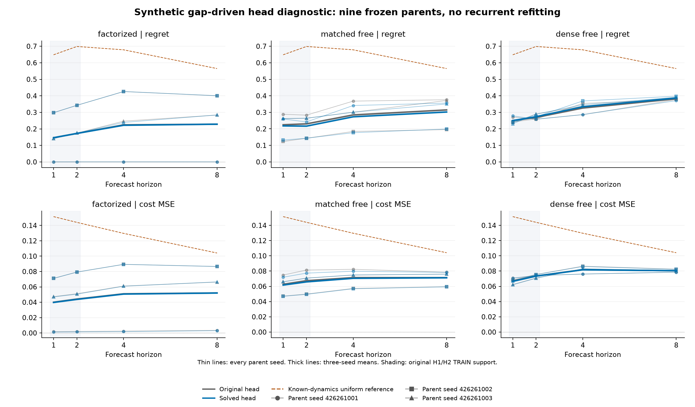

# Frozen recurrent states, certificate-driven decision readouts

Nine existing recurrent checkpoints are unchanged. This diagnostic refits only their bounded linear decision heads on original H1/H2 TRAIN states, then compares original and solved heads on one fresh development pool. It is not nine new recurrent fits.

[Frozen protocol](../finite-gap-readout-study-protocol.md). Original qualification, producer and independent audit closures, all source pins and all parent evidence were authenticated before reading these metrics.

## Unchanged absolute criteria

| Parent / head | Short horizon | Blind extrapolation | Observed filtering |
|---|---|---|---|
| factorized_original | FAIL (23/24) | FAIL (15/21) | FAIL (6/8) |
| factorized_solved | FAIL (23/24) | FAIL (15/21) | FAIL (6/8) |
| matched_free_original | FAIL (23/24) | FAIL (13/21) | PASS (8/8) |
| matched_free_solved | FAIL (23/24) | FAIL (13/21) | PASS (8/8) |
| dense_free_original | FAIL (22/24) | FAIL (11/21) | FAIL (4/8) |
| dense_free_solved | FAIL (22/24) | FAIL (10/21) | FAIL (4/8) |

All applicable conditions must pass for every seed. Favorable means do not override failures. The observed-event and survival outputs are verified unchanged by the head intervention; their criteria are retained, not attributed to a new improvement.

## All nine TRAIN numerical certificates

| Parent | Seed | Original objective | Solved objective | FW gap | Simplex violation | Curvature bound L |
|---|---:|---:|---:|---:|---:|---:|
| factorized | 426261001 | 0.00362076556 | 0.00255567343 | 0 | 0 | 0.145135 |
| factorized | 426261002 | 0.129180484 | 0.129101948 | 9.01e-09 | 0 | 0.246791 |
| factorized | 426261003 | 0.0981513107 | 0.0973315201 | 6.89e-10 | 1.11e-16 | 0.204784 |
| matched_free | 426261001 | 0.14863569 | 0.143390915 | 1.3e-10 | 0 | 0.240204 |
| matched_free | 426261002 | 0.0690768975 | 0.0678183858 | 2.53e-12 | 0 | 0.16268 |
| matched_free | 426261003 | 0.113583748 | 0.112924752 | 9.28e-09 | 1.11e-16 | 0.240539 |
| dense_free | 426261001 | 0.133483397 | 0.132953984 | 5.76e-09 | 1.11e-16 | 0.238991 |
| dense_free | 426261002 | 0.125960502 | 0.124881715 | 6.33e-09 | 1.11e-16 | 0.244529 |
| dense_free | 426261003 | 0.117624908 | 0.116867916 | 8.22e-10 | 0 | 0.24422 |

The objective is blind MSE plus observed MSE, each divided by N × 2 × 4. Absorbed zero states stay in both denominators. Each head has 32 stored probabilities, with four nonnegative values summing to one per latent column; C = 0.25 - P.

Each attempt uses fixed-step monotone-restarted FISTA with at most 20,000 iterations and L = 2 × max row absolute sum of the Gram matrix. It checks the direct-residual certificate at iteration zero, every ten iterations and the retained final point. A quadratic increase beyond 1e-15 triggers one plain projected step; another increase fails without backtracking. No export repair occurs. Success requires simplex error at most 1e-12, signed FW gap between -1e-12 and 1e-8, and objective increase at most 1e-12. The audit reconstructs initial/final loss, gradient, gap and L from saved TRAIN states; it reconciles intermediate history and work records without replaying unsaved iterates.

This is a float64 numerical certificate, not an interval proof. The closed simplex includes boundary heads that finite softmax logits only approach, so an improvement cannot isolate optimizer choice. Monotonicity restarts are counted within the single fixed-budget attempt. There are no new attempts, replacement parents or fallback successes.

## Fresh-development means

| Parent / head | H | Blind regret | Blind MSE | Observed MSE | Observed KL | Blind survival MAE |
|---|---:|---:|---:|---:|---:|---:|
| factorized_original | 4 | 0.224308 | 0.0509643 | 0.0452062 | 0.0588218 | 0.00653403 |
| factorized_original | 8 | 0.228146 | 0.0520738 | 0.0499188 | 0.0556811 | 0.0101944 |
| factorized_solved | 4 | 0.221728 | 0.0506299 | 0.0447464 | 0.0588218 | 0.00653403 |
| factorized_solved | 8 | 0.228278 | 0.0519917 | 0.0498657 | 0.0556811 | 0.0101944 |
| matched_free_original | 4 | 0.28437 | 0.0714412 | 0.0623216 | 0.0769342 | 0.0055838 |
| matched_free_original | 8 | 0.31455 | 0.071349 | 0.0713998 | 0.0773053 | 0.00775005 |
| matched_free_solved | 4 | 0.272996 | 0.0704982 | 0.0605638 | 0.0769342 | 0.0055838 |
| matched_free_solved | 8 | 0.301921 | 0.0711897 | 0.0710372 | 0.0773053 | 0.00775005 |
| dense_free_original | 4 | 0.32617 | 0.0818449 | 0.0735192 | 0.11156 | 0.00513073 |
| dense_free_original | 8 | 0.382055 | 0.0804676 | 0.0782552 | 0.104786 | 0.00690084 |
| dense_free_solved | 4 | 0.333721 | 0.0816956 | 0.0734628 | 0.11156 | 0.00513073 |
| dense_free_solved | 8 | 0.386487 | 0.0804937 | 0.0781428 | 0.104786 | 0.00690084 |

Means average three separate frozen policies; they are not ensemble predictions or confidence intervals.

## Every H4/H8 paired difference

Differences are solved minus original on the same checkpoint and cases. These are descriptive arithmetic, not new criteria or significance tests.

| Parent | Seed | H | Regret difference | Blind MSE difference | Observed MSE difference |
|---|---:|---:|---:|---:|---:|
| factorized | 426261001 | 4 | +6.01651e-05 | -0.000668624 | -0.000557302 |
| factorized | 426261001 | 8 | +6.41459e-07 | -0.000517541 | -0.000575307 |
| factorized | 426261002 | 4 | +0 | -4.48723e-05 | -0.000143953 |
| factorized | 426261002 | 8 | +0 | +9.04131e-06 | +5.39806e-05 |
| factorized | 426261003 | 4 | -0.00779926 | -0.000289441 | -0.000678254 |
| factorized | 426261003 | 8 | +0.000395695 | +0.000262287 | +0.000361869 |
| matched_free | 426261001 | 4 | -0.0265873 | -0.00261004 | -0.00506276 |
| matched_free | 426261001 | 8 | -0.0203494 | -0.000267338 | -0.00118545 |
| matched_free | 426261002 | 4 | -0.00753464 | -0.000499075 | -0.000301633 |
| matched_free | 426261002 | 8 | +0.0035454 | -4.53418e-05 | +0.000245053 |
| matched_free | 426261003 | 4 | +0 | +0.000280186 | +9.08886e-05 |
| matched_free | 426261003 | 8 | -0.0210825 | -0.000165437 | -0.000147583 |
| dense_free | 426261001 | 4 | +0 | +5.91577e-05 | +4.04953e-06 |
| dense_free | 426261001 | 8 | -0.00692871 | -0.00015152 | -0.000235366 |
| dense_free | 426261002 | 4 | +0.0150727 | -0.000565249 | -0.000405322 |
| dense_free | 426261002 | 8 | +0.0197984 | -0.000257968 | -0.00048129 |
| dense_free | 426261003 | 4 | +0.00758162 | +5.82178e-05 | +0.000231886 |
| dense_free | 426261003 | 8 | +0.000426437 | +0.000487963 | +0.000379565 |

## Data and work

| Split | Attempted prefixes | Endpoint eligible | Found-terminated prefixes | Valid prefix events |
|---|---:|---:|---:|---:|
| train | 512 | 471 | 41 | 4481 |
| base | 128 | 114 | 14 | 1110 |

TRAIN is the original namespace 426260924. DEV is fresh namespace 428260924, generated only after all nine completed solves and their durable barrier. This is further development after earlier results, not untouched final confirmation. Only surviving prefixes receive endpoint targets; first-found observations in future routes are absorbing. All parent checkpoints are retained.

| Parent | Seed | Load seconds | TRAIN extraction seconds | Build / solve / certificate seconds | Original DEV seconds | Solved DEV seconds | Gram value calls | Iterations |
|---|---:|---:|---:|---:|---:|---:|---:|---:|
| factorized | 426261001 | 0.014202 | 0.034800 | 0.004581 | 0.016543 | 0.018772 | 11 | 10 |
| matched_free | 426261001 | 0.001010 | 0.021165 | 0.028172 | 0.012753 | 0.012415 | 92 | 90 |
| dense_free | 426261001 | 0.000564 | 0.024787 | 0.014846 | 0.011979 | 0.013226 | 33 | 30 |
| matched_free | 426261002 | 0.001087 | 0.025935 | 0.008988 | 0.012470 | 0.012223 | 22 | 20 |
| dense_free | 426261002 | 0.000587 | 0.028178 | 0.021130 | 0.029601 | 0.018474 | 43 | 40 |
| factorized | 426261002 | 0.000590 | 0.025243 | 0.028330 | 0.014651 | 0.012421 | 53 | 50 |
| dense_free | 426261003 | 0.000805 | 0.026393 | 0.023219 | 0.016295 | 0.016302 | 43 | 40 |
| factorized | 426261003 | 0.000596 | 0.025525 | 0.017476 | 0.014097 | 0.012457 | 33 | 30 |
| matched_free | 426261003 | 0.000669 | 0.022471 | 0.130601 | 0.013736 | 0.013541 | 251 | 250 |

## Counted solver work

| Parent | Seed | Accepted iterations | Monotonicity restarts | Gram gradients | Quadratic values | Update projections | Direct residual passes |
|---|---:|---:|---:|---:|---:|---:|---:|
| factorized | 426261001 | 10 | 0 | 10 | 11 | 10 | 2 |
| matched_free | 426261001 | 90 | 1 | 91 | 92 | 91 | 10 |
| dense_free | 426261001 | 30 | 2 | 32 | 33 | 32 | 4 |
| matched_free | 426261002 | 20 | 1 | 21 | 22 | 21 | 3 |
| dense_free | 426261002 | 40 | 2 | 42 | 43 | 42 | 5 |
| factorized | 426261002 | 50 | 2 | 52 | 53 | 52 | 6 |
| dense_free | 426261003 | 40 | 2 | 42 | 43 | 42 | 5 |
| factorized | 426261003 | 30 | 2 | 32 | 33 | 32 | 4 |
| matched_free | 426261003 | 250 | 0 | 250 | 251 | 250 | 26 |

Gram value/gradient calls use cached sufficient statistics; direct certificate passes read the complete residual problem. These operation counts are not interchangeable costs. Discarded accelerated candidates and their replacement plain steps remain counted. No projection is applied after stopping.

## Separate synthetic engineering prerequisite

Before the new empirical study, the fixed 18-fixture suite qualified the gap-driven method on **18/18** cases and the unchanged SLSQP comparator on **10/18**. Each method had **two fixtures already meeting the certificate at initialization**, including small-scale or unsupported objectives. This is bounded numerical engineering evidence, not empirical decision effectiveness or an architecture comparison. All 36 outputs, including comparator failures, are retained.

| Method | First call seconds | Later 17 calls seconds | All 18 call seconds | Independent scalar-check seconds | Initially qualifying cases |
|---|---:|---:|---:|---:|---:|
| slsqp | 0.172930 | 0.053749 | 0.226679 | 0.009622 | 2 |
| gap_projected | 0.000892 | 1.542814 | 1.543706 | 0.009186 | 2 |

First SLSQP solve includes lazy SciPy import; there is no separately measured import-only timer. First calls and remaining calls are reported separately, without claiming matched steady-state speed. Gram construction and independent scalar checks are separate.

The separate prerequisite supervisor ran for 3.042 seconds. Its 18 Gram builds took 0.000959 seconds and fixture generation took 0.001796 seconds. These are nested costs, not additions to that duration. The scientific predecessor remains STOPPED_BEFORE_DEV and is preserved as failed historical evidence; this successor has a different registration and DEV namespace.

## Current-study timing scope

Load time includes checkpoint decoding, model construction, strict state loading, original head export and guards. Extraction includes both TRAIN forwards and original-head validation. Solve time includes problem construction and the numerical certificate. Both evaluation views rerun frozen forwards and pay original-head computation plus explicit matrix maps; solved outputs are posthoc maps, not new checkpoint weights. Evaluation timers include all three routes and array exports, excluding writes, scalar metrics and state hashes. These are not single-decision latency or a matched speedup claim.

| Original current-study phase | Seconds |
|---|---:|
| qualify | 2.318 |
| fit | 2.270 |
| audit | 1.860 |
| Total successful phases | 6.449 |

Whole-phase durations include launch and cleanup and contain the nested timers above. Earlier recurrent training is excluded.

The preserved first integration failed with 74 tests passing and 1 failing, before scientific execution. Its original supervisor duration was 2.405 seconds, excluded from the successful-phase total. The corrected worker and separately registered second qualification do not replace that failure or its original source snapshot.

[summary.json](summary.json) retains all 72 metric rows, all gate conditions and failures, 36 paired comparisons, nine complete solves with original and retained final matrices, their full certificate histories, 18 evaluation records, frozen-output checks and all 24 structural-work routes. Structural counters are attested operation counts, not complete FLOPs; gradient, allocation and platform costs are not inferred from them.

## Interpretation limits

A numerically certified TRAIN solution only bounds this fixed-state linear-head objective. Fresh decision improvement would support a readout-fitting bottleneck under this constrained family. Failure would not prove that latent information is absent or that nonlinear readouts cannot help. The state extraction is source-qualified rather than independently rerun by the numerical audit. Event and survival equality does not identify hidden states. There is no new architecture, novelty, calibration, robotics, native-environment transfer or scenario-shift claim. All earlier verdicts remain closed.
