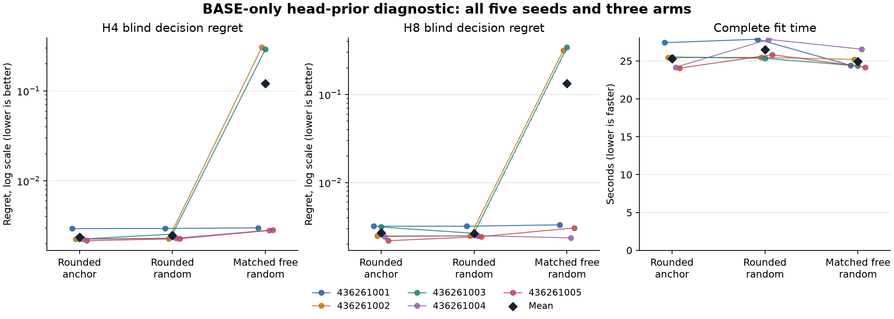

# Does performance depend on the starting cost head?

**HEAD_INDEPENDENT_ADVANCE_FAIL**. 14/15 prospectively fixed primary conditions pass.

Fifteen fresh fits compare rounded transport with its original task-derived head, rounded transport with a task-independent random head, and initially function-matched free transport with the same random head. The random-head rounded arm is the candidate; random-head matched free is its sole primary control. The original-head rounded anchor is descriptive and cannot rescue a failed candidate.

Both random arms use the same local standard-normal 4-by-8 logits from PCG64 with SeedSequence([fit_seed, 436, 1]). Draws are not centered, rescaled, selected or tuned. The inherited constructor computes its original head first, then discards it in the random arms. All arms retain 352 float64 parameters, the same losses, 1,024 prefix updates and 3,072 joint updates. Generic random logits change scale and shape as well as removing the cost-template prior; the comparison does not isolate latent-label alignment alone.

| Model | Short horizon | Blind extrapolation | Observed filtering |
|---|---:|---:|---:|
| Rounded anchor | PASS 36/36 | PASS 31/31 | PASS 12/12 |
| Rounded random | PASS 36/36 | PASS 31/31 | PASS 12/12 |
| Matched free random | PASS 36/36 | FAIL 23/31 | PASS 12/12 |

The candidate must pass all three absolute criteria, all ten nonpositive paired H4/H8 regret differences and both 10% mean-regret improvements against its primary control. Every seed remains binding. An anchor result or favorable average cannot rescue a failed condition.

| Primary control | H | Candidate mean regret | Control mean regret | Relative reduction |
|---|---:|---:|---:|---:|
| matched_free_random | 4 | 0.0024773643 | 0.12126011 | 97.96% |
| matched_free_random | 8 | 0.002655882 | 0.13366608 | 98.01% |

Relative reductions are ratios of the five fit means; positive values favor rounded random. All seed values remain visible because weak controls can dominate averages. Five seeds share one TRAIN cohort and are not five independent population studies. No confidence interval or significance claim is made. The figure labels log axes when all regrets are positive and uses a linear axis when any is zero.

| Control | Candidate mean fit seconds | Control mean fit seconds | Candidate / control time |
|---|---:|---:|---:|
| matched_free_random | 26.480950 | 24.947186 | 1.061480 |

| Model | Seed | Prefix updates | Joint updates | Prefix stage seconds | Joint stage seconds | Complete fit seconds | Controller seconds |
|---|---:|---:|---:|---:|---:|---:|---:|
| rounded_anchor | 436261001 | 1024 | 3072 | 6.653939 | 20.021909 | 27.416313 | 27.232713 |
| rounded_anchor | 436261002 | 1024 | 3072 | 6.362737 | 18.908949 | 25.450936 | 25.280278 |
| rounded_anchor | 436261003 | 1024 | 3072 | 6.375326 | 18.955685 | 25.524115 | 25.339681 |
| rounded_anchor | 436261004 | 1024 | 3072 | 5.904999 | 18.090407 | 24.184280 | 24.007583 |
| rounded_anchor | 436261005 | 1024 | 3072 | 6.049934 | 17.827080 | 24.054374 | 23.885827 |
| rounded_random | 436261001 | 1024 | 3072 | 6.815812 | 20.872444 | 27.875123 | 27.697838 |
| rounded_random | 436261002 | 1024 | 3072 | 6.032589 | 19.271234 | 25.485803 | 25.312802 |
| rounded_random | 436261003 | 1024 | 3072 | 6.630494 | 18.544348 | 25.358782 | 25.185230 |
| rounded_random | 436261004 | 1024 | 3072 | 6.048589 | 21.595249 | 27.852556 | 27.653068 |
| rounded_random | 436261005 | 1024 | 3072 | 6.477797 | 19.172234 | 25.832484 | 25.659296 |
| matched_free_random | 436261001 | 1024 | 3072 | 6.384008 | 17.871668 | 24.432470 | 24.265161 |
| matched_free_random | 436261002 | 1024 | 3072 | 6.512483 | 18.515625 | 25.208327 | 25.038016 |
| matched_free_random | 436261003 | 1024 | 3072 | 5.838424 | 18.315071 | 24.350323 | 24.163926 |
| matched_free_random | 436261004 | 1024 | 3072 | 6.620800 | 19.750671 | 26.562040 | 26.387976 |
| matched_free_random | 436261005 | 1024 | 3072 | 6.058771 | 17.945503 | 24.182772 | 24.013957 |

Original native phases: qualification 11.146781s, fit/evaluation 390.875411s, audit 8.537092s. Selected qualification: 375 passing tests and 1 warning(s), plus the retained independently audited exposure probe.

The original v1 engineering qualification remains FAILED: 372 tests passed, three failed and one warning was recorded; its native phase lasted 7.017424292s. All three failures were the same public-keyword rejection test expecting ValueError instead of the actual TypeError. Exposure and scientific fitting never started in v1. A separate v2 registration corrected that assertion and its admission plumbing while preserving all original 131 sources and failure evidence. The model, trainer, runner, audit, science configuration and numerical criteria remain byte-identical; the failed qualification is not relabeled as a pass.

Complete fit time includes construction, random initialization, validation, updates, boundary checkpoints and durable allocation logs. Stage and controller times are nested and must not be added again to full fit or native-phase time. All six restricted head/dynamics hashes per fit are charged inside checkpoints. Timing is descriptive. Equal parameters and updates do not imply equal compute or optimization geometry.

TRAIN retains 484/512 attempted prefixes and BASE retains 486/512. All attempts, including found events, contribute to prefix likelihood; endpoint metrics use surviving prefixes without replacements. TRAIN labels cover H1/H2; H4/H8 are extrapolation. All fifteen final checkpoints precede BASE generation. The explicit epsilon-0.12 reference validates targets but never supplies oracle states to learned models.

Pre-DEV integrity, independently checked again from saved boundary bytes:

| Seed | Rounded initial/prefix dynamics identical | Prefix Adam identical | All three heads unchanged in prefix stage |
|---|---|---|---|
| 436261001 | True | True | True |
| 436261002 | True | True | True |
| 436261003 | True | True | True |
| 436261004 | True | True | True |
| 436261005 | True | True | True |

| Model | Seed | Actual transport | Effective head policy | Extra random entries | Extra copied bytes |
|---|---:|---|---|---:|---:|
| rounded_anchor | 436261001 | rounded | inherited_cost_template | 0 | 0 |
| rounded_random | 436261001 | rounded | task_independent_standard_normal | 32 | 256 |
| matched_free_random | 436261001 | matched_free | task_independent_standard_normal | 32 | 256 |
| rounded_random | 436261002 | rounded | task_independent_standard_normal | 32 | 256 |
| matched_free_random | 436261002 | matched_free | task_independent_standard_normal | 32 | 256 |
| rounded_anchor | 436261002 | rounded | inherited_cost_template | 0 | 0 |
| matched_free_random | 436261003 | matched_free | task_independent_standard_normal | 32 | 256 |
| rounded_anchor | 436261003 | rounded | inherited_cost_template | 0 | 0 |
| rounded_random | 436261003 | rounded | task_independent_standard_normal | 32 | 256 |
| rounded_anchor | 436261004 | rounded | inherited_cost_template | 0 | 0 |
| rounded_random | 436261004 | rounded | task_independent_standard_normal | 32 | 256 |
| matched_free_random | 436261004 | matched_free | task_independent_standard_normal | 32 | 256 |
| rounded_random | 436261005 | rounded | task_independent_standard_normal | 32 | 256 |
| matched_free_random | 436261005 | matched_free | task_independent_standard_normal | 32 | 256 |
| rounded_anchor | 436261005 | rounded | inherited_cost_template | 0 | 0 |

The independent audit decodes 69 saved NPZ files, including all 45 model boundaries, plus 45 Adam JSONs. It reconstructs the declared random initializer once per seed, five times, separately from its zero model, optimizer and world-generator calls. It rebuilds targets, metrics, schedules and shared forward work without replaying learning. Publication uses audited JSON and opaque evidence bytes only. These zero-call statements do not describe the fitting phase.

This BASE-only diagnostic does not reopen the prior replication, which failed its combined rule with 45/54 conditions passing, or repair its observation-noise-transfer failure. The uniform reset and known doubly stochastic world structure remain favorable priors. Supervised cost targets and the head family still provide task information. A local pass is not architectural novelty, latent identification, calibrated text decisions, biological benefit, native transfer or ICLR readiness. Follow-up work requires a separate frozen protocol; no further study is executed or admitted here.

All primary conditions:

| Condition | Result |
|---|---|
| BLIND_EXTRAPOLATION | PASS |
| OBSERVED_FILTERING_EXTRAPOLATION | PASS |
| SHORT_HORIZON_LEARNING | PASS |
| matched_free_random_436261001_h4_nonpositive_regret_difference | PASS |
| matched_free_random_436261001_h8_nonpositive_regret_difference | PASS |
| matched_free_random_436261002_h4_nonpositive_regret_difference | PASS |
| matched_free_random_436261002_h8_nonpositive_regret_difference | PASS |
| matched_free_random_436261003_h4_nonpositive_regret_difference | PASS |
| matched_free_random_436261003_h8_nonpositive_regret_difference | PASS |
| matched_free_random_436261004_h4_nonpositive_regret_difference | PASS |
| matched_free_random_436261004_h8_nonpositive_regret_difference | FAIL |
| matched_free_random_436261005_h4_nonpositive_regret_difference | PASS |
| matched_free_random_436261005_h8_nonpositive_regret_difference | PASS |
| matched_free_random_h4_ten_percent_mean_regret | PASS |
| matched_free_random_h8_ten_percent_mean_regret | PASS |

Every failed absolute condition:

- matched_free_random / BLIND_EXTRAPOLATION: 436261002_h4_half_mse
- matched_free_random / BLIND_EXTRAPOLATION: 436261002_h4_half_regret
- matched_free_random / BLIND_EXTRAPOLATION: 436261002_h8_half_mse
- matched_free_random / BLIND_EXTRAPOLATION: 436261002_h8_half_regret
- matched_free_random / BLIND_EXTRAPOLATION: 436261003_h4_half_mse
- matched_free_random / BLIND_EXTRAPOLATION: 436261003_h4_half_regret
- matched_free_random / BLIND_EXTRAPOLATION: 436261003_h8_half_mse
- matched_free_random / BLIND_EXTRAPOLATION: 436261003_h8_half_regret

Every primary paired contrast:

| Seed | H | Rounded random regret | Matched free random regret | Candidate minus control |
|---|---:|---:|---:|---:|
| 436261001 | 4 | 0.0029581702 | 0.0030063158 | -4.8145644e-05 |
| 436261002 | 4 | 0.002289307 | 0.30499145 | -0.30270215 |
| 436261003 | 4 | 0.0025552208 | 0.29264321 | -0.29008799 |
| 436261004 | 4 | 0.0023096457 | 0.0028228244 | -0.00051317868 |
| 436261005 | 4 | 0.0022744779 | 0.0028367629 | -0.00056228501 |
| 436261001 | 8 | 0.0031989619 | 0.0033171496 | -0.00011818775 |
| 436261002 | 8 | 0.0024818076 | 0.31706473 | -0.31458292 |
| 436261003 | 8 | 0.0026607497 | 0.34252383 | -0.33986308 |
| 436261004 | 8 | 0.002497206 | 0.0023601469 | 0.00013705913 |
| 436261005 | 8 | 0.0024406847 | 0.0030645246 | -0.00062383989 |

Every anchor contrast, descriptive only:

| Seed | H | Random regret | Anchor regret | Regret difference | Blind MSE difference | Observed MSE difference | KL difference |
|---|---:|---:|---:|---:|---:|---:|---:|
| 436261001 | 1 | 0.002838607 | 0.0019543033 | 0.00088430366 | -9.5994363e-05 | -9.5994363e-05 | -0.00030529101 |
| 436261001 | 2 | 0.0032888348 | 0.0032680626 | 2.0772204e-05 | -7.6261591e-05 | -4.1438657e-05 | -9.4745242e-05 |
| 436261001 | 4 | 0.0029581702 | 0.0029491835 | 8.9866937e-06 | -7.2013122e-05 | 5.2792542e-05 | 0.00015881581 |
| 436261001 | 8 | 0.0031989619 | 0.003201636 | -2.6740882e-06 | -8.3253212e-05 | -1.7761113e-05 | -3.4608774e-05 |
| 436261002 | 1 | 0.0019869855 | 0.0019675473 | 1.9438172e-05 | -7.4315976e-06 | -7.4315976e-06 | 0.00018691694 |
| 436261002 | 2 | 0.0024317365 | 0.0024313663 | 3.7017491e-07 | 3.3936161e-05 | 0.000108082 | 0.00052952134 |
| 436261002 | 4 | 0.002289307 | 0.002258018 | 3.1288978e-05 | -3.7607192e-06 | -4.0546141e-05 | 4.9641277e-05 |
| 436261002 | 8 | 0.0024818076 | 0.0024861241 | -4.3165145e-06 | -4.207117e-06 | -5.9633844e-05 | 0.00028199289 |
| 436261003 | 1 | 0.0027915448 | 0.0028242168 | -3.2671931e-05 | -9.3970344e-05 | -9.3970344e-05 | 6.6319404e-05 |
| 436261003 | 2 | 0.0027033601 | 0.0027037302 | -3.7017491e-07 | -9.9882024e-05 | -0.00026797606 | -0.00028434601 |
| 436261003 | 4 | 0.0025552208 | 0.0022495697 | 0.00030565105 | -7.7268951e-05 | -0.00021335175 | -0.00030979158 |
| 436261003 | 8 | 0.0026607497 | 0.0031329332 | -0.00047218355 | -4.0224965e-05 | 2.7605126e-05 | 0.00011117914 |
| 436261004 | 1 | 0.0019721185 | 0.0019137527 | 5.8365847e-05 | 9.3731972e-06 | 9.3731972e-06 | 0.0003872998 |
| 436261004 | 2 | 0.0024362538 | 0.0023979827 | 3.827107e-05 | 4.0115303e-05 | 6.3684496e-05 | 0.00040194095 |
| 436261004 | 4 | 0.0023096457 | 0.0022578493 | 5.1796363e-05 | 2.0481368e-05 | 4.1699273e-05 | 0.0006330942 |
| 436261004 | 8 | 0.002497206 | 0.0024447075 | 5.2498566e-05 | 1.9194845e-05 | -5.4235522e-05 | 0.00040754971 |
| 436261005 | 1 | 0.0019256187 | 0.0019600442 | -3.4425481e-05 | -0.00014693055 | -0.00014693055 | -0.00018491242 |
| 436261005 | 2 | 0.0023958179 | 0.0023958179 | 0 | -0.00014449923 | -0.00011856348 | 6.9580546e-05 |
| 436261005 | 4 | 0.0022744779 | 0.002162095 | 0.00011238288 | -0.00011970213 | -0.00024674053 | -0.00019596782 |
| 436261005 | 8 | 0.0024406847 | 0.0021914135 | 0.00024927122 | -9.3957679e-05 | -0.00014953423 | -0.00015075829 |

All endpoint results:

| Model | Seed | H | Blind regret | Blind cost MSE | Observed cost MSE | Observed KL | Blind survival MAE | Observed survival MAE | Shuffled regret |
|---|---:|---:|---:|---:|---:|---:|---:|---:|---:|
| rounded_anchor | 436261001 | 1 | 0.0019543033 | 0.0012769171 | 0.0012769171 | 0.0048115151 | 0.0029240826 | 0.0029240826 | 0.58687676 |
| rounded_anchor | 436261001 | 2 | 0.0032680626 | 0.001168227 | 0.001790175 | 0.0066242727 | 0.0045731603 | 0.0030967663 | 0.58837778 |
| rounded_anchor | 436261001 | 4 | 0.0029491835 | 0.0010153069 | 0.001805215 | 0.006677556 | 0.0073840595 | 0.0030136629 | 0.58655596 |
| rounded_anchor | 436261001 | 8 | 0.003201636 | 0.00086999196 | 0.0013259538 | 0.0047365967 | 0.010404246 | 0.0028161947 | 0.52905406 |
| rounded_anchor | 436261002 | 1 | 0.0019675473 | 0.0010169696 | 0.0010169696 | 0.0037794201 | 0.0028611105 | 0.0028611105 | 0.58879053 |
| rounded_anchor | 436261002 | 2 | 0.0024313663 | 0.0009179334 | 0.0014454124 | 0.0054196959 | 0.0044879662 | 0.0030165718 | 0.58826383 |
| rounded_anchor | 436261002 | 4 | 0.002258018 | 0.00081802672 | 0.0017039755 | 0.0061269333 | 0.0072546664 | 0.0029576775 | 0.58648025 |
| rounded_anchor | 436261002 | 8 | 0.0024861241 | 0.00066866135 | 0.0012946289 | 0.004296184 | 0.010280492 | 0.0027539725 | 0.53201195 |
| rounded_anchor | 436261003 | 1 | 0.0028242168 | 0.0013310953 | 0.0013310953 | 0.003996189 | 0.0028628031 | 0.0028628031 | 0.58851149 |
| rounded_anchor | 436261003 | 2 | 0.0027037302 | 0.0012436653 | 0.0017908372 | 0.0058657573 | 0.0044952935 | 0.0030011342 | 0.58990099 |
| rounded_anchor | 436261003 | 4 | 0.0022495697 | 0.0010667233 | 0.0020316099 | 0.0070759321 | 0.0072731813 | 0.0029523595 | 0.58655802 |
| rounded_anchor | 436261003 | 8 | 0.0031329332 | 0.00089870443 | 0.0014975906 | 0.00418428 | 0.010308543 | 0.0027490691 | 0.5288443 |
| rounded_anchor | 436261004 | 1 | 0.0019137527 | 0.0010308523 | 0.0010308523 | 0.0041287215 | 0.0028814574 | 0.0028814574 | 0.58689401 |
| rounded_anchor | 436261004 | 2 | 0.0023979827 | 0.00094269668 | 0.0015194907 | 0.0059606781 | 0.0045077204 | 0.0030356078 | 0.59022952 |
| rounded_anchor | 436261004 | 4 | 0.0022578493 | 0.0008532642 | 0.0016974284 | 0.0064099431 | 0.0072744162 | 0.0029638163 | 0.58493055 |
| rounded_anchor | 436261004 | 8 | 0.0024447075 | 0.00069651982 | 0.0013191025 | 0.0042342031 | 0.01031923 | 0.0027671544 | 0.5319894 |
| rounded_anchor | 436261005 | 1 | 0.0019600442 | 0.0013287503 | 0.0013287503 | 0.0043825851 | 0.0028626181 | 0.0028626181 | 0.58887625 |
| rounded_anchor | 436261005 | 2 | 0.0023958179 | 0.0012615774 | 0.0018476542 | 0.006176084 | 0.0044870203 | 0.0030257327 | 0.58641367 |
| rounded_anchor | 436261005 | 4 | 0.002162095 | 0.0010856403 | 0.002201142 | 0.0068141007 | 0.00726905 | 0.0029626878 | 0.58470863 |
| rounded_anchor | 436261005 | 8 | 0.0021914135 | 0.00087421095 | 0.0016529159 | 0.0047853207 | 0.010308628 | 0.002754902 | 0.52882371 |
| rounded_random | 436261001 | 1 | 0.002838607 | 0.0011809228 | 0.0011809228 | 0.0045062241 | 0.0028891796 | 0.0028891796 | 0.58294726 |
| rounded_random | 436261001 | 2 | 0.0032888348 | 0.0010919654 | 0.0017487363 | 0.0065295274 | 0.0045254676 | 0.0030585364 | 0.58837797 |
| rounded_random | 436261001 | 4 | 0.0029581702 | 0.00094329375 | 0.0018580075 | 0.0068363718 | 0.007313146 | 0.0029821398 | 0.58655273 |
| rounded_random | 436261001 | 8 | 0.0031989619 | 0.00078673875 | 0.0013081927 | 0.004701988 | 0.010335974 | 0.0027803422 | 0.52719655 |
| rounded_random | 436261002 | 1 | 0.0019869855 | 0.001009538 | 0.001009538 | 0.003966337 | 0.0028637004 | 0.0028637004 | 0.58689427 |
| rounded_random | 436261002 | 2 | 0.0024317365 | 0.00095186956 | 0.0015534944 | 0.0059492173 | 0.0044863635 | 0.0030185293 | 0.59223269 |
| rounded_random | 436261002 | 4 | 0.002289307 | 0.000814266 | 0.0016634294 | 0.0061765746 | 0.0072452065 | 0.0029634587 | 0.58655071 |
| rounded_random | 436261002 | 8 | 0.0024818076 | 0.00066445423 | 0.0012349951 | 0.0045781769 | 0.010257865 | 0.0027567112 | 0.53047773 |
| rounded_random | 436261003 | 1 | 0.0027915448 | 0.0012371249 | 0.0012371249 | 0.0040625084 | 0.002892291 | 0.002892291 | 0.59037303 |
| rounded_random | 436261003 | 2 | 0.0027033601 | 0.0011437832 | 0.0015228612 | 0.0055814113 | 0.0045288548 | 0.0030343703 | 0.58982596 |
| rounded_random | 436261003 | 4 | 0.0025552208 | 0.00098945434 | 0.0018182582 | 0.0067661405 | 0.0073244328 | 0.0029885915 | 0.588317 |
| rounded_random | 436261003 | 8 | 0.0026607497 | 0.00085847946 | 0.0015251958 | 0.0042954591 | 0.010352996 | 0.0027886397 | 0.52902036 |
| rounded_random | 436261004 | 1 | 0.0019721185 | 0.0010402255 | 0.0010402255 | 0.0045160213 | 0.0028876621 | 0.0028876621 | 0.58887871 |
| rounded_random | 436261004 | 2 | 0.0024362538 | 0.00098281199 | 0.0015831752 | 0.006362619 | 0.0045073825 | 0.0030377073 | 0.59030113 |
| rounded_random | 436261004 | 4 | 0.0023096457 | 0.00087374557 | 0.0017391277 | 0.0070430373 | 0.007263971 | 0.0029719336 | 0.58289328 |
| rounded_random | 436261004 | 8 | 0.002497206 | 0.00071571466 | 0.001264867 | 0.0046417528 | 0.010311898 | 0.0027716636 | 0.52720407 |
| rounded_random | 436261005 | 1 | 0.0019256187 | 0.0011818198 | 0.0011818198 | 0.0041976727 | 0.0028591617 | 0.0028591617 | 0.58888128 |
| rounded_random | 436261005 | 2 | 0.0023958179 | 0.0011170782 | 0.0017290908 | 0.0062456645 | 0.0044819628 | 0.0030225569 | 0.59407285 |
| rounded_random | 436261005 | 4 | 0.0022744779 | 0.00096593816 | 0.0019544015 | 0.0066181328 | 0.0072519089 | 0.0029572761 | 0.58647702 |
| rounded_random | 436261005 | 8 | 0.0024406847 | 0.00078025327 | 0.0015033816 | 0.0046345624 | 0.010278636 | 0.0027515547 | 0.52883218 |
| matched_free_random | 436261001 | 1 | 0.0031275082 | 0.0014164034 | 0.0014164034 | 0.006022448 | 0.0028655207 | 0.0028655207 | 0.59191959 |
| matched_free_random | 436261001 | 2 | 0.0035880389 | 0.0013865206 | 0.0020320294 | 0.007722897 | 0.0044635116 | 0.0029928047 | 0.58964832 |
| matched_free_random | 436261001 | 4 | 0.0030063158 | 0.0011971298 | 0.0021652612 | 0.00842108 | 0.0071689516 | 0.0029389262 | 0.58751424 |
| matched_free_random | 436261001 | 8 | 0.0033171496 | 0.0011422714 | 0.0020837851 | 0.00791911 | 0.010191068 | 0.0027258377 | 0.52924871 |
| matched_free_random | 436261002 | 1 | 0.27963172 | 0.064116881 | 0.064116881 | 0.052639901 | 0.0030101714 | 0.0030101714 | 0.58789066 |
| matched_free_random | 436261002 | 2 | 0.28003723 | 0.067178656 | 0.063276229 | 0.063087707 | 0.0045223092 | 0.0030351629 | 0.60552028 |
| matched_free_random | 436261002 | 4 | 0.30499145 | 0.069845909 | 0.064521772 | 0.070674338 | 0.0068212308 | 0.0030660729 | 0.58501846 |
| matched_free_random | 436261002 | 8 | 0.31706473 | 0.069686866 | 0.062107526 | 0.060576806 | 0.008931787 | 0.0030162328 | 0.52583711 |
| matched_free_random | 436261003 | 1 | 0.21377857 | 0.055880593 | 0.055880593 | 0.050113435 | 0.0030906576 | 0.0030906576 | 0.57588169 |
| matched_free_random | 436261003 | 2 | 0.24402629 | 0.062617024 | 0.059245115 | 0.061817555 | 0.0048361226 | 0.0032043528 | 0.60326911 |
| matched_free_random | 436261003 | 4 | 0.29264321 | 0.070605061 | 0.061060541 | 0.063860946 | 0.0075562326 | 0.0030958079 | 0.58325475 |
| matched_free_random | 436261003 | 8 | 0.34252383 | 0.071398382 | 0.062249435 | 0.056158635 | 0.010332466 | 0.0030060969 | 0.53073825 |
| matched_free_random | 436261004 | 1 | 0.0020473356 | 0.0011756145 | 0.0011756145 | 0.0056339369 | 0.0028902763 | 0.0028902763 | 0.58858466 |
| matched_free_random | 436261004 | 2 | 0.0032966397 | 0.0011929176 | 0.0018153548 | 0.0071535504 | 0.0045030431 | 0.0030243542 | 0.59002285 |
| matched_free_random | 436261004 | 4 | 0.0028228244 | 0.0010752632 | 0.0019673818 | 0.0086746529 | 0.0072633012 | 0.0029734102 | 0.58472434 |
| matched_free_random | 436261004 | 8 | 0.0023601469 | 0.00095227499 | 0.0017983398 | 0.0073362219 | 0.010274075 | 0.0027785721 | 0.53113284 |
| matched_free_random | 436261005 | 1 | 0.0028413006 | 0.0014531143 | 0.0014531143 | 0.006113568 | 0.0028726484 | 0.0028726484 | 0.59056025 |
| matched_free_random | 436261005 | 2 | 0.0032561504 | 0.0014394524 | 0.0021164787 | 0.0075792315 | 0.0044854278 | 0.0030102268 | 0.59363819 |
| matched_free_random | 436261005 | 4 | 0.0028367629 | 0.0012283921 | 0.0023025506 | 0.0090241678 | 0.007244908 | 0.0029626536 | 0.58473398 |
| matched_free_random | 436261005 | 8 | 0.0030645246 | 0.001063181 | 0.0020569259 | 0.0078949527 | 0.010320952 | 0.0027457713 | 0.52946092 |

All-attempt prefix diagnostics:

| Model | Seed | Attempts | Events | Mean event NLL |
|---|---:|---:|---:|---:|
| rounded_anchor | 436261001 | 512 | 4529 | 0.78551906 |
| rounded_anchor | 436261002 | 512 | 4529 | 0.78552755 |
| rounded_anchor | 436261003 | 512 | 4529 | 0.78541326 |
| rounded_anchor | 436261004 | 512 | 4529 | 0.78549402 |
| rounded_anchor | 436261005 | 512 | 4529 | 0.78552203 |
| rounded_random | 436261001 | 512 | 4529 | 0.78547702 |
| rounded_random | 436261002 | 512 | 4529 | 0.7855162 |
| rounded_random | 436261003 | 512 | 4529 | 0.78549308 |
| rounded_random | 436261004 | 512 | 4529 | 0.78555702 |
| rounded_random | 436261005 | 512 | 4529 | 0.78552856 |
| matched_free_random | 436261001 | 512 | 4529 | 0.78634194 |
| matched_free_random | 436261002 | 512 | 4529 | 0.81644977 |
| matched_free_random | 436261003 | 512 | 4529 | 0.81342959 |
| matched_free_random | 436261004 | 512 | 4529 | 0.785954 |
| matched_free_random | 436261005 | 512 | 4529 | 0.78602345 |

[Protocol](../finite-head-learning-protocol-v2.md) · [Complete saved summary](summary.json) · [Current-study evidence](evidence.tar.gz) · [Manifest](manifest.json) · [Publication receipt](receipt.json)

The archive preserves the complete v2 study, both 137-source snapshots, the engineering exposure probe, original closures, all predictions and parameter/optimizer boundaries, and these publication artifacts. It also includes the complete failed v1 qualification folder with its 131-source snapshot, registration, original logs and closure. Earlier linked studies, interpreter and installed packages remain external. Their original evidence is reauthenticated and its descriptors remain in the current plans and summary.
