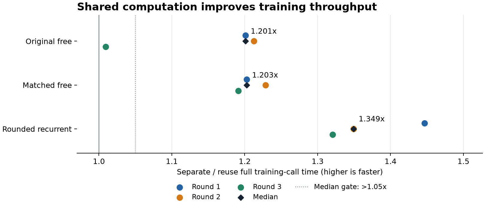

# Shared computation: measured training throughput

**ENGINEERING_THROUGHPUT_PASS**. All nine measured pairs favor reuse, and all three
median ratios exceed the prospectively fixed 1.05x threshold. These are complete
training-call timings on one machine, not an inference benchmark or an
architectural/task-performance gain.

| Model | Median separate / reuse time | Smallest pair | Largest pair |
|---|---:|---:|---:|
| original_free | 1.201x | 1.009x | 1.213x |
| matched_free | 1.203x | 1.191x | 1.229x |
| rounded | 1.349x | 1.321x | 1.447x |

The comparison retains 24 fresh fits: six warmups and 18 measured fits, with
the same 512 attempted training histories, seed, initialization, optimizer,
minibatch order and 32-prefix/64-joint update schedule. The primary timer
includes construction, all safeguards, updates, model/Adam checkpoints and
training-log writes. Warmups were excluded by the original protocol. One
original-free pair improves by only 0.9%; three pairs per model are not a
statistical-significance result.

All 78 qualification tests pass. The independent saved-output audit checks
every update exposure, 72 model checkpoints and 72 optimizer checkpoints.
Initial and prefix-boundary states match exactly. Maximum final model and
optimizer differences are 1.72e-14 and 8.02e-18, within
the fixed symmetric absolute/relative tolerance 1e-7. No training is replayed
by the audit. Agreement over this short schedule does not establish identical
long training trajectories.

Native qualification, producer and audit phases took
3.473,
17.965 and
2.204 seconds respectively.
Generation took 0.112 seconds and is
nested within producer time. Complete warmup/measured training calls total
4.222/12.056
seconds, also nested within producer time. These scopes must not be added twice.

The first qualification stopped at a test-selector bug: 77 tests passed and
one failed before any timed fit. Its complete evidence and 88 frozen sources
remain intact. A separate [v2 registration](finite-joint-reuse-throughput-v2-protocol.md)
corrected only the test selector and registration binding. The workload,
production gate, tolerances and caps were unchanged. The prior
[equal-update feasibility stop](finite-update-learning-stop-results.md) also
remains closed. This engineering result does not reopen or admit that study.

The next research step is a fresh equal-update effectiveness comparison using
this implementation. Any claim that recurrent constraints improve decisions
still needs new held-out results and scenario-shift validation.

[Original protocol](finite-joint-reuse-throughput-protocol.md) ·
[Summary and every paired timing](finite-joint-reuse-throughput-results/summary.json) ·
[Complete current-study and failure evidence](finite-joint-reuse-throughput-results/evidence.tar.gz) ·
[Archive manifest](finite-joint-reuse-throughput-results/manifest.json) ·
[Publication receipt](finite-joint-reuse-throughput-results/receipt.json)
