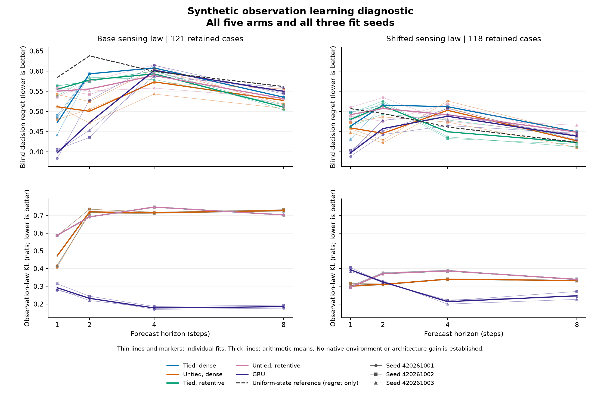

# Recurrent learning in an exact finite world

**The proposed training recipe fails even this favorable synthetic diagnostic.**
Fifteen models completed training and evaluation; the independent audit agrees
with every reported metric. The tied model with memory-retaining initialization
fails the base criterion (9/27 conditions pass) and the separate sensor-shift
criterion (9/21). No architecture advantage or native-environment gain is established.

The world has eight hidden states, four actions and an absorbing event. Exact
conditional targets remove sampled-label estimation noise. Models receive only
public action/observation histories. They train on one- and two-step forecasts,
then face four- and eight-step gaps. All 15 final checkpoints precede evaluation
data generation. This tests a learnable finite-world construction, not Doom,
chess, robotics or TypeSafe's proprietary system.

| Model | Base eight-step regret | Shift eight-step regret | Base first-step observation KL |
| --- | ---: | ---: | ---: |
| Tied, dense | 0.5354 | 0.4496 | 0.4721 |
| Untied, dense | 0.5273 | 0.4274 | 0.4708 |
| Tied, retentive | 0.5108 | 0.4231 | 0.5876 |
| Untied, retentive | 0.5317 | 0.4489 | 0.5876 |
| Ordinary GRU | 0.5500 | 0.4388 | 0.2922 |
| Known-dynamics uniform-state reference | 0.5619 | 0.4235 | N/A |

Lower is better. Model entries average three separate fits, not ensemble
decisions. The reference knows the dynamics but discards the prefix; it is not
an optimal history-ignorant predictor. Full results retain every seed and
horizon, including shuffled-history controls. No uncertainty interval or
significance claim is attached to these means.

Retentive initialization does not meet the required 50% reduction in either
long-gap regret or cost error. Its base eight-step cost MSE is 0.10156, versus
0.10142 for the uniform-state reference. The GRU has better observation forecasts
in the base setting, but that does not translate into good long-gap decisions.
The noisier sensor is unannounced, so its observation KL is descriptive rather
than part of the shift criterion.

The study retained 485/512 TRAIN prefixes, 121/128 base DEV prefixes and 118/128
shifted DEV prefixes. Found-prefix exclusions were not replaced. Training used
48 epochs and 5,760 total updates. The complete fit/evaluation phase took 23.85
seconds; the independent audit took 0.51 seconds on this machine. This is not a
matched-compute comparison.

Qualification passed 146 tests. Its first attempt preserved 138 passing tests
and eight failures from one auditor file-size typo; the corrected attempt used
separate paths and unchanged models, targets and gates. These engineering
attempts are separate from the 15 scientific fits.

[Complete tables and timing](finite-observation-learning-results/report.md) ·
[Machine-readable results](finite-observation-learning-results/summary.json) ·
[Frozen protocol](finite-observation-learning-protocol.md) ·
[All checkpoints and original evidence](https://github.com/kw2828/OpenJev/releases/tag/finite-observation-learning-v1) ·
[Next diagnostic](finite-observation-learning-next.md).
