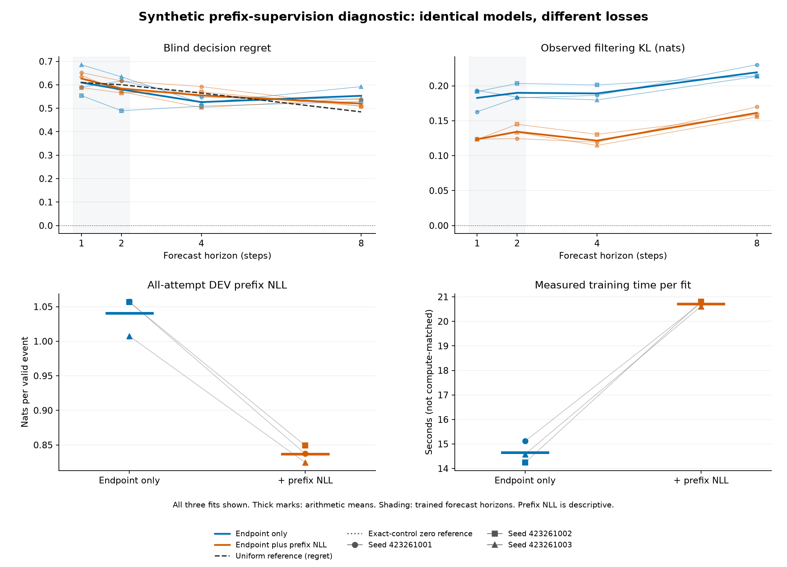

# Prefix supervision in a synthetic observation world

Two arms use the identical 1,088-parameter shared-filter model and paired initialization. `endpoint_only` uses the existing four-component H1/H2 forecast objective. `endpoint_plus_prefix` adds mean public-prefix negative log-likelihood with fixed coefficient 1. Both arms share attempts, eligible endpoint cases, batch orders and update counts. The extra likelihood terms and computation are the intervention.

The reset odor is predicted before conditioning the uniform prior, without an action or hazard. Each later action-conditioned five-event distribution is scored before its label is assimilated. All attempted prefixes, including the first found event, contribute to the prefix diagnostic. Post-found padding does not. Prefix NLL uses one global valid-event denominator; the endpoint loss has its own fixed surviving-case denominator.

No oracle state or belief target is given to either learned model. The fixed cost basis and uniform reset prior remain privileged assumptions. Only the zero-parameter exact control receives the true boundary posterior and known operators; its forecasts agree with independently reconstructed targets within 1e-12.

[Frozen protocol](../finite-prefix-learning-protocol.md). Every metric below was read only after original qualification, fit and audit closures, unchanged source pins and complete payload hashes were authenticated.

## Unchanged criteria

| Criterion | Endpoint only | Endpoint plus prefix |
|---|---|---|
| SHORT_HORIZON_LEARNING | FAIL (6/24) | FAIL (6/24) |
| BLIND_EXTRAPOLATION | FAIL (9/21) | FAIL (9/21) |
| OBSERVED_FILTERING_EXTRAPOLATION | FAIL (2/8) | FAIL (2/8) |

Each criterion requires every fit seed and minimum support. H1/H2 learning requires blind cost MSE and regret at most half the positive uniform reference and observed KL at most 0.1 nats. Blind H4/H8 extrapolation uses the same cost thresholds and H8 survival MAE at most 0.05. Observed H4/H8 filtering requires KL at most 0.1 and receives intervening observations. Prefix NLL cannot rescue failed criteria.

## Longer-horizon means and paired differences

| Arm | H | Blind regret | Blind cost MSE | Observed KL | Blind survival MAE | Shuffled regret |
|---|---:|---:|---:|---:|---:|---:|
| endpoint_only | 4 | 0.526399 | 0.127147 | 0.189089 | 0.00474954 | 0.587863 |
| endpoint_only | 8 | 0.553331 | 0.105958 | 0.219293 | 0.00811859 | 0.57194 |
| endpoint_plus_prefix | 4 | 0.555055 | 0.136957 | 0.121495 | 0.00461466 | 0.603253 |
| endpoint_plus_prefix | 8 | 0.519877 | 0.106566 | 0.161247 | 0.00625772 | 0.541788 |

Differences below are endpoint-plus-prefix minus endpoint-only on the same seed and cases. Negative favors the added loss. These are descriptive arithmetic, not significance tests or additional gates.

| Seed | H | Regret difference | Cost MSE difference | Observed KL difference |
|---|---:|---:|---:|---:|
| 423261001 | 4 | +0.0451231 | +0.0129389 | -0.0670219 |
| 423261002 | 4 | +0.0605971 | +0.00891001 | -0.0706557 |
| 423261003 | 4 | -0.0197522 | +0.00758019 | -0.0651037 |
| 423261001 | 8 | -0.029794 | -0.00184722 | -0.0602863 |
| 423261002 | 8 | -0.019938 | +0.000971736 | -0.0559781 |
| 423261003 | 8 | -0.0506311 | +0.00269938 | -0.0578744 |

## All-attempt prefix diagnostics and inference cost

| Arm | Seed | Attempts | Valid events | Prefix NLL | Prefix seconds | Endpoint seconds |
|---|---:|---:|---:|---:|---:|---:|
| endpoint_only | 423261001 | 128 | 1128 | 1.05712 | 0.002575 | 0.011565 |
| endpoint_only | 423261002 | 128 | 1128 | 1.05667 | 0.002580 | 0.011475 |
| endpoint_only | 423261003 | 128 | 1128 | 1.00759 | 0.002673 | 0.011761 |
| endpoint_plus_prefix | 423261001 | 128 | 1128 | 0.837231 | 0.002446 | 0.011365 |
| endpoint_plus_prefix | 423261002 | 128 | 1128 | 0.849125 | 0.002517 | 0.010919 |
| endpoint_plus_prefix | 423261003 | 128 | 1128 | 0.824498 | 0.002586 | 0.011066 |

Prefix time includes input copies, likelihood forwards, guards, output copies and scalar NLL; it excludes state hashes and file writes. Endpoint time includes blind, observed and shuffled forwards plus copies and guards, but excludes state hashes and scalar metrics. Neither is single-decision latency.

## Data and training work

| Split | Attempted | Endpoint eligible | Found-terminated | Valid prefix events |
|---|---:|---:|---:|---:|
| train | 512 | 490 | 22 | 4535 |
| base | 128 | 121 | 7 | 1128 |

Found-terminated attempts are retained for prefix likelihood, not replaced; only endpoint targets require survival of the whole prefix. All six fits use 480 epochs, batch size 64, Adam 0.003 and clip 5. Every final checkpoint precedes DEV generation. No warm start, posterior supervision, weight search or early stopping is used.

| Arm | Seed | Parameters | Updates | Endpoint exposures | Prefix-event exposures | Fit seconds |
|---|---:|---:|---:|---:|---:|---:|
| endpoint_only | 423261001 | 1088 | 3,840 | 235,200 | 0 | 15.116 |
| endpoint_plus_prefix | 423261001 | 1088 | 3,840 | 235,200 | 2,176,800 | 20.737 |
| endpoint_plus_prefix | 423261002 | 1088 | 3,840 | 235,200 | 2,176,800 | 20.801 |
| endpoint_only | 423261002 | 1088 | 3,840 | 235,200 | 0 | 14.243 |
| endpoint_only | 423261003 | 1088 | 3,840 | 235,200 | 0 | 14.582 |
| endpoint_plus_prefix | 423261003 | 1088 | 3,840 | 235,200 | 2,176,800 | 20.616 |

Fit times include optimizer construction, training, journals, buffer checks and checkpoints, excluding model construction. Both arms have 8,704 parameter bytes and 256 fixed-buffer bytes; activations and optimizer storage are additional. Equal updates do not mean equal supervised terms, operations, runtime or gradient examples.

| Arm | Route | Filter rows | Likelihood rows | Prefix / forecast softmax calls | Transition rows | Cost rows |
|---|---|---:|---:|---:|---:|---:|
| endpoint_only | training_blind | 5,644,800 | 0 | 11,520 / 11,520 | 1,411,200 | 1,411,200 |
| endpoint_only | training_observed | 5,644,800 | 0 | 11,520 / 11,520 | 1,411,200 | 1,411,200 |
| endpoint_only | training_prefix | 0 | 0 | 0 / 0 | 0 | 0 |
| endpoint_only | evaluation_blind | 2,904 | 0 | 6 / 6 | 2,904 | 2,904 |
| endpoint_only | evaluation_observed | 2,904 | 0 | 6 / 6 | 2,904 | 2,904 |
| endpoint_only | evaluation_shuffled | 2,904 | 0 | 6 / 6 | 2,904 | 2,904 |
| endpoint_only | evaluation_prefix | 2,979 | 3,384 | 6 / 0 | 0 | 0 |
| endpoint_plus_prefix | training_blind | 5,644,800 | 0 | 11,520 / 11,520 | 1,411,200 | 1,411,200 |
| endpoint_plus_prefix | training_observed | 5,644,800 | 0 | 11,520 / 11,520 | 1,411,200 | 1,411,200 |
| endpoint_plus_prefix | training_prefix | 5,761,440 | 6,530,400 | 11,520 / 0 | 0 | 0 |
| endpoint_plus_prefix | evaluation_blind | 2,904 | 0 | 6 / 6 | 2,904 | 2,904 |
| endpoint_plus_prefix | evaluation_observed | 2,904 | 0 | 6 / 6 | 2,904 | 2,904 |
| endpoint_plus_prefix | evaluation_shuffled | 2,904 | 0 | 6 / 6 | 2,904 | 2,904 |
| endpoint_plus_prefix | evaluation_prefix | 2,979 | 3,384 | 6 / 0 | 0 | 0 |

Forward work is a source-constrained producer attestation checked against batch schedules and public labels. It excludes backward operations, optimizer work, validation FLOPs and allocation. All counters, six fits, 24 endpoint rows and every condition are retained in [summary.json](summary.json).

| Original closed phase | Seconds |
|---|---:|
| qualify | 3.426 |
| fit | 107.744 |
| audit | 1.207 |
| Total of these successful phases | 112.377 |

Whole-phase times include process launch and cleanup. Fit includes collection, exact checks, fitting, evaluation and output writes; nested timings must not be added again. Any earlier failed qualification is retained separately in the evidence package and is outside this successful-phase total.

## Limits

Means describe separately fitted policies, not an ensemble or confidence interval. Lower training or prefix loss alone does not demonstrate useful held-out decisions. Known C has rank at most three and distinguishes four decision signatures, not every coordinate of the eight-state posterior. This fixed-budget supervision test makes no calibration, convergence, architectural novelty, native-environment or robotics claim, and does not change any prior study outcome.
