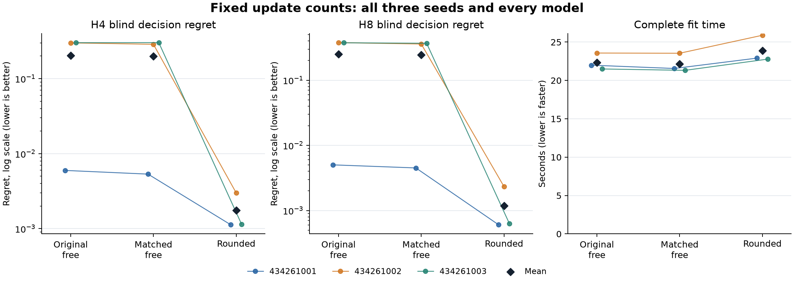

# Equal updates with shared computation

**UPDATE_MATCHED_ADVANCE_PASS**. 19/19 prospectively fixed continuation conditions pass.

All nine fits completed 1,024 prefix updates and 3,072 joint updates each. Same-seed arms received identical joint minibatches. All use the qualified per-call reuse implementation. Equal update counts do not imply equal runtime, FLOPs, gradients or effective degrees of freedom.

| Model | Short horizon | Blind extrapolation | Observed filtering |
|---|---:|---:|---:|
| Original free | PASS 24/24 | FAIL 13/21 | PASS 8/8 |
| Matched free | PASS 24/24 | FAIL 14/21 | PASS 8/8 |
| Rounded | PASS 24/24 | PASS 21/21 | PASS 8/8 |

All seeds remain binding. Means do not rescue a failed absolute condition or a worse paired regret.

| Control | Horizon | Rounded mean regret | Control mean regret | Relative reduction |
|---|---:|---:|---:|---:|
| original_free | 4 | 0.00175612 | 0.202512 | 99.13% |
| original_free | 8 | 0.00118724 | 0.252766 | 99.53% |
| matched_free | 4 | 0.00175612 | 0.198247 | 99.11% |
| matched_free | 8 | 0.00118724 | 0.244463 | 99.51% |

Relative reductions are ratios of the three fit means, with positive values favoring rounded. These descriptive summaries are not significance tests. The very large mean reductions are driven by weak control fits at seeds 434261002 and 434261003; the first seed of each control performs much better. All twelve paired comparisons still favor rounded. The regret panels use a log scale to retain these differences; black diamonds are arithmetic means.

| Control | Rounded mean fit seconds | Control mean fit seconds | Extra rounded time |
|---|---:|---:|---:|
| original_free | 23.861290 | 22.353932 | 6.74% |
| matched_free | 23.861290 | 22.141758 | 7.77% |

| Model | Fit seed | Prefix updates | Joint updates | Prefix stage seconds | Joint stage seconds | Complete fit seconds | Controller seconds |
|---|---:|---:|---:|---:|---:|---:|---:|
| original_free | 434261001 | 1024 | 3072 | 5.235229 | 16.083960 | 21.991604 | 21.825637 |
| original_free | 434261002 | 1024 | 3072 | 5.982897 | 17.417505 | 23.573190 | 23.410127 |
| original_free | 434261003 | 1024 | 3072 | 5.241108 | 16.080565 | 21.497002 | 21.330136 |
| matched_free | 434261001 | 1024 | 3072 | 5.326246 | 16.058403 | 21.560531 | 21.395430 |
| matched_free | 434261002 | 1024 | 3072 | 5.387198 | 17.974217 | 23.546276 | 23.371964 |
| matched_free | 434261003 | 1024 | 3072 | 5.199130 | 15.943916 | 21.318468 | 21.151548 |
| rounded | 434261001 | 1024 | 3072 | 5.646289 | 17.090773 | 22.911567 | 22.745047 |
| rounded | 434261002 | 1024 | 3072 | 6.025988 | 19.656500 | 25.890315 | 25.691727 |
| rounded | 434261003 | 1024 | 3072 | 5.618050 | 16.989729 | 22.781988 | 22.616078 |

Original native phases: qualification 7.770289s, fit 208.154383s, audit 4.480507s. The selected qualification ran 229 passing tests with one warning and retained the independently audited exposure probe.

Complete fit time includes setup, updates, guards, boundary checkpoints and allocation-log persistence. Controller time includes its final summary and is nested inside full fit time. Generation, inference, fit and audit durations must not be added again to their enclosing phase. Runtime comparisons are descriptive, not continuation conditions. Prefix and joint stage durations are also nested within the controller; setup, boundary and summary work falls outside these stage intervals.

Fresh base-condition development retains 120 of 128 attempted prefixes; TRAIN retains 481 of 512. All attempted prefixes, including found events, contribute to prefix likelihood; endpoint metrics use retained prefixes. Training endpoint labels cover H1/H2, while H4/H8 are extrapolation. Learned models receive public histories, not the exact reference state. The synthetic world uses a known doubly stochastic transition prior, and all arms have privileged starting readouts. These choices favor the tested model family. This is no claim of native transfer, latent identification, architectural novelty or statistical significance.

The independent audit reconstructs saved targets, schedules, all 27 model and 27 Adam boundaries, and actual forward work. It does not replay training. The publication reads JSON and hashes opaque evidence; zero learner calls in the publication or audit do not describe the training phase. The five joint reuse routes count physical shared operations once, separately from logical rollout counts and unmeasured backward FLOPs.

The earlier equal-time rounded study did not meet its advancement criterion. This fresh equal-update result does not overturn that result or establish equal-time superiority: rounded takes more time here. The implementation, optimization exposure and fresh cohort also differ across studies, so their contrast does not isolate one causal explanation.

The next step is an untouched replication with a predeclared scenario shift, followed by a second environment. A local pass is not ICLR readiness, calibrated probabilities or evidence of biological benefit. These follow-ups require separate frozen protocols; this report does not execute or admit them.

All 19 continuation conditions:

| Condition | Result |
|---|---|
| BLIND_EXTRAPOLATION | PASS |
| OBSERVED_FILTERING_EXTRAPOLATION | PASS |
| SHORT_HORIZON_LEARNING | PASS |
| matched_free_434261001_h4_nonpositive_regret_difference | PASS |
| matched_free_434261001_h8_nonpositive_regret_difference | PASS |
| matched_free_434261002_h4_nonpositive_regret_difference | PASS |
| matched_free_434261002_h8_nonpositive_regret_difference | PASS |
| matched_free_434261003_h4_nonpositive_regret_difference | PASS |
| matched_free_434261003_h8_nonpositive_regret_difference | PASS |
| matched_free_h4_ten_percent_mean_regret | PASS |
| matched_free_h8_ten_percent_mean_regret | PASS |
| original_free_434261001_h4_nonpositive_regret_difference | PASS |
| original_free_434261001_h8_nonpositive_regret_difference | PASS |
| original_free_434261002_h4_nonpositive_regret_difference | PASS |
| original_free_434261002_h8_nonpositive_regret_difference | PASS |
| original_free_434261003_h4_nonpositive_regret_difference | PASS |
| original_free_434261003_h8_nonpositive_regret_difference | PASS |
| original_free_h4_ten_percent_mean_regret | PASS |
| original_free_h8_ten_percent_mean_regret | PASS |

Every failed absolute condition:

- original_free / BLIND_EXTRAPOLATION: 434261002_h4_half_mse
- original_free / BLIND_EXTRAPOLATION: 434261002_h4_half_regret
- original_free / BLIND_EXTRAPOLATION: 434261002_h8_half_mse
- original_free / BLIND_EXTRAPOLATION: 434261002_h8_half_regret
- original_free / BLIND_EXTRAPOLATION: 434261003_h4_half_mse
- original_free / BLIND_EXTRAPOLATION: 434261003_h4_half_regret
- original_free / BLIND_EXTRAPOLATION: 434261003_h8_half_mse
- original_free / BLIND_EXTRAPOLATION: 434261003_h8_half_regret
- matched_free / BLIND_EXTRAPOLATION: 434261002_h4_half_mse
- matched_free / BLIND_EXTRAPOLATION: 434261002_h8_half_mse
- matched_free / BLIND_EXTRAPOLATION: 434261002_h8_half_regret
- matched_free / BLIND_EXTRAPOLATION: 434261003_h4_half_mse
- matched_free / BLIND_EXTRAPOLATION: 434261003_h4_half_regret
- matched_free / BLIND_EXTRAPOLATION: 434261003_h8_half_mse
- matched_free / BLIND_EXTRAPOLATION: 434261003_h8_half_regret

All endpoint results:

| Model | Seed | H | Blind regret | Blind cost MSE | Observed cost MSE | Observed KL | Blind survival MAE | Observed survival MAE | Shuffled regret |
|---|---:|---:|---:|---:|---:|---:|---:|---:|---:|
| original_free | 434261001 | 1 | 0.007358372 | 0.0017995381 | 0.0017995381 | 0.0080325519 | 0.0020503176 | 0.0020503176 | 0.64704701 |
| original_free | 434261001 | 2 | 0.0070888211 | 0.0016914594 | 0.0018261652 | 0.0048789037 | 0.0032045918 | 0.0023167316 | 0.59541092 |
| original_free | 434261001 | 4 | 0.0059729595 | 0.0018229852 | 0.0023288726 | 0.0082583624 | 0.0045000205 | 0.0020631799 | 0.54283121 |
| original_free | 434261001 | 8 | 0.005019128 | 0.0020714269 | 0.0021473753 | 0.0087127873 | 0.0069609371 | 0.0020896067 | 0.49355138 |
| original_free | 434261002 | 1 | 0.23847709 | 0.058277652 | 0.058277652 | 0.076644108 | 0.0022229277 | 0.0022229277 | 0.66487062 |
| original_free | 434261002 | 2 | 0.28627961 | 0.064044555 | 0.063318606 | 0.076329288 | 0.0034875809 | 0.0026507923 | 0.58165072 |
| original_free | 434261002 | 4 | 0.2998154 | 0.067744763 | 0.062189428 | 0.07528144 | 0.0051569657 | 0.0024362189 | 0.55128381 |
| original_free | 434261002 | 8 | 0.37779659 | 0.076768021 | 0.073909224 | 0.075971992 | 0.006826095 | 0.0022871651 | 0.55892089 |
| original_free | 434261003 | 1 | 0.25120873 | 0.056338579 | 0.056338579 | 0.073129064 | 0.0023869225 | 0.0023869225 | 0.64942907 |
| original_free | 434261003 | 2 | 0.27319352 | 0.061506146 | 0.061182777 | 0.074979692 | 0.0037378627 | 0.002792654 | 0.56585762 |
| original_free | 434261003 | 4 | 0.30174753 | 0.065218948 | 0.060232829 | 0.076037779 | 0.0052720191 | 0.0024909427 | 0.5722304 |
| original_free | 434261003 | 8 | 0.37548219 | 0.074678026 | 0.071409414 | 0.070537214 | 0.0069589669 | 0.0023644537 | 0.5656085 |
| matched_free | 434261001 | 1 | 0.0066321605 | 0.0013194737 | 0.0013194737 | 0.0064585014 | 0.0020019089 | 0.0020019089 | 0.63901458 |
| matched_free | 434261001 | 2 | 0.0064396484 | 0.0012714494 | 0.0016248391 | 0.0044504896 | 0.0031667483 | 0.0022503306 | 0.59535514 |
| matched_free | 434261001 | 4 | 0.0053345946 | 0.0013823088 | 0.0021594317 | 0.0079451594 | 0.0045907327 | 0.002046033 | 0.55016657 |
| matched_free | 434261001 | 8 | 0.0045039925 | 0.0016094582 | 0.0021072396 | 0.0087176229 | 0.007064806 | 0.0020576093 | 0.49355125 |
| matched_free | 434261002 | 1 | 0.24181622 | 0.061442881 | 0.061442881 | 0.080614323 | 0.0021714441 | 0.0021714441 | 0.67257346 |
| matched_free | 434261002 | 2 | 0.27105797 | 0.067472244 | 0.066462898 | 0.081121907 | 0.0033512809 | 0.002655942 | 0.57389807 |
| matched_free | 434261002 | 4 | 0.28712496 | 0.071500809 | 0.065172262 | 0.077239196 | 0.0049169139 | 0.0024536606 | 0.5586713 |
| matched_free | 434261002 | 8 | 0.35973615 | 0.078588427 | 0.076658647 | 0.080791472 | 0.0062828966 | 0.0022008892 | 0.57868959 |
| matched_free | 434261003 | 1 | 0.25643325 | 0.056315093 | 0.056315093 | 0.073111957 | 0.00238412 | 0.00238412 | 0.64910053 |
| matched_free | 434261003 | 2 | 0.27552625 | 0.061456283 | 0.061208592 | 0.074419196 | 0.0037947609 | 0.0028023856 | 0.56696496 |
| matched_free | 434261003 | 4 | 0.30228177 | 0.065427137 | 0.060426615 | 0.07580003 | 0.005223759 | 0.0024828543 | 0.57271335 |
| matched_free | 434261003 | 8 | 0.36914824 | 0.074857049 | 0.071598081 | 0.070444184 | 0.0069515131 | 0.0023054072 | 0.56775405 |
| rounded | 434261001 | 1 | 0.0020566894 | 0.0012035144 | 0.0012035144 | 0.0063275151 | 0.0020323607 | 0.0020323607 | 0.63417154 |
| rounded | 434261001 | 2 | 0.0019575628 | 0.0012246985 | 0.0012254063 | 0.0035229261 | 0.0031918039 | 0.0022558947 | 0.59069048 |
| rounded | 434261001 | 4 | 0.0011252584 | 0.00096882283 | 0.0020557371 | 0.007885281 | 0.0045783693 | 0.0020414727 | 0.55301057 |
| rounded | 434261001 | 8 | 0.00060351876 | 0.00092208608 | 0.0013725932 | 0.0042877423 | 0.0070607185 | 0.0020580919 | 0.50491279 |
| rounded | 434261002 | 1 | 0.0012762351 | 0.0013604478 | 0.0013604478 | 0.0062865294 | 0.002043819 | 0.002043819 | 0.63417261 |
| rounded | 434261002 | 2 | 0.0012545336 | 0.0013100733 | 0.001455865 | 0.0038647923 | 0.0031719895 | 0.0022623311 | 0.59067701 |
| rounded | 434261002 | 4 | 0.0029983737 | 0.0012059062 | 0.0024661369 | 0.00905609 | 0.0045633112 | 0.0020425018 | 0.55301048 |
| rounded | 434261002 | 8 | 0.0023290386 | 0.0011846945 | 0.001899136 | 0.0050305507 | 0.0070185526 | 0.0020136855 | 0.50491271 |
| rounded | 434261003 | 1 | 0.0020174289 | 0.0011498856 | 0.0011498856 | 0.0061248806 | 0.0020265441 | 0.0020265441 | 0.63417261 |
| rounded | 434261003 | 2 | 0.0019577577 | 0.0010900086 | 0.0010259925 | 0.0034659778 | 0.0031423122 | 0.0022257028 | 0.59068944 |
| rounded | 434261003 | 4 | 0.001144729 | 0.00088959073 | 0.0015276854 | 0.0060678976 | 0.0044986544 | 0.0020250606 | 0.56038215 |
| rounded | 434261003 | 8 | 0.00062917485 | 0.00093472033 | 0.00094581578 | 0.0033950146 | 0.006956765 | 0.0020378034 | 0.50491271 |

[Protocol](../finite-reuse-learning-protocol.md) · [Complete saved summary](summary.json) · [Current-study evidence](evidence.tar.gz) · [Manifest](manifest.json) · [Publication receipt](receipt.json)

The archive contains this complete current study, both 102-source snapshots, the engineering exposure probe, original closures, every saved model/optimizer boundary and publication artifacts. Earlier linked throughput and stopped studies, the interpreter and installed packages remain external. Their registered prerequisite evidence is reauthenticated, and its original descriptors are retained. Prior stopped attempts remain closed.
