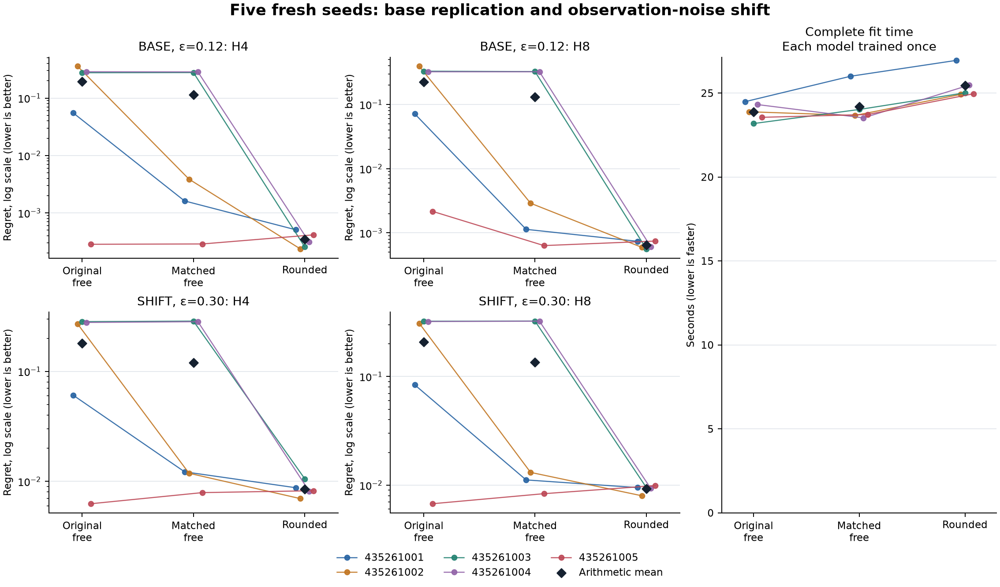

# Fresh replication and observation-noise shift

**REPLICATION_SHIFT_ADVANCE_FAIL**. 45/54 prospectively fixed continuation conditions pass.

Fifteen fresh fits use five seeds, three models and the same qualified per-call reuse implementation. Each fit completes 1,024 prefix updates followed by 3,072 joint updates, with same-seed minibatches paired across arms. Every final checkpoint precedes both evaluation cohorts. Each model is evaluated unchanged on BASE and SHIFT; it is not trained twice.

BASE uses observation error ε=0.12; SHIFT uses ε=0.30. The correct-odor probability changes from 0.88 to 0.70 and each other odor from 0.04 to 0.10. Transition, hazard, costs and action distributions stay fixed. Independent case streams make this an observation-noise transfer test, not paired noise perturbations of the same histories or a challenge to the favorable transition prior.

| Regime | Continuation | Conditions passed | Retained DEV / attempted |
|---|---|---:|---:|
| BASE | FAIL | 24/27 | 488/512 |
| SHIFT | FAIL | 21/27 | 481/512 |

Neither regime rescues the other. Every paired fit and absolute condition remains binding; there is no pooling or mean-based rescue.

| Regime | Model | Short horizon | Blind extrapolation | Observed filtering |
|---|---|---:|---:|---:|
| BASE | Original free | FAIL 33/36 | FAIL 21/31 | PASS 12/12 |
| BASE | Matched free | PASS 36/36 | FAIL 25/31 | PASS 12/12 |
| BASE | Rounded | PASS 36/36 | PASS 31/31 | PASS 12/12 |
| SHIFT | Original free | FAIL 20/36 | FAIL 19/31 | FAIL 2/12 |
| SHIFT | Matched free | FAIL 24/36 | FAIL 23/31 | FAIL 2/12 |
| SHIFT | Rounded | FAIL 26/36 | PASS 31/31 | FAIL 2/12 |

| Regime | Control | H | Rounded mean regret | Control mean regret | Relative reduction |
|---|---|---:|---:|---:|---:|
| BASE | original_free | 4 | 0.00034493541 | 0.19519195 | 99.82% |
| BASE | original_free | 8 | 0.00064937047 | 0.22400032 | 99.71% |
| BASE | matched_free | 4 | 0.00034493541 | 0.11380776 | 99.70% |
| BASE | matched_free | 8 | 0.00064937047 | 0.13062706 | 99.50% |
| SHIFT | original_free | 4 | 0.0085228376 | 0.17970764 | 95.26% |
| SHIFT | original_free | 8 | 0.0092358815 | 0.20885214 | 95.58% |
| SHIFT | matched_free | 4 | 0.0085228376 | 0.12032324 | 92.92% |
| SHIFT | matched_free | 8 | 0.0092358815 | 0.13599197 | 93.21% |

Relative reductions are ratios of the five fit means; positive values favor rounded. Seed-level values and paired differences below remain essential: a large mean reduction can be driven by a few weak control fits. Five seeds share one training cohort and do not constitute five independent population studies. No confidence interval or significance claim is made. The figure labels log axes where every regret is positive; any panel with zero uses a linear axis. Diamonds show arithmetic means.

| Control | Rounded mean fit seconds | Control mean fit seconds | Rounded / control time |
|---|---:|---:|---:|
| original_free | 25.463181 | 23.886531 | 1.066006 |
| matched_free | 25.463181 | 24.188552 | 1.052696 |

| Model | Fit seed | Prefix updates | Joint updates | Prefix stage seconds | Joint stage seconds | Complete fit seconds | Controller seconds |
|---|---:|---:|---:|---:|---:|---:|---:|
| original_free | 435261001 | 1024 | 3072 | 6.079001 | 17.650746 | 24.487454 | 24.298190 |
| original_free | 435261002 | 1024 | 3072 | 5.758334 | 17.942615 | 23.887972 | 23.709356 |
| original_free | 435261003 | 1024 | 3072 | 5.573917 | 17.426368 | 23.184835 | 23.008893 |
| original_free | 435261004 | 1024 | 3072 | 5.906924 | 18.223537 | 24.315060 | 24.139531 |
| original_free | 435261005 | 1024 | 3072 | 5.885663 | 17.486946 | 23.557336 | 23.381089 |
| matched_free | 435261001 | 1024 | 3072 | 6.373321 | 19.413094 | 26.004468 | 25.800200 |
| matched_free | 435261002 | 1024 | 3072 | 6.026529 | 17.464394 | 23.668666 | 23.500127 |
| matched_free | 435261003 | 1024 | 3072 | 5.857449 | 17.978080 | 24.023094 | 23.845250 |
| matched_free | 435261004 | 1024 | 3072 | 5.851340 | 17.487423 | 23.522745 | 23.347488 |
| matched_free | 435261005 | 1024 | 3072 | 5.810388 | 17.727034 | 23.723788 | 23.546256 |
| rounded | 435261001 | 1024 | 3072 | 7.191966 | 19.570751 | 26.949575 | 26.770974 |
| rounded | 435261002 | 1024 | 3072 | 6.084102 | 18.651568 | 24.920527 | 24.744119 |
| rounded | 435261003 | 1024 | 3072 | 6.175041 | 18.658806 | 25.014066 | 24.842432 |
| rounded | 435261004 | 1024 | 3072 | 6.368356 | 18.921251 | 25.473851 | 25.297924 |
| rounded | 435261005 | 1024 | 3072 | 6.152238 | 18.621151 | 24.957889 | 24.781935 |

Original native phases: qualification 11.395891s, fit/evaluation 375.121581s, audit 8.198728s. Selected qualification: 336 passing tests, 1 warning(s), plus the retained independently audited exposure probe.

Complete fit time includes construction, validation, updates, boundary checkpoints and allocation-log persistence. Stage times and controller time are nested; the controller includes its final summary. These components must not be added again to the enclosing native phase. The same fit costs apply to both evaluation regimes and are shown once. Timing is descriptive, not a continuation condition. Equal update counts do not imply equal time, FLOPs, gradients or effective degrees of freedom.

TRAIN retains 483 of 512 attempted prefixes. All attempted histories, including terminal found events, contribute to prefix likelihood; endpoint metrics use surviving prefixes without replacement. Training endpoint labels cover H1/H2; H4/H8 are extrapolation. Observed filtering receives intervening observations, while blind extrapolation does not.

The known doubly stochastic world structure and privileged starting readouts favor the tested family. The observation-noise shift preserves both. Learned models receive public histories and supervised targets, not exact oracle boundary states, noise-level hints or SHIFT training. Separate ε-bound zero-parameter references validate the correct world in each regime.

The independent audit reconstructs saved targets, metrics, schedules, all 45 model and 45 Adam boundaries, and disjoint forward work. It does not replay learning. The publication reads saved JSON and hashes opaque evidence; its zero learner calls do not describe the training phase. Shared forward operations are counted once, separately from logical rollouts and unmeasured backward FLOPs.

The prior local 19-condition pass, prior equal-time failure and feasibility stops remain closed. This new result must stand on its own 54 conditions. It does not establish ICLR readiness, calibrated text probabilities, biological benefit, latent identification, native transfer or architectural novelty. Before a broader claim, a separate frozen study must challenge the favorable transition prior and privileged initialization, followed by a second environment. No follow-up is executed or admitted here.

Every continuation condition:

| Condition | Result |
|---|---|
| base/BLIND_EXTRAPOLATION | PASS |
| base/OBSERVED_FILTERING_EXTRAPOLATION | PASS |
| base/SHORT_HORIZON_LEARNING | PASS |
| base/matched_free_435261001_h4_nonpositive_regret_difference | PASS |
| base/matched_free_435261001_h8_nonpositive_regret_difference | PASS |
| base/matched_free_435261002_h4_nonpositive_regret_difference | PASS |
| base/matched_free_435261002_h8_nonpositive_regret_difference | PASS |
| base/matched_free_435261003_h4_nonpositive_regret_difference | PASS |
| base/matched_free_435261003_h8_nonpositive_regret_difference | PASS |
| base/matched_free_435261004_h4_nonpositive_regret_difference | PASS |
| base/matched_free_435261004_h8_nonpositive_regret_difference | PASS |
| base/matched_free_435261005_h4_nonpositive_regret_difference | FAIL |
| base/matched_free_435261005_h8_nonpositive_regret_difference | FAIL |
| base/matched_free_h4_ten_percent_mean_regret | PASS |
| base/matched_free_h8_ten_percent_mean_regret | PASS |
| base/original_free_435261001_h4_nonpositive_regret_difference | PASS |
| base/original_free_435261001_h8_nonpositive_regret_difference | PASS |
| base/original_free_435261002_h4_nonpositive_regret_difference | PASS |
| base/original_free_435261002_h8_nonpositive_regret_difference | PASS |
| base/original_free_435261003_h4_nonpositive_regret_difference | PASS |
| base/original_free_435261003_h8_nonpositive_regret_difference | PASS |
| base/original_free_435261004_h4_nonpositive_regret_difference | PASS |
| base/original_free_435261004_h8_nonpositive_regret_difference | PASS |
| base/original_free_435261005_h4_nonpositive_regret_difference | FAIL |
| base/original_free_435261005_h8_nonpositive_regret_difference | PASS |
| base/original_free_h4_ten_percent_mean_regret | PASS |
| base/original_free_h8_ten_percent_mean_regret | PASS |
| shift/BLIND_EXTRAPOLATION | PASS |
| shift/OBSERVED_FILTERING_EXTRAPOLATION | FAIL |
| shift/SHORT_HORIZON_LEARNING | FAIL |
| shift/matched_free_435261001_h4_nonpositive_regret_difference | PASS |
| shift/matched_free_435261001_h8_nonpositive_regret_difference | PASS |
| shift/matched_free_435261002_h4_nonpositive_regret_difference | PASS |
| shift/matched_free_435261002_h8_nonpositive_regret_difference | PASS |
| shift/matched_free_435261003_h4_nonpositive_regret_difference | PASS |
| shift/matched_free_435261003_h8_nonpositive_regret_difference | PASS |
| shift/matched_free_435261004_h4_nonpositive_regret_difference | PASS |
| shift/matched_free_435261004_h8_nonpositive_regret_difference | PASS |
| shift/matched_free_435261005_h4_nonpositive_regret_difference | FAIL |
| shift/matched_free_435261005_h8_nonpositive_regret_difference | FAIL |
| shift/matched_free_h4_ten_percent_mean_regret | PASS |
| shift/matched_free_h8_ten_percent_mean_regret | PASS |
| shift/original_free_435261001_h4_nonpositive_regret_difference | PASS |
| shift/original_free_435261001_h8_nonpositive_regret_difference | PASS |
| shift/original_free_435261002_h4_nonpositive_regret_difference | PASS |
| shift/original_free_435261002_h8_nonpositive_regret_difference | PASS |
| shift/original_free_435261003_h4_nonpositive_regret_difference | PASS |
| shift/original_free_435261003_h8_nonpositive_regret_difference | PASS |
| shift/original_free_435261004_h4_nonpositive_regret_difference | PASS |
| shift/original_free_435261004_h8_nonpositive_regret_difference | PASS |
| shift/original_free_435261005_h4_nonpositive_regret_difference | FAIL |
| shift/original_free_435261005_h8_nonpositive_regret_difference | FAIL |
| shift/original_free_h4_ten_percent_mean_regret | PASS |
| shift/original_free_h8_ten_percent_mean_regret | PASS |

Every failed absolute condition:

- BASE / original_free / SHORT_HORIZON_LEARNING: 435261002_h1_half_mse
- BASE / original_free / SHORT_HORIZON_LEARNING: 435261002_h2_half_mse
- BASE / original_free / SHORT_HORIZON_LEARNING: 435261002_h2_half_regret
- BASE / original_free / BLIND_EXTRAPOLATION: 435261002_h4_half_mse
- BASE / original_free / BLIND_EXTRAPOLATION: 435261002_h4_half_regret
- BASE / original_free / BLIND_EXTRAPOLATION: 435261002_h8_half_mse
- BASE / original_free / BLIND_EXTRAPOLATION: 435261002_h8_half_regret
- BASE / original_free / BLIND_EXTRAPOLATION: 435261003_h4_half_mse
- BASE / original_free / BLIND_EXTRAPOLATION: 435261003_h8_half_mse
- BASE / original_free / BLIND_EXTRAPOLATION: 435261003_h8_half_regret
- BASE / original_free / BLIND_EXTRAPOLATION: 435261004_h4_half_mse
- BASE / original_free / BLIND_EXTRAPOLATION: 435261004_h8_half_mse
- BASE / original_free / BLIND_EXTRAPOLATION: 435261004_h8_half_regret
- BASE / matched_free / BLIND_EXTRAPOLATION: 435261003_h4_half_mse
- BASE / matched_free / BLIND_EXTRAPOLATION: 435261003_h8_half_mse
- BASE / matched_free / BLIND_EXTRAPOLATION: 435261003_h8_half_regret
- BASE / matched_free / BLIND_EXTRAPOLATION: 435261004_h4_half_mse
- BASE / matched_free / BLIND_EXTRAPOLATION: 435261004_h8_half_mse
- BASE / matched_free / BLIND_EXTRAPOLATION: 435261004_h8_half_regret
- SHIFT / original_free / SHORT_HORIZON_LEARNING: 435261001_h1_observed_kl
- SHIFT / original_free / SHORT_HORIZON_LEARNING: 435261001_h2_observed_kl
- SHIFT / original_free / SHORT_HORIZON_LEARNING: 435261002_h1_half_mse
- SHIFT / original_free / SHORT_HORIZON_LEARNING: 435261002_h1_half_regret
- SHIFT / original_free / SHORT_HORIZON_LEARNING: 435261002_h1_observed_kl
- SHIFT / original_free / SHORT_HORIZON_LEARNING: 435261002_h2_half_mse
- SHIFT / original_free / SHORT_HORIZON_LEARNING: 435261002_h2_half_regret
- SHIFT / original_free / SHORT_HORIZON_LEARNING: 435261002_h2_observed_kl
- SHIFT / original_free / SHORT_HORIZON_LEARNING: 435261003_h1_observed_kl
- SHIFT / original_free / SHORT_HORIZON_LEARNING: 435261003_h2_half_mse
- SHIFT / original_free / SHORT_HORIZON_LEARNING: 435261003_h2_observed_kl
- SHIFT / original_free / SHORT_HORIZON_LEARNING: 435261004_h1_observed_kl
- SHIFT / original_free / SHORT_HORIZON_LEARNING: 435261004_h2_half_mse
- SHIFT / original_free / SHORT_HORIZON_LEARNING: 435261004_h2_observed_kl
- SHIFT / original_free / SHORT_HORIZON_LEARNING: 435261005_h1_observed_kl
- SHIFT / original_free / SHORT_HORIZON_LEARNING: 435261005_h2_observed_kl
- SHIFT / original_free / BLIND_EXTRAPOLATION: 435261002_h4_half_mse
- SHIFT / original_free / BLIND_EXTRAPOLATION: 435261002_h4_half_regret
- SHIFT / original_free / BLIND_EXTRAPOLATION: 435261002_h8_half_mse
- SHIFT / original_free / BLIND_EXTRAPOLATION: 435261002_h8_half_regret
- SHIFT / original_free / BLIND_EXTRAPOLATION: 435261003_h4_half_mse
- SHIFT / original_free / BLIND_EXTRAPOLATION: 435261003_h4_half_regret
- SHIFT / original_free / BLIND_EXTRAPOLATION: 435261003_h8_half_mse
- SHIFT / original_free / BLIND_EXTRAPOLATION: 435261003_h8_half_regret
- SHIFT / original_free / BLIND_EXTRAPOLATION: 435261004_h4_half_mse
- SHIFT / original_free / BLIND_EXTRAPOLATION: 435261004_h4_half_regret
- SHIFT / original_free / BLIND_EXTRAPOLATION: 435261004_h8_half_mse
- SHIFT / original_free / BLIND_EXTRAPOLATION: 435261004_h8_half_regret
- SHIFT / original_free / OBSERVED_FILTERING_EXTRAPOLATION: 435261001_h4_observed_kl
- SHIFT / original_free / OBSERVED_FILTERING_EXTRAPOLATION: 435261001_h8_observed_kl
- SHIFT / original_free / OBSERVED_FILTERING_EXTRAPOLATION: 435261002_h4_observed_kl
- SHIFT / original_free / OBSERVED_FILTERING_EXTRAPOLATION: 435261002_h8_observed_kl
- SHIFT / original_free / OBSERVED_FILTERING_EXTRAPOLATION: 435261003_h4_observed_kl
- SHIFT / original_free / OBSERVED_FILTERING_EXTRAPOLATION: 435261003_h8_observed_kl
- SHIFT / original_free / OBSERVED_FILTERING_EXTRAPOLATION: 435261004_h4_observed_kl
- SHIFT / original_free / OBSERVED_FILTERING_EXTRAPOLATION: 435261004_h8_observed_kl
- SHIFT / original_free / OBSERVED_FILTERING_EXTRAPOLATION: 435261005_h4_observed_kl
- SHIFT / original_free / OBSERVED_FILTERING_EXTRAPOLATION: 435261005_h8_observed_kl
- SHIFT / matched_free / SHORT_HORIZON_LEARNING: 435261001_h1_observed_kl
- SHIFT / matched_free / SHORT_HORIZON_LEARNING: 435261001_h2_observed_kl
- SHIFT / matched_free / SHORT_HORIZON_LEARNING: 435261002_h1_observed_kl
- SHIFT / matched_free / SHORT_HORIZON_LEARNING: 435261002_h2_observed_kl
- SHIFT / matched_free / SHORT_HORIZON_LEARNING: 435261003_h1_observed_kl
- SHIFT / matched_free / SHORT_HORIZON_LEARNING: 435261003_h2_half_mse
- SHIFT / matched_free / SHORT_HORIZON_LEARNING: 435261003_h2_observed_kl
- SHIFT / matched_free / SHORT_HORIZON_LEARNING: 435261004_h1_observed_kl
- SHIFT / matched_free / SHORT_HORIZON_LEARNING: 435261004_h2_half_mse
- SHIFT / matched_free / SHORT_HORIZON_LEARNING: 435261004_h2_observed_kl
- SHIFT / matched_free / SHORT_HORIZON_LEARNING: 435261005_h1_observed_kl
- SHIFT / matched_free / SHORT_HORIZON_LEARNING: 435261005_h2_observed_kl
- SHIFT / matched_free / BLIND_EXTRAPOLATION: 435261003_h4_half_mse
- SHIFT / matched_free / BLIND_EXTRAPOLATION: 435261003_h4_half_regret
- SHIFT / matched_free / BLIND_EXTRAPOLATION: 435261003_h8_half_mse
- SHIFT / matched_free / BLIND_EXTRAPOLATION: 435261003_h8_half_regret
- SHIFT / matched_free / BLIND_EXTRAPOLATION: 435261004_h4_half_mse
- SHIFT / matched_free / BLIND_EXTRAPOLATION: 435261004_h4_half_regret
- SHIFT / matched_free / BLIND_EXTRAPOLATION: 435261004_h8_half_mse
- SHIFT / matched_free / BLIND_EXTRAPOLATION: 435261004_h8_half_regret
- SHIFT / matched_free / OBSERVED_FILTERING_EXTRAPOLATION: 435261001_h4_observed_kl
- SHIFT / matched_free / OBSERVED_FILTERING_EXTRAPOLATION: 435261001_h8_observed_kl
- SHIFT / matched_free / OBSERVED_FILTERING_EXTRAPOLATION: 435261002_h4_observed_kl
- SHIFT / matched_free / OBSERVED_FILTERING_EXTRAPOLATION: 435261002_h8_observed_kl
- SHIFT / matched_free / OBSERVED_FILTERING_EXTRAPOLATION: 435261003_h4_observed_kl
- SHIFT / matched_free / OBSERVED_FILTERING_EXTRAPOLATION: 435261003_h8_observed_kl
- SHIFT / matched_free / OBSERVED_FILTERING_EXTRAPOLATION: 435261004_h4_observed_kl
- SHIFT / matched_free / OBSERVED_FILTERING_EXTRAPOLATION: 435261004_h8_observed_kl
- SHIFT / matched_free / OBSERVED_FILTERING_EXTRAPOLATION: 435261005_h4_observed_kl
- SHIFT / matched_free / OBSERVED_FILTERING_EXTRAPOLATION: 435261005_h8_observed_kl
- SHIFT / rounded / SHORT_HORIZON_LEARNING: 435261001_h1_observed_kl
- SHIFT / rounded / SHORT_HORIZON_LEARNING: 435261001_h2_observed_kl
- SHIFT / rounded / SHORT_HORIZON_LEARNING: 435261002_h1_observed_kl
- SHIFT / rounded / SHORT_HORIZON_LEARNING: 435261002_h2_observed_kl
- SHIFT / rounded / SHORT_HORIZON_LEARNING: 435261003_h1_observed_kl
- SHIFT / rounded / SHORT_HORIZON_LEARNING: 435261003_h2_observed_kl
- SHIFT / rounded / SHORT_HORIZON_LEARNING: 435261004_h1_observed_kl
- SHIFT / rounded / SHORT_HORIZON_LEARNING: 435261004_h2_observed_kl
- SHIFT / rounded / SHORT_HORIZON_LEARNING: 435261005_h1_observed_kl
- SHIFT / rounded / SHORT_HORIZON_LEARNING: 435261005_h2_observed_kl
- SHIFT / rounded / OBSERVED_FILTERING_EXTRAPOLATION: 435261001_h4_observed_kl
- SHIFT / rounded / OBSERVED_FILTERING_EXTRAPOLATION: 435261001_h8_observed_kl
- SHIFT / rounded / OBSERVED_FILTERING_EXTRAPOLATION: 435261002_h4_observed_kl
- SHIFT / rounded / OBSERVED_FILTERING_EXTRAPOLATION: 435261002_h8_observed_kl
- SHIFT / rounded / OBSERVED_FILTERING_EXTRAPOLATION: 435261003_h4_observed_kl
- SHIFT / rounded / OBSERVED_FILTERING_EXTRAPOLATION: 435261003_h8_observed_kl
- SHIFT / rounded / OBSERVED_FILTERING_EXTRAPOLATION: 435261004_h4_observed_kl
- SHIFT / rounded / OBSERVED_FILTERING_EXTRAPOLATION: 435261004_h8_observed_kl
- SHIFT / rounded / OBSERVED_FILTERING_EXTRAPOLATION: 435261005_h4_observed_kl
- SHIFT / rounded / OBSERVED_FILTERING_EXTRAPOLATION: 435261005_h8_observed_kl

Every paired H4/H8 regret comparison:

| Regime | Control | Seed | H | Rounded regret | Control regret | Rounded minus control |
|---|---|---:|---:|---:|---:|---:|
| BASE | original_free | 435261001 | 4 | 0.00050802744 | 0.055097515 | -0.054589487 |
| BASE | original_free | 435261002 | 4 | 0.0002360269 | 0.35712136 | -0.35688533 |
| BASE | original_free | 435261003 | 4 | 0.00025514031 | 0.27631548 | -0.27606034 |
| BASE | original_free | 435261004 | 4 | 0.00031028271 | 0.28714097 | -0.28683068 |
| BASE | original_free | 435261005 | 4 | 0.00041519972 | 0.00028442637 | 0.00013077334 |
| BASE | original_free | 435261001 | 8 | 0.00073867183 | 0.071389961 | -0.070651289 |
| BASE | original_free | 435261002 | 8 | 0.00059443685 | 0.39316701 | -0.39257257 |
| BASE | original_free | 435261003 | 8 | 0.00056204134 | 0.33005862 | -0.32949658 |
| BASE | original_free | 435261004 | 8 | 0.00060650769 | 0.32322381 | -0.3226173 |
| BASE | original_free | 435261005 | 8 | 0.00074519463 | 0.0021621996 | -0.001417005 |
| BASE | matched_free | 435261001 | 4 | 0.00050802744 | 0.001617018 | -0.0011089906 |
| BASE | matched_free | 435261002 | 4 | 0.0002360269 | 0.0038731318 | -0.0036371049 |
| BASE | matched_free | 435261003 | 4 | 0.00025514031 | 0.27788395 | -0.27762881 |
| BASE | matched_free | 435261004 | 4 | 0.00031028271 | 0.28537667 | -0.28506639 |
| BASE | matched_free | 435261005 | 4 | 0.00041519972 | 0.00028802798 | 0.00012717174 |
| BASE | matched_free | 435261001 | 8 | 0.00073867183 | 0.0011348575 | -0.00039618564 |
| BASE | matched_free | 435261002 | 8 | 0.00059443685 | 0.0028965494 | -0.0023021125 |
| BASE | matched_free | 435261003 | 8 | 0.00056204134 | 0.32533134 | -0.3247693 |
| BASE | matched_free | 435261004 | 8 | 0.00060650769 | 0.32313915 | -0.32253264 |
| BASE | matched_free | 435261005 | 8 | 0.00074519463 | 0.00063339923 | 0.00011179539 |
| SHIFT | original_free | 435261001 | 4 | 0.008749934 | 0.060705518 | -0.051955584 |
| SHIFT | original_free | 435261002 | 4 | 0.006969454 | 0.26961514 | -0.26264569 |
| SHIFT | original_free | 435261003 | 4 | 0.010547542 | 0.28333861 | -0.27279107 |
| SHIFT | original_free | 435261004 | 4 | 0.0081274061 | 0.27861694 | -0.27048953 |
| SHIFT | original_free | 435261005 | 4 | 0.0082198514 | 0.0062620027 | 0.0019578487 |
| SHIFT | original_free | 435261001 | 8 | 0.0094935474 | 0.083790605 | -0.074297058 |
| SHIFT | original_free | 435261002 | 8 | 0.0079783564 | 0.30945505 | -0.30147669 |
| SHIFT | original_free | 435261003 | 8 | 0.0095004906 | 0.32318669 | -0.3136862 |
| SHIFT | original_free | 435261004 | 8 | 0.0093086428 | 0.32108702 | -0.31177838 |
| SHIFT | original_free | 435261005 | 8 | 0.0098983706 | 0.0067413145 | 0.0031570561 |
| SHIFT | matched_free | 435261001 | 4 | 0.008749934 | 0.01221647 | -0.0034665361 |
| SHIFT | matched_free | 435261002 | 4 | 0.006969454 | 0.011849405 | -0.0048799507 |
| SHIFT | matched_free | 435261003 | 4 | 0.010547542 | 0.28650534 | -0.2759578 |
| SHIFT | matched_free | 435261004 | 4 | 0.0081274061 | 0.28314234 | -0.27501494 |
| SHIFT | matched_free | 435261005 | 4 | 0.0082198514 | 0.007902646 | 0.00031720541 |
| SHIFT | matched_free | 435261001 | 8 | 0.0094935474 | 0.011166295 | -0.0016727481 |
| SHIFT | matched_free | 435261002 | 8 | 0.0079783564 | 0.013101067 | -0.0051227108 |
| SHIFT | matched_free | 435261003 | 8 | 0.0095004906 | 0.32381427 | -0.31431378 |
| SHIFT | matched_free | 435261004 | 8 | 0.0093086428 | 0.32353808 | -0.31422943 |
| SHIFT | matched_free | 435261005 | 8 | 0.0098983706 | 0.0083401475 | 0.001558223 |

All endpoint results:

| Regime | Model | Seed | H | Blind regret | Blind cost MSE | Observed cost MSE | Observed KL | Blind survival MAE | Observed survival MAE | Shuffled regret |
|---|---|---:|---:|---:|---:|---:|---:|---:|---:|---:|
| BASE | original_free | 435261001 | 1 | 0.022764602 | 0.022332833 | 0.022332833 | 0.026522895 | 0.0030959311 | 0.0030959311 | 0.61854739 |
| BASE | original_free | 435261001 | 2 | 0.03930801 | 0.024676025 | 0.022170668 | 0.024880183 | 0.0039961633 | 0.0029164307 | 0.61857373 |
| BASE | original_free | 435261001 | 4 | 0.055097515 | 0.029673391 | 0.023529538 | 0.028247123 | 0.0052930639 | 0.0030639395 | 0.58819377 |
| BASE | original_free | 435261001 | 8 | 0.071389961 | 0.032911243 | 0.025120245 | 0.033292646 | 0.0067847944 | 0.0029740507 | 0.5267016 |
| BASE | original_free | 435261002 | 1 | 0.31142793 | 0.077713534 | 0.077713534 | 0.081997427 | 0.0027378507 | 0.0027378507 | 0.6635908 |
| BASE | original_free | 435261002 | 2 | 0.33612905 | 0.083605812 | 0.080482323 | 0.079900197 | 0.003355717 | 0.0026554716 | 0.63443049 |
| BASE | original_free | 435261002 | 4 | 0.35712136 | 0.084399067 | 0.081765807 | 0.078650718 | 0.0045240838 | 0.0027221216 | 0.60934258 |
| BASE | original_free | 435261002 | 8 | 0.39316701 | 0.082533842 | 0.082932396 | 0.081022534 | 0.0056389208 | 0.0026285054 | 0.53310788 |
| BASE | original_free | 435261003 | 1 | 0.18860652 | 0.05725194 | 0.05725194 | 0.058813956 | 0.0026752827 | 0.0026752827 | 0.64321188 |
| BASE | original_free | 435261003 | 2 | 0.24462306 | 0.065018782 | 0.060723857 | 0.064349693 | 0.0034132017 | 0.0027030841 | 0.62703862 |
| BASE | original_free | 435261003 | 4 | 0.27631548 | 0.073673917 | 0.063627312 | 0.066481548 | 0.0045852066 | 0.0025949074 | 0.58907799 |
| BASE | original_free | 435261003 | 8 | 0.33005862 | 0.072950902 | 0.062714275 | 0.0730283 | 0.0060846925 | 0.0025854391 | 0.53256048 |
| BASE | original_free | 435261004 | 1 | 0.2104538 | 0.057050387 | 0.057050387 | 0.059027292 | 0.0027106616 | 0.0027106616 | 0.63533526 |
| BASE | original_free | 435261004 | 2 | 0.2346515 | 0.064934553 | 0.0606137 | 0.064642674 | 0.0034336896 | 0.0027231544 | 0.62266296 |
| BASE | original_free | 435261004 | 4 | 0.28714097 | 0.073583625 | 0.063247069 | 0.066176239 | 0.0046472077 | 0.0026206781 | 0.58811125 |
| BASE | original_free | 435261004 | 8 | 0.32322381 | 0.073030343 | 0.062738129 | 0.074294174 | 0.0061658679 | 0.0026071429 | 0.53419136 |
| BASE | original_free | 435261005 | 1 | 0.0024076465 | 0.0013532477 | 0.0013532477 | 0.0046135249 | 0.0025324431 | 0.0025324431 | 0.62157818 |
| BASE | original_free | 435261005 | 2 | 0.002440658 | 0.0013060891 | 0.0015986957 | 0.0060043092 | 0.0034244368 | 0.0024843956 | 0.61449809 |
| BASE | original_free | 435261005 | 4 | 0.00028442637 | 0.00089659829 | 0.0011952585 | 0.0047819393 | 0.0046571533 | 0.0026251672 | 0.58677407 |
| BASE | original_free | 435261005 | 8 | 0.0021621996 | 0.00097377205 | 0.0018471047 | 0.0069418968 | 0.0061871162 | 0.0024184148 | 0.51538907 |
| BASE | matched_free | 435261001 | 1 | 0.0020313614 | 0.0018376708 | 0.0018376708 | 0.0053740487 | 0.0024316681 | 0.0024316681 | 0.61841815 |
| BASE | matched_free | 435261001 | 2 | 0.0021355526 | 0.0018799787 | 0.0019920042 | 0.0053396029 | 0.0032489086 | 0.0023689855 | 0.61320479 |
| BASE | matched_free | 435261001 | 4 | 0.001617018 | 0.0017631582 | 0.0020520815 | 0.0061005512 | 0.004494143 | 0.0024781981 | 0.59080496 |
| BASE | matched_free | 435261001 | 8 | 0.0011348575 | 0.0019532534 | 0.0027114424 | 0.0077458884 | 0.0060308827 | 0.0022794716 | 0.51707285 |
| BASE | matched_free | 435261002 | 1 | 0.0016018691 | 0.0025370314 | 0.0025370314 | 0.0053307085 | 0.0023802238 | 0.0023802238 | 0.62426004 |
| BASE | matched_free | 435261002 | 2 | 0.0016014451 | 0.002675948 | 0.0031384082 | 0.0070026098 | 0.003176439 | 0.0023159084 | 0.61496792 |
| BASE | matched_free | 435261002 | 4 | 0.0038731318 | 0.0026041825 | 0.0029221796 | 0.0069406122 | 0.0044394029 | 0.0023117099 | 0.59473145 |
| BASE | matched_free | 435261002 | 8 | 0.0028965494 | 0.0030058488 | 0.0035362074 | 0.0084680392 | 0.0059697088 | 0.0021700078 | 0.52375687 |
| BASE | matched_free | 435261003 | 1 | 0.19043906 | 0.057387906 | 0.057387906 | 0.059118462 | 0.0026555418 | 0.0026555418 | 0.6432165 |
| BASE | matched_free | 435261003 | 2 | 0.23920485 | 0.065232068 | 0.060838379 | 0.064272591 | 0.0034236351 | 0.002687516 | 0.62619978 |
| BASE | matched_free | 435261003 | 4 | 0.27788395 | 0.073762751 | 0.06358824 | 0.06629407 | 0.0045782196 | 0.0025792879 | 0.58910828 |
| BASE | matched_free | 435261003 | 8 | 0.32533134 | 0.072957386 | 0.062804916 | 0.073210677 | 0.0060511148 | 0.0025825536 | 0.53160728 |
| BASE | matched_free | 435261004 | 1 | 0.21255129 | 0.057086598 | 0.057086598 | 0.059141751 | 0.0027388295 | 0.0027388295 | 0.63729057 |
| BASE | matched_free | 435261004 | 2 | 0.23238081 | 0.064974202 | 0.060561106 | 0.064827317 | 0.0035045433 | 0.0027642925 | 0.62372648 |
| BASE | matched_free | 435261004 | 4 | 0.28537667 | 0.073599012 | 0.06320389 | 0.066154495 | 0.00470874 | 0.0026657384 | 0.59177062 |
| BASE | matched_free | 435261004 | 8 | 0.32313915 | 0.073057638 | 0.062849021 | 0.074263183 | 0.0062197019 | 0.0026488039 | 0.53419136 |
| BASE | matched_free | 435261005 | 1 | 0.00056723116 | 0.0012955091 | 0.0012955091 | 0.0042787369 | 0.0025243177 | 0.0025243177 | 0.62158304 |
| BASE | matched_free | 435261005 | 2 | 0.0006266633 | 0.0012597568 | 0.0015444658 | 0.0056218571 | 0.0034204927 | 0.0024828047 | 0.61441446 |
| BASE | matched_free | 435261005 | 4 | 0.00028802798 | 0.00093436462 | 0.0012020025 | 0.0049503133 | 0.0046432868 | 0.0026198144 | 0.58857815 |
| BASE | matched_free | 435261005 | 8 | 0.00063339923 | 0.00097871408 | 0.0018767462 | 0.0066010135 | 0.0061810446 | 0.0024041895 | 0.51951251 |
| BASE | rounded | 435261001 | 1 | 0.00050879594 | 0.0011908663 | 0.0011908663 | 0.0035570887 | 0.0025703438 | 0.0025703438 | 0.61809668 |
| BASE | rounded | 435261001 | 2 | 0.00051681992 | 0.0011544994 | 0.0014347076 | 0.0044822328 | 0.0034173621 | 0.0025152934 | 0.60709079 |
| BASE | rounded | 435261001 | 4 | 0.00050802744 | 0.00080891443 | 0.0012660584 | 0.0036542467 | 0.0046826981 | 0.0026511731 | 0.58681687 |
| BASE | rounded | 435261001 | 8 | 0.00073867183 | 0.00089174636 | 0.0021309743 | 0.0058724007 | 0.0062198278 | 0.0024302725 | 0.51340023 |
| BASE | rounded | 435261002 | 1 | 0.00047964818 | 0.0009652905 | 0.0009652905 | 0.0029822029 | 0.0025329674 | 0.0025329674 | 0.6200291 |
| BASE | rounded | 435261002 | 2 | 0.00057590391 | 0.00090890512 | 0.0011678834 | 0.0038526355 | 0.0034343013 | 0.0024959821 | 0.61657739 |
| BASE | rounded | 435261002 | 4 | 0.0002360269 | 0.00060024637 | 0.0011260427 | 0.003853655 | 0.0046648253 | 0.00262396 | 0.58863137 |
| BASE | rounded | 435261002 | 8 | 0.00059443685 | 0.00067633343 | 0.0015083407 | 0.005207033 | 0.0062490216 | 0.0024135371 | 0.52102068 |
| BASE | rounded | 435261003 | 1 | 0.00047523341 | 0.001087922 | 0.001087922 | 0.0030491469 | 0.0025242415 | 0.0025242415 | 0.61987531 |
| BASE | rounded | 435261003 | 2 | 0.00052611119 | 0.0010434294 | 0.0014334445 | 0.0048811817 | 0.0034046496 | 0.0024756903 | 0.61074876 |
| BASE | rounded | 435261003 | 4 | 0.00025514031 | 0.00068143252 | 0.0011497102 | 0.004120899 | 0.0046485642 | 0.0026006012 | 0.58843751 |
| BASE | rounded | 435261003 | 8 | 0.00056204134 | 0.00075037277 | 0.0014869544 | 0.0047665307 | 0.0061948904 | 0.0023858554 | 0.5210043 |
| BASE | rounded | 435261004 | 1 | 0.00046435783 | 0.0010897572 | 0.0010897572 | 0.0031702663 | 0.0024850501 | 0.0024850501 | 0.61999884 |
| BASE | rounded | 435261004 | 2 | 0.00050864493 | 0.0010685598 | 0.001436441 | 0.0044382415 | 0.0033530218 | 0.0024366299 | 0.61090749 |
| BASE | rounded | 435261004 | 4 | 0.00031028271 | 0.00066638524 | 0.0012722526 | 0.0039490086 | 0.0045759473 | 0.0025587829 | 0.59225897 |
| BASE | rounded | 435261004 | 8 | 0.00060650769 | 0.0007605184 | 0.00176661 | 0.0062252951 | 0.006087788 | 0.002345751 | 0.51854839 |
| BASE | rounded | 435261005 | 1 | 0.00050872551 | 0.0010336661 | 0.0010336661 | 0.0031540565 | 0.0025481633 | 0.0025481633 | 0.61946832 |
| BASE | rounded | 435261005 | 2 | 0.00055038429 | 0.00099281105 | 0.0012992856 | 0.0040149254 | 0.0034177411 | 0.0024967889 | 0.61582345 |
| BASE | rounded | 435261005 | 4 | 0.00041519972 | 0.00062473757 | 0.0011222726 | 0.0037102901 | 0.0046444136 | 0.002631949 | 0.58978163 |
| BASE | rounded | 435261005 | 8 | 0.00074519463 | 0.00068967652 | 0.0015596386 | 0.005398052 | 0.0061571398 | 0.0024200658 | 0.51376048 |
| SHIFT | original_free | 435261001 | 1 | 0.052691435 | 0.02364544 | 0.02364544 | 0.12503213 | 0.0027068294 | 0.0027068294 | 0.50343444 |
| SHIFT | original_free | 435261001 | 2 | 0.061931655 | 0.024095468 | 0.025329993 | 0.13525129 | 0.0034430185 | 0.0026332335 | 0.50673243 |
| SHIFT | original_free | 435261001 | 4 | 0.060705518 | 0.025821265 | 0.028087738 | 0.13163517 | 0.0047419579 | 0.0026809012 | 0.48373422 |
| SHIFT | original_free | 435261001 | 8 | 0.083790605 | 0.028625173 | 0.032680886 | 0.13187543 | 0.0060504966 | 0.0026680559 | 0.44928583 |
| SHIFT | original_free | 435261002 | 1 | 0.27441181 | 0.064249967 | 0.064249967 | 0.16529048 | 0.0024875892 | 0.0024875892 | 0.54938708 |
| SHIFT | original_free | 435261002 | 2 | 0.28629225 | 0.064928709 | 0.066213607 | 0.17910159 | 0.003042177 | 0.0024227236 | 0.51796491 |
| SHIFT | original_free | 435261002 | 4 | 0.26961514 | 0.064423049 | 0.073938481 | 0.17712387 | 0.0041426238 | 0.0024918621 | 0.52527424 |
| SHIFT | original_free | 435261002 | 8 | 0.30945505 | 0.063055217 | 0.075797698 | 0.16507806 | 0.0052534838 | 0.0023506665 | 0.43860519 |
| SHIFT | original_free | 435261003 | 1 | 0.2088314 | 0.052185853 | 0.052185853 | 0.14482592 | 0.0023991282 | 0.0023991282 | 0.52525932 |
| SHIFT | original_free | 435261003 | 2 | 0.24053858 | 0.056158685 | 0.055232731 | 0.15949866 | 0.0029937045 | 0.0023460801 | 0.51534365 |
| SHIFT | original_free | 435261003 | 4 | 0.28333861 | 0.060544723 | 0.062202608 | 0.15302598 | 0.0040492362 | 0.002329 | 0.4926631 |
| SHIFT | original_free | 435261003 | 8 | 0.32318669 | 0.061256787 | 0.07091218 | 0.15775303 | 0.0052249652 | 0.0022865227 | 0.47529722 |
| SHIFT | original_free | 435261004 | 1 | 0.19333852 | 0.051857005 | 0.051857005 | 0.14317086 | 0.0024194744 | 0.0024194744 | 0.51417742 |
| SHIFT | original_free | 435261004 | 2 | 0.23641833 | 0.056079012 | 0.055135864 | 0.15713658 | 0.0030186087 | 0.0023581751 | 0.52186251 |
| SHIFT | original_free | 435261004 | 4 | 0.27861694 | 0.060458985 | 0.062076266 | 0.152455 | 0.0040803139 | 0.0023459029 | 0.4934304 |
| SHIFT | original_free | 435261004 | 8 | 0.32108702 | 0.060994975 | 0.070898235 | 0.15750809 | 0.0052713235 | 0.0022742114 | 0.46856226 |
| SHIFT | original_free | 435261005 | 1 | 0.01018705 | 0.0042828941 | 0.0042828941 | 0.10853433 | 0.0023677822 | 0.0023677822 | 0.51605539 |
| SHIFT | original_free | 435261005 | 2 | 0.0091293447 | 0.0040349309 | 0.0053486061 | 0.11289061 | 0.0030071812 | 0.0023024888 | 0.52312781 |
| SHIFT | original_free | 435261005 | 4 | 0.0062620027 | 0.0034185608 | 0.0077946377 | 0.114784 | 0.0041078898 | 0.0022141888 | 0.4997365 |
| SHIFT | original_free | 435261005 | 8 | 0.0067413145 | 0.0029683086 | 0.007641778 | 0.10942092 | 0.0053592279 | 0.0022838154 | 0.44560353 |
| SHIFT | matched_free | 435261001 | 1 | 0.01533154 | 0.0051943108 | 0.0051943108 | 0.10914983 | 0.0022393462 | 0.0022393462 | 0.51109377 |
| SHIFT | matched_free | 435261001 | 2 | 0.015994224 | 0.0049964412 | 0.0067329712 | 0.11420604 | 0.0028892269 | 0.0022166314 | 0.52154746 |
| SHIFT | matched_free | 435261001 | 4 | 0.01221647 | 0.0044117255 | 0.0073507905 | 0.11313035 | 0.0039460385 | 0.0021389324 | 0.49746954 |
| SHIFT | matched_free | 435261001 | 8 | 0.011166295 | 0.0038655462 | 0.0084380614 | 0.11006853 | 0.0052315996 | 0.0021642373 | 0.44594647 |
| SHIFT | matched_free | 435261002 | 1 | 0.013708439 | 0.0059816929 | 0.0059816929 | 0.11220643 | 0.0021547128 | 0.0021547128 | 0.51892958 |
| SHIFT | matched_free | 435261002 | 2 | 0.013483078 | 0.0057225795 | 0.006583242 | 0.11495883 | 0.0028046526 | 0.0021375887 | 0.5245139 |
| SHIFT | matched_free | 435261002 | 4 | 0.011849405 | 0.0052915169 | 0.0082103724 | 0.11350575 | 0.0039108258 | 0.0021381715 | 0.50443206 |
| SHIFT | matched_free | 435261002 | 8 | 0.013101067 | 0.0048395066 | 0.0090184745 | 0.1105799 | 0.0052499115 | 0.0020904153 | 0.44200258 |
| SHIFT | matched_free | 435261003 | 1 | 0.20938058 | 0.052213275 | 0.052213275 | 0.14334179 | 0.0023912391 | 0.0023912391 | 0.52844138 |
| SHIFT | matched_free | 435261003 | 2 | 0.23680283 | 0.056109593 | 0.055230893 | 0.15809106 | 0.0030254898 | 0.0023463694 | 0.5135911 |
| SHIFT | matched_free | 435261003 | 4 | 0.28650534 | 0.060812443 | 0.062523993 | 0.15273469 | 0.004038538 | 0.002322074 | 0.49266387 |
| SHIFT | matched_free | 435261003 | 8 | 0.32381427 | 0.061345861 | 0.071160079 | 0.15586517 | 0.0052080721 | 0.0022827541 | 0.47583419 |
| SHIFT | matched_free | 435261004 | 1 | 0.19252428 | 0.051818829 | 0.051818829 | 0.1425445 | 0.0024568824 | 0.0024568824 | 0.51383523 |
| SHIFT | matched_free | 435261004 | 2 | 0.23515898 | 0.056066777 | 0.055118403 | 0.15648321 | 0.0030804966 | 0.0023969107 | 0.52551937 |
| SHIFT | matched_free | 435261004 | 4 | 0.28314234 | 0.060518588 | 0.062283595 | 0.15272437 | 0.004124018 | 0.0023747982 | 0.49530396 |
| SHIFT | matched_free | 435261004 | 8 | 0.32353808 | 0.061010513 | 0.070798775 | 0.15691558 | 0.0053297808 | 0.0023031913 | 0.46947292 |
| SHIFT | matched_free | 435261005 | 1 | 0.011610346 | 0.004453899 | 0.004453899 | 0.10790011 | 0.0023560593 | 0.0023560593 | 0.51286741 |
| SHIFT | matched_free | 435261005 | 2 | 0.011365072 | 0.0042115473 | 0.0055326876 | 0.11320275 | 0.0029976184 | 0.0022983854 | 0.52336767 |
| SHIFT | matched_free | 435261005 | 4 | 0.007902646 | 0.0035634719 | 0.0078725645 | 0.11562139 | 0.0041063625 | 0.0022094329 | 0.49993063 |
| SHIFT | matched_free | 435261005 | 8 | 0.0083401475 | 0.0030176533 | 0.0075376354 | 0.10980208 | 0.0053706236 | 0.0022787688 | 0.44587807 |
| SHIFT | rounded | 435261001 | 1 | 0.013033854 | 0.0046894715 | 0.0046894715 | 0.10928536 | 0.0023946079 | 0.0023946079 | 0.51792719 |
| SHIFT | rounded | 435261001 | 2 | 0.01317111 | 0.0045139365 | 0.0056164604 | 0.11503244 | 0.0030234945 | 0.0023211402 | 0.52174294 |
| SHIFT | rounded | 435261001 | 4 | 0.008749934 | 0.0037685315 | 0.0075213211 | 0.11488562 | 0.0041395079 | 0.0022271929 | 0.49983251 |
| SHIFT | rounded | 435261001 | 8 | 0.0094935474 | 0.0032555366 | 0.0078183851 | 0.10958849 | 0.0053961844 | 0.0022905163 | 0.44411682 |
| SHIFT | rounded | 435261002 | 1 | 0.0099863819 | 0.0048082603 | 0.0048082603 | 0.10960908 | 0.0023746734 | 0.0023746734 | 0.51340526 |
| SHIFT | rounded | 435261002 | 2 | 0.010092879 | 0.0045801391 | 0.0057339645 | 0.11444484 | 0.0030137248 | 0.0023176828 | 0.51809774 |
| SHIFT | rounded | 435261002 | 4 | 0.006969454 | 0.0037178314 | 0.0077120645 | 0.11512023 | 0.0041155882 | 0.0022312385 | 0.49777361 |
| SHIFT | rounded | 435261002 | 8 | 0.0079783564 | 0.0032618551 | 0.0075144965 | 0.10875206 | 0.0054687571 | 0.0022774307 | 0.43871722 |
| SHIFT | rounded | 435261003 | 1 | 0.010809078 | 0.0048041897 | 0.0048041897 | 0.10922058 | 0.0023482727 | 0.0023482727 | 0.50921701 |
| SHIFT | rounded | 435261003 | 2 | 0.011358778 | 0.0045303179 | 0.0056866806 | 0.11383104 | 0.0029911218 | 0.0022963472 | 0.51956384 |
| SHIFT | rounded | 435261003 | 4 | 0.010547542 | 0.0038917071 | 0.0079820636 | 0.11533694 | 0.0041118697 | 0.0022156791 | 0.4993029 |
| SHIFT | rounded | 435261003 | 8 | 0.0095004906 | 0.0032282995 | 0.0077251346 | 0.10950492 | 0.0054345774 | 0.0022691664 | 0.44415285 |
| SHIFT | rounded | 435261004 | 1 | 0.012035573 | 0.0046945611 | 0.0046945611 | 0.11018086 | 0.0023148149 | 0.0023148149 | 0.50888451 |
| SHIFT | rounded | 435261004 | 2 | 0.011271909 | 0.0044246601 | 0.0054812164 | 0.1145415 | 0.0029501628 | 0.0022551818 | 0.51732903 |
| SHIFT | rounded | 435261004 | 4 | 0.0081274061 | 0.0037902805 | 0.0074040173 | 0.11429734 | 0.0040758684 | 0.0021722359 | 0.49818236 |
| SHIFT | rounded | 435261004 | 8 | 0.0093086428 | 0.0031798492 | 0.007634174 | 0.10947003 | 0.0053427706 | 0.0022235955 | 0.44422846 |
| SHIFT | rounded | 435261005 | 1 | 0.012575022 | 0.0046949771 | 0.0046949771 | 0.10968991 | 0.0023731352 | 0.0023731352 | 0.51049334 |
| SHIFT | rounded | 435261005 | 2 | 0.011605162 | 0.0044002404 | 0.0053470593 | 0.11385724 | 0.0029964556 | 0.0023234825 | 0.52486299 |
| SHIFT | rounded | 435261005 | 4 | 0.0082198514 | 0.0036095341 | 0.007759977 | 0.11438251 | 0.0041027563 | 0.0022280429 | 0.5031283 |
| SHIFT | rounded | 435261005 | 8 | 0.0098983706 | 0.0032386948 | 0.0080420036 | 0.10970761 | 0.0053868896 | 0.0022942443 | 0.44466118 |

All-attempt prefix diagnostics (descriptive):

| Regime | Model | Seed | Attempts | Valid events | Mean event NLL |
|---|---|---:|---:|---:|---:|
| BASE | original_free | 435261001 | 512 | 4524 | 0.784413 |
| BASE | original_free | 435261002 | 512 | 4524 | 0.81405246 |
| BASE | original_free | 435261003 | 512 | 4524 | 0.80311788 |
| BASE | original_free | 435261004 | 512 | 4524 | 0.80301294 |
| BASE | original_free | 435261005 | 512 | 4524 | 0.77426884 |
| BASE | matched_free | 435261001 | 512 | 4524 | 0.77548261 |
| BASE | matched_free | 435261002 | 512 | 4524 | 0.77541052 |
| BASE | matched_free | 435261003 | 512 | 4524 | 0.80283991 |
| BASE | matched_free | 435261004 | 512 | 4524 | 0.80301741 |
| BASE | matched_free | 435261005 | 512 | 4524 | 0.77417925 |
| BASE | rounded | 435261001 | 512 | 4524 | 0.77294041 |
| BASE | rounded | 435261002 | 512 | 4524 | 0.77330106 |
| BASE | rounded | 435261003 | 512 | 4524 | 0.77317906 |
| BASE | rounded | 435261004 | 512 | 4524 | 0.77336695 |
| BASE | rounded | 435261005 | 512 | 4524 | 0.77338245 |
| SHIFT | original_free | 435261001 | 512 | 4490 | 1.3438385 |
| SHIFT | original_free | 435261002 | 512 | 4490 | 1.3494648 |
| SHIFT | original_free | 435261003 | 512 | 4490 | 1.3545087 |
| SHIFT | original_free | 435261004 | 512 | 4490 | 1.3557622 |
| SHIFT | original_free | 435261005 | 512 | 4490 | 1.3465559 |
| SHIFT | matched_free | 435261001 | 512 | 4490 | 1.3465142 |
| SHIFT | matched_free | 435261002 | 512 | 4490 | 1.3450782 |
| SHIFT | matched_free | 435261003 | 512 | 4490 | 1.3558462 |
| SHIFT | matched_free | 435261004 | 512 | 4490 | 1.3567238 |
| SHIFT | matched_free | 435261005 | 512 | 4490 | 1.3470002 |
| SHIFT | rounded | 435261001 | 512 | 4490 | 1.346612 |
| SHIFT | rounded | 435261002 | 512 | 4490 | 1.3459081 |
| SHIFT | rounded | 435261003 | 512 | 4490 | 1.3461914 |
| SHIFT | rounded | 435261004 | 512 | 4490 | 1.3454717 |
| SHIFT | rounded | 435261005 | 512 | 4490 | 1.34549 |

[Protocol](finite-reuse-replication-protocol.md) · [Complete saved summary](finite-reuse-replication-results/summary.json) · [Current-study evidence](finite-reuse-replication-results/evidence.tar.gz) · [Manifest](finite-reuse-replication-results/manifest.json) · [Publication receipt](finite-reuse-replication-results/receipt.json)

The archive contains this complete current study, both 116-source snapshots, its engineering exposure probe, original closures, all predictions and model/optimizer boundaries, and these publication artifacts. The parent local pass and earlier linked studies, interpreter and installed packages remain external. Their registered evidence is reauthenticated and its descriptors remain in the plans and summary.
