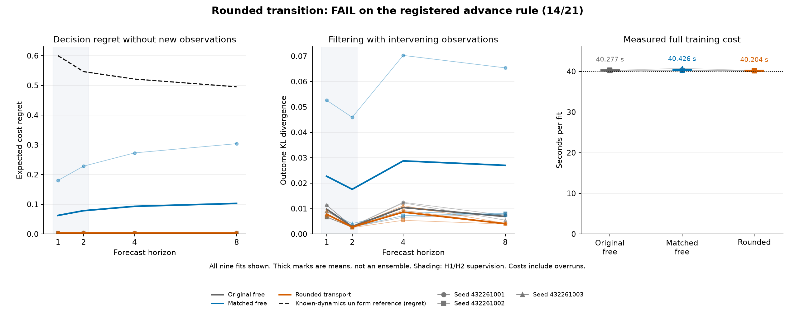

# Rounded transition under one training-time allowance

**ROUNDED_ADVANCE_FAIL: 14/21 conditions.**

All three arms use the same public-prefix-only stage until elapsed 10 seconds, then joint H1/H2 supervision until elapsed 40 seconds from one start. They share 352 stored parameters and fresh data. Late updates restore model, optimizer and cursor state; all attempted work remains charged.

[Protocol](../finite-rounded-learning-protocol.md) · [All saved numbers](summary.json) · [Original evidence receipt](receipt.json)

| Arm | Transition | Initial comparison |
|---|---|---|
| Original free | Column softmax | Original seeded logits |
| Matched free | Column softmax | Effective transition matched to rounded initialization within 1e-12 |
| Rounded | Four fixed sweeps, slack contractions and rank-one correction | Same original raw logits |

Emission, hazard and cost-head initial parameters are paired. The rounded constraint has 196 ideal transition degrees versus 224 for free columns, despite equal raw parameter counts. Function matching does not match gradients or update counts. The construction uses the task's doubly stochastic structure and still permits uniform mixing.

| Criterion | Original free | Matched free | Rounded |
|---|---|---|---|
| SHORT_HORIZON_LEARNING | PASS 24/24 | PASS 24/24 | PASS 24/24 |
| BLIND_EXTRAPOLATION | PASS 21/21 | FAIL 17/21 | PASS 21/21 |
| OBSERVED_FILTERING_EXTRAPOLATION | PASS 8/8 | PASS 8/8 | PASS 8/8 |

Advance requires all three original rounded-arm criteria. Against each control, all six paired H4/H8 regret differences must be nonpositive, both horizon means must improve at least 10% from positive control means, and mean full fit time must be at most 1.05 times the control. No mean or control substitution rescues a failed condition.

| Advance condition | Outcome |
|---|---|
| BLIND_EXTRAPOLATION | PASS |
| OBSERVED_FILTERING_EXTRAPOLATION | PASS |
| SHORT_HORIZON_LEARNING | PASS |
| matched_free_432261001_h4_nonpositive_regret_difference | PASS |
| matched_free_432261001_h8_nonpositive_regret_difference | PASS |
| matched_free_432261002_h4_nonpositive_regret_difference | FAIL |
| matched_free_432261002_h8_nonpositive_regret_difference | FAIL |
| matched_free_432261003_h4_nonpositive_regret_difference | PASS |
| matched_free_432261003_h8_nonpositive_regret_difference | PASS |
| matched_free_h4_ten_percent_mean_regret | PASS |
| matched_free_h8_ten_percent_mean_regret | PASS |
| matched_free_mean_fit_time_within_five_percent | PASS |
| original_free_432261001_h4_nonpositive_regret_difference | PASS |
| original_free_432261001_h8_nonpositive_regret_difference | PASS |
| original_free_432261002_h4_nonpositive_regret_difference | FAIL |
| original_free_432261002_h8_nonpositive_regret_difference | FAIL |
| original_free_432261003_h4_nonpositive_regret_difference | FAIL |
| original_free_432261003_h8_nonpositive_regret_difference | PASS |
| original_free_h4_ten_percent_mean_regret | FAIL |
| original_free_h8_ten_percent_mean_regret | FAIL |
| original_free_mean_fit_time_within_five_percent | PASS |

## Paired long-horizon comparisons

| Control | Seed | H | Rounded regret | Control regret | Difference | Relative reduction |
|---|---:|---:|---:|---:|---:|---:|
| original_free | 432261001 | 4 | 0.003721272 | 0.004485294 | -0.0007640226 | 17.034% |
| original_free | 432261002 | 4 | 0.00366486 | 0.002625416 | 0.001039443 | -39.592% |
| original_free | 432261003 | 4 | 0.003662907 | 0.002835372 | 0.0008275354 | -29.186% |
| original_free | 432261001 | 8 | 0.002949317 | 0.003409226 | -0.0004599092 | 13.490% |
| original_free | 432261002 | 8 | 0.004237837 | 0.001962758 | 0.002275079 | -115.912% |
| original_free | 432261003 | 8 | 0.002942435 | 0.003221317 | -0.0002788823 | 8.657% |
| matched_free | 432261001 | 4 | 0.003721272 | 0.2729354 | -0.2692141 | 98.637% |
| matched_free | 432261002 | 4 | 0.00366486 | 0.002625416 | 0.001039443 | -39.592% |
| matched_free | 432261003 | 4 | 0.003662907 | 0.003758395 | -9.548814e-05 | 2.541% |
| matched_free | 432261001 | 8 | 0.002949317 | 0.3039293 | -0.30098 | 99.030% |
| matched_free | 432261002 | 8 | 0.004237837 | 0.001962758 | 0.002275079 | -115.912% |
| matched_free | 432261003 | 8 | 0.002942435 | 0.002974432 | -3.199674e-05 | 1.076% |

## Three-seed means

| Arm | H | Blind MSE | Regret | Observed KL |
|---|---:|---:|---:|---:|
| original_free | 1 | 0.002300192 | 0.002951893 | 0.009760721 |
| original_free | 2 | 0.002202374 | 0.003362414 | 0.002923196 |
| original_free | 4 | 0.00172048 | 0.003315361 | 0.01042203 |
| original_free | 8 | 0.00129321 | 0.002864434 | 0.006884933 |
| matched_free | 1 | 0.02094981 | 0.0625084 | 0.02272644 |
| matched_free | 2 | 0.02353433 | 0.07841092 | 0.0176025 |
| matched_free | 4 | 0.02476274 | 0.09310641 | 0.02876771 |
| matched_free | 8 | 0.02490415 | 0.1029555 | 0.02701782 |
| rounded | 1 | 0.002177467 | 0.004112221 | 0.007782068 |
| rounded | 2 | 0.002111013 | 0.003859001 | 0.002737596 |
| rounded | 4 | 0.001729053 | 0.003683013 | 0.008608115 |
| rounded | 8 | 0.001217435 | 0.00337653 | 0.004054153 |

Arithmetic means of separately fitted models on common cases, not an ensemble or significance test.

## Every training allocation

| Arm | Seed | Accepted joint | Accepted prefix | All attempted | Timed s | Overrun s | Summary s | Construction s | Full fit s |
|---|---:|---:|---:|---:|---:|---:|---:|---:|---:|
| original_free | 432261001 | 3523 | 1463 | 4988 | 40.009650 | 0.009650 | 0.002275 | 0.001869 | 40.249198 |
| original_free | 432261002 | 3207 | 1483 | 4692 | 40.013072 | 0.013072 | 0.013087 | 0.000313 | 40.339622 |
| original_free | 432261003 | 3283 | 1400 | 4685 | 40.009009 | 0.009009 | 0.003436 | 0.000342 | 40.242168 |
| matched_free | 432261001 | 3411 | 1497 | 4910 | 40.007968 | 0.007968 | 0.005916 | 0.004068 | 40.277435 |
| matched_free | 432261002 | 3193 | 1505 | 4700 | 40.018566 | 0.018566 | 0.005126 | 0.000607 | 40.244902 |
| matched_free | 432261003 | 968 | 1467 | 2437 | 40.067085 | 0.067085 | 0.005913 | 0.001022 | 40.756179 |
| rounded | 432261001 | 2866 | 1372 | 4240 | 40.011325 | 0.011325 | 0.002170 | 0.000559 | 40.203580 |
| rounded | 432261002 | 2583 | 1267 | 3852 | 40.011462 | 0.011462 | 0.002379 | 0.000314 | 40.199347 |
| rounded | 432261003 | 2738 | 1287 | 4027 | 40.012845 | 0.012845 | 0.001426 | 0.000915 | 40.210240 |

Fit seconds include construction, both allocation stages, discarded attempts, boundary checkpoints, final diagnostics and durable full trace; final fit-row publication and shared preprocessing remain included in outer producer time.

Timing columns are nested, not additive. All arms freeze the cost head in prefix training, then start joint training at batch zero with fresh Adam state. Identical eligibility windows are not equal FLOPs, accepted updates or actual wall time. Full construction and structural forward-operation counters are retained in the summary; they do not count backward FLOPs.

## Correction at every rounded boundary

| Seed | Boundary | Pre-round row residual | Pre-round column residual | Largest action correction mass | Largest correction entry | Largest change | Final row residual | Final column residual |
|---|---|---:|---:|---:|---:|---:|---:|---:|
| 432261001 | initial | 3.0842e-13 | 2.220446e-16 | 8.000002e-08 | 1.250001e-09 | 1.660403e-10 | 1.110223e-16 | 2.220446e-16 |
| 432261001 | boundary | 0.0255833 | 3.330669e-16 | 0.04404493 | 0.01452299 | 0.02203455 | 2.220446e-16 | 2.220446e-16 |
| 432261001 | final | 0.01453961 | 2.220446e-16 | 0.02279569 | 0.007418325 | 0.01012268 | 2.220446e-16 | 2.220446e-16 |
| 432261002 | initial | 2.847722e-13 | 4.440892e-16 | 8.000002e-08 | 1.250002e-09 | 1.483942e-10 | 2.220446e-16 | 2.220446e-16 |
| 432261002 | boundary | 0.03372408 | 3.330669e-16 | 0.05770296 | 0.01314971 | 0.02323766 | 3.330669e-16 | 2.220446e-16 |
| 432261002 | final | 0.01394644 | 2.220446e-16 | 0.02636475 | 0.005831582 | 0.01367182 | 2.220446e-16 | 2.220446e-16 |
| 432261003 | initial | 2.620126e-13 | 3.330669e-16 | 8.000002e-08 | 1.250001e-09 | 1.498742e-10 | 2.220446e-16 | 2.220446e-16 |
| 432261003 | boundary | 0.02283632 | 4.440892e-16 | 0.03652004 | 0.01054621 | 0.01987509 | 2.220446e-16 | 2.220446e-16 |
| 432261003 | final | 0.01362797 | 2.220446e-16 | 0.02174961 | 0.006450673 | 0.01071374 | 2.220446e-16 | 2.220446e-16 |

These nine records are independently reconstructed from the rounded arm's saved initial, stage-one boundary and final parameters. All 27 arm/boundary records remain in the summary; the 18 free records use their actual column softmax and have no correction values. Each correction uses four sweeps and fixed slack 1e-8, with final residual tolerance 1e-12. Boundary values do not bound unsaved intermediate training states or replay their gradients. A balanced input X becomes (1-1e-8)X+1e-8 U, so the correction is an intentional parameterization, not a numerical-only repair.

## Every endpoint metric

| Arm | Seed | H | Cases | Blind MSE | Regret | Survival MAE | Observed MSE | Observed survival MAE | Observed KL | Shuffled regret |
|---|---:|---:|---:|---:|---:|---:|---:|---:|---:|---:|
| original_free | 432261001 | 1 | 116 | 0.002611778 | 0.002937516 | 0.002958696 | 0.002611778 | 0.002958696 | 0.01134767 | 0.5978252 |
| original_free | 432261001 | 2 | 116 | 0.0024622 | 0.004497807 | 0.004098043 | 0.002491304 | 0.002633729 | 0.003091874 | 0.520399 |
| original_free | 432261001 | 4 | 116 | 0.001934559 | 0.004485294 | 0.005916464 | 0.002866937 | 0.003022295 | 0.01247118 | 0.5663952 |
| original_free | 432261001 | 8 | 116 | 0.001434569 | 0.003409226 | 0.009225912 | 0.001808576 | 0.002335295 | 0.007337636 | 0.4907492 |
| original_free | 432261002 | 1 | 116 | 0.001547476 | 0.003123537 | 0.002954863 | 0.001547476 | 0.002954863 | 0.006555251 | 0.5972504 |
| original_free | 432261002 | 2 | 116 | 0.001569162 | 0.002664497 | 0.004000111 | 0.001180818 | 0.002601911 | 0.002745895 | 0.5198448 |
| original_free | 432261002 | 4 | 116 | 0.001164295 | 0.002625416 | 0.005664026 | 0.001376782 | 0.003002519 | 0.006566598 | 0.5593681 |
| original_free | 432261002 | 8 | 116 | 0.0009852011 | 0.001962758 | 0.008841575 | 0.002035567 | 0.002363372 | 0.007852816 | 0.4907463 |
| original_free | 432261003 | 1 | 116 | 0.002741324 | 0.002794625 | 0.002956075 | 0.002741324 | 0.002956075 | 0.01137924 | 0.5972537 |
| original_free | 432261003 | 2 | 116 | 0.00257576 | 0.002924937 | 0.004088358 | 0.002586329 | 0.00264255 | 0.002931821 | 0.5198448 |
| original_free | 432261003 | 4 | 116 | 0.002062588 | 0.002835372 | 0.005857135 | 0.002905348 | 0.003017135 | 0.01222832 | 0.5669229 |
| original_free | 432261003 | 8 | 116 | 0.001459859 | 0.003221317 | 0.009059087 | 0.001365955 | 0.002313606 | 0.005464348 | 0.4906616 |
| matched_free | 432261001 | 1 | 116 | 0.05046715 | 0.1803551 | 0.003023021 | 0.05046715 | 0.003023021 | 0.05261821 | 0.5879765 |
| matched_free | 432261001 | 2 | 116 | 0.05864983 | 0.2282412 | 0.003651358 | 0.06030843 | 0.00264429 | 0.04593128 | 0.5276127 |
| matched_free | 432261001 | 4 | 116 | 0.06310855 | 0.2729354 | 0.00477466 | 0.06470756 | 0.002958728 | 0.07028336 | 0.5494208 |
| matched_free | 432261001 | 8 | 116 | 0.06490421 | 0.3039293 | 0.007065859 | 0.06314842 | 0.002991746 | 0.06538545 | 0.5103985 |
| matched_free | 432261002 | 1 | 116 | 0.001619571 | 0.003123537 | 0.002962297 | 0.001619571 | 0.002962297 | 0.00666938 | 0.5972504 |
| matched_free | 432261002 | 2 | 116 | 0.001644077 | 0.002664497 | 0.004003264 | 0.001359763 | 0.002619472 | 0.00277384 | 0.5198448 |
| matched_free | 432261002 | 4 | 116 | 0.001211342 | 0.002625416 | 0.005652208 | 0.00155744 | 0.003016092 | 0.007214027 | 0.5593681 |
| matched_free | 432261002 | 8 | 116 | 0.001038354 | 0.001962758 | 0.00880932 | 0.00207207 | 0.002387942 | 0.008145723 | 0.4974689 |
| matched_free | 432261003 | 1 | 116 | 0.01076272 | 0.004046569 | 0.003231198 | 0.01076272 | 0.003231198 | 0.008891724 | 0.5889373 |
| matched_free | 432261003 | 2 | 116 | 0.01030907 | 0.004327117 | 0.004190676 | 0.0111701 | 0.002845626 | 0.004102361 | 0.5198417 |
| matched_free | 432261003 | 4 | 116 | 0.009968315 | 0.003758395 | 0.005431459 | 0.0119578 | 0.003087369 | 0.00880575 | 0.5746201 |
| matched_free | 432261003 | 8 | 116 | 0.008769882 | 0.002974432 | 0.008297796 | 0.01253773 | 0.002601859 | 0.007522293 | 0.4967043 |
| rounded | 432261001 | 1 | 116 | 0.002198776 | 0.004286038 | 0.002964872 | 0.002198776 | 0.002964872 | 0.007452648 | 0.5968505 |
| rounded | 432261001 | 2 | 116 | 0.002115021 | 0.00381441 | 0.004063173 | 0.002318108 | 0.002647897 | 0.002939015 | 0.5198044 |
| rounded | 432261001 | 4 | 116 | 0.001747565 | 0.003721272 | 0.005759057 | 0.002477351 | 0.00300253 | 0.009284541 | 0.5577454 |
| rounded | 432261001 | 8 | 116 | 0.001140679 | 0.002949317 | 0.00889666 | 0.001303702 | 0.002263236 | 0.004034024 | 0.5020876 |
| rounded | 432261002 | 1 | 116 | 0.001732041 | 0.003963007 | 0.002895313 | 0.001732041 | 0.002895313 | 0.006815311 | 0.605524 |
| rounded | 432261002 | 2 | 116 | 0.001696395 | 0.003942764 | 0.004006986 | 0.001142389 | 0.002618573 | 0.002518931 | 0.5198419 |
| rounded | 432261002 | 4 | 116 | 0.001357455 | 0.00366486 | 0.005722574 | 0.001312118 | 0.002919818 | 0.005390075 | 0.5593713 |
| rounded | 432261002 | 8 | 116 | 0.001178942 | 0.004237837 | 0.008909076 | 0.0009738901 | 0.002258819 | 0.003910594 | 0.4898389 |
| rounded | 432261003 | 1 | 116 | 0.002601585 | 0.004087618 | 0.00292441 | 0.002601585 | 0.00292441 | 0.009078244 | 0.5968505 |
| rounded | 432261003 | 2 | 116 | 0.002521623 | 0.00381983 | 0.00402589 | 0.002756769 | 0.002653154 | 0.002754842 | 0.5198012 |
| rounded | 432261003 | 4 | 116 | 0.002082139 | 0.003662907 | 0.005731954 | 0.003043753 | 0.002970009 | 0.01114973 | 0.5592515 |
| rounded | 432261003 | 8 | 116 | 0.001332684 | 0.002942435 | 0.008879267 | 0.001344792 | 0.002272803 | 0.004217841 | 0.4899294 |

## Evidence and limits

The original engineering log records 216 passing tests and 1 warning. Qualification includes a complete independent audit of its small saved run. All nine scientific final checkpoints precede fresh DEV generation. The independent audit makes 45 array reads, including 27 parameter checkpoints, plus 27 optimizer JSON reads; it reconstructs public-history targets, metrics, transition boundaries and work records without model, optimizer or environment calls.

| Original supervised phase | Seconds |
|---|---:|
| qualify | 15.952 |
| fit | 378.126 |
| audit | 25.566 |
| Total of these three original phases | 419.644 |

All seeds and registered conditions are retained. Historical update losses, timings and intermediate hash records are source-qualified attestations, not a training replay. The exact reference uses known dynamics; learned arms receive public histories. Observed filtering has intervening observations and is distinct from blind extrapolation. These synthetic results and their privileged initial readout do not establish statistical significance, latent identification, native transfer, biological wiring advantages or architectural novelty. The earlier failed balanced integration remains closed.
