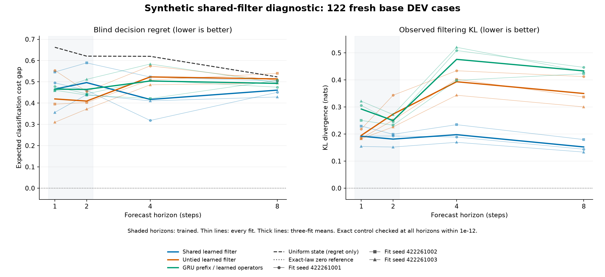

# Shared filtering improves forecasts, but still fails the learning criteria

**The shared filter makes partial progress without receiving the correct
starting state. All three prespecified criteria still fail.** Nine fits
completed, and the independent saved-output audit agrees with the targets,
metrics and work counts. This is a synthetic learning result, not a native-task
or architecture breakthrough.

Each learned model reads the same public history. The shared filter uses one
set of learned action/observation operators to process history and forecast
the future. The untied filter starts with the same predictions, but updates
separate history and forecast operators. The third model retains the existing
GRU history encoder. All use an eight-state representation and the same fixed,
exact cost readout. No learned arm receives an oracle posterior or true dynamics.
The fixed cost basis remains privileged task knowledge.

| Criterion | Shared filter | Untied filter | GRU prefix |
| --- | --- | --- | --- |
| Short-horizon learning | FAIL, 6/24 | FAIL, 7/24 | FAIL, 6/24 |
| Blind extrapolation | FAIL, 9/21 | FAIL, 9/21 | FAIL, 9/21 |
| Observed filtering extrapolation | FAIL, 2/8 | FAIL, 2/8 | FAIL, 2/8 |

These are condition counts, not accuracy scores. Every applicable threshold
must hold for all three fit seeds. The absolute requirements include halving
uniform-reference cost error and regret, and an observed KL limit of 0.1 nats.
Support and survival checks alone cannot establish a learning pass.

| Model | Parameters | Eight-step blind regret | Eight-step cost MSE | Eight-step observed KL |
| --- | ---: | ---: | ---: | ---: |
| Shared filter | 1,088 | 0.460997 | 0.098193 | 0.152373 |
| Untied filter | 2,144 | 0.513748 | 0.102412 | 0.349987 |
| GRU prefix | 6,412 | 0.492700 | 0.100624 | 0.433440 |
| Uniform state / exact dynamics | 0 | 0.523209 | 0.101444 | N/A |

Lower is better. Learned entries are arithmetic means of three independently
initialized fits, not ensemble decisions or confidence intervals. The uniform
reference knows the dynamics and discards history; it is not an optimal policy
that ignores history.

Shared filtering lowers mean eight-step regret **10.27% versus untied filtering**
and **6.43% versus the GRU prefix**, with improvements in every paired seed.
Mean observed KL falls **56.46% / 64.85%**, respectively, with all paired H4/H8
differences favorable. These are descriptive comparisons, not significance
tests; percentages compare the three-fit means. Four-step regret is mixed: one seed worsens against both controls.
Eight-step cost MSE also worsens against the GRU in one seed. The model remains
far from the absolute learning thresholds.

The study retained **481/512 TRAIN** and **122/128 fresh DEV** cases. Found
prefixes were excluded without replacement. All nine final checkpoints
preceded DEV generation. Training used 480 epochs and **34,560 updates**;
the complete fit/evaluation phase took **149.57 seconds** and the independent
audit took **0.65 seconds**. Qualification passed **88 tests** on its first
attempt, with one test-only tensor-to-scalar warning.

Parameter savings do not establish compute savings. The report retains all
training and evaluation timings, plus actual forward call/row counts. Evaluation
includes three forecast views and input/output copies; it is not per-decision
latency. Shared-filter evaluation was slower than the GRU-prefix control in
each paired seed on this run.

The result supports investigating how the recurrent filter is trained. It does
not establish convergence, correct latent-state recovery, calibration, a new
filtering algorithm or transfer to Doom, chess or robotics. The next proposal
adds observation prediction throughout the prefix, including terminal cases,
under a new protocol. This completed study remains closed.

[All seeds, paired differences and costs](finite-shared-filter-results/report.md) ·
[Machine-readable results](finite-shared-filter-results/summary.json) ·
[Frozen protocol](finite-shared-filter-protocol.md) ·
[All checkpoints and original evidence](https://github.com/kw2828/OpenJev/releases/tag/finite-shared-filter-v1) ·
[Next training comparison](finite-shared-filter-next.md).
