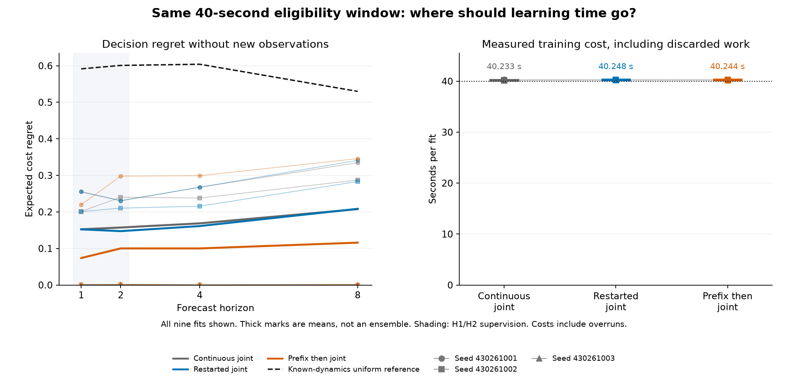

# Prefix learning helps averages at equal time, but remains unreliable

**The improvement survives an equal training-time allowance, but the method
fails its advance rule: 16/21 conditions pass.** All nine fits completed and
the independent saved-output audit agrees. Every method still fails the
long-horizon forecasting criterion.

| Method | Short horizon | Blind forecasting | Observed filtering | Mean full fit seconds |
| --- | --- | --- | --- | ---: |
| Continuous joint training | PASS 24/24 | FAIL 15/21 | PASS 8/8 | 40.233 |
| Joint training with Adam restart | PASS 24/24 | FAIL 16/21 | PASS 8/8 | 40.248 |
| Prefix likelihood, then joint training | PASS 24/24 | FAIL 18/21 | PASS 8/8 | 40.244 |

Fractions count satisfied conditions, not successful episodes. Each criterion
requires every condition to pass across all three seeds.

## What the equal-time comparison changes

The [previous result](finite-expected-count-learning-results.md) gave the
pretrained model extra training time. Here, all three methods receive one
40-second eligibility window, including construction and a stage boundary
at elapsed ten seconds. Prefix learning spends the first stage fitting
public-history likelihood; the controls spend it on the joint objective.
The model, data, H1/H2 supervision and paired initial weights are shared.

Prefix learning lowers mean four/eight-step decision regret **40.68% / 44.17%**
against continuous joint training, and **37.94% / 44.39%** against restarted
joint training. Its mean full fitting time differs by less than **0.03%**
from either control. Equal eligibility does not imply identical update counts,
FLOPs or actual elapsed time; all discarded work and overruns are charged.

| Mean decision regret, lower is better | H4 | H8 |
| --- | ---: | ---: |
| Continuous joint | 0.168688 | 0.207631 |
| Restarted joint | 0.161260 | 0.208444 |
| Prefix then joint | 0.100071 | 0.115912 |

The improvement is uneven. Against either control, four of six paired
seed/horizon comparisons improve, but seed **430261001** worsens at both
horizons. Prefix H8 regrets are **0.345800, 0.000935 and 0.001003** for the
three seeds. That first seed also fails the original long-horizon criterion.
The mean improvement and cost conditions pass; the failed absolute criterion
and four worse paired comparisons prevent advancement. These are descriptive
averages, not an ensemble or a significance test.

## What was checked

This is the same eight-state, **352-parameter** factorized recurrent model.
The new namespace is **430260924**, with **512 TRAIN attempts, 478 eligible**,
and **128 DEV attempts, 120 eligible**. Found-terminated histories still
contribute to prefix likelihood. All nine final models were saved before
DEV generation. No evaluation-informed checkpoint selection occurred.

The experiment retains all 27 model boundaries, 27 optimizer boundaries,
minibatch orders and every attempted update. Late updates restore both
parameters and Adam state. The joint controls carry the accepted minibatch
cursor across the boundary; the prefix method begins joint training at zero.
Independent fit clocks can give the joint controls different boundary states,
so this is not an isolated test of resetting Adam moments.

Qualification passes **269 selected tests and lint**, including an end-to-end
audit of the small engineering run. Original qualification, fit/evaluation
and audit phases close in **18.006, 364.204 and 4.564 seconds**. The audit
reconstructs targets, metrics, gates and saved-state joins without running a
model, optimizer or environment. Intermediate execution and timings remain
source-qualified records, not replayed training. The chart was visually
reviewed; its first display draft is retained in the evidence archive.

## Interpretation

This strengthens the evidence that learning allocation can help this model's
average decision performance without more elapsed training time. It does not
establish reliability across seeds, a new architecture, biological wiring,
calibrated probabilities, scenario transfer or an ICLR contribution. The
known task structure, uniform reset prior and privileged initial cost head
remain supplied advantages.

No candidate advances. The [prospective reading note](predictive-geometry-next.md)
examines predictive information and action consequences, including an algebraic
reason that a simple pairwise loss would duplicate existing supervision.
It admits no new training run. Earlier failed studies and the closed
longer-horizon-supervision follow-up remain closed.

[Frozen protocol](finite-training-allocation-protocol.md) ·
[Every metric and training cost](finite-training-allocation-results/report.md) ·
[Machine-readable results](finite-training-allocation-results/summary.json) ·
[Source and closure receipt](finite-training-allocation-results/receipt.json) ·
[Complete evidence](https://github.com/kw2828/OpenJev/releases/tag/finite-training-allocation-v1).

Registration SHA256:
`2867fc976559808ceda2b21818bdbf394c343f4871a95e6b24bd789a85b10145`.
