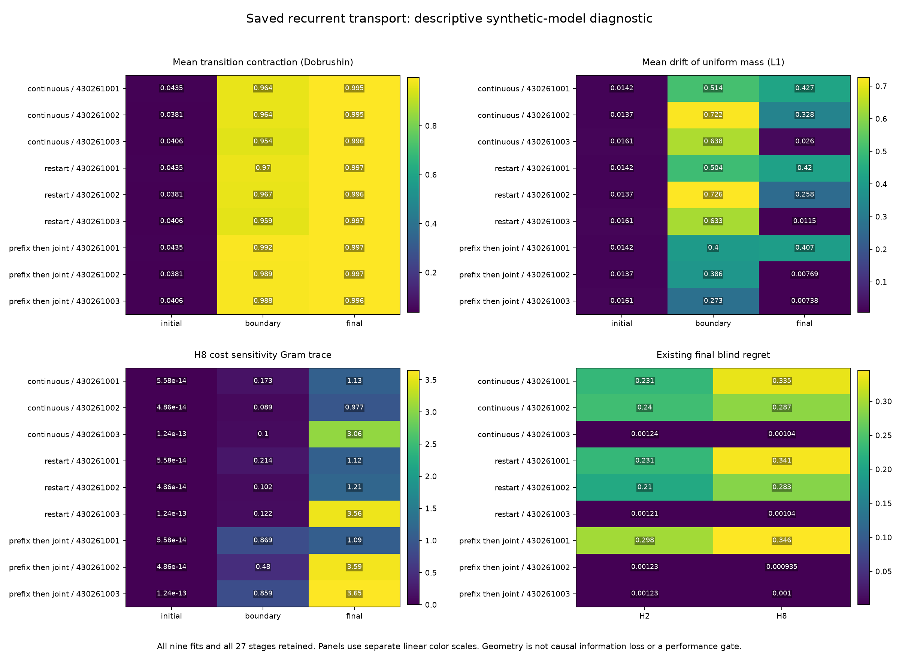

# Poor recurrent fits preserve some state differences and suppress others

**The saved models show a clear descriptive association between uneven
transition geometry and large decision errors.** This identifies a concrete
next intervention, but establishes neither its cause nor an improved model.
All nine fits and all 27 initial, boundary and final checkpoints are included.

The [parent experiment](finite-training-allocation-results.md) gave three
learning schedules equal training-time allowances. Prefix learning improved
average regret but failed its advance rule. This diagnostic reads those saved
parameters; it performs no new training or forecasting evaluation.

## What distinguishes the final fits

Each transition maps an eight-state probability vector to its next state.
Uniform drift measures how much it moves an initially uniform vector. The
minimum contrast singular value measures its weakest response to a state
difference whose entries sum to zero, taking the minimum across four actions.
These are properties of the learned model, not errors against true dynamics.

| Schedule | Seed | Mean uniform drift | Minimum contrast singular value | Existing H2 regret | Existing H8 regret |
| --- | ---: | ---: | ---: | ---: | ---: |
| Continuous joint | 430261001 | 0.427356 | 0.00137933 | 0.230588 | 0.334590 |
| Continuous joint | 430261002 | 0.327928 | 0.000301193 | 0.240200 | 0.287259 |
| Continuous joint | 430261003 | 0.025959 | 0.895414 | 0.001243 | 0.001044 |
| Restarted joint | 430261001 | 0.419848 | 0.00148643 | 0.230588 | 0.341086 |
| Restarted joint | 430261002 | 0.257583 | 0.00000371555 | 0.210340 | 0.283204 |
| Restarted joint | 430261003 | 0.011510 | 0.955501 | 0.001205 | 0.001044 |
| Prefix then joint | 430261001 | 0.407308 | 0.00162892 | 0.297854 | 0.345800 |
| Prefix then joint | 430261002 | 0.007694 | 0.960057 | 0.001227 | 0.000935 |
| Prefix then joint | 430261003 | 0.007383 | 0.960937 | 0.001227 | 0.001003 |

The five inaccurate fits have mean drift **0.258-0.427**, with at least one
very weak transition direction. The four accurate fits have drift
**0.00738-0.02596**, with minimum singular values above **0.895**. These groups
describe the visible error separation; no classifier or threshold was fitted.
There are only three paired seeds, not nine independent replications.

Two simpler summaries miss the distinction. Mean Dobrushin coefficients
overlap near **0.995-0.997** across good and bad fits: retaining a strongly
distinguishable pair does not imply preserving every relevant direction.
Every final eight-step cost Gram has rank seven at every registered threshold.
Its spectrum can still be uneven. Complete rank collapse is not the diagnosis.
Emission and readout contrast ranks are at most three by construction; their
structural zero modes must not be mistaken for learned failure.

The weak prefix fit already has large H1/H2 errors. Its short-horizon pass
against the uniform reference did not establish accurate prediction. Its
observed-filtering error is also worse than the other prefix fits, so a
cost-head-only explanation is insufficient. The result does not isolate a
defect that appears only at long horizons.

## Why balancing is worth testing, and what it cannot guarantee

A doubly stochastic transition preserves uniform mass. That matches additional
known structure in this particular synthetic world, whose transitions mix a
permutation with uniform noise. A prospective intervention can test whether
enforcing this structure improves learning reliability, against a free model
starting from the same effective probabilities.

Balancing alone does not preserve memory: the uniform matrix is doubly
stochastic and erases all state contrasts. Indeed, our initial models already
have low uniform drift and almost no eight-step sensitivity. Every stage-boundary
model also has large drift, including models that later become accurate.
Low drift alone is neither a training-progress measure nor a success rule.

The [next experiment note](balanced-transport-next.md) separates persistent
balancing from its initialization effect and charges the normalization work.
It does not reopen the closed longer-horizon-supervision follow-up. The
[earlier retentive-initialization failure](finite-observation-learning-results.md)
also remains negative evidence.

## Evidence and limits

Qualification passed **53 fabricated-array tests and lint**. The first attempt
failed three overly strict floating-point assertions; its source snapshot,
logs and failure receipt remain in the archive. Only arithmetic error bounds
in those assertions changed. The diagnostic formulas and spectral thresholds
did not change. The successful qualification and diagnostic took **0.935** and
**0.510 seconds**, respectively.

The diagnostic decoded exactly **27 checkpoint archives and 108 parameter
arrays**, with zero model, optimizer or generator calls and zero new cases.
Publication used only the closed JSON and opaque file hashes. Its archive
contains **126 members**, with byte-for-byte verification. All registered
source and parent evidence files stayed unchanged. The figure was visually
checked after rendering.

The Gram quantities average uniformly over action sequences and include
survival attenuation. They describe learned sensitivity, not mutual information,
true-state recovery, policy-weighted utility or a causal optimization mechanism.
No architecture advances and no biological, robotics or ICLR novelty claim
follows from this diagnostic.

[Protocol](finite-transport-diagnostic-protocol.md) ·
[All spectra, ranks and existing errors](finite-transport-diagnostic-results/summary.json) ·
[Publication report](finite-transport-diagnostic-results/report.md) ·
[Receipt](finite-transport-diagnostic-results/receipt.json) ·
[Child evidence](finite-transport-diagnostic-results/evidence.tar.gz) ·
[Required parent checkpoints and evidence](https://github.com/kw2828/OpenJev/releases/tag/finite-training-allocation-v1).

Registration SHA256:
`3f1aefbd5f869e08c40b5a1f2beefeb1b0c7361a9462860e363a92bcc90c8352`.
