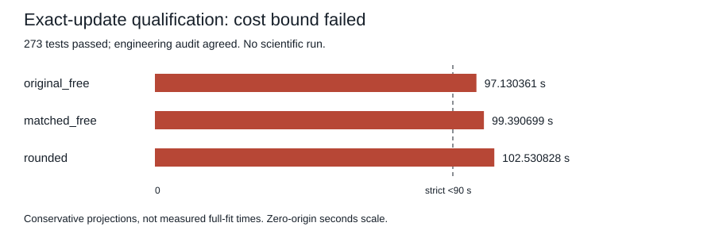

# Exact-update learning stopped at feasibility qualification

**QUALIFICATION_FAILED.** All 273 tests passed with one warning, and the three retained engineering fits passed their independent saved-output checks. Each conservative full-fit projection exceeded the registered strict 90-second bound. No scientific study was registered or started.

| Arm | Prefix stage(s) | Joint stage(s) | Complete probe fit(s) | Projected full fit(s) | Feasible below 90s |
| --- | ---: | ---: | ---: | ---: | --- |
| original_free | 0.308489875 | 0.798271375 | 1.859718042 | 97.130360804 | FAIL |
| matched_free | 0.334584792 | 0.811964791 | 1.175202334 | 99.390699388 | FAIL |
| rounded | 0.281294792 | 0.880314125 | 1.179414542 | 102.530828309 | FAIL |

The engineering probe used namespace 942201, seed 942301, 512 TRAIN attempts and 8 DEV attempts. Each arm completed exactly 32 prefix updates and 64 joint updates. Its audit checked saved targets, predictions, paired batches and model/optimizer boundaries. These small engineering outputs are not scientific effectiveness results.

The preselected scientific schedule was 1024 prefix and 3072 joint updates per fit. The frozen rule was `2 * (prefix_stage_seconds * 32 + joint_stage_seconds * 48) + measured_nonstage_fit_seconds < 90`. All three projections failed. This is a conservative feasibility rejection, not proof that a measured full fit would exceed the separate 120-second safety cap. Counts and thresholds were not adjusted.

The original supervised qualification closed with exit 1 after 11.249260417s. Tests took 4.29s and the exposure helper recorded 5.472502875s internally; the full exposure command took 5.932906708s including child startup. These scopes are nested within the qualification, not additive. No retry, scientific registration, scientific fit, or scientific audit followed. The previous equal-time result remains separate and failed.

The archive preserves every 128 original child-study file, all 75 current registered sources and their complete frozen snapshot, original command/process receipts and logs, the retained three-fit probe, the complete pinned rounded-kernel proof/publication, and the five registered parent-evidence files. Arrays and checkpoints are copied as opaque bytes. System-temporary pytest fixtures were not retained and are not claimed to be in this archive. The interpreter and installed packages remain external.

The saved engineering audit reports arithmetic agreement while leaving original process admission to its caller. Its enclosing original qualification is authentically closed as failed. Publication does not relabel it as technical qualification success or establish a model/architecture gain.

[Complete summary](finite-update-learning-stop-results/summary.json) · [Exact member manifest](finite-update-learning-stop-results/manifest.json) · [Evidence archive](finite-update-learning-stop-results/evidence.tar.gz)
