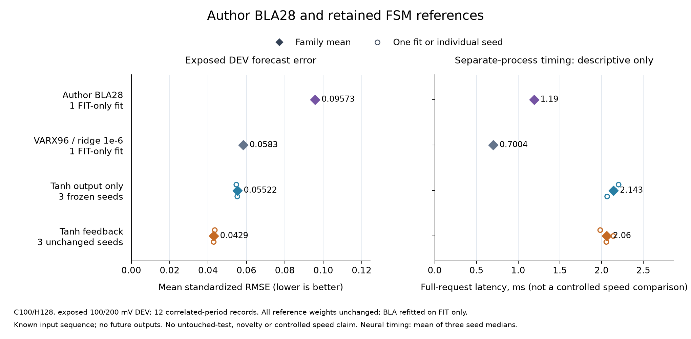

# The recurrent gain survives a FIT-only author linear reference

The pooled author BLA28 adaptation completed its fit and all 384 development
forecasts. It did not remove the fixed recurrent residual's advantage. It also
did not become our strongest control: longer-memory VARX remains the better
linear predictor on this task. **All four registered continuation checks passed,
with independent audit agreement.** This supports proceeding to the nonlinear
reference comparison, not opening the reserved scenario yet.

| Model | Mean standardized forecast RMSE | Observed request latency | Numeric storage |
|---|---:|---:|---:|
| Author BLA28, FIT-only causal adaptation | 0.095731 | 1.190 ms | 8,040 B |
| Best longer-memory linear control, VARX96 | 0.058296 | 0.700 ms | 18,648 B |
| Tanh output-only correction | 0.055222 | 2.143 ms | 44,592 B |
| Fixed tanh recurrent feedback correction | **0.042901** | 2.060 ms | 44,592 B |

Lower error is better. Neural errors average all three unchanged seeds. Latencies
come from separate processes and measure these implementations; they do not
establish a matched speed advantage. BLA timing includes a new context-state
solve on every request. Storage excludes transient workspace and interpreter
overhead. The [previous comparison](fsm-linear-controls-results.md) retains all
fifteen control families and their measurements.

The candidate is **55.19% lower in error than this BLA adaptation**, but that
headline is weaker evidence than its existing **26.41% gain over VARX96** and
**22.31% gain over output-only correction**. We retain the strongest comparison.
The BLA's weaker result does not show why it underperformed; its frequency-domain
training objective differs from the conditional forecast objective.

## What ran

The [protocol](fsm-author-bla-protocol.md) and [registration](fsm-author-bla-registration.json)
were published in commit `5bad1abd` before the one measured child process.
The exact author source is
[`freq-statespace` a79e8c56](https://github.com/merijnfloren/freq-statespace/tree/a79e8c567b018a6c9462528fc1e10b77fd19b3e2).
This is a restricted refit of a published method, not a new architecture or a
reproduction of the authors' released weights or periodic test score.

- FIT: realizations 0..2 at 100 and 200 mV, both periods. The author method
  computes its own FIT normalization and averages periods internally.
- Model: 28 states, subspace dimension 29, unweighted frequency response,
  BFGS with original `rtol=1e-3`, `atol=1e-5`, maximum 5,000 iterations.
- The original child exited successfully in **20.00 seconds**. BFGS stopped
  after **574 iterations** using its small-change condition. FIT frequency MSE
  fell from **0.00141614 to 0.00082482**. This is not a stationarity certificate.
- DEV: the same twelve exposed records, each with 32 requests of 100 observed
  samples followed by a 128-step forecast. Periods remain separate.
- Initialization: a fixed least-squares state estimate from the 99 available
  observation/input pairs. No future outputs or periodic tail warmup.
- The shared context observability matrix had rank 28 at the fixed cutoff.
  The fitted transition matrix's spectral radius was 0.993326. Neither fact
  establishes accurate physical-state recovery or robustness under shift.

All three recurrent seeds beat this new BLA, as do their means on both amplitudes
and every record. The strongest control remains the previously selected
output-only model. All four frozen rules against that strongest control pass:
at least 5% lower mean error, every seed improves, no record over 2% worse, and
both amplitudes improve. No neural weights, learning rates or seeds were changed.

## Evidence and limits

Before fitting, **109 fabricated checks** passed in the isolated numerical
environment, including the native-shape reader's four-member access boundary.
The [engineering report](fsm-author-engineering-results.md) also retains the
synthetic author fit, save/load parity and earlier failed lint attempts.
The supervisor passed completion, failure, timeout, identity-change and
existing-output rejection checks. Numerical models use CPU float64.

The independent audit reconstructed all **384 new requests** from saved numeric
matrices and physical contexts, then rescored **300 prior forecast banks**.
Maximum normalized prediction difference was **7.55e-15**, below the registered
1e-8 tolerance. It made no author-package calls, refits or timing reruns.
[Audit](fsm-author-bla-results/audit.json) ·
[Original process](fsm-author-bla-results/original-process.json) ·
[Complete evidence and model checkpoints](https://github.com/kw2828/OpenJev/releases/tag/fsm-author-bla-study-v1).

Only the 100/200 mV training archive members were decoded. **All 300 mV and
official-test measurements and their headers remain unopened.** The original
archive is CC BY 4.0, credited to Merijn Floren, KU Leuven and Floren et al.,
ISMA-USD 2024. The isolated author integration is GPL-3.0-or-later; see its
[notices](fsm_author/THIRD_PARTY.md).

This is development evidence on one measured system. Repeated periods share
a realization, and windows from the same realization are correlated. The candidate was selected on these same
records in earlier work. The author neural NL-LFR has not been fitted under
this causal contract, so this result cannot stand in for that nonlinear control.
It also establishes no new biological mechanism, connectome advantage, control
performance, untouched transfer or ICLR-ready contribution.

The next useful comparison is a qualified FIT-only NL-LFR with a bounded causal
state initializer. Keep the candidate fixed. Only after that reference check
should the reserved 300 mV scenario receive its separately frozen evaluation.
