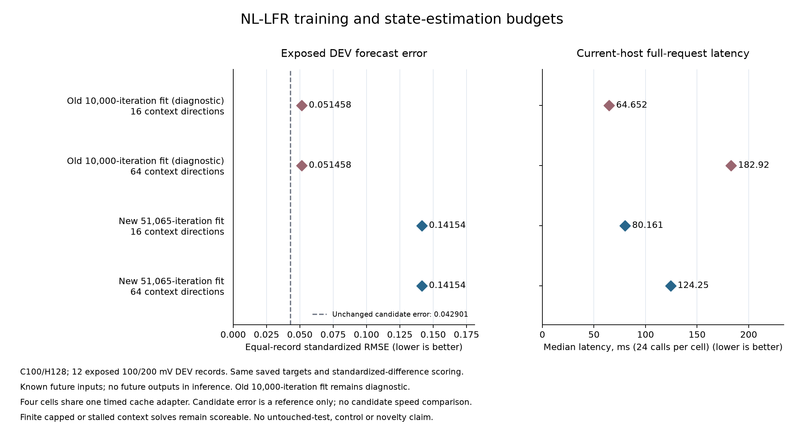

# Longer training did not improve the nonlinear reference

**Reference complete; candidate continuation passes 4/4.** The independent audit
replays all 1,536 forecasts and agrees with the original four-condition evaluator.
The unchanged tanh-feedback candidate retains **22.31% lower exposed-DEV
error** than the strongest eligible control, tanh output-only: **0.042901 vs
0.055222**. The strongest control is unchanged after adding both completed
nonlinear-reference policies. This closes the registered reference check;
it is not untouched confirmation or an architecture-novelty result.

| Checkpoint | Context directions | Mean RMSE | 100 mV | 200 mV | Median request, ms |
| --- | ---: | ---: | ---: | ---: | ---: |
| Old 10,000, capped diagnostic | 16 | 0.051457732 | 0.040770102 | 0.062145362 | 64.652 |
| Old 10,000, capped diagnostic | 64 | 0.051458274 | 0.040770921 | 0.062145626 | 182.919 |
| New 51,065, training complete | 16 | 0.141538778 | 0.115177196 | 0.167900360 | 80.161 |
| New 51,065, training complete | 64 | 0.141535923 | 0.115179689 | 0.167892157 | 124.249 |

The fresh larger-budget fit lowers the native training objective from **53.197659
to 33.969512**, stopping after 51,065 iterations. Its first 10,000 losses match
the old fit exactly. Yet causal C100/H128 forecast error rises roughly **175%**
at both inference budgets. Extra state estimation changes error by less than
0.003% at either checkpoint while increasing median latency. Longer training worsens
forecasting under this recipe; extra context-solver work does not recover that loss.
It does not identify whether overfitting, objective mismatch or initialization
accounts for the deterioration: the new fit changes both learned dynamics and
the final-linear seed used to infer state.

## Budget contrasts

Positive reductions mean lower error; negative reductions mean deterioration.
Each relative effect uses the displayed starting error as its denominator.

| Change | Starting error | Absolute reduction | Relative reduction |
| --- | ---: | ---: | ---: |
| `old16` to `new16` | 0.051457732 | -0.090081046 | -175.058330% |
| `old64` to `new64` | 0.051458274 | -0.090077649 | -175.049884% |
| `old16` to `old64` | 0.051457732 | -0.000000542 | -0.001053% |
| `new16` to `new64` | 0.141538778 | 0.000002855 | 0.002017% |

The absolute interaction `(old64-new64)-(old16-new16)` is
**0.000003397382**. Reduced context-fit loss does not
imply better future prediction. The original 10,000-iteration fit remains a
capped diagnostic, even though its forecast error is lower than the completed fit.

## Coverage, solver work and continuation

The original evaluator closed in **213.62 seconds**; the independent audit closed
in **216.02 seconds**. All **1,536 forecasts, 48 record-condition slots, four
warmups and 96 timing calls** complete with no failures. All 384 old16 replays
match exactly; all 768 within-checkpoint seed/trace comparisons pass, including
identical early stops where applicable and nonincreasing context objectives.
The audit also rescores 312 unchanged historical forecast banks and makes no
new raw-recording decode, training call or timing replay.

| Cell | Context iteration cap | Stalled | Gradient tolerance |
| --- | ---: | ---: | ---: |
| `old16` | 378 | 5 | 1 |
| `old64` | 2 | 145 | 237 |
| `new16` | 230 | 154 | 0 |
| `new64` | 24 | 335 | 25 |

Finite capped and stalled context solves remain scoreable under the unchanged
protocol. These statuses are not convergence or forecasting-quality certificates.
All four policies retain **60,184 numeric bytes per stream**; the inference
budget changes work, not parameter storage.

The unchanged candidate passes every frozen condition against the same strongest
control: at least 5% lower mean error, improvement in every paired seed, no record
seed-mean more than 2% worse, and improvement at both amplitudes. The ranking
includes 18 eligible families including the candidate, hence 17 controls. Both
completed new-reference policies stay in that ranking. All records, all family
scores, paired seeds, 96 latencies and timed solver-work totals appear in the
[complete scalar tables](fsm-author-nllfr-factorial-results/table.md).

The four-cell timings use the same current-host cache adapter and rotated order,
including fresh legal input copies, normalization, state estimation, Jacobian and
line-search work, final SVD, rollout and physical output conversion. Disk I/O and
scoring are excluded. The candidate was not re-timed in this run, so its earlier
latency cannot establish a matched speed or deployment-frontier claim here.

## Meaning and next experiment

These are the same twelve exposed 100/200 mV DEV records used in earlier model
selection, one author-method seed, and a previously selected candidate. Repeated
periods and windows are correlated. Known future applied inputs are supplied;
this is conditional prediction rather than autonomous control. Standardized-target
subtraction is shared by every new score and historical-bank rescore; earlier
reports preserve their original rounding order.

The completed reference does not improve the strongest previous comparison.
The next priority is a [frozen-weight 300 mV amplitude-shift confirmation](fsm-amplitude-shift-proposal.md),
before more sensitivity training. That proposal remains unregistered and unrun.
It will fix every model and the comparison rule before access. The earlier
[publication correction](fsm-author-publication-correction.md) still applies to
opaque vendor example bytes copied into the BLA archive. No new 300 mV or official
test arrays were decoded for this factorial comparison. A second measured system
and a specific new mechanism are still needed for a stronger research claim.

## Reproduction and evidence

- [Frozen protocol](fsm-author-nllfr-factorial-protocol.md) and [registration](fsm-author-nllfr-factorial-registration.json), published at commit `e58e12d239ce0480d69a678504b401376f17efa9` before evaluation.
- [New training result](fsm-author-nllfr-budget-fit-results.md), [independent factorial audit](fsm-author-nllfr-factorial-results/audit.json), [summary](fsm-author-nllfr-factorial-results/summary.json) and [plot provenance](fsm-author-nllfr-factorial-results/receipt.json).
- [Child evidence release](https://github.com/kw2828/OpenJev/releases/tag/fsm-author-nllfr-factorial-study-v1), requiring the pinned [parent release](https://github.com/kw2828/OpenJev/releases/tag/fsm-author-nllfr-study-v1). Both checkpoints, all new forecasts/traces, original process closures and qualified sources are retained; raw archives and runtimes are excluded.
- [Harness qualification](fsm-author-factorial-harness-qualification.md): 95 new and 71 prior fabricated checks. Plotting adds 19 focused fabricated tests; these are implementation evidence, not extra empirical replications.

The author adapter is GPL-3.0-or-later. Derived FSM arrays are CC BY 4.0, attributed
to Merijn Floren, KU Leuven and the FSM benchmark authors; the original data
license is carried in the evidence. This is an author-method adaptation under our
causal contract, not reproduction of the authors' periodic benchmark score.
