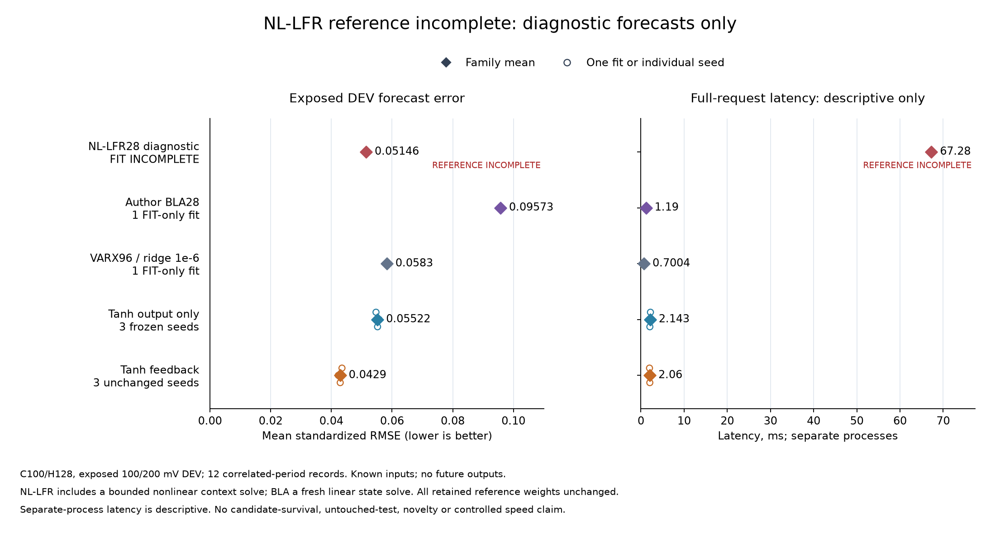

# The nonlinear reference reached its training limit

**REFERENCE_INCOMPLETE.** The one registered author NL-LFR fit reached 10,000
iterations without its small-change stopping flag. All 384 subsequent diagnostic
forecasts were finite and replayed exactly in the independent audit, but a
successful audit does not make the fit complete. The frozen continuation rule
therefore does not pass. No reserved-scenario evaluation follows this result.

| Model | Mean standardized forecast RMSE | Observed request latency | Numeric storage |
|---|---:|---:|---:|
| Author NL-LFR28, **incomplete fit, diagnostic only** | 0.051458 | 67.277 ms | 60,184 B |
| Author BLA28, completed FIT-only adaptation | 0.095731 | 1.190 ms | 8,040 B |
| Best longer-memory linear control, VARX96 | 0.058296 | 0.700 ms | 18,648 B |
| Tanh output-only correction, three fixed seeds | 0.055222 | 2.143 ms | 44,592 B |
| Tanh recurrent feedback, three unchanged seeds | 0.042901 | 2.060 ms | 44,592 B |

Lower error is better. All scores use the same twelve exposed 100/200 mV DEV
records and C100/H128 task. Neural family scores average the three retained
seeds. The candidate's error is descriptively 16.63% below this capped NL-LFR
checkpoint, but this is **not a win against a completed conventional reference**.
Historical gains against VARX96 and output-only correction remain recorded in
the [earlier comparison](fsm-linear-controls-results.md).

Timings come from separate processes, not a matched speed experiment. NL-LFR
includes a fresh nonlinear context-state solve per request; numerical storage
excludes transient workspace and interpreter overhead. The implementations have
different training objectives, initialization methods and search budgets.

## What completed

The [protocol](fsm-author-nllfr-protocol.md) and
[registration](fsm-author-nllfr-registration.json) were published before the one
original fit. It adapted the author's pinned nonlinear feedback model using only
our existing FIT partition, starting from our own completed BLA28. It did not use
the author's pretrained weights. The model has 28 latent states and 7,473
trainable scalars; its nonlinear branch has two width-64 ReLU layers.

- The original fit exited in **1,089.37 seconds**, reaching its fixed 10,000
  iteration cap. The independent native FIT loss fell from **294.1252 to 53.1977**.
  This frequency-domain training loss is not the forecast RMSE in the table.
- The author stop flag remained false. Iterations include optimizer line-search
  trials, so the counter does not establish 10,000 accepted parameter updates.
  No restart, optimizer substitution, seed search or checkpoint selection occurred.
- The original diagnostic evaluator completed in **30.20 seconds**, with all
  384 requests and 24 full-request timings preserved. Output history and applied
  inputs alone initialized each forecast; future output labels arrived afterward.
- Of the 384 bounded context-state solves, **378 reached their 16-direction cap**,
  **5 stalled**, and **1 met the gradient tolerance**. Finite capped and stalled
  solves remain scored under the frozen contract; they are not convergence claims.
- The diagnostic mean errors were **0.040770 at 100 mV** and **0.062145 at 200 mV**.
  Their periods and windows are correlated, not independent environments.

## Independent verification

Before measurement use, 162 fabricated pipeline tests and a full-size synthetic
runtime check qualified the producer and evaluator. The separate auditor passed
64 fabricated tests before any measured audit. Its one original run took
**28.65 seconds** and reported agreement.

The auditor independently reconstructed FIT normalization and spectra, solved
4,097 periodic linear initial-state systems, and reproduced both native training
objectives. It replayed all 384 nonlinear context solves and forecasts with
**zero maximum difference** in the retained predictions and states. It also
rescored 300 earlier forecast banks and twelve BLA banks. No refits, optimizer
calls or timing reruns occurred during that audit. The figure passed 21 fabricated
checks and visual inspection; it only reads authenticated saved scalars.

[Audit](fsm-author-nllfr-results/audit.json) ·
[Fit receipt](fsm-author-nllfr-results/fit-process.json) ·
[Evaluation receipt](fsm-author-nllfr-results/evaluation-process.json) ·
[All diagnostic records](fsm-author-nllfr-results/evaluation.json) ·
[Evidence and checkpoints](https://github.com/kw2828/OpenJev/releases/tag/fsm-author-nllfr-study-v1).

The audit's four continuation booleans are false because reference completion
is required before those rules can pass. They must not be described as four
measured quality losses. Likewise, the diagnostic checkpoint is excluded from
the eligible complete-control pool; its separate displayed score is retained.

## What this changes

Training budget and short-context state estimation remain unresolved. Increasing
training alone cannot establish that the conditional initializer is adequate.
The saved checkpoint also omits the optimizer's internal state: loading it into
a new optimizer would be a new warm-start recipe, not continuation of this run.
Any follow-up must receive a separate protocol and budget, preserve this outcome,
and keep the original candidate fixed. The proposed
[sensitivity-regularization screen](fsm-sensitivity-experiment-draft.md) remains
unregistered and unrun while the conventional comparison is unresolved.

This experiment decoded only the four admitted 100/200 mV TRAIN members and
used their declared FIT/DEV partitions. A separate
[publication correction](fsm-author-publication-correction.md) documents upstream
300 mV train/test example files inadvertently copied into the earlier BLA evidence
bundle. Numerical-use evidence and publication byte access are distinct; the
broader claim that reserved files were never opened or copied is withdrawn.
The new evidence bundle excludes upstream examples before hashing or archiving.

Data remain credited to Merijn Floren, KU Leuven and Floren et al., ISMA-USD 2024,
under CC BY 4.0. The isolated author integration is GPL-3.0-or-later. This result
establishes no untouched transfer, biological advantage, novel architecture,
control-policy improvement or ICLR-ready contribution.
