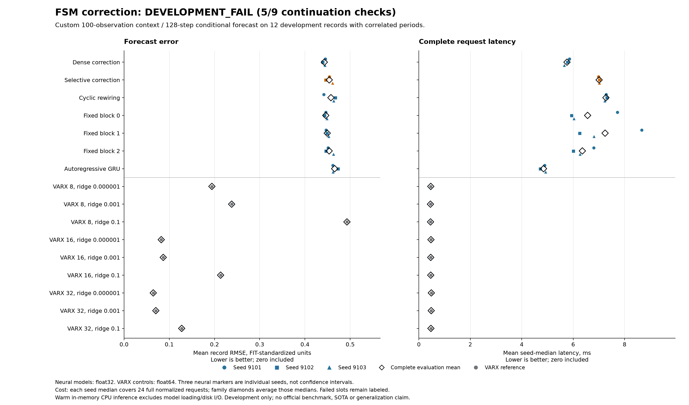
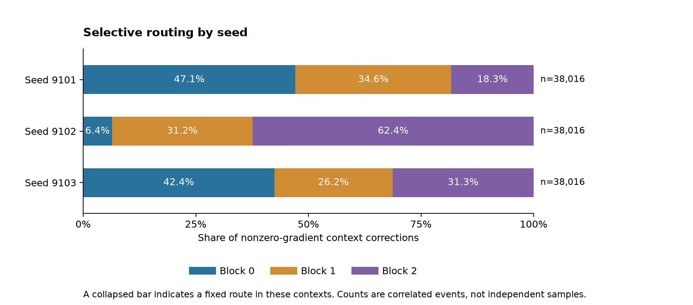

# Multivariate correction loses to dense and linear controls

**Development FAIL, 5/9 conditions pass.** All 21 neural and nine linear fits
complete. The independent saved-output audit agrees with the original result.
Selective correction has **2.46% higher error and 21.69% higher full-request
latency than dense correction**, and loses the error comparison in every seed.
Selective correction has **7.02 times the error of the best linear control**,
which takes **0.485 ms versus 7.010 ms** per complete request on this machine.

This rejects the registered selective-correction proposal for this pilot.
It is not a promising new architecture result or evidence of a connectome
advantage. The trained checkpoints remain useful reproducible negative evidence.

## What was compared

This is a custom development split of the authors' measured CubeSpec mirror
system: three applied voltages, three displacements, two input amplitudes.
Twelve FIT records and twelve DEV records keep orthogonal realization triplets
and repeated periods grouped. Requests contain 100 observations followed by
128 conditional forecast steps. All 300 mV and official-test arrays remain
undecoded. These DEV records are now exposed, not untouched confirmation.

The six correction variants have 37,020 parameters and identical initial weights
within each seed. A conventional autoregressive GRU has 37,668 parameters. Each
of the 21 neural fits uses exactly 1,024 updates on paired batch schedules,
for **21,504 accepted updates**. Nine VARX controls span three lag orders and
three fixed penalties, fitted only on FIT data. No model or checkpoint was
selected during the fits.

The table includes every declared family. Error is the equal-record mean RMSE
in FIT-standardized output units, averaged over three seeds for neural models.
Neural latency is the mean of per-seed medians over 24 complete requests;
each linear model reports its single median over the same requests. Both error
and latency are lower-is-better. Numeric bytes include retained auxiliary parameters,
normalization and one stream's state, but exclude temporary workspace and
Python object overhead.

| Model | Mean RMSE | Request ms | Numeric bytes |
|---|---:|---:|---:|
| Dense correction | 0.442827 | 5.760 | 148,464 |
| Selective correction | 0.453717 | 7.010 | 148,464 |
| Cyclic rewiring | 0.457464 | 7.274 | 148,464 |
| Fixed block 0 | 0.446059 | 6.562 | 148,464 |
| Fixed block 1 | 0.449266 | 7.241 | 148,464 |
| Fixed block 2 | 0.453487 | 6.357 | 148,464 |
| Autoregressive GRU | 0.465653 | 4.847 | 151,068 |
| VARX 8, ridge 1e-06 | 0.194283 | 0.464 | 1,752 |
| VARX 8, ridge 0.001 | 0.237965 | 0.451 | 1,752 |
| VARX 8, ridge 0.1 | 0.492882 | 0.454 | 1,752 |
| VARX 16, ridge 1e-06 | 0.082303 | 0.471 | 3,288 |
| VARX 16, ridge 0.001 | 0.086704 | 0.462 | 3,288 |
| VARX 16, ridge 0.1 | 0.213574 | 0.462 | 3,288 |
| VARX 32, ridge 1e-06 | 0.064630 | 0.485 | 6,360 |
| VARX 32, ridge 0.001 | 0.070323 | 0.480 | 6,360 |
| VARX 32, ridge 0.1 | 0.127523 | 0.469 | 6,360 |

The linear control at lag order 32 and ridge 1e-6 is the strongest declared
reference. Its advantage is specific to this measured pilot and these native
implementations. Neural models use float32 PyTorch and VARX uses float64
NumPy/SciPy on an Apple M5 Max CPU. Costs include normalization, conversion,
conditioning and all 128 forecast steps; loading and disk I/O are excluded.
Individual timings and seed outcomes are retained rather than presented as
confidence intervals. No exclusive-machine or Rust speed claim is made.

## The failed rule and the routing result

| Frozen condition | Result |
|---|---|
| All 30 fits complete | Pass |
| All 30 evaluations complete | Pass |
| Selective family complete | Pass |
| At least 5% below strongest control error | Fail |
| Latency at most 1.10 times dense | Fail: 1.217 times |
| Storage at most 1.10 times dense | Pass: equal |
| No record more than 2% worse than dense | Fail: worst record 3.35% worse |
| Every seed beats dense error | Fail: zero of three |
| Two blocks each receive at least 5% of corrections in every seed | Pass |

Each seed records 38,016 nonzero-gradient context corrections. All three blocks
are used in every seed, so the loss is not explained by the single-output
fixed-route degeneracy found during qualification. Variable routing alone did
not improve forecasting. This does not identify the cause of poor neural
performance: the fixed training budget does not establish convergence or rule
out stronger neural identification methods.

## Evidence and practical limits

The [protocol](fsm-correction-protocol.md) and
[registration](fsm-correction-registration.json) were committed as `72464907`
before measurement decoding and fitting. The original process exited zero;
its recorded study interval is 594.41 seconds, excluding startup and admission.
All 42 initial/final neural checkpoints, final optimizers, nine linear models,
360 prediction banks, 360 record rows and 720 timing samples are preserved.

[Independent audit](fsm-correction-results/audit.json) recomputes errors and
all nine conditions, checks common saved targets, schedules, model/storage
counts, checkpoint schemas and optimizer steps. It does not independently
re-decode raw labels, replay training, rerun routing or repeat timing. Those
limits matter when interpreting an audit pass.

Component qualification passes 267 current fabricated checks; the separate
auditor passes 19. The first integration qualification retained 57 passes and
one duplicate-seed-summary failure. The source was corrected before freezing,
and all 14 affected integration checks then passed. No empirical retry occurred.

[Download complete evidence](https://github.com/kw2828/OpenJev/releases/download/fsm-correction-study-v1/evidence.tar.gz)
includes original failures, snapshots, checkpoints, forecasts and logs.
[Manifest](fsm-correction-results/evidence-manifest.json) and
[archive receipt](fsm-correction-results/evidence-receipt.json) identify the bytes.
The source measurement archive is excluded; obtain it from the
[authors' pinned repository](https://github.com/merijnfloren/fsm-benchmark-data/tree/539a12fef384b086a8562b500498b2fa3899ef70).
Normalized target windows remain covered by the preserved
[CC BY 4.0 notice](fsm-correction-results/DATA_LICENSE.txt). Credit Merijn Floren,
KU Leuven, and Floren et al., ISMA-USD 2024. Splitting, windowing and normalization
are our transformations; no endorsement is implied.

The authors' 28-state BLA and nonlinear LFR remain published reference methods
to qualify, not baselines reproduced here. This reduced-training DEV study is
not an official benchmark score, a scenario-shift result or closed-loop control.
The [next proposed comparison](fsm-linear-residual-next.md) starts from the
accurate linear predictor rather than repeating this failed routing claim.
