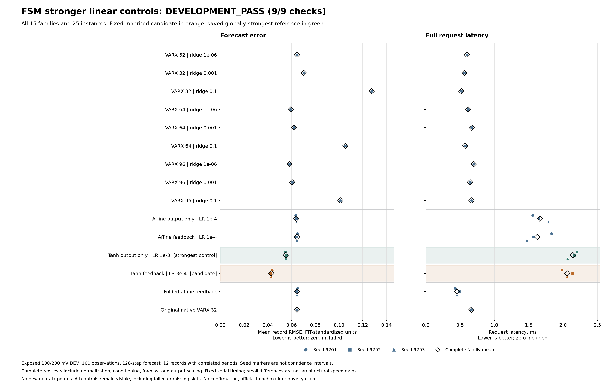

# The residual forecast survives stronger linear controls

**Development PASS, 9/9 conditions; independent audit PASS.** The fixed tanh
feedback candidate has **26.41% lower error than the best newly fitted linear
control**, VARX96 with ridge 1e-6. Its **22.31% improvement over the strongest
control overall**, tanh output-only, is unchanged from the prior study.

All twelve inherited neural checkpoints stay unchanged, with **zero new neural
updates**. This run fits nine conventional linear controls and converts three
affine-feedback checkpoints into equivalent native VARX models. Folding cuts
measured affine latency by **71.92%** and numeric storage by **42.47%**. It does
not create a new predictive model or a new architecture.



[Protocol](fsm-linear-controls-protocol.md) · [Registration](fsm-linear-controls-registration.json) ·
[Audit](fsm-linear-controls-results/audit.json) · [Summary](fsm-linear-controls-results/summary.json) ·
[Evidence archive](https://github.com/kw2828/OpenJev/releases/download/fsm-linear-controls-study-v1/evidence.tar.gz) ·
[Manifest](fsm-linear-controls-results/evidence-manifest.json) · [Package receipt](fsm-linear-controls-results/evidence-receipt.json)

## Fixed comparison

The [preceding residual study](fsm-residual-results.md) selected one learning
rate per architecture on already exposed DEV. Those four selections and all
three seeds remain fixed here: affine output-only and feedback at 1e-4, tanh
output-only at 1e-3 and tanh feedback at 3e-4. No candidate is retuned or selected
again. The strongest reference is chosen globally among all fourteen declared
noncandidate families by complete mean DEV error, independently of timing.

New VARX controls cross orders 32, 64 and 96 with penalties 1e-6, 1e-3 and 0.1.
They use only the same twelve FIT records and unchanged FIT normalization.
Each order's sufficient statistics are shared across its three penalties;
all nine solves close before new DEV forecasting. Longer orders use more
observed history and parameters, so this is a stronger-reference check rather
than a matched-capacity mechanism experiment.

## Every declared family

Error is equal-record RMSE in FIT-standardized output units, then averaged
across three seeds for inherited learned models. Each instance uses one warmup
and retains 24 timed complete requests. Latency is the mean of seed medians;
new VARX controls and the native backbone each have one instance. Lower is
better for all three columns.

| Family | Mean RMSE | Request ms | Numeric bytes |
|---|---:|---:|---:|
| VARX32, ridge 1e-6 | 0.064630 | 0.600 | 6,360 |
| VARX32, ridge 0.001 | 0.070323 | 0.562 | 6,360 |
| VARX32, ridge 0.1 | 0.127523 | 0.518 | 6,360 |
| VARX64, ridge 1e-6 | 0.059372 | 0.618 | 12,504 |
| VARX64, ridge 0.001 | 0.062153 | 0.670 | 12,504 |
| VARX64, ridge 0.1 | 0.105389 | 0.575 | 12,504 |
| **VARX96, ridge 1e-6: best fresh linear** | **0.058296** | **0.700** | **18,648** |
| VARX96, ridge 0.001 | 0.060518 | 0.646 | 18,648 |
| VARX96, ridge 0.1 | 0.101161 | 0.667 | 18,648 |
| Affine output-only, rate 1e-4 | 0.063955 | 1.663 | 11,056 |
| Affine feedback, rate 1e-4 | 0.064588 | 1.625 | 11,056 |
| **Tanh output-only, rate 1e-3: strongest control** | **0.055222** | **2.143** | **44,592** |
| **Tanh feedback, rate 3e-4: fixed candidate** | **0.042901** | **2.060** | **44,592** |
| Folded affine feedback | 0.064588 | 0.456 | 6,360 |
| Original native VARX32 | 0.064630 | 0.665 | 6,360 |

Every inherited neural family's mean error exactly matches its prior result.
Against the best fresh linear control, candidate improvements by seed are
**25.39%, 27.45% and 26.38%**. All twelve record means improve; the smallest
reduction is **3.70%**, on 200 mV realization 3, period 0. Mean reductions are
**39.28% at 100 mV** and **12.10% at 200 mV**. Against the stronger tanh
output-only reference, the minimum record improvement remains **9.93%**.
These correlated records are descriptive checks, not independent replications.

## Folding and timing limits

Native folding adds the learned affine weight and bias to the frozen backbone
coefficients. All three folds pass all twelve record comparisons at the frozen
`atol=rtol=1e-9`; the largest absolute forecast difference is **1.9984e-14**.
All 36 parity banks are retained. The merged model's ridge metadata describes
its original backbone, not a fresh ridge fit of the merged coefficients.

Mean latency changes from **1.6251 to 0.4563 ms**, a measured **3.56-fold
speedup** over the unfused PyTorch implementation. Numeric storage changes
from **11,056 to 6,360 bytes**. The candidate remains **2.94 times slower and
2.39 times larger than the best fresh linear control**, and **4.51 times
slower and 7.01 times larger than folded affine feedback**.

Do not interpret small timing differences as architectural speed gains.
Refitted VARX32/ridge 1e-6 and the native backbone have exactly equal saved
coefficients and error rows, but their medians are **0.6002 and 0.6649 ms**, a
**10.77% difference**.
The unchanged tanh pair reverses its small timing ranking from the prior run.
Measurements use fixed serial order, CPU float64, one PyTorch thread and
unforced native BLAS threading, without exclusive-machine or randomized
interleaving controls. The candidate/output-only latency ratio is **0.9613**
in this run; it is a gate measurement, not a reliable small-speedup claim.

Complete-request costs include normalization, conversion, conditioning, all
128 forecast steps, validation and denormalization, excluding loading/disk I/O.
Storage includes weights/coefficients, one lag state, normalization and numeric
metadata, excluding workspace, requests and Python/string overhead.

## All nine frozen conditions

| Condition | Observed result |
|---|---|
| All nine linear fits complete | Pass |
| All 25 evaluation slots have complete finite scores and costs | Pass |
| All three folds preserve forecasts | Pass: maximum difference 1.9984e-14 |
| At least 5% lower error than strongest control | Pass: 22.31% lower |
| Every candidate seed beats that same control | Pass: 3/3 |
| No record more than 2% worse than that control | Pass: all improve at least 9.93% |
| Both amplitudes improve against that control | Pass: 30.96% / 14.04% lower |
| Latency at most 1.10 times tanh output-only | Pass: 0.9613 times |
| Storage no larger than tanh output-only | Pass: equal |

## Scope and evidence

This uses the same exposed 100/200 mV estimation split: realizations 0-2 for
FIT, 3-5 for DEV, with periods kept separate. C100 observed outputs and 99 past
inputs initialize H128 forecasts; future input `u[k]` predicts output `y[k]`.
No future output enters prediction. No 300 mV or official-test array is decoded.
The candidate's selection and these reference comparisons reuse DEV, so this
is **development, not untouched confirmation**. The authors' BLA28/NL-LFR
models remain unrun; their [reference qualification plan](fsm-author-reference-qualification.md)
is still required before broad competitiveness claims. No novelty, stability,
biological connectivity or closed-loop control result is established.

[Commit `1a553907`](https://github.com/kw2828/OpenJev/commit/1a5539074bccc815493debbedc9a4d7d3ae83820)
freezes the producer and registration before execution. The original child
exits zero after **5.5039 seconds**, including startup/admission and writes;
the producer's narrower interval is **4.3386 seconds**. Evidence retains all
25 evaluation slots, 300 forecast banks, 36 parity banks and 600 timing samples.
The independent audit verifies saved errors, common targets, frozen checkpoint
identities, coefficient addition, storage, and all nine rules. It checks ridge
backward errors against saved sufficient statistics; FIT lineage and timings
remain source/receipt-attested. It performs no raw-data refit, model inference
or timing replay. Source attribution and derived-data licensing accompany the
[evidence release](https://github.com/kw2828/OpenJev/releases/tag/fsm-linear-controls-study-v1).

The [CC BY 4.0 notice](fsm-linear-controls-results/DATA_LICENSE.txt) covers
derived target windows. Credit Merijn Floren, KU Leuven, and Floren et al.,
ISMA-USD 2024; splitting, windowing and normalization are our transformations.
The original measurement archive is excluded from the evidence package and
remains available from the [authors' pinned repository](https://github.com/merijnfloren/fsm-benchmark-data/tree/539a12fef384b086a8562b500498b2fa3899ef70).
No endorsement is implied.

Qualification covers 38 fabricated folding checks and 35 current harness checks;
the independent auditor passes 49 fabricated checks. The initial harness
fixture failures and all subsequent corrections are retained. No empirical
attempt was retried.

The archive contains 526 payload files plus its manifest, totaling 69,534,714
compressed bytes. All archived files were read back and verified against their
original hashes. Archive SHA-256:

```text
dc12cd25f6b93ad89f4d8999952aad7cf2de7d2fa2e1be966fa791e803a712f5
```
