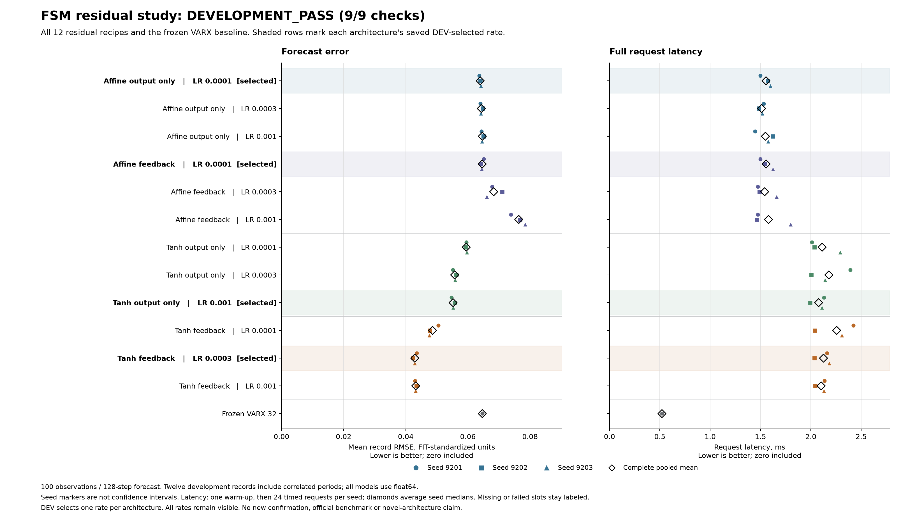

# Nonlinear feedback improves the linear-backbone development forecast

**Development PASS, 9/9 conditions.** All 36 fits complete 2,048 updates, and
the independent saved-output audit agrees. Feeding a small tanh correction
back into the forecast lowers mean error **22.31% versus output-only tanh
correction**, **32.92% versus the strongest affine correction**, and **33.62%
versus the frozen native VARX backbone**.

The selected tanh pair has equal persistent numeric storage. Feedback takes
**2.126 ms versus 2.077 ms** per complete request, a **2.33% increase**. Native
VARX remains much cheaper: **0.521 ms and 6,360 bytes**, versus the candidate's
**44,592 bytes**. This is a useful development lead, not evidence of a new
architecture, biological wiring, benchmark leadership or ICLR readiness.



[Protocol](fsm-residual-protocol.md) · [Registration](fsm-residual-registration.json) ·
[Independent audit](fsm-residual-results/audit.json) ·
[Complete evidence](https://github.com/kw2828/OpenJev/releases/tag/fsm-residual-study-v1) ·
[Prior art](fsm-residual-prior-art.md)

## What changed

The [preceding correction pilot](fsm-correction-results.md) lost to a linear
model. This comparison starts with that accurate, frozen float64 order-32 VARX
model and learns a residual. It crosses two head types with two placements:

| Head | Output-only correction | Feedback correction |
|---|---|---|
| Affine, 588 trainable parameters | Advance the unchanged linear trajectory | Insert corrected outputs into the next lag state |
| Tanh, 4,779 trainable parameters | Advance the unchanged linear trajectory | Insert corrected outputs into the next lag state |

Both heads see the same 195 features: the last 32 outputs, current input and
last 32 inputs. The tanh head has 24 hidden units. Final head weights and
biases start at zero; each fit's first scheduled FIT batch passes the initial
forecast parity check against native VARX. The backbone and FIT normalizer
remain unchanged.

Each architecture uses learning rates 1e-4, 3e-4 and 1e-3, with seeds 9201,
9202 and 9203. Every fit uses the same per-seed batch schedule, batch size 16,
Adam, full free-running 128-step mean squared error, and 2,048 updates. There
is no teacher forcing, auxiliary loss, DEV checkpoint selection or empirical
restart. All fits close before new DEV forecasting and rate selection.

One learning rate per architecture is selected using pooled error on the
**same exposed DEV data reported here**. This is descriptive development
selection, not an unbiased selected-model efficacy estimate. The affine
reference searches both affine placements; its identity and the strongest
overall reference remain fixed in all subsequent comparisons.

## Every declared recipe

Error is equal-record mean RMSE in FIT-standardized output units, averaged
over three seeds for learned models. Latency is the mean of per-seed medians
over 24 complete warm requests. Native VARX has one evaluation. Both metrics
are lower-is-better. Bold rows are the selected rate within each architecture.

| Recipe | Rate | Mean RMSE | Request ms | Numeric bytes |
|---|---:|---:|---:|---:|
| **Affine output only** | 0.0001 | 0.063955 | 1.555 | 11,056 |
| Affine output only | 0.0003 | 0.064300 | 1.511 | 11,056 |
| Affine output only | 0.001 | 0.064638 | 1.549 | 11,056 |
| **Affine feedback** | 0.0001 | 0.064588 | 1.555 | 11,056 |
| Affine feedback | 0.0003 | 0.068303 | 1.541 | 11,056 |
| Affine feedback | 0.001 | 0.076367 | 1.579 | 11,056 |
| Tanh output only | 0.0001 | 0.059455 | 2.112 | 44,592 |
| Tanh output only | 0.0003 | 0.055745 | 2.179 | 44,592 |
| **Tanh output only** | 0.001 | 0.055222 | 2.077 | 44,592 |
| Tanh feedback | 0.0001 | 0.048609 | 2.257 | 44,592 |
| **Tanh feedback** | 0.0003 | 0.042901 | 2.126 | 44,592 |
| Tanh feedback | 0.001 | 0.043211 | 2.102 | 44,592 |
| Native VARX | n/a | 0.064630 | 0.521 | 6,360 |

The strongest selected reference is tanh output-only at 1e-3. The strongest
affine reference is output-only at 1e-4. The candidate is tanh feedback at 3e-4.
No seed is selected or discarded.

## Does the benefit depend on learning-rate selection?

Tanh feedback also improves error at **every matched learning rate**:

| Matched rate | Error reduction versus tanh output-only | Seed wins |
|---|---:|---:|
| 1e-4 | 18.24% | 3/3 |
| 3e-4 | 23.04% | 3/3 |
| 1e-3 | 21.75% | 3/3 |

Affine feedback instead raises mean error by 0.99%, 6.23% and 18.14% at those
rates. This supports a conditional interaction between the nonlinear head and
feedback under this training budget. It does not isolate nonlinearity from
capacity: the tanh and affine heads have different parameter counts. Identical
initial forecasts also do not imply identical training gradients.

For the selected models, all three candidate seeds beat tanh output-only,
the strongest affine reference and native VARX. All twelve record seed means
improve over the strongest reference; the smallest reduction is **9.93%**.
Mean error falls **30.96% at 100 mV** and **14.04% at 200 mV**. These are
descriptive checks on correlated records, not twelve independent replications.

| Seed | Tanh feedback, 3e-4 | Tanh output-only, 1e-3 | Affine output-only, 1e-4 |
|---|---:|---:|---:|
| 9201 | 0.043493 | 0.054709 | 0.063624 |
| 9202 | 0.042293 | 0.055741 | 0.064049 |
| 9203 | 0.042917 | 0.055217 | 0.064194 |

[Exact comparisons](fsm-residual-results/descriptive-comparisons.json) and
[all evaluation rows](fsm-residual-results/evaluations.json) retain the
record, amplitude, channel and seed outcomes. The figure shows every rate;
seed markers are not confidence intervals.

## Frozen continuation rule

| Condition | Result |
|---|---|
| All 36 fits finish every update | Pass: 73,728 updates |
| All 37 evaluations are complete, finite and have costs | Pass |
| Initial forecast identity and unchanged backbone | Pass |
| At least 5% below strongest reference error | Pass: 22.31% lower |
| Every seed beats all three selected references | Pass: 3/3 |
| No record more than 2% worse than strongest reference | Pass: every record improves at least 9.93% |
| Both amplitudes improve | Pass: 30.96% / 14.04% |
| Latency at most 1.10 times tanh output-only | Pass: 1.0233 times |
| Storage no larger than tanh output-only | Pass: equal |

## Data, cost and claim boundaries

The measured CubeSpec fine-steering mirror has three voltage inputs and three
displacement outputs, sampled at 6,400 Hz. This custom split uses only 100/200
mV estimation arrays: realizations 0-2 for FIT and 3-5 for DEV, keeping both
periods separate. There are twelve FIT and twelve DEV records, with one
orthogonal realization triplet per amplitude in each partition. Periods and
windows are correlated. The unchanged normalizer uses the original 98,304 FIT
samples. Each request supplies C100 observations and H128 future inputs;
future outputs are unavailable. This is conditional forecasting, not
closed-loop robotics control or arbitrary-state recovery.

DEV was already exposed in the preceding pilot. **All 300 mV and official-test
arrays and their array headers remain undecoded.** Neither the original
authors' 28-state BLA/NL-LFR methods nor a broader order search are reproduced
by this result. The [next design](fsm-residual-next.md) prioritizes those
stronger controls and an untouched amplitude shift.

All models here use CPU float64 on an Apple M5 Max. The runner uses one
PyTorch thread; native BLAS threading is not forced. The saved
[environment](fsm-residual-results/environment.json) records Python 3.12.13,
PyTorch 2.14.0, NumPy 2.5.3 and SciPy 1.18.1. No exclusive-machine timing claim
is made. Complete-request timing includes normalization, copying/conversion,
conditioning, all 128 steps, validation and denormalization; disk/model loading
is excluded. Numeric storage includes frozen coefficients, residual parameters,
one stream's lag state, normalization and numeric metadata, excluding temporary
workspace, requests and Python object overhead.

The candidate is **4.08 times slower and 7.01 times larger than native VARX**.
Affine feedback could be folded algebraically into native VARX coefficients;
its current unfused PyTorch runtime is not its minimum deployable cost. The
registered latency gate compares only the matched tanh pair. This study does
not establish overall neural runtime dominance.

Linear initialization and nonlinear feedback are established in
[NL-LFR](https://arxiv.org/abs/2004.05040),
[dynoNet](https://arxiv.org/abs/2006.02250) and related identification work.
The [prior-art review](fsm-residual-prior-art.md) distinguishes this simpler
full-rollout training comparison from guided residual search and SUBNET.
No connectome, RL, conformal guarantee, stability proof or new architecture
is demonstrated here.

## Evidence and reproduction

The protocol, registration and producer sources were committed as
[`70833625`](https://github.com/kw2828/OpenJev/commit/70833625c3715779d8888394edd683f47ef31fb8)
before new empirical fitting. The [original process](fsm-residual-results/original-process.json)
exited zero after 568.63 seconds including startup, admission, all fitting,
evaluation and checkpoint writes. The producer's narrower study interval is
567.38 seconds. All 72 initial/final model checkpoints, final Adam states,
training traces, 444 prediction banks, 444 record rows and 888 timing samples
are retained.

The independent auditor recomputes all saved errors, selection and nine
conditions; checks common targets, schedules, checkpoint tensors, zero heads,
unchanged backbone, Adam counters, storage, hashes and original process
completion. It does **not** independently decode raw labels, replay training,
repeat timing or replay initial parity. Initial forecast parity and the
temporal fitting barrier are qualified-source/receipt attestations. An audit
pass therefore verifies the saved-output accounting within this scope.

Core qualification covers 95 fabricated checks; the runner has 23 current
checks qualified before registration. The auditor has 52 current checks,
including the qualified portability fix before outcome auditing. Engineering
drafts, test attempts and the packager's initial synthetic fixture failure
are preserved. No empirical result was retried.

[Download the complete evidence archive](https://github.com/kw2828/OpenJev/releases/download/fsm-residual-study-v1/evidence.tar.gz)
(91,289,540 bytes) with [manifest](fsm-residual-results/evidence-manifest.json)
and [archive receipt](fsm-residual-results/evidence-receipt.json). It contains
757 payload files plus the embedded manifest, including frozen source,
qualification records, models, forecasts, audit and figures. The original
raw measurement archive is excluded. Archive SHA-256:

```text
446e31c38aa06158a6e6c3dd2591864c9b77adc45d28926d388ef3d2e6ec5f17
```

Obtain source measurements from the
[authors' pinned repository](https://github.com/merijnfloren/fsm-benchmark-data/tree/539a12fef384b086a8562b500498b2fa3899ef70).
The [CC BY 4.0 notice](fsm-residual-results/DATA_LICENSE.txt) covers the retained
normalized target windows. Credit Merijn Floren, KU Leuven, and Floren et al.,
ISMA-USD 2024. Splitting, windowing and normalization are our transformations;
no endorsement is implied. The [parent release](https://github.com/kw2828/OpenJev/releases/tag/fsm-correction-study-v1)
preserves the original linear fit and preceding negative experiment.
