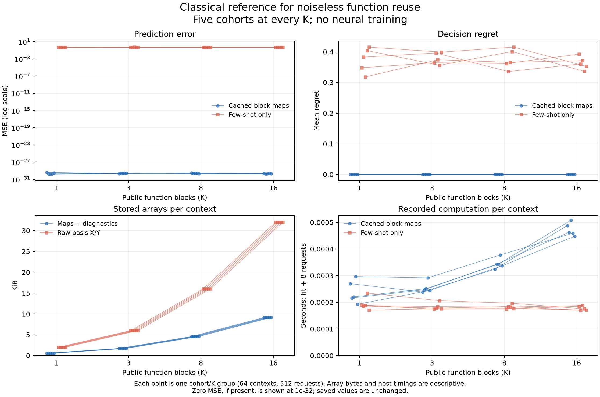

# A classical reference solves the linear function-reuse diagnostic

**100% function recovery and zero decision regret on all 10,240 fresh requests.**
The ordinary least-squares reference passes all 80 fixed checks across five
independent cohorts and four context sizes. Prediction MSE is at floating-point
precision. This rules out raw accuracy on this local linear task as convincing
evidence for our proposed new architecture. No new neural model was trained.

## What was tested

The [recent dynamic-compression paper](https://arxiv.org/html/2608.17896v1)
motivates answering later queries by revisiting selected examples. We independently
implemented its disclosed noiseless linear function family: eight-dimensional
functions, sixteen publicly tagged demonstrations per function, and later four
untagged examples identifying the requested function. Each context receives eight
queries. Our context sizes, generated cohorts, float64 reference, six-candidate
decision extension and runtime are local choices. This does not reproduce the
paper's learned models or compare against their reported measurements.

The reference fits a map to each public demonstration block. At a query, it
selects the map that best predicts the supplied few-shot examples, then applies
that map to the query input. Hidden matrices, query identities, query targets
and future requests do not enter this prediction path. The few-shot-only
control fits a minimum-norm map from the four current examples without retained
history. It checks the value of retaining examples, not architectural superiority.

Every row below averages five independently generated cohorts, each containing
64 contexts and 512 requests. Every cohort separately passes the fixed rule.

| Functions per context | Cached-reference MSE | Few-shot-only MSE | Reference decision regret | Few-shot-only regret | Reference action accuracy |
|---|---:|---:|---:|---:|---:|
| 1 | 2.41e-30 | 0.5092 | 0 | 0.3737 | 100% |
| 3 | 2.41e-30 | 0.5054 | 0 | 0.3780 | 100% |
| 8 | 2.49e-30 | 0.5019 | 0 | 0.3760 | 100% |
| 16 | 2.14e-30 | 0.5016 | 0 | 0.3627 | 100% |

The application supplies six unit-length cost vectors per request. A candidate's
cost is its inner product with the predicted eight-dimensional output. Regret
uses the actual output and the best of these six candidates. These are synthetic
linear utilities, not game rewards or a probability-calibration benchmark.
All 1,280 contexts count, with no filtered or replacement cases. Requests within
one context share fitted maps and are not independent contexts.

## Why this is a strong baseline, not a new model claim

Sixteen noiseless Gaussian inputs span eight dimensions almost surely, so the
public data identify each linear map. Residual matching then identifies the
queried map. The measured minimum relative singular value is 0.0722; every basis
is full rank, and there are no exact residual ties. Every cohort's MSE lies
between 1.50e-30 and 4.06e-30. These values are numerical error, not meaningful
quality differences among context sizes.

The reference explicitly assumes a linear function class and stores one fitted
map per function. Its storage grows with context size. That differs from a
learned fixed-size recurrent state and does not refute the cited paper's
capacity argument. Selective replay itself already has direct prior art. A
new OpenJev architecture needs a stronger quality-resource result than beating
a weak single-pass model on a task this reference already solves.

## Storage and computation

| Functions | Map arrays | Retained diagnostic arrays | Raw basis X/Y arrays | Fit + eight queries per context |
|---|---:|---:|---:|---:|
| 1 | 512 B | 73 B | 2,048 B | 0.239 ms |
| 3 | 1,536 B | 219 B | 6,144 B | 0.255 ms |
| 8 | 4,096 B | 584 B | 16,384 B | 0.345 ms |
| 16 | 8,192 B | 1,168 B | 32,768 B | 0.473 ms |

Map coefficients use one quarter of the raw basis X/Y numeric payload. The
reference also retains rank/singular-value diagnostics. Raw demonstrations can
be discarded from the fitted bank, but the experiment retains them as evidence.
Input buffers, current requests, Python objects and LAPACK workspace are extra.
This is numeric-array accounting, not measured peak process memory, fixed total
storage, or a memory comparison with the paper's model.

Timings include validation, all block fits, all residual comparisons and candidate
scoring. They exclude data generation, persistence and reporting. These are single
shared-host passes, not repeated latency benchmarks. Complete original process
times were **1.792 seconds for generation/evaluation/persistence** and **1.582
seconds for the independent audit**. No neural training, optimizer update,
external model call or environment rollout occurred. Closed-form map estimation
is included in the measured fitting work.

## Verification and consequence

All **69 focused tests** and lint pass. Tests cover public-only prediction,
future-query independence, block permutations, exact ties, rank deficiency,
nonfinite inputs, fixed denominators and deliberate evidence corruption.
The independent audit authenticates the frozen sources and raw artifacts,
reconstructs **8,960 block fits using QR** and **10,240 few-shot fits using SVD**,
and agrees with every prediction, decision, metric and interpretation condition.
It does not replay random generation or independently measure the producer's
timings. The original run and audit both exited zero within their fixed caps.

The first component-test launcher used the wrong Python interpreter and ran no
tests; its log is preserved alongside the corrected successful engineering run.
The final combined qualification passed before the scientific run. There was
one registered scientific run and one independent audit, with no retries or
post-outcome changes. Registration SHA-256:
`9c48893f50c87f99241bbb584e39636b94dd14ab3a427f6ff78addce58707d5a`.

Do not train a new neural model merely to improve this local task's accuracy.
The [next research question](query-time-memory-next.md) is query-conditioned
refinement under meaningful resource constraints and uncertainty, with evidence
replay kept distinct from new observations. That requires a separate benchmark
and strong statistical/retrieval controls before any novelty claim.

[Frozen protocol](function-reuse-reference-protocol.md) ·
[All cohort metrics and audit](function-reuse-reference-results/summary.json) ·
[Plotted values](function-reuse-reference-results/plotted-values.json) ·
[Complete compact evidence archive](function-reuse-reference-results/evidence.tar.gz) ·
[Publication receipt](function-reuse-reference-results/receipt.json).
