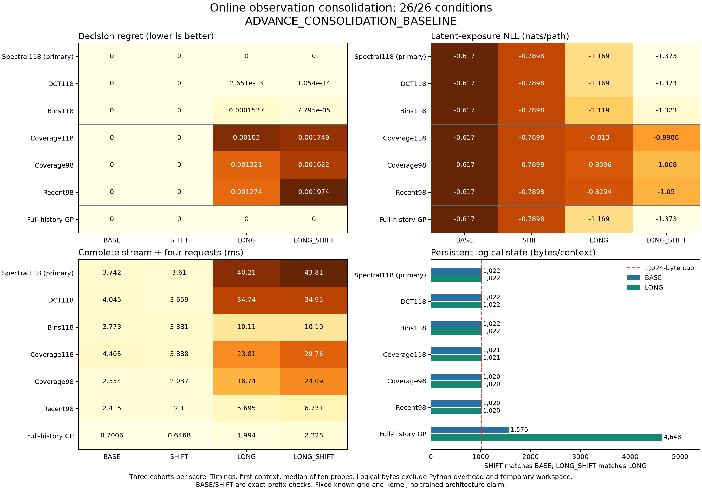

# Observation consolidation: 26/26 conditions pass

**The registered outcome is `ADVANCE_CONSOLIDATION_BASELINE`.** The spectral memory has zero observed decision regret in every cohort of all four populations, including the two 192-observation populations where it compresses the stream into 118 sums. All three raw-retention controls have positive regret on those longer streams. This qualifies a useful analytic memory baseline for further learning research.

**It does not establish a new architecture or a computational advantage.** The fixed DCT sketch produces essentially the same decisions, and the spectral implementation is slower than every raw-retention control in the long-stream timing probes. The [earlier learned-deletion result](retention-results.md) remains failed; this experiment uses fresh fields and no learned parameters.

The experiment uses a supplied Gaussian field law on a known 17 by 17 grid: RBF length and amplitude 1, spatial white variance `1e-5`, and observation-noise variance `0.09`. Every method knows the grid, kernel and noise. Each stream visits distinct grid locations. Four later requests each offer four paths, or deferral. Path cost is `0.02 + P(mean latent exposure > 0.5)`; deferral costs `0.20`. Writes receive only current public coordinates and measurements. Future paths and private realized exposures never choose what the memory retains.

There are **1,536 independent fields, 6,144 requests and 24,576 latent path outcomes**: three cohorts of 128 fields in each population. BASE has 64 observations and axial paths; SHIFT has 64 observations and diagonal paths. LONG and LONG_SHIFT use 192 observations with those respective geometries. Diagonal paths are longer despite having the same four points and grid-index stride. Requests and path outcomes within a field are correlated.

The hybrid memories store sorted raw labels through event 118. At event 119, they convert all labels into 118 fixed linear sums; each subsequent write adds the new observation once. A 37-byte occupancy mask identifies all observed locations. Prediction conditions the original GP law on the retained numerical row space, including the transformed observation-noise covariance. It does not assume that sums are independent measurements, retain a hidden archive, or reconstruct discarded labels. BASE and SHIFT are therefore exact-prefix checks, not compression wins.

Regret is measured against the full public-history GP's conditional expected costs. NLL scores realized latent path exposure in nats per path, without future observation noise. Lower is better. Tables average all three equal-sized cohorts; no method or cohort was selected after evaluation.

| Method | BASE regret | SHIFT regret | LONG regret | LONG_SHIFT regret |
| --- | ---: | ---: | ---: | ---: |
| **Spectral118, primary** | **0** | **0** | **0** | **0** |
| DCT118 | 0 | 0 | 2.65e-13 | 1.05e-14 |
| Bins118 | 0 | 0 | 0.000154 | 0.000078 |
| Coverage118 | 0 | 0 | 0.001830 | 0.001749 |
| Recent98 | 0 | 0 | 0.001274 | 0.001974 |
| Coverage98 | 0 | 0 | 0.001321 | 0.001622 |
| Full-history GP | 0 | 0 | 0 | 0 |

| Method | BASE NLL | SHIFT NLL | LONG NLL | LONG_SHIFT NLL |
| --- | ---: | ---: | ---: | ---: |
| **Spectral118, primary** | **-0.6170** | **-0.7898** | **-1.1686** | **-1.3730** |
| DCT118 | -0.6170 | -0.7898 | -1.1687 | -1.3729 |
| Bins118 | -0.6170 | -0.7898 | -1.1190 | -1.3233 |
| Coverage118 | -0.6170 | -0.7898 | -0.8130 | -0.9988 |
| Recent98 | -0.6170 | -0.7898 | -0.8294 | -1.0496 |
| Coverage98 | -0.6170 | -0.7898 | -0.8396 | -1.0677 |
| Full-history GP | -0.6170 | -0.7898 | -1.1686 | -1.3730 |

Zero observed regret does not mean identical posteriors or guaranteed future decisions. Spectral risk MAE against the full GP is **2.66e-6 on LONG and 3.37e-6 on LONG_SHIFT**. DCT risk MAE is larger, **0.000338 and 0.000218**, yet its decision regret is also effectively zero. Thus this task supplies little decision evidence for preferring the kernel eigenbasis over DCT. Binning is less accurate but still beats the raw controls descriptively. Neither alternative can replace the prespecified primary in the registered decision.

| Registered requirement | Passed |
| --- | ---: |
| Every BASE/SHIFT cohort has regret at most 1e-8 | 6/6 |
| Both long-population means improve regret by 30% against each raw control, with 1e-6 tolerance | 6/6 |
| Each population's NLL is within 0.02 nat of its best raw control | 4/4 |
| Every long-population cohort improves regret by 10% against its best raw control, with 1e-6 tolerance | 6/6 |
| Both long-population means beat always defer | 2/2 |
| Both prespecified paired-bootstrap upper limits are below zero | 2/2 |
| **Total** | **26/26** |

The spectral-minus-Coverage98 mean regret differences are **-0.001321 on LONG**, with 95% bootstrap interval **[-0.002317, -0.000466]**, and **-0.001622 on LONG_SHIFT**, with interval **[-0.002768, -0.000738]**. Each interval uses the fixed 1,000 resamples of 384 whole-field mean regrets. Queries within a field are not treated as independent samples. These intervals support this prespecified comparison on this field distribution, not a universal superiority claim.

| Method | Logical bytes/context | BASE ms | SHIFT ms | LONG ms | LONG_SHIFT ms |
| --- | ---: | ---: | ---: | ---: | ---: |
| Spectral118 | 1,022 | 3.742 | 3.610 | 40.205 | 43.807 |
| DCT118 | 1,022 | 4.045 | 3.659 | 34.741 | 34.954 |
| Bins118 | 1,022 | 3.773 | 3.881 | 10.108 | 10.194 |
| Coverage118 | 1,021 | 4.405 | 3.888 | 23.813 | 29.757 |
| Recent98 | 1,020 | 2.415 | 2.100 | 5.695 | 6.731 |
| Coverage98 | 1,020 | 2.354 | 2.037 | 18.741 | 24.088 |
| Full-history GP | 1,576 / 4,648 | 0.701 | 0.647 | 1.994 | 2.328 |

Logical state counts retained arrays, four kernel/noise scalars, an event counter and, for hybrids, one kind byte. The full GP exceeds the 1,024-byte cap: 1,576 bytes for 64 observations and 4,648 for 192. All raw controls also exploit the known finite grid. Coverage118 deletes the lowest grid ID among nearest-neighbor ties; Coverage98 preserves temporal order and deletes the oldest tied observation, controlling for that spatial tie bias.

Times are original medians of ten repetitions after three warmups, processing the first field of each population through all stream writes and four requests on one CPU thread. They include basis reconstruction and factorization. They are descriptive probes, not population speed estimates. On LONG/LONG_SHIFT, the spectral probe traces **2,415,255 bytes** of peak Python/NumPy allocation, versus **493,830 bytes** for Coverage98. Temporary workspace, Python objects, native allocations and RSS are not part of the logical state cap; native peak memory remains unmeasured. The persistent-state result is not an equal-workspace or overall compute win.

**118 fabricated tests passed in 1.97 seconds.** The original run process closed successfully in **51.765 seconds**, and the independent audit process in **61.477 seconds**. The audit verifies all 84 prediction groups, 72 saved state batches, 28 resource records and 26 conditions. It independently reconstructs the three bases and both bootstrap intervals, decoding 168 NPZ files and 696 arrays. Each state batch contains 128 contexts. It independently recomputes GP predictions without importing the producer memory implementation, training a model or generating fields. Mean, variance, risk and accumulated-sum comparisons use `rtol=atol=1e-8`; retained raw state and mask bytes are exact. Rank is exact and its cutoff uses a relative-only comparison. All eight current sources and snapshots, the original process closure and the complete 183-file manifest are authenticated before numerical decoding and checked again afterward. Historical runtime and private realized exposures remain saved evidence, not regenerated measurements.

All eight registered files, including the [protocol](measurement-protocol.md), were pinned at commit `0eb9de43` before collection. Registration SHA256: `37c4081d0ac97e22fea81542b9473293be64e906354893269f3199530e9db144`. No empirical retries, inherited weights, finetuning or post-result method selection were used.

- [Complete saved outcome](measurement-results/summary.json), [independent audit](measurement-results/audit.json), and [paired-bootstrap evidence](measurement-results/bootstrap.json).
- [Figure](measurement-results/benchmark.png), [evidence archive](measurement-results/evidence.tar.gz), and [archive index](measurement-results/archive-index.json). The archive retains the current data, predictions, states, source snapshots and original process records; the prior failed result remains separately linked.
- [Prospective next question](measurement-next.md): remove the supplied-law assumptions before testing a learned memory architecture.

[Gaussian conditioning on projected observations](https://papers.nips.cc/paper/2024/file/379ea6eb0faad176b570c2e26d58ff2b-Paper-Conference.pdf) is established prior art. [WISKI](https://proceedings.mlr.press/v130/stanton21a.html) is related streaming sufficient-statistic work using a kernel approximation. This experiment retains the original kernel and loses information through projection. It demonstrates a strong fixed-basis baseline under a known smooth law and finite grid, not learned adaptation, an unbounded-domain storage result, or architectural novelty.
