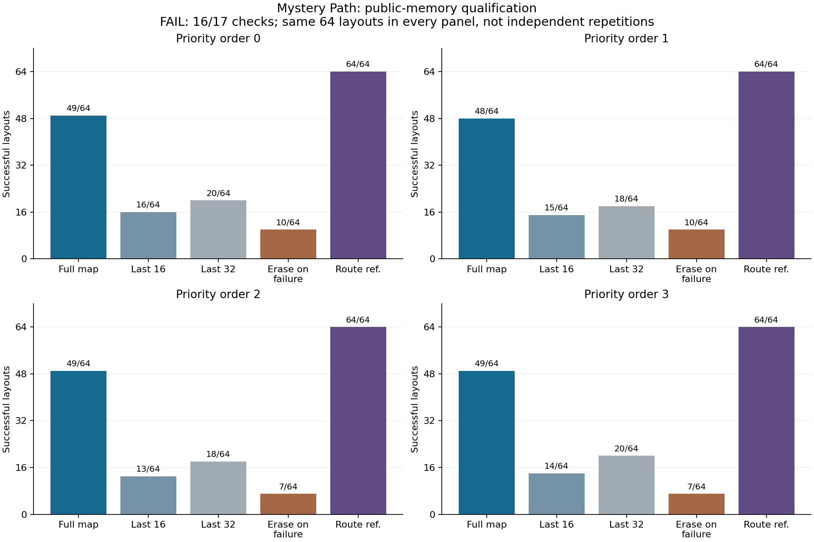
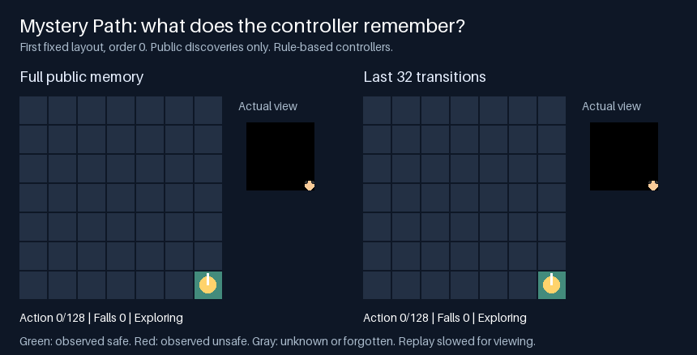

# Route memory helps, but this qualification failed

**Full public memory reached the goal on 76.2% of layout/order pairs, versus 29.7% with the last 32 transitions.** That is a substantial retention effect. It still falls below the fixed 80% requirement, so the qualification recipe is closed. These are rule-based controllers, not trained neural models.

| Controller | Success | Actions per episode | Falls per episode |
|---|---:|---:|---:|
| Full public memory | 195/256 (76.2%) | 79.65 | 8.82 |
| Last 16 transitions | 58/256 (22.7%) | 102.09 | 20.94 |
| Last 32 transitions | 76/256 (29.7%) | 95.38 | 16.61 |
| Erase memory on failure | 34/256 (13.3%) | 112.23 | 29.86 |
| Known-route reference | 256/256 (100%) | 13.27 | 0.00 |

All action and fall averages include failures. Four action-priority orders reuse the same **64 distinct layouts**. The 256 layout/order pairs are correlated repeats, not 256 independent maps.

## What was compared

We used the official Memory Gym `MysteryPath-Grid-v0`, unchanged, at revision `a94f2b60d1769ea44df3226561488768e1dff9f4`. The agent explores an invisible route. A wrong move displays a red cross; the next action returns it to the origin. Turns and returns count toward the 128-action limit. [Upstream source](https://github.com/MarcoMeter/endless-memory-gym/blob/a94f2b60d1769ea44df3226561488768e1dff9f4/memory_gym/mystery_path_grid.py).

Public controllers see only location, heading and failure extracted from actual RGB observations, plus their issued actions and rewards. They share the same planner. The full controller retains safe and unsafe cells across returns; the window controls reconstruct that map from exactly their last 16 or 32 transitions. The reference alone receives the hidden route and goal.

Full memory beat every public control in every priority order. Against last-32, it won 119 paired cases where last-32 failed, with zero reverse cases. The pooled difference was **46.5 percentage points**. This isolates retained public information within this controller family. It does not show that a learned recurrent architecture outperforms another learned model.

## Recorded example

The example was fixed before reading outcomes: layout index 0, priority order 0, full memory versus last-32. **Both succeed in 23 actions**, so this short example shows the interface rather than the aggregate memory advantage. Green and red cells are reconstructed solely from observed safe and failed positions; they do not reveal the hidden route. The small black panels show the actual environment observations. [Recording receipt](../output/mystery-path-qualification-v1/visualization-01/receipt.json).

## Fixed decision and verification

**16 of 17 criteria passed.** The sole failure was full-memory success: 195 versus the required 205 successes out of 256. Reference competence and every pooled/per-order advantage passed. We did not relax the threshold, replace layouts, shorten history windows, or increase the action budget.

The [protocol, source and inputs](../evidence/mystery-path-qualification-v1/README.md) were published before execution at `540ec3071ba5112be150c57aad6425f97ab0a0f6`. **552 focused tests** passed; a separate four-seed adapter check consumed 87 actions. The qualification executed **1,280 episodes and 103,069 native actions**. Replay verified every frame, reward, terminal flag, declared controller action and retained-state measurement. It uses the same official simulator, not an independent implementation.

Execution took **18.859 seconds** and replay **15.527 seconds** internally; the enclosing execution, audit and reporting process took **35.469 seconds**. These are instrumented shared-host CPU timings, including research overhead, not deployment latency claims. [Complete counts, timings and state sizes](../output/mystery-path-qualification-v1/review-01/report.md).

Full memory peaked at 219 serialized state bytes, versus 1,213 for raw last-32 history. These are different explicit representations. The comparison is not parameter matched, trained, or a claim about process memory. A learned model needs its own quality, storage and whole-decision compute comparison.

[Download all raw episodes, source, inputs and audit records](https://github.com/kw2828/OpenJev/releases/tag/research-mystery-path-qualification-v1).

The broader research goal remains open. This result supports the importance of retaining discoveries, but does not admit the proposed model-training pilot or establish connectome, recurrent-world-model or architectural novelty. The existing failure and its continuation rule remain unchanged.
