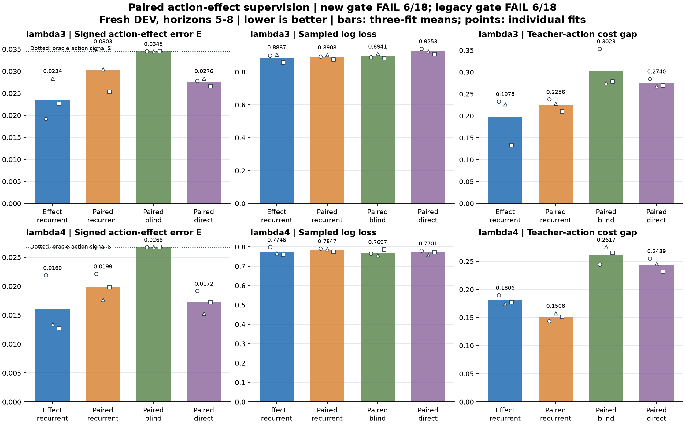

# Paired action-effect supervision: DEV_FAIL

**New mechanism gate: 6/18. Unchanged legacy forecast gate: 6/18.** All 12 fits and the independent saved-output audit completed. The new gate determines this registration's outcome; the legacy gate is reported separately and cannot rescue it.

Against the paired recurrent control, the candidate lowers long-horizon effect error in **6/6** seed/regime pairs, reaches the registered 10% reduction in **4/6**, and reaches the 5% decision-gap reduction in **1/6**. The complete comparisons below retain every seed.

The candidate and paired recurrent control use the same 1,046 TRAIN blocks, initializations, epoch orders, three forward rollouts per batch, probability targets and ordinary losses. Only the candidate gives weight 0.1 to the TRAIN-normalized squared signed-effect error. This comparison tests that extra loss; it does not isolate a new architecture. All controls already receive both factual and opposite-action soft targets.

Bars are means of three fits on the same fresh DEV cases. Points are individual fits, not independent datasets or confidence intervals. E compares the direction and magnitude of the probability change under action XOR1. Every case remains, including cases with zero oracle signal.

## Long-horizon means

| Method | Setting | Effect error E | Sampled NLL | Decision gap | Normal NLL | Normal decision gap |
|---|---|---:|---:|---:|---:|---:|
| Effect recurrent | lambda3 | 0.023391 | 0.886658 | 0.197751 | 0.662376 | 0.149475 |
| Effect recurrent | lambda4 | 0.016011 | 0.774573 | 0.180600 | 0.611323 | 0.124054 |
| Paired recurrent | lambda3 | 0.030292 | 0.890769 | 0.225592 | 0.667974 | 0.137750 |
| Paired recurrent | lambda4 | 0.019875 | 0.784694 | 0.150767 | 0.613173 | 0.132740 |
| Paired action blind | lambda3 | 0.034495 | 0.894059 | 0.302282 | 0.671653 | 0.192155 |
| Paired action blind | lambda4 | 0.026761 | 0.769696 | 0.261742 | 0.620613 | 0.171135 |
| Paired direct | lambda3 | 0.027605 | 0.925291 | 0.274028 | 0.673984 | 0.168644 |
| Paired direct | lambda4 | 0.017207 | 0.770123 | 0.243930 | 0.617304 | 0.158546 |

E, sampled negative log likelihood and decision gap above cover horizons 5-8. Normal scores cover horizons 1-8. Outcome scores include all absorbing suffixes; decision scores average nonterminal rows within case and then cases with decision support. Undefined values are never filled with zero.

The new gate requires at least 10% lower E and 5% lower decision gap, no more than 1% higher long NLL or normal NLL/gap, and at least 48 supported cases, against all controls in all seeds/settings. The unchanged legacy gate instead requires 1% lower long NLL and 5% lower decision gap, with its same normal limits. These are different hypotheses, not interchangeable pass counts.

## Every paired comparison

Positive percentages favor effect recurrent: `100*(control-candidate)/control`. Each row is a paired seed comparison, not a ratio of aggregated means. A zero denominator is undefined.

| Seed | Setting | Control | E reduction | NLL reduction | Gap reduction | Normal NLL reduction | Normal gap reduction |
|---|---|---|---:|---:|---:|---:|---:|
| 330000001 | lambda3 | Paired recurrent | +45.27% | -0.66% | +2.06% | +0.85% | -24.11% |
| 330000002 | lambda3 | Paired recurrent | +6.87% | -0.06% | +0.59% | +0.42% | +4.20% |
| 330000003 | lambda3 | Paired recurrent | +10.75% | +2.14% | +36.74% | +1.25% | -6.89% |
| 330000001 | lambda4 | Paired recurrent | +1.09% | -0.93% | -32.30% | -0.49% | -1.94% |
| 330000002 | lambda4 | Paired recurrent | +23.96% | +2.68% | -10.66% | +0.11% | +8.89% |
| 330000003 | lambda4 | Paired recurrent | +35.91% | +2.14% | -17.43% | +1.28% | +12.62% |
| 330000001 | lambda3 | Paired action blind | +44.33% | -1.02% | +34.01% | +1.69% | +8.73% |
| 330000002 | lambda3 | Paired action blind | +17.76% | +0.63% | +17.45% | +1.82% | +27.40% |
| 330000003 | lambda3 | Paired action blind | +34.48% | +2.90% | +52.23% | +0.63% | +30.04% |
| 330000001 | lambda4 | Paired action blind | +18.18% | -4.34% | +22.34% | +0.24% | +22.16% |
| 330000002 | lambda4 | Paired action blind | +49.83% | -1.37% | +36.59% | +1.31% | +31.43% |
| 330000003 | lambda4 | Paired action blind | +52.51% | +3.68% | +33.18% | +2.92% | +29.01% |
| 330000001 | lambda3 | Paired direct | +30.92% | +4.39% | +18.13% | +1.71% | +11.13% |
| 330000002 | lambda3 | Paired direct | +0.02% | +2.37% | +15.32% | +2.10% | +12.35% |
| 330000003 | lambda3 | Paired direct | +15.17% | +5.79% | +50.57% | +1.35% | +10.55% |
| 330000001 | lambda4 | Paired direct | -14.34% | -2.44% | +25.51% | +1.07% | +25.32% |
| 330000002 | lambda4 | Paired direct | +11.94% | -1.19% | +28.85% | -0.34% | +20.66% |
| 330000003 | lambda4 | Paired direct | +26.21% | +1.90% | +23.40% | +2.16% | +18.43% |

## Gate detail

| Seed | Setting | Control | New gate | Legacy gate | Failed new conditions |
|---|---|---|---|---|---|
| 330000001 | lambda3 | paired_recurrent | False | False | long_gap_gain, normal_gap_nonregression |
| 330000001 | lambda3 | paired_blind | False | False | long_log_nonregression |
| 330000001 | lambda3 | paired_direct | True | True | none |
| 330000001 | lambda4 | paired_recurrent | False | False | long_effect_gain, long_gap_gain, normal_gap_nonregression |
| 330000001 | lambda4 | paired_blind | False | False | long_log_nonregression |
| 330000001 | lambda4 | paired_direct | False | False | long_effect_gain, long_log_nonregression |
| 330000002 | lambda3 | paired_recurrent | False | False | long_effect_gain, long_gap_gain |
| 330000002 | lambda3 | paired_blind | True | False | none |
| 330000002 | lambda3 | paired_direct | False | True | long_effect_gain |
| 330000002 | lambda4 | paired_recurrent | False | False | long_gap_gain |
| 330000002 | lambda4 | paired_blind | False | False | long_log_nonregression |
| 330000002 | lambda4 | paired_direct | False | False | long_log_nonregression |
| 330000003 | lambda3 | paired_recurrent | False | False | normal_gap_nonregression |
| 330000003 | lambda3 | paired_blind | True | True | none |
| 330000003 | lambda3 | paired_direct | True | True | none |
| 330000003 | lambda4 | paired_recurrent | False | False | long_gap_gain |
| 330000003 | lambda4 | paired_blind | True | True | none |
| 330000003 | lambda4 | paired_direct | True | True | none |

## Cases and charged computation

Fresh DEV retained **90/128 lambda3** and **91/128 lambda4** originating cases. The 75 prefix terminations were excluded without replacement. Results condition on surviving the fixed eight-transition analytic prefix. TRAIN is the unchanged 1,046-case parent dataset; no earlier DEV, TEST or confirmation arrays were reused.

* lambda3: 90 cases for effects/outcomes; 81 with decision support; 321/360 nonterminal long-horizon rows.
* lambda4: 91 cases for effects/outcomes; 87 with decision support; 348/364 nonterminal long-horizon rows.

| Method | Mean fit seconds | Fit range |
|---|---:|---:|
| Effect recurrent | 12.122 | 12.031-12.225 |
| Paired recurrent | 11.968 | 11.570-12.397 |
| Paired action blind | 12.438 | 11.963-13.363 |
| Paired direct | 12.372 | 12.197-12.475 |

New worker times: audit 22.709s; collection 81.191s; fit 156.372s.
Total new worker time is **260.272s**. Adding the charged upstream parent collection (**306.723s**, 18026 steps and 5460 teacher annotations) gives **566.995s** of accounted worker time. The upstream charge includes that parent collection's unused DEV work; labels are not free. Qualification, publication and historical pretraining are outside this worker-time total.

Recorded times include this implementation's checks and serialization. Nested annotation/Bayesian call timings must not be added to wall times. There is no hardware-independent speed claim.

## Interpretation boundaries

This is a forecasting and teacher-action imitation study along precommitted paths. It is not autonomous control, RL, connectome evidence, robotics transfer or architectural novelty. Full-belief targets are privileged training annotations, never neural inference inputs. Normal terminal certainty uses only already observed found; blind forecasts receive no future observation.

The independent audit reconstructs saved DEV probabilities, effects, scalar scores and both gates. It does not replay optimization or native scalar primitives, and TRAIN normalization is authenticated metadata rather than an independent TRAIN-array recomputation. Three fits share the same evaluation cases. Gate counts cannot be compared with prior studies as a progress metric.

[Compact scalars and individual fits](otto-action-effect-results/summary.json) | [Protocol](otto-action-effect-protocol.md) | [Original closure](../output/otto-action-effect-v1/closure-01.json)
