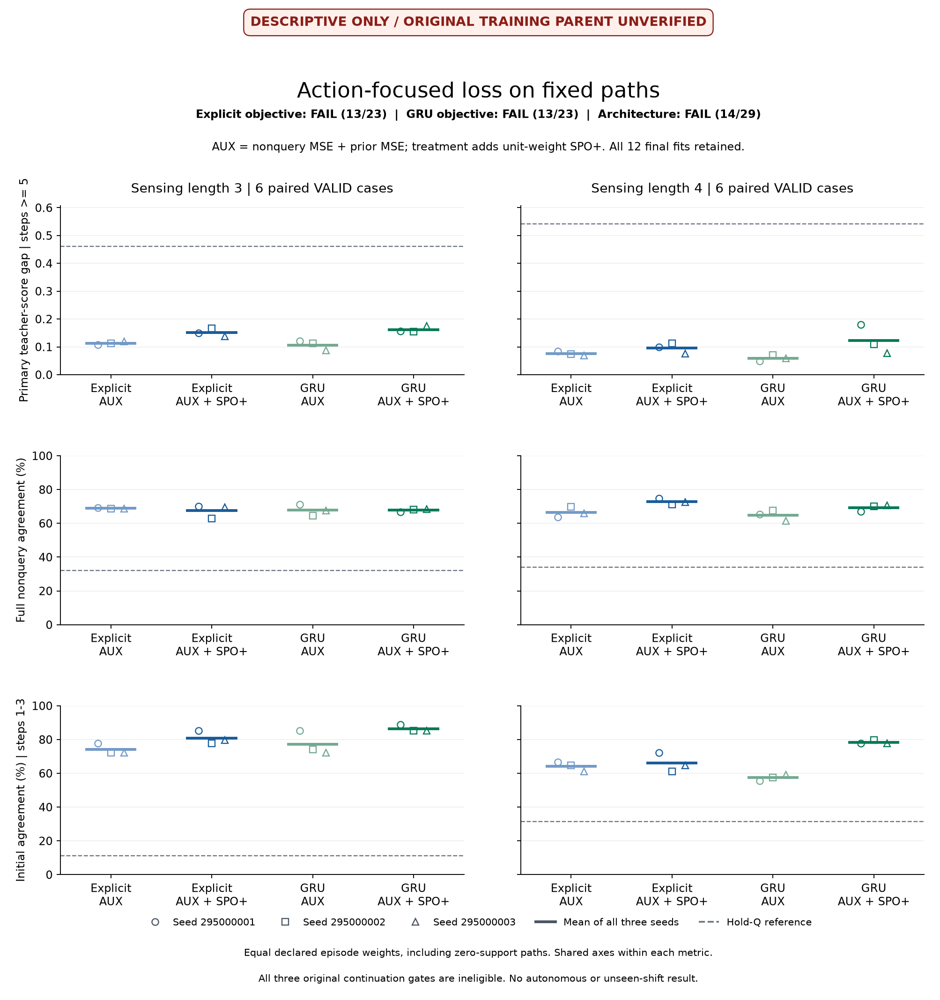
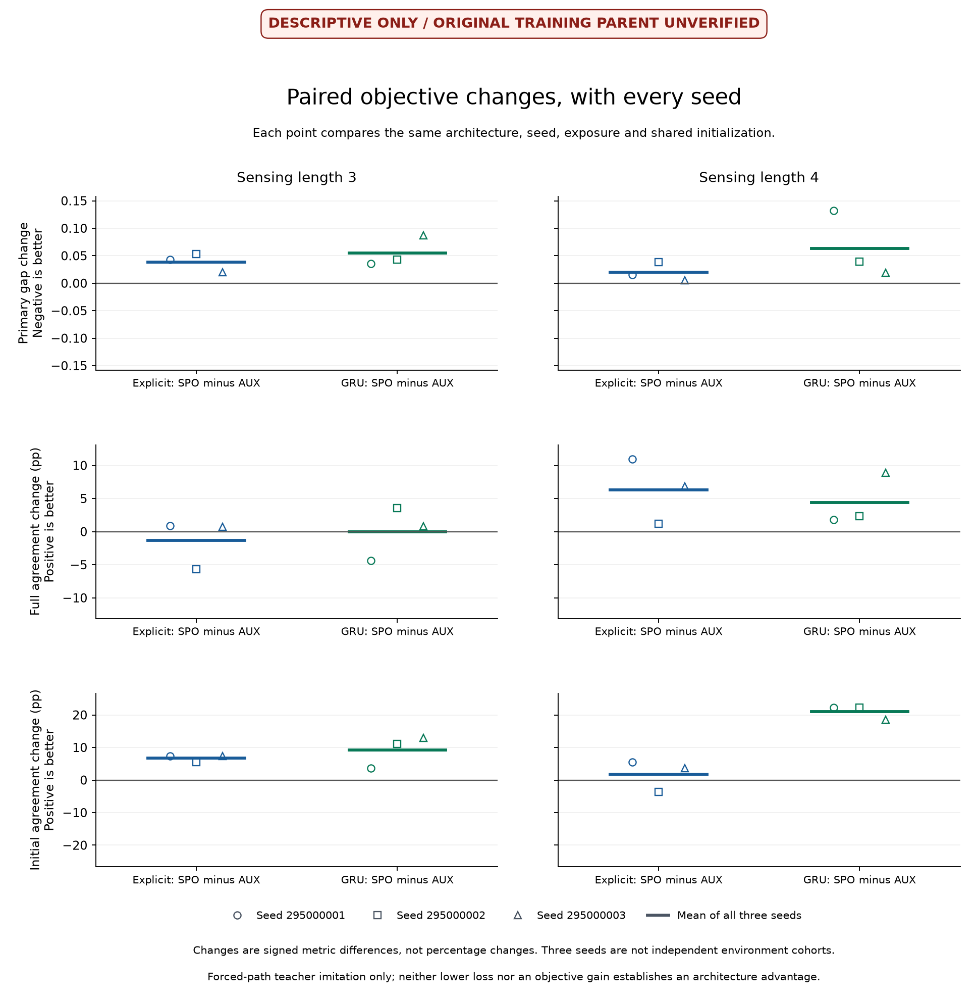
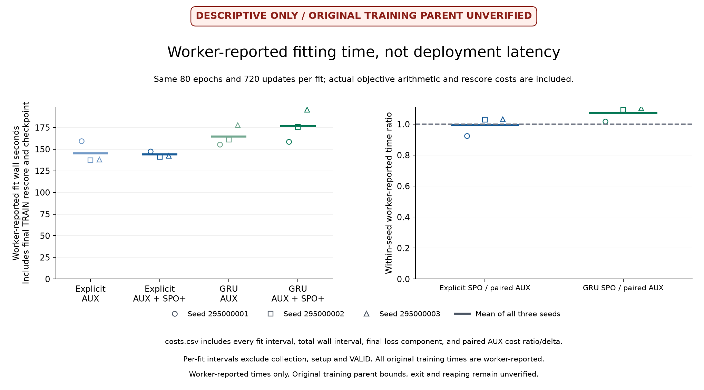

# The added decision loss worsened later choices

**This fixed SPO+ recipe did not improve the primary later-decision metric in either recurrent model.** In the saved predictions, it increases the later teacher-score gap in every paired seed comparison. Some agreement scores improve, but the more costly mistakes defeat the intended objective. There is no evidence here for an explicit-correction architecture advantage.

The worker completed all twelve fits. However, a session interruption left no final record from its original supervising process. The original technical-completion condition remains false. A separately frozen, successfully supervised diagnostic independently reconciled the saved arithmetic; it cannot establish the original supervisor's exit, reaping or full elapsed bounds. These results are descriptive and cannot qualify the original experiment for continuation.

[Original protocol](otto-action-focused-protocol.md) · [Interruption diagnostic protocol](otto-action-focused-interruption-protocol.md) · [Diagnostic closure](../output/otto-action-focused-interruption-v1/closure-01.json) · [Models and evidence](https://github.com/kw2828/OpenJev/releases/tag/otto-action-focused-v1)

## What changed

The comparison retained unchanged shared-output explicit-correction and ordinary GRU models, each trained with AUX alone or AUX plus unit-weight SPO+. AUX contains the existing nonquery score MSE and prior-query MSE. Both terms and the SPO+ surrogate use scores divided by 64. This intervention changes the objective, not the architecture. [SPO+ is an established method](https://arxiv.org/abs/1710.08005).

All four cells use the same 54 fresh TRAIN paths, 36 fresh VALID paths and three paired fit seeds. The two sensing settings appear in both TRAIN and VALID. Three collector paths share each originating case, leaving six VALID cases per setting. Training has 20,674 chronological rows, 780 selected nonquery targets and 5,131 later-query targets. Validation is a full census of 18,104 rows, including 13,567 nonquery decisions. Every fit uses 80 epochs and 720 updates. Every final checkpoint closes before VALID decoding.

The following are means over all three fits. Gap is the teacher's score difference between the chosen action and its best legal action, averaged with the original fixed episode weights. It is not observed environment regret. Later means nonquery steps at or after step 5; agreement differences are percentage points.

Each episode first averages its eligible rows, then each setting retains its fixed 18-path denominator, including zero contributions from unsupported episodes. Later support is 17/18 paths in setting 3 and 15/18 in setting 4. Paired arms use identical masks and denominators.

| Model | Sensing setting | Later gap, AUX | Later gap, +SPO+ | Gap increase | Full agreement change | Initial agreement change |
| --- | ---: | ---: | ---: | ---: | ---: | ---: |
| Explicit correction | 3 | 0.113046 | 0.151663 | +34.16% | -1.35 pp | +6.79 pp |
| Explicit correction | 4 | 0.076131 | 0.096074 | +26.20% | +6.31 pp | +1.85 pp |
| Ordinary GRU | 3 | 0.106771 | 0.161870 | +51.61% | -0.01 pp | +9.26 pp |
| Ordinary GRU | 4 | 0.059055 | 0.122309 | +107.11% | +4.36 pp | +20.99 pp |

All **12 paired seed-by-setting comparisons** increase the primary gap. These comparisons share data and are not independent trials. The ordinary GRU with AUX has the lower mean later gap in both settings. Neither a selected initial-agreement improvement nor the small numerical full-agreement change at setting 3 overrides the primary failures.

The outcome is not a regression in every scope. For explicit correction at setting 4, the full-path teacher gap falls from **0.079206 to 0.072828**, even as its later gap rises. Full and later scopes use different episode averages; neither can substitute for the other. Initial agreement improves in eleven of twelve paired comparisons.

## The objective was optimized, but TRAIN score fit deteriorated

Final saved TRAIN predictions show lower SPO+ loss alongside worse MSE components. The table averages all three fits using the original importance weights and scaling. SPO+ is computed as a post-fit diagnostic for AUX as well as for the treatment.

| Family | Nonquery MSE | Prior-query MSE | SPO+ diagnostic |
| --- | ---: | ---: | ---: |
| Explicit AUX | 0.00001390 | 0.00001145 | 0.00440644 |
| Explicit AUX + SPO+ | 0.00007681 | 0.00005991 | 0.00210946 |
| GRU AUX | 0.00001135 | 0.00000981 | 0.00406278 |
| GRU AUX + SPO+ | 0.00007127 | 0.00006279 | 0.00277473 |

The loss components have different scales and homogeneity. These saved values are consistent with a tradeoff against score calibration, but they do not establish gradient dominance, a causal failure of recurrent state or insufficient memory. No per-component gradient experiment was performed. The outcome rejects this fixed coefficient, scale and training recipe; it does not establish that decision-focused learning generally fails.

## Conditions and process evidence

The original named decisions remain **ineligible**: explicit objective 13/23, GRU objective 13/23 and architecture 14/29. Their shared technical condition is false because the original supervising process did not leave a terminal record. The primary numerical conditions also fail independently of that gap. The counts are condition coverage, not success probabilities. No overall 41-condition promotion score is used.

Collection closed normally: 90 complete paths in **1,228.14 seconds** of worker time. The training worker reports **1,905.82 seconds**, twelve final fits, 8,640 updates and 49 payloads. The worker's successful receipt cannot substitute for its missing parent record. Per-fit and stage times are retained as worker-reported measurements, not certified speed comparisons.

Before fresh collection, the original code and protocol were published in commit `1b61df2`; 190 fabricated checks passed. Training was frozen before fitting in commit `b0f2411`. The new diagnostic was frozen before its saved-array reads in commit `a8d9711`, with 22 fabricated checks passing. It independently reconstructs targets, weights, losses, metrics, the checkpoint barrier and the condition records, agreeing on **884,914 checks**. This counts verification work, not statistical confidence. All 150 original and diagnostic source hashes remained unchanged.

The new diagnostic completed in **5.09 seconds**, with its actual original supervisor closing in **5.18 seconds**, exit zero, worker reaped and process group absent. It made zero model, optimizer, teacher or simulator calls. Its final receipt counts 885,230 checks after the additional source and output closure checks. [Diagnostic receipt](../output/otto-action-focused-interruption-v1/diagnostic-01/receipt.json) · [Original interruption observation](../output/otto-action-focused-v1/interruption-01/observation-01.json).

The release contains two archives: all original collection and training payloads, including twelve checkpoints, and the complete diagnostic plus presentation outputs. The latter includes the full diagnostic JSON and every CSV, retained outside Git to keep large result files in the release assets. Both archives have SHA-256 manifests and byte-for-byte round-trip checks. A first presentation attempt rejected the diagnostic's increasing verification counter; its failure is retained. The corrected presentation reader passed 40 fabricated checks and preserves every scientific value and eligibility limitation.

For future runs, the unchanged supervisor now launches in its own session with durable output and exclusive attempt records. Forty-eight fabricated launcher checks passed, including killing the initiating process group and verifying that the original supervisor survived, reaped its worker and produced its genuine terminal. Timeout and nonzero-exit cases remained failures. This process fix does not repair or rerun the current experiment.

## Research implication

Keep the ordinary shared GRU with the calibration objective as the reference. The added loss did not supply evidence for a new architecture or a reason to expand this model's claims.

Next, test whether decision adaptation can help while preserving the recurrent forecast state. Use three fresh ordinary-GRU AUX pretrains, each followed by four adaptation branches: frozen versus trainable backbone, crossed with MSE versus MSE plus SPO+. Every branch gets the same zero-initialized residual action readout; its output never feeds recurrent corrections. This gives three shared pretrains and twelve adaptation fits. Frozen-MSE controls the added readout, joint-MSE controls extra training exposure, and joint-SPO tests allowing decision gradients into the recurrent model. [Prospective design](otto-protected-readout-design.md).

Freeze 80 pretraining epochs and 40 adaptation epochs, data order, optimizer and loss arithmetic before fresh collection. Close every final checkpoint before untouched evaluation. Require lower later teacher-score gap in both settings against these controls, preserved full and initial agreement, and paired-seed nonregression against frozen-MSE. Verify unchanged backbone weights for frozen branches and report measured compute. This tests an established adaptation mechanism; it is not evidence of a new architecture or biological learning. Any development gain still needs an unseen scenario shift, autonomous quality-versus-total-compute measurement and a second environment.
