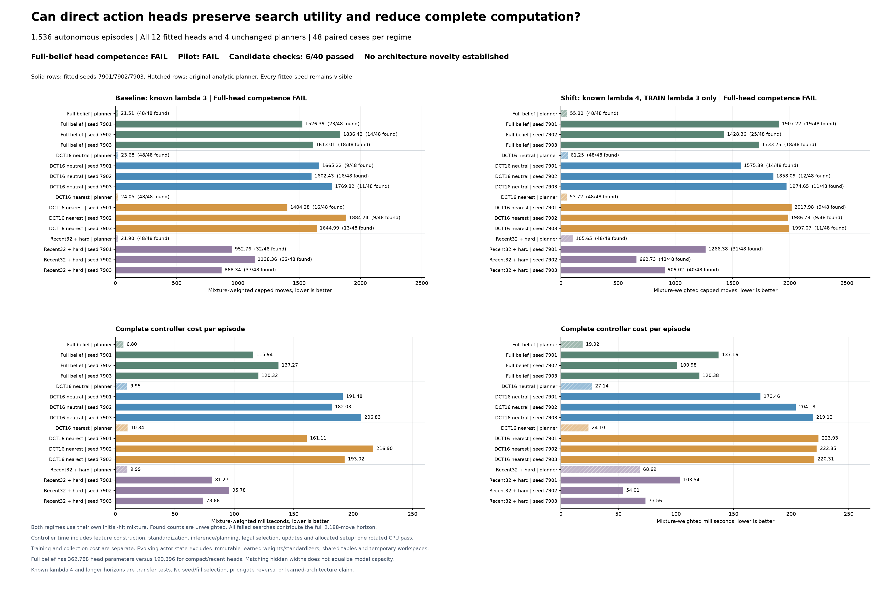

# OTTO action heads: faster decisions did not produce competent search

21 September 2026. All twelve fits and all **1,536 autonomous episodes** completed. The frozen pilot **fails: 6/40 candidate conditions pass**, and the separate full-belief-head competence prerequisite fails for every seed in both sensing regimes. All four analytic planners found every source. Every learned fit had censored failures and remained below 95% mixture-weighted success in both regimes.

This is a negative result for the specified supervised readout and data recipe. It does not isolate a failure of compact memory: the larger full-belief head also fails badly. No learned-architecture, biological-memory or novelty claim is established, and neither failure flag from the [earlier autonomous spectral comparison](otto-spectral-control-results.md) changes.

[Frozen protocol](otto-action-head-protocol.md) · [Plan](../output/otto-action-head-v1/plan-01.json) · [Complete run summary](../output/otto-action-head-v1/run-01/summary.json) · [Independent audit](../output/otto-action-head-v1/audit-02/summary.json)

## What the completed comparison measures

The four fixed representations are full Bayes, DCT16 with neutral extension, DCT16 with distance-one extension, and recent32 with all historical hard exclusions. Each received a two-hidden-layer action head, trained separately with seeds 7901, 7902 and 7903. The recurrent evidence updates were fixed, not learned. Full-belief heads have 362,788 parameters; the other heads have 199,396. Equal hidden widths do not mean equal parameter capacity.

The 384 TRAIN and 96 separate validation trajectories supplied 9,190 and 2,477 decision examples. All four representations received the same public streams and teacher targets. Each fit completed 40 epochs. Validation cross entropy selected one of eight scheduled checkpoints; all DCT/recent fits selected epoch five, while full belief selected epochs 20, 15 and 15. This was checkpoint selection, not early stopping. The [fit records](../output/otto-action-head-v1/run-01/fits.json) preserve all curves and selected identities, and the [training snapshot](otto-action-head-status.md) remains an explicitly earlier, pre-outcome record.

Evaluation used 48 fresh cases per regime, with all sixteen arms on every case: twelve learned fits and four analytic planners. Within each regime, each initial-hit category has sixteen cases, arranged into eight blocks with two cases per category. Baseline sensing length is three; shifted sensing length is four. Both use a 53x53 grid and a 2,188-move horizon. Every unsuccessful episode contributes all 2,188 moves. There were **680 censored learned-head episodes**, all retained; the 384 analytic-planner episodes all found their sources.

The raw found counts below describe the balanced sampled cases. Success percentages, mean capped moves and controller costs first average within each hit stratum, then apply the regime's initial-hit mixture. The weights for hits 1/2/3 are **83.0998% / 12.8918% / 4.0084%** at baseline and **84.4502% / 12.0761% / 3.4737%** under shift. Consequently, a raw count such as 23/48 is not the same quantity as weighted success of 31.09%.

## Every arm and seed

Controller cost is mean complete controller time per episode, including initialization, evidence updates, feature construction, head or planner decisions, and allocated shared/checkpoint setup. It excludes simulator time. Values are rounded for display; decisions use the full saved values.

### Baseline sensing length three

| Arm / fitting seed | Raw found | Weighted success | Mean capped moves | Controller ms/episode |
|---|---:|---:|---:|---:|
| full_bayes / planner | 48/48 | 100.00% | 21.51 | 6.80 |
| full_bayes / 7901 | 23/48 | 31.09% | 1,526.39 | 115.94 |
| full_bayes / 7902 | 14/48 | 16.17% | 1,836.42 | 137.27 |
| full_bayes / 7903 | 18/48 | 26.50% | 1,613.01 | 120.32 |
| dct16_neutral / planner | 48/48 | 100.00% | 23.68 | 9.95 |
| dct16_neutral / 7901 | 9/48 | 24.25% | 1,665.22 | 191.48 |
| dct16_neutral / 7902 | 16/48 | 27.11% | 1,602.43 | 182.03 |
| dct16_neutral / 7903 | 11/48 | 19.25% | 1,769.82 | 206.83 |
| dct16_nearest / planner | 48/48 | 100.00% | 24.05 | 10.34 |
| dct16_nearest / 7901 | 16/48 | 36.44% | 1,404.28 | 161.11 |
| dct16_nearest / 7902 | 9/48 | 14.92% | 1,884.24 | 216.90 |
| dct16_nearest / 7903 | 13/48 | 25.25% | 1,644.99 | 193.02 |
| recent32_hard / planner | 48/48 | 100.00% | 21.90 | 9.99 |
| recent32_hard / 7901 | 32/48 | 62.45% | 952.76 | 81.27 |
| recent32_hard / 7902 | 32/48 | 54.23% | 1,138.36 | 95.78 |
| recent32_hard / 7903 | 37/48 | 71.42% | 868.34 | 73.86 |

### Shifted sensing length four

| Arm / fitting seed | Raw found | Weighted success | Mean capped moves | Controller ms/episode |
|---|---:|---:|---:|---:|
| full_bayes / planner | 48/48 | 100.00% | 55.80 | 19.02 |
| full_bayes / 7901 | 19/48 | 12.95% | 1,907.22 | 137.16 |
| full_bayes / 7902 | 25/48 | 35.03% | 1,428.36 | 100.98 |
| full_bayes / 7903 | 18/48 | 21.24% | 1,733.25 | 120.38 |
| dct16_neutral / planner | 48/48 | 100.00% | 61.25 | 27.14 |
| dct16_neutral / 7901 | 14/48 | 29.42% | 1,575.39 | 173.46 |
| dct16_neutral / 7902 | 12/48 | 15.42% | 1,858.09 | 204.18 |
| dct16_neutral / 7903 | 11/48 | 10.14% | 1,974.65 | 219.12 |
| dct16_nearest / planner | 48/48 | 100.00% | 53.72 | 24.10 |
| dct16_nearest / 7901 | 9/48 | 8.09% | 2,017.98 | 223.93 |
| dct16_nearest / 7902 | 9/48 | 9.70% | 1,986.78 | 222.35 |
| dct16_nearest / 7903 | 11/48 | 9.06% | 1,997.07 | 220.31 |
| recent32_hard / planner | 48/48 | 100.00% | 105.65 | 68.69 |
| recent32_hard / 7901 | 31/48 | 48.07% | 1,266.38 | 103.54 |
| recent32_hard / 7902 | 43/48 | 83.73% | 662.73 | 54.01 |
| recent32_hard / 7903 | 40/48 | 67.90% | 909.02 | 73.56 |

Family means give each fitting seed equal weight. Baseline weighted success is 23.54% for DCT neutral, 25.54% for DCT nearest, 62.70% for recent32_hard, and 24.59% for full belief. Shifted success is 18.32%, 8.95%, 66.57% and 23.08%, respectively. Recent heads are better than DCT heads in this experiment, but remain far from the analytic planners. This does not establish that forgetting is generally better than accumulation.

All hit-stratum metrics and all eight paired blocks are preserved under `regimes.<regime>.strata` and `.blocks` in the [audited summary](../output/otto-action-head-v1/audit-02/summary.json). Neutral DCT improves over the recent-head family on only **1/8 blocks in each regime**; nearest DCT improves on **0/8 in each regime**. These are fixed paired blocks, not independent statistical significance claims.

## The frozen decision remains FAIL

Full-head competence required each of its three fits, in both regimes, to attain at least 95% weighted success and no more than 105% of the full planner's capped moves. **All six fit/regime combinations fail both tests.** The [audit's competence details](../output/otto-action-head-v1/audit-02/summary.json) retain each result separately.

The candidate conditions below are additional to that prerequisite. Each column contains all ten conditions for one fill/regime; none can be dropped because the full-head prerequisite failed.

| Frozen candidate condition | Neutral baseline | Nearest baseline | Neutral shift | Nearest shift |
|---|:---:|:---:|:---:|:---:|
| Every fit weighted success >=95% | Fail | Fail | Fail | Fail |
| Family success >= full planner | Fail | Fail | Fail | Fail |
| Family capped moves <=105% of full planner | Fail | Fail | Fail | Fail |
| Family controller cost <=80% of full planner | Fail | Fail | Fail | Fail |
| Every fit controller cost < full planner | Fail | Fail | Fail | Fail |
| Family moves <=95% of recent-head family | Fail | Fail | Fail | Fail |
| At least 6/8 positive blocks versus recent heads | Fail | Fail | Fail | Fail |
| Family moves <=105% of full-head family | Pass | Pass | Fail | Fail |
| Family controller cost <= full-head family | Fail | Fail | Fail | Fail |
| Evolving state <=20% of full planner | Pass | Pass | Pass | Pass |
| **Conditions passed** | **2/10** | **2/10** | **1/10** | **1/10** |

The two baseline passes against the full-head move threshold compare against an unsuccessful control. They are not evidence of competent search. The four storage passes concern evolving arrays only. The overall `readout_pilot_passes` flag is false; `learned_architecture_advantage_established` remains false.

## Faster decisions, more computation per search

Removing lookahead reduced the measured cost of an individual decision. For the full planner, the ratio of mixture-weighted decision time to mixture-weighted moves is approximately **299 microseconds at baseline and 324 under shift**. The corresponding DCT-head family ratios are **46 and 44 microseconds**. These ratios summarize different realized trajectories; they are not matched-state latency measurements or a deployment speedup.

Long unsuccessful searches overwhelm that local reduction. DCT-neutral family controller time is **193.45 ms/episode at baseline and 198.92 ms under shift**; DCT-nearest is **190.34 and 222.20 ms**. The full planner needs **6.80 and 19.02 ms**, respectively. Thus DCT heads consume roughly **28 times** the full planner's controller time at baseline and **10-12 times** under shift. They also cost more per search than the full-belief head family, at **124.51 and 119.51 ms**, and the recent-head family, at **83.64 and 77.04 ms**.

Complete controller cost includes all evidence updates, actor initialization, feature construction, standardization, decisions and allocated setup. One checkpoint load/validation is charged per 48-case learned workload per regime; applicable shared spectral-model initialization is allocated similarly. These workload allocations are not disjoint whole-process costs and must not be added to the supervisor wall time. Simulator time is separate. All timing is from one rotated CPU pass, not repeated deployment benchmarking.

| Stored arrays | DCT heads | Recent32_hard heads | Full-belief heads |
|---|---:|---:|---:|
| Evolving actor state, including hard mask | 4,857 B | 3,577 B | 25,281 B |
| Immutable head parameters | 797,584 B | 797,584 B | 1,451,152 B |
| Immutable standardizer | 24,640 B | 24,640 B | 45,064 B |
| Head plus standardizer | 822,224 B | 822,224 B | 1,496,216 B |

DCT's evolving state is **80.79% smaller** than full belief, but this is not an 80.79% reduction in total deployed memory. It still includes the full 2,809-cell hard mask; head weights, standardizers, actor priors, shared kernels and temporary arrays are additional. The saved spectral-model tables occupy **433,784 B per regime**, including three initial log priors and the kernel. Storage entries count array payloads, not Python or allocator overhead. The [complete storage and timing fields](../output/otto-action-head-v1/run-01/summary.json) remain available.

## Execution and independent checks

The worker completed in **3,049.503 s**, enclosed by **3,050.410 s** of suspend-inclusive supervisor time, below the frozen 5,400-second cap. Peak worker RSS was **2,758,852,608 B**, below 8 GiB. The closed 48 payloads total **972,798,216 B**, excluding the completion receipt, below 2 GiB. There were **1,576,306 attempted and returned native steps**: 826 qualification calls, 11,667 collection calls and 1,563,813 evaluation calls. All 17,280 optimizer updates completed. Collection took 32.421 s and the twelve fit intervals sum to 26.086 s; these are nested components of the complete run, not additional wall time.

[Worker receipt](../output/otto-action-head-v1/run-01/receipt.json) · [Successful supervisor terminal](../output/otto-action-head-v1/run-process-01.terminal.json)

The first saved-only audit invocation stopped at its absolute-path input guard, before scientific payload decoding or numerical checks. Its [failed receipt](../output/otto-action-head-v1/audit-01/receipt.json) is preserved. The corrected invocation used the same auditor source and unchanged scientific outputs in a new `audit-02` directory. It completed with actual tool exit zero, **1,574,853 numerical comparisons**, maximum absolute difference **6.3881e-9**, and agreement on all forty conditions and competence outcomes. It took **17.806 s** with peak RSS **1,263,419,392 B**. Neither audit ran the simulator, called an actor or updated weights.

[Successful audit receipt](../output/otto-action-head-v1/audit-02/receipt.json) · [Selected-checkpoint checks](../output/otto-action-head-v1/audit-02/selected-checkpoints.json)

The auditor independently checks coverage, recorded source/draw/action joins, TRAIN-only standardizer moments, selected-checkpoint validation cross entropy, grouped arithmetic and gates. It checks selected epochs against every recorded validation loss, but cannot replay nonselected weights that were not saved. It does not reconstruct raw features or posteriors, regenerate random streams, replay optimization, or establish timing truth. Its disclosed validation near-tie handling cannot revise an autonomous choice or scientific condition.

The figure and both preselected case-zero replays use only saved outputs, with no new simulation: [PDF](../output/otto-action-head-v1/figure-01/action-head.pdf), [baseline replay](../output/otto-action-head-v1/figure-01/first-case-base.gif), [shifted replay](../output/otto-action-head-v1/figure-01/first-case-shift.gif), [plotted values](../output/otto-action-head-v1/figure-01/plotted-values.json), and [figure receipt](../output/otto-action-head-v1/figure-01/receipt.json). Both replays show all sixteen arms. Playback timing is illustrative and does not represent computation time.

[Download the complete run](https://github.com/kw2828/OpenJev/releases/tag/otto-action-head-v1): a **295,125,290-byte lossless archive** contains all 49 original files, including all twelve selected checkpoints, full raw collection features/targets, fit histories, kernels and evaluation episode/transition ledgers. Every archived member was streamed against the original bytes and closed receipt, including the gzip integrity check. [Archive manifest](../output/otto-action-head-v1/archive-01/manifest.json) · [Restore and verify](../output/otto-action-head-v1/archive-01/RESTORE.md). The large raw files are release assets rather than Git objects; the small summaries, checkpoints, receipts and figures remain directly available in the repository.

## Interpretation and next boundary

This experiment does not justify advancing the proposed compact learned readout. The larger full-belief head has better validation teacher-action agreement yet poor autonomous performance, while the recent head performs better autonomously but still fails competence. Validation imitation alone was not a sufficient qualification for search utility. Teacher targets were relative heuristic action scores, not optimal Q-values or calibrated probabilities, and decision-weighted collection data differ from mixture-weighted episode evaluation.

Both representation and readout must be considered when interpreting the failure. Training used only sensing length three and trajectories up to 256 moves. The sensing-length feature was constant during training, so the shift activates an untrained input direction; evaluation also permits 2,188 moves. The shifted outcome therefore mixes known-prior/readout transfer and longer-horizon behavior. These limitations do not erase the severe baseline failure, and this comparison cannot identify which training, capacity or coverage change would repair it.

A stronger published learned controller must first be independently qualified and evaluated under its stated interface before serving as a new reference. That would be a separate, prospectively bounded comparison. Any revised training recipe requires a separate frozen comparison. The completed result retains its original checkpoints, thresholds and every fill and seed.
