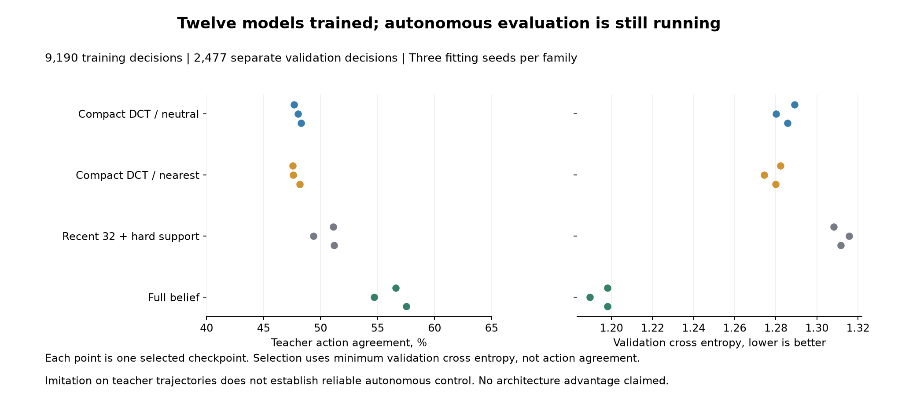

# Learned action-head pilot: training snapshot

All **twelve planned fits completed**, covering two compact DCT memories, recent32_hard and full belief across three fitting seeds. The autonomous run was confirmed live at **2026-09-21T15:22:31.799098+00:00**. Its final outcomes and independent audit are pending. This page records a training snapshot, not a successful control result.

[Prospective protocol](otto-action-head-protocol.md) · [Frozen plan](../output/otto-action-head-v1/plan-01.json) · [All fit records](../output/otto-action-head-v1/run-01/fits.json)

## What was trained

The 384 training trajectories supplied **9,190 decision examples**, and 96 separate validation trajectories supplied **2,477**. Every representation received identical public trajectories and full-Bayes teacher targets. Each fit ran all 40 epochs, with the minimum validation cross entropy selecting among eight checkpoints. A selected epoch of five is not an early-stopped fit.

These are direct action-score MLPs over fixed recurrent memory. Compact and recent heads share parameter counts; the full-belief control deliberately has more active parameters with the same hidden widths. The probability model and DCT recurrence were not learned. All models still retain a 2,809-bit support mask; weights, standardizers and shared tables are additional to evolving state.

| Representation | Parameters | Selected teacher-action agreement | Selected epochs |
|---|---:|---:|---|
| dct16_neutral | 199,396 | 47.68-48.28% | 5, 5, 5 |
| dct16_nearest | 199,396 | 47.56-48.16% | 5, 5, 5 |
| recent32_hard | 199,396 | 49.37-51.19% | 5, 5, 5 |
| full_bayes | 362,788 | 54.70-57.53% | 20, 15, 15 |

These percentages measure agreement with the teacher on validation trajectories. They do not measure source-finding success. All data-collection trajectories found their source before the 256-move limit; that is the teacher behavior policy's result, not the learned models' result. The autonomous evaluation retains every planned model and case, including 2,188-move censored failures, and covers both sensing regimes.

## Saved checkpoints

Every fit's selected checkpoint is included; none was chosen by autonomous performance. These weights are research artifacts with pending control-quality evaluation.

- dct16_neutral: [7901](../output/otto-action-head-v1/run-01/head-dct16_neutral-7901.npz), [7902](../output/otto-action-head-v1/run-01/head-dct16_neutral-7902.npz), [7903](../output/otto-action-head-v1/run-01/head-dct16_neutral-7903.npz).
- dct16_nearest: [7901](../output/otto-action-head-v1/run-01/head-dct16_nearest-7901.npz), [7902](../output/otto-action-head-v1/run-01/head-dct16_nearest-7902.npz), [7903](../output/otto-action-head-v1/run-01/head-dct16_nearest-7903.npz).
- recent32_hard: [7901](../output/otto-action-head-v1/run-01/head-recent32_hard-7901.npz), [7902](../output/otto-action-head-v1/run-01/head-recent32_hard-7902.npz), [7903](../output/otto-action-head-v1/run-01/head-recent32_hard-7903.npz).
- full_bayes: [7901](../output/otto-action-head-v1/run-01/head-full_bayes-7901.npz), [7902](../output/otto-action-head-v1/run-01/head-full_bayes-7902.npz), [7903](../output/otto-action-head-v1/run-01/head-full_bayes-7903.npz).

[Snapshot receipt](../output/otto-action-head-v1/training-snapshot-01/receipt.json) · [Observed execution status](../output/otto-action-head-v1/training-snapshot-01/execution-status.json).

The [previous autonomous compression study](otto-spectral-control-results.md) still fails both of its decision rules. This pilot does not revise those failures. No learned-architecture or biological-wiring advantage is established.
