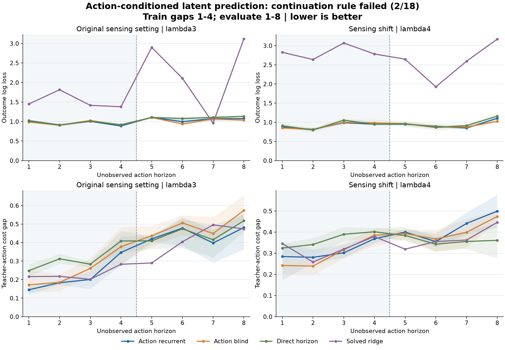

# Action-conditioned latent prediction did not pass the development screen

**DEV_FAIL: 2 of 18 comparisons passed.** All nine neural fits, the solved ridge
reference and the independent saved-prediction audit completed. Action
conditioning did not consistently improve prediction over the action-blind
control. The evidence does not support moving this model into autonomous planning.

The protocol and qualified implementation were published in
[79043dea](https://github.com/kw2828/OpenJev/commit/79043dea) before collection.
This is a fresh development pilot, not the earlier study's closed TEST or
confirmation panel. No Astra requests or replacement cases were used.

The shaded region marks gap lengths used in training. Lines are means of three
fits on the same cases; bands show the fit range, not confidence intervals.
Lower log loss and decision gap are better. The deterministic ridge fit is shown
once. [All numerical results, comparisons and costs](otto-action-latent-results/README.md).

## What was tested

The candidate separates action prediction from observation assimilation:
`prior_next = F(posterior, action)` and
`posterior_next = G(prior_next, observation_next)`.
Its 28-dimensional state and heads have 8,299 trainable parameters. A same-sized
control receives zero proposed-action input. An 8,107-parameter direct predictor
uses the same observed-prefix encoder and a shared positional action encoder,
with no recurrent action rollout. A 3,024-coefficient ridge reference uses all
nine prefix observations and fixed action features.

Each originating case starts with eight observed analytic-policy transitions.
Then its complete random action block is committed before any future odor.
Training sees four-step blocks; fresh evaluation uses eight. During a blind
block, predictors receive no future odor, updated belief summaries, analytic
scores, teacher scores or found flags. The ordinary-observation panel predicts
before assimilating each new observation. All methods share the same targets.

This forecasts future teacher costs along fixed paths. It is not an autonomous
search rollout, learned planner, connectome comparison or reproduction of Jev.
The GRU transition mechanism is established; its use alone is not novelty.

## Result

These are means over the three fits, with the exact per-fit rule retained below.
Log loss covers five outcomes: four odor categories and absorbing found.

| Long gaps 5-8 | lambda3 log loss | lambda3 decision gap | lambda4 log loss | lambda4 decision gap |
|---|---:|---:|---:|---:|
| Action recurrent | 1.062800 | 0.456592 | 0.949422 | 0.422583 |
| Action blind | 1.035081 | 0.502254 | 0.934890 | 0.409249 |
| Direct horizon | 1.105050 | 0.466179 | 0.974455 | 0.363322 |
| Solved ridge | 2.269969 | 0.428260 | 2.583536 | 0.369872 |

Against the direct predictor, the candidate lowers mean long-gap log loss by
**3.82% / 2.57%**, but its decision gap is only **2.06% lower** in lambda3 and
**16.31% higher** after the lambda4 sensing shift. Against action blind, its log
loss is **2.68% / 1.55% worse**; decision gap is **9.09% lower / 3.26% higher**.
These percentages compare the displayed means, rather than averaging per-seed
relative effects. The complete per-seed comparisons remain in the result table.
Those mixed means do not establish a consistent benefit from action conditioning.

Ridge's high log loss also does not make it uniformly worse at probability
prediction: under the shift its long-gap Brier score is **0.408210**, better than
the candidate's **0.460269**. Long-gap Brier scores remain in the full result table.

The frozen rule required at least 1% lower long-gap log loss and 5% lower decision
gap against every control, for all three fit seeds and both regimes, with no more
than 1% normal-panel regression and sufficient decision support. Only **2/18**
seed/regime/control cells passed. No candidate was selected after seeing DEV.

## Data, costs and limits

Collection attempted all **288 originating cases**. The analytic prefix found
the source in 96, which were excluded without replacement. The retained forecast
population is **124/192 TRAIN**, **30/48 lambda3 DEV** and **38/48 lambda4 DEV**.
The result therefore describes cases that survive that particular prefix, not
all initial conditions.

Long-gap outcome scores include all **120 / 152** target rows. Decisions have
**117 / 143** nonterminal rows and **30 / 36** supported cases. Normal-panel
decisions have **237 / 289** nonterminal rows and **30 / 38** supported cases.
Within each supported case, average surviving decision rows before averaging
cases. Full-case zero-contribution averages and unsupported IDs are retained.
Repeated fits share cases and do not multiply the evaluation sample size.

The fixed training recipe used 80 epochs per neural fit, 320 updates per fit,
and **2,880 updates total**. All nine fits and the single ridge solve completed
before first DEV decoding. Teacher-cost targets used one common TRAIN-only scale
of **0.00750037** in /64 units; no DEV-dependent tuning or early stopping occurred.

The collection worker took **50.21 seconds**, making 2,982 native transitions and
1,013 original TensorFlow annotation forwards. The training/evaluation worker
took **12.98 seconds**; individual neural fit intervals were **1.07-1.61 seconds**.
The ridge fit took **0.00453 seconds**. Audit took **2.67 seconds**. These are
measured CPU implementation costs, including the documented checks, not an
end-to-end serving speedup. All process groups closed and were reaped.

Two limitations matter for the next experiment. The learners see compressed
public-belief features, so they may lack information needed for accurate
forecasting. Also, the normal panel freezes finite learned logits after observed
found instead of taking the available exact terminal-probability shortcut.
Neither should be interpreted as a fundamental limitation of recurrent models.

The independent audit reconstructed all 24 saved views and checked the recorded
720 epoch permutations, parameter counts, normalization metadata and fixed rule.
It performed no model, optimizer, teacher or native calls and did not replay the
training process or independently recompute TRAIN target variance. Qualification
passed **185 fabricated tests**. An earlier engineering attempt failed lint on a
test fixture, was preserved, and was corrected before registration.

[Protocol](otto-action-latent-protocol.md) ·
[Official closure](../output/otto-action-latent-v1/closure-01.json) ·
[Every comparison](otto-action-latent-results/README.md) ·
[Checkpoints, predictions, traces and evidence](https://github.com/kw2828/OpenJev/releases/tag/otto-action-latent-v1) ·
[Next hypothesis](otto-action-latent-next.md).
