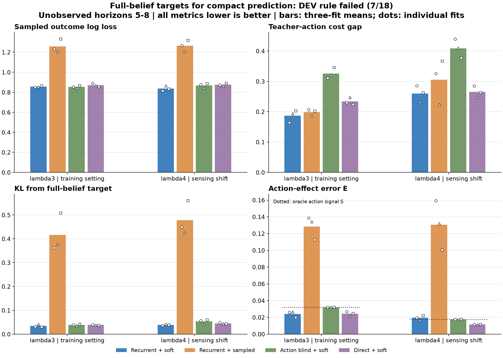

# Full-belief distillation did not pass the development screen

**DEV_FAIL: 7 of 18 paired comparisons passed.** All 12 prescribed fits and the independent saved-output audit completed. The original continuation rule is unchanged; oracle diagnostics do not replace it.

The strongest result is probability supervision: recurrent soft lowers long-gap log loss against its sampled-label twin in **6/6 seed/regime pairs**, with mean paired reductions of **31.83% / 33.62%** in lambda3/lambda4. Long-gap decision cost improves in only **3/6** of those pairs. Better probability forecasts did not produce a consistent decision advantage.

The action-effect diagnostic is also mixed. Under the sensing shift, recurrent soft has mean E=**0.019487**, versus **0.017444** for action blind and **0.011549** for direct. It is worse than direct in **3/3 seeds**. This measures error in the direction and size of the probability change under opposite actions, not merely sensitivity to action input.

Bars average three fit seeds on the same fresh development cases; dots show each fit. These are not confidence intervals or independent datasets. The bottom panels are supplementary diagnostics.

The experiment changes categorical supervision while keeping the 28-state model, inputs, optimizer and data matched. Recurrent soft versus recurrent sampled isolates the target distribution within this study. Action blind and direct use the same soft targets. The full-belief teacher has privileged information that never enters neural inference.

## Long-gap results

| Method | Setting | Sampled NLL | Decision gap | Oracle KL | Action-effect E |
|---|---|---:|---:|---:|---:|
| Recurrent + soft | lambda3 | 0.855482 | 0.186871 | 0.034263 | 0.024194 |
| Recurrent + soft | lambda4 | 0.837916 | 0.259987 | 0.039123 | 0.019487 |
| Recurrent + sampled | lambda3 | 1.256867 | 0.198495 | 0.416046 | 0.128376 |
| Recurrent + sampled | lambda4 | 1.264648 | 0.305542 | 0.478026 | 0.130580 |
| Action blind + soft | lambda3 | 0.854082 | 0.325936 | 0.038408 | 0.032133 |
| Action blind + soft | lambda4 | 0.867855 | 0.408977 | 0.053358 | 0.017444 |
| Direct + soft | lambda3 | 0.871481 | 0.233971 | 0.038296 | 0.024426 |
| Direct + soft | lambda4 | 0.874923 | 0.265663 | 0.044604 | 0.011549 |

Every value above covers unobserved horizons 5-8. NLL is sampled negative log likelihood. NLL and KL include absorbing-found suffixes. Decision gap averages nonterminal rows within each case, then supported cases. Action-effect E retains every case and measures error in the predicted change under action XOR1. Its dotted reference S is the full-belief action signal; E=S for an exactly action-blind predictor.

## Paired effects

Positive percentages favor recurrent soft. Entries are means of the three paired reductions `100*(control-candidate)/control`, followed by their minimum and maximum. They are not ratios of the displayed means.

| Control | Setting | NLL reduction | Decision-gap reduction | KL reduction | Effect-error reduction |
|---|---|---:|---:|---:|---:|
| Recurrent + sampled | lambda3 | +31.83% [+29.23%, +35.22%] | +5.49% [-4.10%, +20.72%] | +91.48% [+89.02%, +94.17%] | +81.22% [+80.12%, +82.32%] |
| Recurrent + sampled | lambda4 | +33.62% [+28.42%, +36.88%] | +12.42% [-3.46%, +28.51%] | +91.68% [+90.21%, +93.08%] | +84.34% [+78.06%, +87.65%] |
| Action blind + soft | lambda3 | -0.17% [-1.41%, +0.49%] | +42.75% [+39.44%, +47.37%] | +9.37% [-19.12%, +28.27%] | +24.70% [+16.88%, +38.22%] |
| Action blind + soft | lambda4 | +3.37% [-2.51%, +6.64%] | +36.31% [+30.46%, +43.50%] | +24.61% [+3.26%, +35.36%] | -11.71% [-26.48%, +4.09%] |
| Direct + soft | lambda3 | +1.80% [-0.87%, +4.55%] | +19.99% [+9.52%, +28.92%] | +10.44% [-9.21%, +20.56%] | +0.06% [-21.96%, +19.13%] |
| Direct + soft | lambda4 | +4.20% [-0.32%, +6.56%] | +2.29% [-0.46%, +6.97%] | +11.98% [+4.68%, +22.07%] | -68.61% [-90.11%, -46.46%] |

The registered gate requires at least 1% lower sampled NLL and 5% lower decision gap at long horizons against each control for all three seeds and both regimes, no more than 1% normal-panel regression, and at least 48 supported cases. A favorable average cannot rescue a failed cell.

## Data, computation and limits

Collection retained **1046/1536 TRAIN**, **84/128 lambda3 DEV** and **103/128 lambda4 DEV** cases. The 559 prefix terminations were excluded without replacement. This estimates performance conditional on surviving the fixed analytic prefix.

* lambda3, long gaps: 84 originating cases; 81 with decision support; 322/336 nonterminal target rows.
* lambda4, long gaps: 103 originating cases; 94 with decision support; 374/412 nonterminal target rows.

| Method | Fit time mean | Fit time range |
|---|---:|---:|
| Recurrent + soft | 9.732s | 9.534-10.036s |
| Recurrent + sampled | 9.445s | 9.312-9.514s |
| Action blind + soft | 9.530s | 9.454-9.634s |
| Direct + soft | 9.920s | 9.842-9.976s |

Original process worker times: audit 23.879s; collection 306.723s; fit 125.841s.
Collection charged 18026 native steps, 5460 teacher annotations, 2 sensor tables, 23862 likelihood lookups and 18026 Bayesian updates. Nested call times cannot be added. These are implementation-specific costs, not a general speedup claim.

Normal forecasts use an exact terminal shortcut only after found was observed. Gap forecasts receive no future observations or found flags. The opposite-action diagnostic invents no alternate observations.

The full-belief reference uses the authenticated scalar sensor kernel and declared 53-bit uniform-grid law. It is a privileged probabilistic reference, not a fair learned baseline or deterministic PRNG replay. The audit reconstructs DEV beliefs, targets and metrics; it authenticates TRAIN variance and raw sensor primitive values as records rather than replaying training or native code.

This is a development forecasting study, not autonomous search, RL, connectome evidence, robotics transfer or architectural novelty. Earlier TEST and confirmation panels remain closed. The larger dataset and shared terminal shortcut also prevent attributing cross-study changes solely to distillation.

The 7/18 result cannot be treated as progress over the previous pilot's 2/18: the case allocation and terminal treatment changed. The matched comparisons here are the evidence.

[Every seed, normal-panel result and cost](otto-belief-distillation-results/README.md) | [Protocol](otto-belief-distillation-protocol.md) | [Closed evidence](../output/otto-belief-distillation-v1/closure-01.json)
