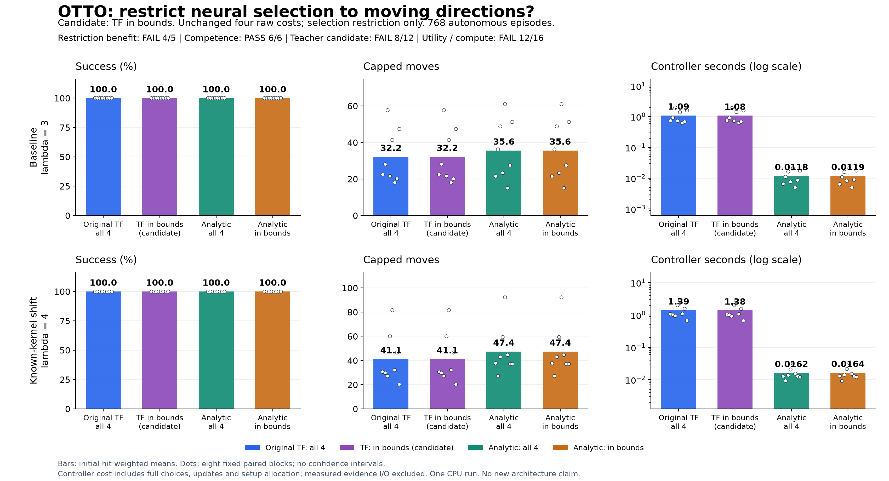
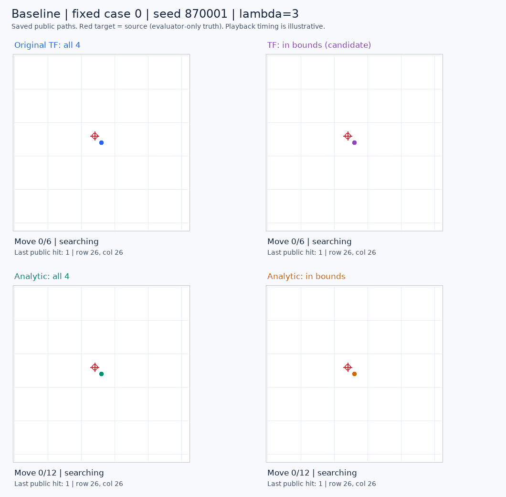
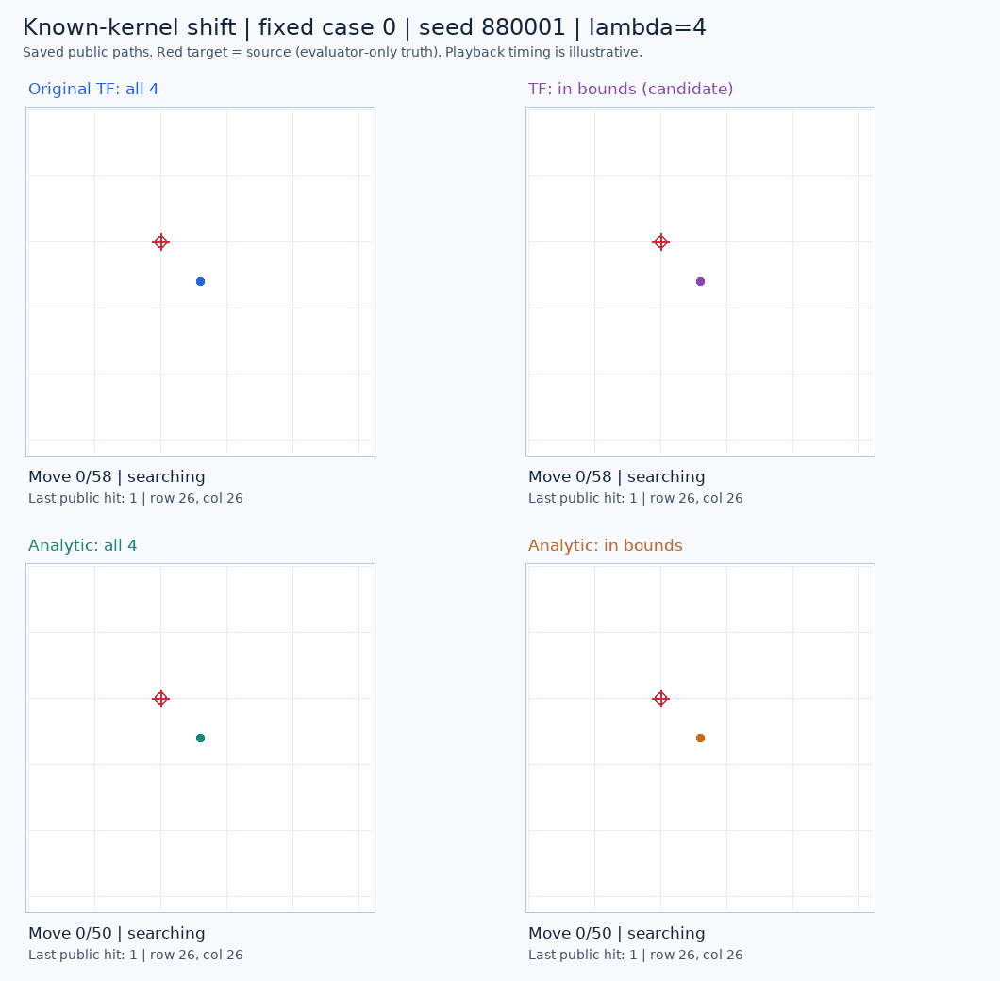

# Boundary restriction: identical paths, a competent but expensive reference

**The movement restriction changes none of the 192 paired neural trajectories.** All 768 searches succeed. The released model uses **9.67% fewer moves in the baseline and 13.24% fewer under a known sensing shift** than the analytic controls on this fresh cohort, but its teacher-consistency and computation rules still fail. This comparison trains no model and establishes no new architecture advantage.

The original policy never chooses a blocked direction here, so the restriction never changes its action. This is **no demonstrated intervention benefit**, not evidence that the restriction would fail to rescue the earlier boundary stall. That earlier failed search and its study's failed rules remain unchanged.

## Complete comparison

There are 96 paired cases per regime. Every controller starts from the same sampled source and public observation for its case. Means use the regime's frozen initial-hit mixture; raw successes have denominator 96. A failed search would contribute the full 2,188-move horizon. No case was replaced or omitted.

| Regime | Controller | Raw found | Weighted success | Weighted capped moves | Controller seconds/episode |
| --- | --- | ---: | ---: | ---: | ---: |
| Baseline | Original TensorFlow policy | 96/96 | 100% | 32.1761 | 1.094819 |
| Baseline | Same model, moving directions only | 96/96 | 100% | 32.1761 | 1.084404 |
| Baseline | Analytic, all four directions | 96/96 | 100% | 35.6196 | 0.011822 |
| Baseline | Analytic, moving directions only | 96/96 | 100% | 35.6196 | 0.011922 |
| Known-kernel shift | Original TensorFlow policy | 96/96 | 100% | 41.0834 | 1.393391 |
| Known-kernel shift | Same model, moving directions only | 96/96 | 100% | 41.0834 | 1.382558 |
| Known-kernel shift | Analytic, all four directions | 96/96 | 100% | 47.3540 | 0.016217 |
| Known-kernel shift | Analytic, moving directions only | 96/96 | 100% | 47.3540 | 0.016381 |

Both neural arms have identical actions, observations and outcomes in every pair. All **4,750 shared-prefix decisions** have byte-identical four-action costs and posterior hashes. There are no first-action divergences and no blocked moves in any arm. Both analytic controls also have identical success and move counts on every case. Slight time differences come from separately measured executions, not improved trajectories or an established speed benefit from masking.

The gains are uneven. Against either analytic control, neural wins/ties/losses by capped moves are **38/25/33** in the baseline and **43/9/44** under shift. Shifted initial-hit-two cases worsen to **25.2813 moves versus 22.2188**. The initial-hit mixture and gain magnitudes therefore matter; favorable weighted means do not imply improvement on most cases or every stratum.

## Predeclared decisions

All four rules below concern the restricted neural candidate. Every condition in a rule must pass.

| Rule | Passed | Decision and limiting condition |
| --- | ---: | --- |
| Descriptive restriction benefit | 4/5 | **FAIL:** no strict success or move improvement over the original policy |
| Competent reference | 6/6 | **PASS:** success and move margins pass in both regimes against both analytic controls |
| Promising teacher candidate | 8/12 | **FAIL:** only 5/8 blocks improve in each regime, below the required 6/8 |
| Utility versus complete computation | 12/16 | **FAIL:** all four complete-cost comparisons lose to analytic control |

The competence threshold requires at least 95% weighted success and capped moves within 105% of each analytic control. The teacher rule also requires no success loss, at least 5% fewer moves and gains in six of eight blocks. The separate utility rule requires no greater complete controller cost. These are frozen descriptive thresholds, not statistical significance tests.

The restricted candidate takes **91.72x / 85.26x** the all-four analytic controller's weighted computation in this single instrumented CPU run. Its full exact posterior already carries the available history under the supplied sensing model. This result does not demonstrate missing memory, justify a biological-wiring explanation, or establish a superior teacher. The positive aggregate move result is worth retaining, alongside the failed consistency criterion and [earlier shifted failure](otto-released-reference-results.md).

## What changed and what was measured

The unchanged released value network has 13,390,849 parameters. Both neural arms execute the original TensorFlow model and RLPolicy once per choice, including eight-way symmetry averaging and sixteen action/observation branches. The candidate changes only final action eligibility. It preserves all four raw float32 costs and the original first-action near-tie arithmetic. The unqualified NumPy port remains excluded.

All four directions are legal in the native environment. A blocked direction stays in place and receives an observation; excluding it is a policy intervention, not a legality fix. Each actor maintains an exact posterior using only public observations. The evaluator separately verifies every reset and update against the native posterior, including the final observation.

Both regimes use a fixed 53x53 grid. Sensing length changes from three to four, and every actor receives the applicable exact kernel. This is a known-kernel shift with an unchanged value model, not unknown sensor identification or the upstream automatically resized task. Seeds 870001-870096 and 880001-880096 were new to the inspected local studies; their absence from the released model's training is not established.

Complete controller time includes initialization, choices, updates and model-specific setup. The 2.25768 seconds of physical model setup are allocated across all 384 neural episodes. The first cold forward stays in its actual episode. Measured nested evidence-writing time is excluded, with raw intervals retained; forward time is part of choice time and is never counted twice. Shared imports, evaluator checks and native environment work are separate. These timings do not estimate deployment latency or a text-generation speedup.

## Fixed-case replays

The protocol selected case zero in each regime before execution. Both GIFs show all four arms and use illustrative playback timing. Red targets show evaluator-only source truth to the viewer.

The shifted replay is retained even though it favors analytic control. Neither replay substitutes for the complete aggregates.

## Execution and next model experiment

The plan, sources and engineering evidence were committed and pushed as `7a946a7` before any autonomous call. All **768 resets, 19,900 native steps and 9,500 TensorFlow forwards** returned. All 95 source pins and the 43-distribution runtime remained unchanged. The worker took 386.75 seconds, the supervisor 387.08 seconds, and peak worker RSS was 761,954,304 bytes. Both processes exited, with no remaining process group. No training updates or remote model calls were made.

The independent saved-output audit agrees on **757,879 checks**, reconstructing public beliefs, selection from recorded costs, paired trajectories, work and timing sums, and all four rules. It took 5.60 seconds without model or simulator calls. Original neural values, analytic scores, random draws and timing truth remain authenticated execution evidence, not independently rerun facts. Pre-run engineering verification passed 91 synthetic tests in the exact native runtime. The sixteen saved-score selector checks also passed, without neural or simulator calls.

The next learned experiment should target the readout bottleneck identified by the [failed full-belief action head](otto-action-head-results.md). A small action-centered scorer with shared weights can be compared against an ordinary scorer with rotation/reflection augmentation, using the same exact posterior and matched training exposure. Because this study misses the teacher screen, analytic supervision should target **comparable search quality at lower complete cost**, rather than claim an empirically superior teacher. Training on student-visited prefixes would address the earlier gap between imitation validation and autonomous behavior. This is a proposed separate experiment, not an admitted training run or a novelty claim for symmetry alone. Compact recurrent memory becomes interpretable only once the full-belief scorer is competent.

- [Frozen protocol](otto-boundary-control-protocol.md) and [machine-readable plan](../output/otto-boundary-control-v1/plan-01.json).
- [Independent aggregates, strata, blocks and every paired case](../output/otto-boundary-control-v1/audit-01/summary.json), [audit receipt](../output/otto-boundary-control-v1/audit-01/receipt.json), and [execution witness](../output/otto-boundary-control-v1/execution-witness.json).
- [Run summary](../output/otto-boundary-control-v1/run-01/summary.json), [worker receipt](../output/otto-boundary-control-v1/run-01/receipt.json), and [supervisor terminal](../output/otto-boundary-control-v1/run-process-01.terminal.json).
- [Complete raw execution archive](https://github.com/kw2828/OpenJev/releases/tag/otto-boundary-control-v1). Extract at the repository root to restore all recorded paths.
- [Saved-score qualification](../output/otto-boundary-control-v1/selection-preflight-01/receipt.json), [independent reader](../scripts/audit_otto_boundary_control.py), and [visualization receipt](../output/otto-boundary-control-v1/figure-01/receipt.json).
