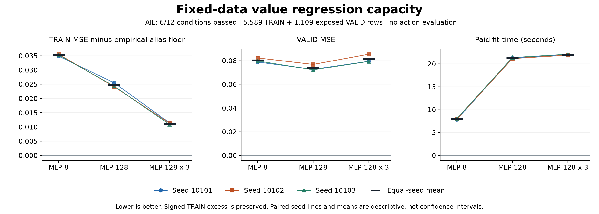

# Fixed-data scalar capacity screen

**FAIL: 6/12 frozen conditions passed.** TRAIN excess: 6/6; VALID improvement: 0/6.

Against the fresh narrow baseline, mean VALID MSE is 7.93% lower for MLP 128 and 1.37% higher for the three-layer network. Its mean TRAIN excess is 68.21% lower. Its VALID MSE improves in 1/3 paired seeds. These equal-seed averages do not replace the fixed per-seed criteria.

This study compares fresh ordinary-network capacity on identical Monte Carlo teacher-return labels. It includes no autonomous searches, observation-branch scoring or new collection. It establishes no recurrent, connectome or novel-architecture advantage.

All models use the same 5,589 TRAIN states from 192 completed teacher episodes and 1,109 VALID states from 48 episodes, with uniform row MSE, three paired seeds, 80 epochs and fixed final checkpoints. VALID is exposed research validation. The initialization recipe is new; the freshly trained width-eight control is the relevant capacity baseline.

The empirical TRAIN feature-alias floor is **0.0640057818654** normalized MSE. There are 3,981 byte-identical-input groups, 351 duplicate groups containing 1,959 rows, and 342 groups with conflicting returns. This is a finite-cohort bound for these cached inputs, not a population uncertainty estimate.

| Fit | TRAIN MSE | TRAIN excess | VALID MSE | TRAIN MAE, moves | VALID MAE, moves |
|---|---:|---:|---:|---:|---:|
| mlp8@10101 | 0.0988821957 | 0.0348764139 | 0.078847131 | 13.717749 | 13.1701198 |
| mlp128@10101 | 0.0895439057 | 0.0255381238 | 0.0726915711 | 12.5938228 | 12.2678784 |
| deep128@10101 | 0.0754176204 | 0.0114118385 | 0.079428306 | 10.7450789 | 12.6787721 |
| mlp8@10102 | 0.0995296884 | 0.0355239065 | 0.0822547384 | 14.0423021 | 13.6390583 |
| mlp128@10102 | 0.0881816431 | 0.0241758612 | 0.0768391257 | 12.8569281 | 12.8412792 |
| deep128@10102 | 0.0753179468 | 0.0113121649 | 0.0853607443 | 10.7814359 | 13.1850391 |
| mlp8@10103 | 0.0993299467 | 0.0353241648 | 0.0797607506 | 13.8294305 | 13.2869883 |
| mlp128@10103 | 0.0883394839 | 0.0243337021 | 0.0722311499 | 12.6202254 | 12.382879 |
| deep128@10103 | 0.0748906648 | 0.010884883 | 0.0793623612 | 10.7111618 | 12.9490779 |

MSE is in normalized return units `(T-t)/64`; MAE is in movement units. Signed excess is neither clipped nor given an epsilon allowance.

| Fit | Parameters | TRAIN negative predictions | VALID negative predictions | Paid fit seconds |
|---|---:|---:|---:|---:|
| mlp8@10101 | 88,241 | 4 | 1 | 7.868114 |
| mlp128@10101 | 1,411,841 | 62 | 21 | 21.249385 |
| deep128@10101 | 1,444,865 | 21 | 17 | 22.050053 |
| mlp8@10102 | 88,241 | 0 | 0 | 7.977676 |
| mlp128@10102 | 1,411,841 | 17 | 11 | 21.144539 |
| deep128@10102 | 1,444,865 | 17 | 7 | 21.897054 |
| mlp8@10103 | 88,241 | 3 | 0 | 8.072285 |
| mlp128@10103 | 1,411,841 | 54 | 21 | 21.372144 |
| deep128@10103 | 1,444,865 | 56 | 35 | 22.090845 |

Total paid fit time: 153.722096 s. Complete worker duration: 162.905443 s. Fit time includes initialization, optimization and checkpoint export/publication. It excludes final scalar parity and saved-prediction diagnostics. The worker also pays authentication, preparation, those diagnostics and output work. Equal optimizer updates do not imply equal computation; these are single-run hardware-specific measurements.

The 243 saved-prediction calls took 0.513825 s; the 18 parity forward calls took 0.009108 s. These are timed forward calls only, excluding feature upcasts, vector assembly and output writes. They are not end-to-end policy latency measurements.

| Condition | Actual | Required maximum | Result |
|---|---:|---:|---|
| mlp128.10101.train_excess | 0.025538123822576225 | 0.027901131100140121 | Pass |
| mlp128.10101.valid_mse | 0.072691571140602873 | 0.070962417889773644 | Fail |
| mlp128.10102.train_excess | 0.02417586118788756 | 0.028419125222308529 | Pass |
| mlp128.10102.valid_mse | 0.076839125660187593 | 0.074029264567498351 | Fail |
| mlp128.10103.train_excess | 0.024333702052506706 | 0.028259331833532977 | Pass |
| mlp128.10103.valid_mse | 0.072231149866950062 | 0.071784675539997705 | Fail |
| deep128.10101.train_excess | 0.01141183851367035 | 0.027901131100140121 | Pass |
| deep128.10101.valid_mse | 0.07942830595828973 | 0.070962417889773644 | Fail |
| deep128.10102.train_excess | 0.011312164923443321 | 0.028419125222308529 | Pass |
| deep128.10102.valid_mse | 0.085360744349102333 | 0.074029264567498351 | Fail |
| deep128.10103.train_excess | 0.010884882983847863 | 0.028259331833532977 | Pass |
| deep128.10103.valid_mse | 0.079362361153963543 | 0.071784675539997705 | Fail |

All twelve direct float64 conditions are required. Both wider families and all seeds are retained. A pass motivates a separately frozen autonomous comparison, not a competence claim. A failure rejects this fixed recipe; it does not rule out all higher-capacity models.

This is distinct from the earlier [Bellman-versus-Monte-Carlo continuation](otto-bellman-control-results.md), which used the same small architecture, different targets and autonomous evaluation, passed 19/42 conditions and failed its overall rule. That decision and the original scalar trial's 0/54 failure remain unchanged. Smaller scalar error need not improve action ranking.

The independent audit reconstructed every cached feature/target and replayed all final scalar predictions: 252 independent readouts covering 60,444 rows including parity witnesses. Optimizer execution, original Torch parity and timings remain authenticated execution evidence.

[Protocol](otto-capacity-protocol.md) | [Conditional next-step review](../output/otto-capacity-v1/next-experiment-review.md)

| Provenance | Bound artifact | SHA-256 prefix |
|---|---|---|
| Plan | [Record](../output/otto-capacity-v1/plan-01.json) | `f00b138d01c8687d` |
| Worker | [Record](../output/otto-capacity-v1/run-01/receipt.json) | `ec7f9551c5a590f8` |
| Independent audit | [Record](../output/otto-capacity-v1/audit-01/receipt.json) | `ac33b263d27a45df` |
| Parent terminal | [Record](../output/otto-capacity-v1/run-process-01.terminal.json) | `8d7ef2cc90ab986e` |

[Full audit summary](../output/otto-capacity-v1/audit-01/summary.json) | [Plot values and exact criteria](../output/otto-capacity-v1/report-01/plotted-values.json) | [Publication receipt](../output/otto-capacity-v1/report-01/receipt.json) | [Initial publisher source](../output/otto-capacity-v1/report-support/publish-initial.py)

[Complete evidence archive](https://github.com/kw2828/OpenJev/releases/tag/otto-capacity-v1). The archive preserves this study and its qualification/provenance records. Historical input caches remain separate dependencies from the [original scalar release](https://github.com/kw2828/OpenJev/releases/tag/otto-return-value-v1).

Rendering note: the chart received an axis-padding correction after visual inspection. [Corrected-render receipt](../output/otto-capacity-v1/render-02/receipt.json) binds the final images and [layout source](../output/otto-capacity-v1/report-support/publish.py); the original report-01 numerical output and plotted values remain unchanged.
